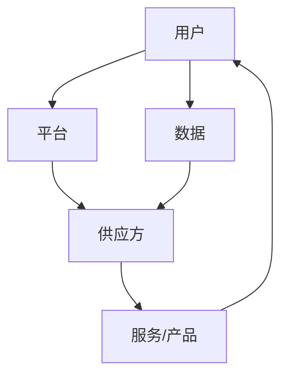

                 


```markdown
# 巴菲特的价值链分析：数字平台经济下的价值创造

> 关键词：巴菲特, 价值链分析, 数字平台经济, 价值创造, 数据驱动, 数字化工具, 投资策略

> 摘要：本文深入探讨了巴菲特的价值链分析方法在数字平台经济中的应用，分析了数字平台经济的特点及其对价值链重构的影响，提出了基于数据驱动的数字化工具和方法，帮助投资者和企业在数字时代更有效地创造和实现价值。

---

# 第1章: 巴菲特投资理念与价值创造概述

## 1.1 巴菲特投资理念的核心思想

### 1.1.1 价值投资的定义与核心原则

- **价值投资**：寻找市场价格低于其内在价值的股票进行长期投资。
- **核心原则**：注重企业的基本面分析，关注企业的盈利能力、财务状况和竞争优势。
- **长期视角**：巴菲特强调长期投资，避免短期市场波动的干扰。

### 1.1.2 巴菲特投资成功的关键要素

- **企业竞争优势**：寻找具有强大护城河的企业。
- **管理层质量**：重视管理层的诚信和能力。
- **财务健康状况**：关注企业的盈利能力、负债情况和现金流。

### 1.1.3 从传统到数字平台经济的价值链转型

- **传统经济**：基于物理资源和地理位置的价值创造。
- **数字平台经济**：基于数据和技术的虚拟资源价值创造。
- **转型关键**：利用数字技术重构价值链，提升效率和用户体验。

## 1.2 数字平台经济的背景与特点

### 1.2.1 数字平台经济的定义与特征

- **定义**：数字平台经济是以数字技术为核心驱动力，通过互联网平台连接供需双方，实现资源优化配置的经济形态。
- **特征**：
  - **双边或多边市场**：连接供需双方，形成网络效应。
  - **数据驱动**：通过数据采集和分析，优化资源配置和用户体验。
  - **去中介化**：减少中间环节，降低交易成本。

### 1.2.2 数字平台经济与传统经济的对比

| 对比维度       | 传统经济                | 数字平台经济              |
|----------------|------------------------|--------------------------|
| 交易方式       | 线下交易为主            | 线上交易为主              |
| 中介环节       | 中介较多，成本较高      | 去中介化，成本降低        |
| 资源配置       | 分散、效率低            | 集中、高效                |
| 技术依赖       | 低                     | 高                       |

### 1.2.3 数字平台经济对价值创造的影响

- **提升效率**：通过数字化工具优化资源配置，降低运营成本。
- **增强用户体验**：通过数据驱动的个性化服务，提升用户满意度。
- **创造新价值**：通过数字技术创造新的商业模式和价值点。

## 1.3 巴菲特价值链条分析的数字化转型

### 1.3.1 传统价值链条分析的局限性

- **数据不足**：传统分析依赖财务报表，难以捕捉实时数据。
- **效率低下**：手动分析耗时且容易出错。
- **动态变化**：市场环境变化快，静态分析难以适应。

### 1.3.2 数字平台经济下价值链条的新特点

- **实时数据**：通过实时数据分析优化价值链。
- **动态调整**：快速响应市场变化，灵活调整价值链。
- **数据闭环**：从数据采集到分析再到应用，形成闭环。

### 1.3.3 数字化工具在价值链条分析中的应用

- **数据可视化工具**：如 Tableau、Power BI，用于直观展示数据。
- **数据分析工具**：如 Python、R，用于深度挖掘数据。
- **人工智能技术**：利用 AI 进行预测和优化。

## 1.4 本章小结

本章介绍了巴菲特投资理念的核心思想，探讨了数字平台经济的特点及其对价值链重构的影响，强调了数字化工具在价值链条分析中的重要性。

---

# 第2章: 数字平台经济下的价值链条重构

## 2.1 数字平台经济中的核心价值链条

### 2.1.1 数字平台经济中的核心价值环节

- **用户获取**：通过数字营销和推广吸引用户。
- **数据采集**：收集用户行为数据和需求。
- **价值传递**：通过平台提供服务或产品。
- **价值实现**：通过商业模式实现收入和利润。

### 2.1.2 数字平台经济中的价值传递机制

- **双边市场**：供需双方通过平台进行交易，形成价值传递。
- **数据驱动**：通过数据分析优化价值传递路径。
- **网络效应**：用户越多，平台价值越大。

### 2.1.3 数字平台经济中的价值创造主体

- **平台方**：构建平台并提供基础服务。
- **供应方**：提供产品或服务。
- **用户方**：购买产品或服务，创造需求。

## 2.2 数字平台经济下的价值链重构方法

### 2.2.1 价值链重构的定义与目标

- **定义**：通过数字化手段优化和重新设计价值链。
- **目标**：提升效率、降低成本、增强用户体验。

### 2.2.2 数字技术对价值链重构的推动作用

- **自动化**：通过自动化技术减少人工干预。
- **智能化**：利用 AI 技术优化决策。
- **数据化**：通过数据驱动实现精准管理。

### 2.2.3 价值链重构的关键步骤与策略

#### 关键步骤

1. **数据采集与分析**：收集价值链各环节的数据，分析瓶颈和优化点。
2. **流程优化**：基于数据分析结果，优化流程。
3. **技术实施**：引入数字化工具和技术支持重构。
4. **效果评估**：评估重构后的效果，持续优化。

#### 优化策略

- **模块化管理**：将价值链分解为可管理的模块。
- **创新驱动**：利用技术创新推动价值重构。
- **用户导向**：以用户需求为导向进行优化。

## 2.3 巴菲特价值链条分析的数字化方法

### 2.3.1 数据驱动的价值链条分析

- **数据采集**：通过日志、传感器等获取数据。
- **数据分析**：使用大数据技术分析数据。
- **数据可视化**：通过图表展示数据，辅助决策。

### 2.3.2 数字工具在价值链条分析中的应用

- **数据挖掘工具**：如 Python 的 Pandas 库，用于数据清洗和分析。
- **机器学习模型**：如随机森林、神经网络，用于预测和分类。
- **流程优化工具**：如 BPM（业务流程管理），用于优化流程。

### 2.3.3 数字化价值链条分析的优缺点

- **优点**：
  - 数据准确，分析结果可靠。
  - 可实时监控，快速响应。
- **缺点**：
  - 数据处理复杂，需要专业技能。
  - 初期投入高，需要资源支持。

## 2.4 本章小结

本章详细探讨了数字平台经济下的价值链条重构方法，介绍了数字化工具的应用，分析了重构的优势和挑战。

---

# 第3章: 巴菲特价值链条分析框架

## 3.1 巴菲特价值链条分析的核心要素

### 3.1.1 价值创造的核心要素

- **核心业务**：企业的主营业务和核心竞争力。
- **关键资源**：企业所需的关键资源，如数据、技术、人才。
- **关键流程**：企业运营的关键流程，如生产、供应链、销售。

### 3.1.2 价值传递的核心要素

- **渠道**：产品或服务到达用户的路径。
- **品牌**：企业的品牌形象和声誉。
- **用户体验**：用户对产品或服务的体验和满意度。

### 3.1.3 价值实现的核心要素

- **收入模式**：企业的收入来源和方式。
- **成本结构**：企业的成本构成和控制。
- **利润**：企业的盈利能力。

## 3.2 数字平台经济下的价值链条分析模型

### 3.2.1 数字平台经济下的价值链分析模型



### 3.2.2 模型的输入与输出

- **输入**：用户需求、市场数据、企业资源。
- **输出**：优化后的价值链方案、价值实现的最大化策略。

### 3.2.3 模型的验证与优化

- **验证**：通过实际数据测试模型的准确性。
- **优化**：根据测试结果调整模型参数，提升预测能力。

## 3.3 巴菲特价值链条分析的数字化工具

### 3.3.1 数据可视化工具

- **工具**：Tableau、Power BI。
- **功能**：将数据转化为图表，便于直观分析。

### 3.3.2 价值链条分析软件

- **工具**：Excel、ERP 系统。
- **功能**：用于数据处理、流程优化、成本控制。

### 3.3.3 数字化工具的优缺点

- **优点**：
  - 提高分析效率，减少人为错误。
  - 支持实时监控和动态调整。
- **缺点**：
  - 需要较高的技术投入。
  - 需要专业人员操作和维护。

## 3.4 本章小结

本章构建了数字平台经济下的价值链条分析模型，介绍了数字化工具的应用，分析了工具的优缺点。

---

# 第4章: 项目实战——基于数字平台的巴菲特价值链条分析

## 4.1 项目背景与目标

- **背景**：某电商平台希望通过数字化手段优化其价值链条。
- **目标**：提升用户体验，降低运营成本，提高盈利能力。

## 4.2 项目实施步骤

### 4.2.1 数据采集与清洗

- **数据来源**：用户行为数据、销售数据、市场数据。
- **工具**：Python 的 Pandas 库。
- **代码示例**：
  ```python
  import pandas as pd
  df = pd.read_csv('data.csv')
  df_clean = df.dropna()
  ```

### 4.2.2 价值链条分析

- **分析工具**：使用 Tableau 进行数据可视化。
- **分析步骤**：
  1. 确定价值链各环节的关键指标。
  2. 识别瓶颈环节。
  3. 提出优化建议。

### 4.2.3 优化实施与效果评估

- **优化措施**：
  - 优化供应链管理，降低库存成本。
  - 提升用户体验，增加用户粘性。
- **效果评估**：
  - 用户满意度提升。
  - 营销成本降低。
  - 转化率提高。

## 4.3 项目总结

- **成功经验**：
  - 数据驱动的分析方法有效识别了瓶颈环节。
  - 数字化工具的应用显著提升了效率。
- **改进建议**：
  - 继续优化模型，提升预测能力。
  - 加强数据安全和隐私保护。

## 4.4 本章小结

本章通过实际项目展示了巴菲特价值链条分析在数字平台经济中的应用，详细介绍了实施步骤和效果评估。

---

# 第5章: 总结与展望

## 5.1 本章总结

- 巴菲特的价值链分析方法在数字平台经济中具有重要的应用价值。
- 数字化工具和方法能够有效优化价值链，提升企业竞争力。
- 通过数据驱动的分析和优化，企业可以在数字时代创造更多价值。

## 5.2 对未来研究的展望

- **人工智能的进一步应用**：利用 AI 技术提升价值链分析的精准度和效率。
- **区块链技术的应用**：通过区块链技术实现更加透明和安全的价值传递。
- **绿色经济的融合**：探索数字平台经济与绿色经济的结合，推动可持续发展。

## 5.3 本章小结

本章总结了全文的主要内容，展望了未来的研究方向。

---

# 作者：AI天才研究院 & 禅与计算机程序设计艺术
```

