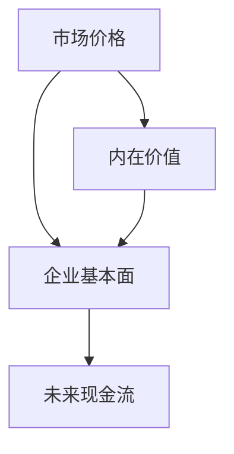
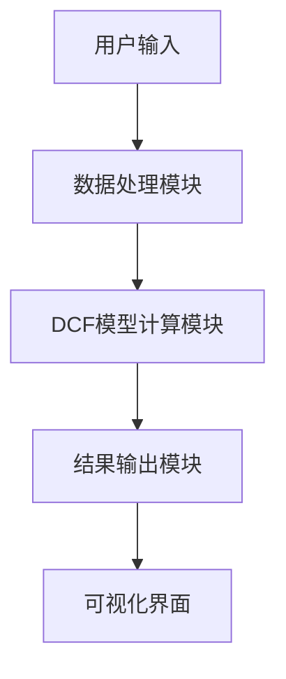

                 


# 巴菲特的价格与价值区分

> 关键词：巴菲特，价值投资，价格与价值，内在价值，DCF模型，安全边际，投资策略

> 摘要：本文详细探讨了巴菲特的价格与价值区分策略，从其投资哲学、核心概念、内在价值评估方法到实际应用，层层剖析。通过技术化的分析与实例，帮助读者理解如何在投资中运用这一策略，做出明智的投资决策。

---

## 第1章 巴菲特投资理念概述

### 1.1 巴菲特的投资哲学

#### 1.1.1 价值投资的定义与核心理念

价值投资是一种以内在价值为导向的投资策略，强调购买价格低于其实际价值的资产。巴菲特是这一理念的杰出代表，他主张通过深入分析企业的基本面，寻找那些具有持续竞争优势和良好管理团队的企业进行投资。

#### 1.1.2 巴菲特的投资策略与成功案例

巴菲特的成功在于他始终坚持价值投资原则，例如他对可口可乐和苹果公司的投资，不仅考虑了企业的盈利能力，还关注其市场地位和长期增长潜力。他的投资策略强调长期持有、分散风险和追求安全边际。

#### 1.1.3 价格与价值区分的哲学基础

巴菲特认为市场价格与内在价值的差异是投资机会的来源。他强调，投资者应关注企业的实际价值，而非市场的短期波动。这种区分使得投资者能够在市场低估时买入，市场高估时卖出。

### 1.2 价值投资的基本原则

#### 1.2.1 购买便宜的东西而不是便宜的东西

巴菲特指出，投资者应买入价格低于其内在价值的股票，而不是仅仅寻找价格低廉的股票。这需要对企业的未来现金流进行合理评估。

#### 1.2.2 安全边际的概念

安全边际是指内在价值与市场价格之间的差距，确保在市场价格波动时仍能获得正收益。巴菲特认为，安全边际是投资成功的关键因素之一。

#### 1.2.3 长期投资与复利效应

巴菲特强调长期投资的重要性，认为复利效应能够显著提升投资回报。他建议投资者选择具有稳定增长潜力的企业，而非追求短期收益。

### 1.3 巴菲特投资体系的核心要素

#### 1.3.1 经济护城河

经济护城河是指企业在市场中竞争优势的持久性。巴菲特倾向于投资那些拥有强大护城河的企业，确保其长期盈利能力。

#### 1.3.2 管理层能力评估

巴菲特认为管理层的能力和诚信是企业成功的关键因素。他倾向于投资由优秀管理者领导的企业。

#### 1.3.3 财务状况分析

巴菲特注重企业的财务健康状况，包括低债务水平、稳定的现金流和合理的利润率。这些因素是评估企业内在价值的重要指标。

---

## 第2章 价格与价值的定义与区别

### 2.1 市场价格的波动性与不确定性

市场价格受市场情绪、宏观经济因素和投资者心理的影响，具有高度波动性。这种波动性可能导致市场价格与内在价值的分离，为投资者提供套利机会。

### 2.2 内在价值的计算与评估

内在价值是基于企业未来现金流折现计算的理论价值，反映其真实价值。投资者应通过深入分析企业基本面来估算其内在价值。

### 2.3 价格与价值区分的实践意义

#### 2.3.1 价格与价值区分在投资中的作用

通过区分市场价格与内在价值，投资者可以识别低估或高估的资产，做出更明智的投资决策。

#### 2.3.2 价格与价值区分的长期有效性

长期来看，市场价格趋向于回归内在价值。因此，价格与价值区分是投资决策的重要依据。

#### 2.3.3 价格与价值区分的短期挑战

短期内，市场价格可能因多种因素偏离内在价值，导致投资者面临决策困难。

### 2.4 核心概念对比分析

#### 2.4.1 价格与价值的对比表格

| 特性 | 市场价格 | 内在价值 |
|------|----------|----------|
| 定义 | 当前市场交易价格 | 未来现金流的现值 |
| 波动性 | 高 | 低 |
| 影响因素 | 市场情绪、投资者心理 | 企业基本面、现金流 |

#### 2.4.2 实体关系图（ER图）分析



---

## 第3章 内在价值评估方法

### 3.1 现金流折现法（DCF模型）

#### 3.1.1 DCF模型的基本原理

DCF模型通过将未来现金流折现为现值，估算企业的内在价值。其公式为：

$$ \text{内在价值} = \sum_{t=1}^{n} \frac{\text{现金流}_t}{(1 + r)^t} + \frac{\text{残值}}{(1 + r)^n} $$

其中，\( r \) 为折现率，\( n \) 为预测期数。

#### 3.1.2 自由现金流的计算公式

自由现金流（FCF）是企业在扣除资本支出后的剩余现金流：

$$ \text{FCF} = \text{EBIT} \times (1 - \text{税率}) + \text{折旧} - \text{资本支出} $$

#### 3.1.3 折现率的确定方法

折现率通常基于无风险利率和风险溢价之和：

$$ r = r_f + \text{风险溢价} $$

---

### 3.2 可比公司分析法

#### 3.2.1 可比公司分析的步骤

1. 选择与目标公司相似的可比公司。
2. 计算可比公司的估值比率（如市盈率、市净率）。
3. 应用这些比率估算目标公司的内在价值。

#### 3.2.2 市盈率与市净率的比较

市盈率适用于盈利稳定的公司，而市净率适用于资产密集型公司。两者各有优缺点，需结合具体情况使用。

---

### 3.3 股权自由现金流模型

#### 3.3.1 股权自由现金流的定义

股权自由现金流是企业税后现金流中分配给股东的部分：

$$ \text{股权自由现金流} = \text{净利润} + \text{折旧} - \text{资本支出} $$

#### 3.3.2 股权自由现金流的计算公式

$$ \text{股权自由现金流} = \text{营业收入} - \text{营业成本} - \text{税费} - \text{利息支出} - \text{资本支出} $$

---

## 第4章 价格与价值区分的系统分析

### 4.1 问题场景介绍

投资者需要区分市场价格与内在价值，以做出明智的投资决策。本文构建了一个基于DCF模型的评估系统，帮助投资者估算企业的内在价值。

### 4.2 系统架构设计



### 4.3 系统功能设计

- 数据输入与处理
- DCF模型计算
- 结果可视化

### 4.4 系统接口设计

- 输入接口：企业财务数据、市场数据
- 输出接口：内在价值估算结果

---

## 第5章 项目实战

### 5.1 环境安装

安装Python和相关库（如pandas、numpy）。

### 5.2 核心实现源代码

```python
import pandas as pd
import numpy as np

def calculate_intrinsic_value(fcf, discount_rate, years):
    iv = 0
    for t in range(years):
        iv += fcf / (1 + discount_rate) ** t
    return iv

# 示例数据
fcf = [100, 120, 150, 200]
discount_rate = 0.1
years = 4

intrinsic_value = calculate_intrinsic_value(fcf, discount_rate, years)
print(f"内在价值：{intrinsic_value}")
```

### 5.3 实际案例分析

以苹果公司为例，估算其内在价值。首先收集其财务数据，计算自由现金流，然后应用DCF模型估算其内在价值。

---

## 第6章 最佳实践与小结

### 6.1 投资策略的注意事项

- 保持长期视角
- 重视安全边际
- 定期复核评估

### 6.2 拓展阅读

推荐阅读巴菲特的经典著作《投资的真相》和《巴菲特致股东的信》。

---

## 作者：AI天才研究院 & 禅与计算机程序设计艺术

本文由AI天才研究院与禅与计算机程序设计艺术团队共同撰写，旨在通过技术化的分析帮助读者理解巴菲特的价值投资理念。

