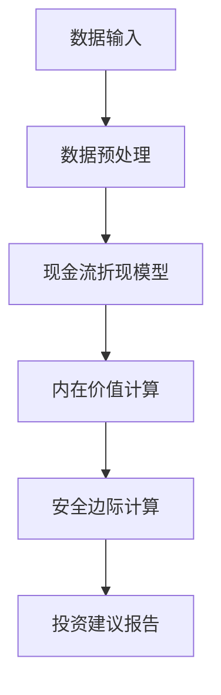

                 


# 巴菲特的企业价值评估：内在价值vs市场价格

## 关键词：巴菲特，企业价值评估，内在价值，市场价格，安全边际，价值投资，现金流折现模型

## 摘要：本文深入分析了巴菲特的企业价值评估方法，重点探讨了内在价值与市场价格的关系。通过详细讲解巴菲特的价值投资哲学、内在价值计算方法、安全边际策略以及实际案例分析，帮助读者理解如何在投资中应用这些原则。文章结合理论与实践，提供了丰富的数学模型和实际操作指南，帮助投资者做出更明智的投资决策。

---

# 第1章: 巴菲特投资哲学概述

## 1.1 价值投资的定义与特点

### 1.1.1 价值投资的定义
价值投资是一种长期投资策略，强调以低于内在价值的价格购买优质企业。其核心在于识别市场低估的机会，而非追逐短期价格波动。

### 1.1.2 巴菲特的价值投资体系
巴菲特的价值投资体系基于以下几个核心原则：
1. **安全边际**：买入价格低于内在价值，以确保即使市场波动，也能获得超额收益。
2. **长期视角**：关注企业的长期盈利能力，而非短期市场波动。
3. **优质企业**：投资于具有强大护城河、良好管理团队和持续竞争优势的企业。

### 1.1.3 巴菲特投资哲学的演变
巴菲特的投资哲学经历了从“烟蒂投资”到“优质企业”的演变，但核心始终围绕着寻找具有持续竞争优势的企业。

---

## 1.2 巴菲特的投资策略与选股标准

### 1.2.1 巴菲特的选股标准
巴菲特选股时注重以下几点：
1. **护城河**：企业必须具备强大的竞争优势，能够长期保持领先地位。
2. **管理层**：管理层必须诚实、有能力，且以股东利益为重。
3. **财务健康**：企业必须具备健康的财务状况，低债务负担，高盈利能力。

### 1.2.2 巴菲特的行业偏好
巴菲特偏好具有稳定需求和长期增长潜力的行业，如消费必需品、金融服务和公用事业。

### 1.2.3 巴菲特的长期投资理念
巴菲特强调长期投资，避免频繁交易，以降低交易成本和市场波动的影响。

---

# 第2章: 内在价值与市场价格的关系

## 2.1 企业价值评估的定义与意义

### 2.1.1 企业价值评估的定义
企业价值评估是对企业整体价值的估算，通常包括企业的资产、负债、现金流和未来盈利能力等因素。

### 2.1.2 企业价值评估的意义
企业价值评估是投资者做出明智投资决策的基础，帮助识别市场低估或高估的机会。

### 2.1.3 企业价值评估的边界与外延
企业价值评估需要考虑企业所在的行业、市场环境、宏观经济因素等外部条件，以及企业内部的财务状况和管理能力。

---

## 2.2 内在价值与市场价格的关系

### 2.2.1 内在价值的定义
内在价值是基于企业未来现金流的现值，反映了企业的真实价值。

### 2.2.2 市场价格的波动性
市场价格受市场情绪、短期事件和市场参与者的预期影响，经常偏离内在价值。

### 2.2.3 内在价值与市场价格的动态平衡
市场价格围绕内在价值波动，长期来看，市场价格会回归内在价值。

---

## 第3章: 巴菲特的企业价值评估模型

### 3.1 巴菲特的企业价值评估方法

#### 3.1.1 现金流折现模型
现金流折现模型（DCF）是巴菲特常用的估值方法，通过将未来现金流折现到现值，计算企业的内在价值。

#### 3.1.2 股东权益自由现金流模型
股东权益自由现金流模型将企业产生的自由现金流折现，用于评估企业价值。

#### 3.1.3 市盈率与市净率分析
市盈率（P/E）和市净率（P/B）是常用的估值指标，但巴菲特更倾向于使用现金流折现模型。

---

## 3.2 巴菲特的企业价值评估公式

### 3.2.1 内在价值计算公式
$$ \text{内在价值} = \sum_{t=1}^{n} \frac{\text{自由现金流}_t}{(1 + r)^t} $$
其中，\( r \) 为折现率，\( n \) 为预测期数。

### 3.2.2 市场价格波动公式
$$ \text{市场价格} = \text{内在价值} \times \text{市场情绪系数} $$

### 3.2.3 安全边际计算公式
$$ \text{安全边际} = \text{内在价值} - \text{市场价格} $$

---

## 第4章: 巴菲特的企业价值评估核心要素

### 4.1 企业财务指标分析

#### 4.1.1 净利润与ROE分析
$$ \text{ROE} = \frac{\text{净利润}}{\text{股东权益}} $$
高ROE表明企业利用股东资金的效率较高。

#### 4.1.2 营业收入与增长性分析
$$ \text{增长率} = \frac{\text{营业收入}_t - \text{营业收入}_{t-1}}{\text{营业收入}_{t-1}} $$

#### 4.1.3 财务杠杆与偿债能力分析
$$ \text{债务率} = \frac{\text{总负债}}{\text{股东权益}} $$

### 4.2 企业竞争优势分析

#### 4.2.1 投资壁垒与竞争优势
企业竞争优势包括成本优势、技术优势、品牌优势等。

#### 4.2.2 企业护城河分析
护城河是企业在市场上长期保持竞争优势的能力，常见的护城河包括技术壁垒、网络效应、成本优势等。

#### 4.2.3 行业地位与市场占有率
$$ \text{市场占有率} = \frac{\text{企业销售额}}{\text{行业总销售额}} $$

---

## 第5章: 巴菲特的企业价值评估与安全边际

### 5.1 安全边际的定义与作用

#### 5.1.1 安全边际的定义
安全边际是内在价值与市场价格之间的差额，提供了投资的安全空间。

#### 5.1.2 安全边际的作用
安全边际能够降低投资风险，确保即使市场价格波动，投资者也能获得超额收益。

### 5.2 巴菲特的安全边际策略

#### 5.2.1 安全边际与内在价值的关系
$$ \text{安全边际} = \text{内在价值} - \text{市场价格} $$

#### 5.2.2 安全边际与市场价格的波动
市场价格波动会影响安全边际的大小，但内在价值是衡量安全边际的基础。

#### 5.2.3 安全边际在投资决策中的应用
通过计算安全边际，投资者可以选择具有足够安全空间的投资标的。

---

## 第6章: 巴菲特企业价值评估的实际案例分析

### 6.1 巴菲特的经典投资案例

#### 6.1.1 可口可乐的估值案例
可口可乐的内在价值计算：
1. 预测未来现金流。
2. 使用DCF模型计算内在价值。
3. 对比市场价格，计算安全边际。

#### 6.1.2 伯克希尔哈撒韦的估值案例
伯克希尔哈撒韦作为巴菲特的旗舰公司，其估值案例展示了巴菲特对企业价值评估的全过程。

---

## 第7章: 巴菲特企业价值评估的系统架构设计

### 7.1 系统功能设计

#### 7.1.1 数据收集模块
- 收集企业的财务数据和市场数据。
- 数据预处理和清洗。

#### 7.1.2 模型计算模块
- 使用现金流折现模型计算内在价值。
- 计算安全边际。

#### 7.1.3 结果分析模块
- 对比市场价格，评估投资机会。
- 生成投资建议报告。

### 7.2 系统架构设计

#### 7.2.1 系统架构图


### 7.3 系统接口设计
- 输入接口：企业财务数据、市场数据。
- 输出接口：内在价值、安全边际、投资建议。

---

## 第8章: 项目实战与最佳实践

### 8.1 项目环境安装
- 安装Python和相关库（如Pandas、NumPy、Matplotlib）。

### 8.2 核心实现源代码
```python
def calculate_intrinsic_value(fcf, discount_rate):
    # 现金流折现模型
    intrinsic_value = sum(fcf / (1 + discount_rate)**t for t in range(len(fcf)))
    return intrinsic_value

# 示例数据
fcf = [100, 120, 150, 200]
discount_rate = 0.1

iv = calculate_intrinsic_value(fcf, discount_rate)
print(f"内在价值: {iv}")
```

### 8.3 实际案例分析
以可口可乐为例，计算其内在价值，并对比市场价格，评估安全边际。

### 8.4 最佳实践 tips
- 确保数据的准确性和完整性。
- 选择合适的折现率。
- 结合市场环境和企业基本面进行综合评估。

---

## 第9章: 总结与展望

### 9.1 总结
巴菲特的企业价值评估方法以内在价值为核心，结合安全边际策略，帮助投资者做出明智的投资决策。

### 9.2 展望
未来，随着技术的发展，企业价值评估将更加依赖于大数据和人工智能，提供更精准的估值方法。

---

## 作者：AI天才研究院/AI Genius Institute & 禅与计算机程序设计艺术 /Zen And The Art of Computer Programming

---

这篇文章全面解析了巴菲特的企业价值评估方法，结合理论与实践，为投资者提供了详细的指导。

