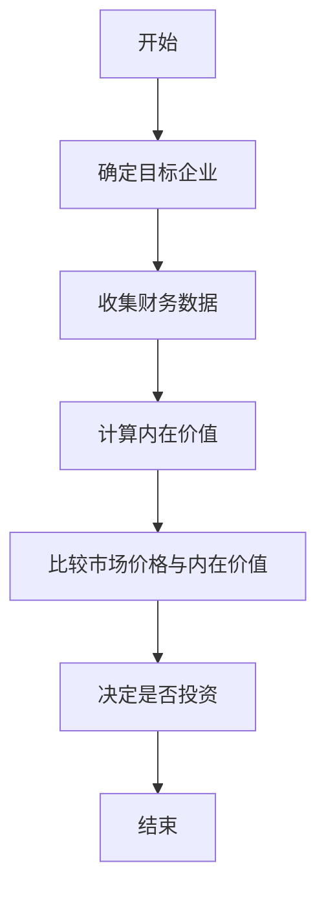
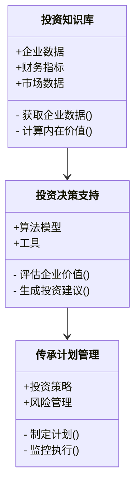

                 


# 巴菲特的传承计划：如何传递投资智慧

## 关键词：巴菲特, 投资智慧, 传承计划, 价值投资, 长期投资, 分散投资, 投资策略

## 摘要：  
巴菲特作为世界顶级投资者，他的投资智慧和哲学不仅在金融市场中留下了深刻的印记，更通过传承计划影响了无数投资者。本文将详细分析巴菲特的传承计划，探讨其投资智慧的核心理念、算法原理、系统架构以及项目实战，为读者提供全面的视角，帮助他们理解和应用这些智慧。

---

# 第一部分：巴菲特投资智慧的背景与核心理念

## 第1章：巴菲特的生平与投资哲学

### 1.1 巴菲特的成长经历
巴菲特出生于1934年，早年展现出对投资的浓厚兴趣，15岁时开始在股票市场中进行投资。他通过阅读经典投资书籍和实践，逐步形成了自己的投资理念。

### 1.2 巴菲特的投资理念
巴菲特的核心投资理念是“价值投资”，即寻找那些被市场低估的优秀企业，长期持有，等待其价值回归。他强调安全边际和企业的长期竞争优势。

### 1.3 巴菲特的价值投资理论
价值投资的核心是寻找“margin of safety”（安全边际），即以低于内在价值的价格买入优质股票。巴菲特认为，投资的本质是寻找企业的未来现金流，并通过折现计算其内在价值。

## 第2章：巴菲特传承计划的背景

### 2.1 巴菲特家族传承的背景
巴菲特的家族传承计划主要是为了确保他的投资智慧能够被后代继承和发扬光大。他通过设立信托基金和选择合适的接班人，确保他的投资哲学得以延续。

### 2.2 巴菲特投资智慧的传承意义
巴菲特的传承计划不仅关乎他的家族，更对全球投资者产生了深远影响。他的投资智慧为无数人提供了成功的模板。

### 2.3 巴菲特传承计划的目标与挑战
传承计划的目标是将投资智慧系统化、结构化，使其能够被更广泛的人群所理解和应用。挑战在于如何将复杂的投资理念转化为可操作的策略。

---

# 第二部分：巴菲特投资智慧的核心概念与联系

## 第3章：价值投资的核心原理

### 3.1 价值投资的定义
价值投资是一种以低于内在价值的价格购买优质股票的投资策略。它强调安全边际和长期持有的理念。

### 3.2 价值投资与其他投资策略的对比
通过表格对比价值投资、成长投资和技术分析的特点，帮助读者更好地理解其独特性。

| 投资策略 | 核心理念 | 优点 | 缺点 |
|----------|----------|------|------|
| 价值投资 | 寻找被低估的股票 | 风险较低，回报稳定 | 需要深入分析企业 |
| 成长投资 | 投资于高增长企业 | 高回报潜力 | 风险较高 |

## 第4章：投资策略的算法原理

### 4.1 投资决策的数学模型
巴菲特的决策过程可以通过数学模型进行模拟。例如，DCF模型用于评估企业的内在价值。

### 4.2 价值评估的算法流程
使用Mermaid流程图展示价值评估的步骤：



---

# 第三部分：巴菲特传承计划的系统架构与实现

## 第5章：系统架构设计

### 5.1 功能模块设计
传承计划系统包括知识库模块、决策支持模块和计划管理模块。

### 5.2 系统架构图
使用Mermaid绘制系统架构图：



---

# 第四部分：项目实战与案例分析

## 第6章：项目实战

### 6.1 环境安装
安装必要的工具和软件，如Python、数据分析库（Pandas、NumPy）等。

### 6.2 核心代码实现
使用Python编写DCF模型的代码，计算企业的内在价值。

```python
import pandas as pd

def calculate_intrinsic_value(financial_data, discount_rate):
    # 计算自由现金流
    fcfs = financial_data['FCF']
    # 计算永续增长阶段的现金流
    terminal_value = fcfs[-1] * (1 + financial_data['永续增长率']) / (discount_rate - financial_data['永续增长率'])
    # 计算现值
    present_value = 0
    for i in range(len(fcfs)):
        present_value += fcfs[i] / (1 + discount_rate) ** i
    # 加上终值
    present_value += terminal_value / (1 + discount_rate) ** len(fcfs)
    return present_value

# 示例数据
data = {
    'FCF': [10, 12, 15],
    '永续增长率': 0.05,
    'discount_rate': 0.1
}
financial_data = pd.DataFrame(data)
intrinsic_value = calculate_intrinsic_value(financial_data, 0.1)
print(f"内在价值: {intrinsic_value}")
```

---

# 第五部分：总结与展望

## 第7章：总结与展望

### 7.1 传承计划的成功关键
成功的关键在于系统的结构化设计和长期坚持的价值投资理念。

### 7.2 最佳实践
读者应注重系统化的学习和实践，结合实际案例深入理解巴菲特的投资智慧。

### 7.3 注意事项
投资者需注意市场变化和个体差异，灵活调整投资策略。

### 7.4 拓展阅读
推荐阅读巴菲特的经典著作《聪明的投资者》和相关投资策略书籍。

---

# 作者：AI天才研究院 & 禅与计算机程序设计艺术

---

这篇文章通过详细分析巴菲特的投资智慧和传承计划，结合技术博客的特点，为读者提供了从理论到实践的全面指导。

