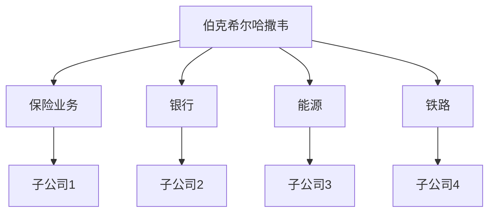

                 

# 巴菲特的伯克希尔哈撒韦模式：控股公司的优势

## 关键词：巴菲特，伯克希尔哈撒韦，控股公司，价值投资，风险管理，投资策略，企业治理

## 摘要： 
巴菲特的伯克希尔哈撒韦是一家以控股公司模式运作的著名投资公司。本文将从背景介绍、核心概念、算法原理、系统分析、项目实战和最佳实践六个方面，详细分析伯克希尔哈撒韦的成功模式和控股公司的优势。文章深入探讨了巴菲特的投资哲学、伯克希尔哈撒韦的组织架构、价值投资的数学模型以及风险管理策略，并通过具体案例分析展示了其成功的运作方式。

---

## 第一部分：背景介绍

### 第1章：巴菲特与伯克希尔哈撒韦概述

#### 1.1 巴菲特的背景与投资理念

- **1.1.1 巴菲特的生平简介**
  - 1934年出生，美国堪萨斯州人
  - 曾就读于哥伦比亚大学，师从本杰明·格雷厄姆
  - 1965年收购伯克希尔哈撒韦公司，开启投资生涯

- **1.1.2 巴菲特的投资哲学**
  - 价值投资：寻找市场低估的优秀企业
  - 长期持有：注重企业的内在价值
  - 安全边际：买入价格低于内在价值的企业

- **1.1.3 巴菲特的价值投资理念**
  - 企业护城河：竞争优势是长期投资的关键
  - 高质量的管理层：信任管理层的能力和道德
  - 耐心与纪律：坚持长期投资，避免短期波动

#### 1.2 伯克希尔哈撒韦的成立与演变

- **1.2.1 伯克希尔哈撒韦的创立**
  - 成立于1839年，最初是纺织公司
  - 1965年巴菲特收购，转型为控股公司

- **1.2.2 伯克希尔哈撒韦的扩张与转型**
  - 从纺织业转向多元化投资
  - 通过收购优秀企业，构建多元化的业务组合

- **1.2.3 伯克希尔哈撒韦的多元化业务**
  - 保险、银行、能源、铁路等多种业务
  - 通过控股结构实现协同效应

#### 1.3 巴菲特与伯克希尔哈撒韦的成功模式

- **1.3.1 巴菲特的选股标准**
  - 低市盈率、低市净率、高股息率
  - 寻找具有持续竞争优势的企业

- **1.3.2 伯克希尔哈撒韦的股东价值最大化**
  - 长期持有优质资产，实现股东价值
  - 通过分红和回购回馈股东

- **1.3.3 巴菲特的长期投资策略**
  - 避免短期市场波动，关注企业长期价值
  - 通过分散投资降低风险

---

## 第二部分：核心概念与优势

### 第2章：控股公司的定义与特点

#### 2.1 控股公司的定义

- **2.1.1 控股公司的法律结构**
  - 控股公司作为母公司，持有子公司部分或全部股权
  - 通过控股结构实现对子公司的控制

- **2.1.2 控股公司的股权结构**
  - 母公司持有子公司一定比例的股权
  - 通过董事会控制子公司决策

- **2.1.3 控股公司的治理模式**
  - 母公司对子公司进行战略决策和管理
  - 子公司保持一定的运营独立性

#### 2.2 控股公司的核心优势

- **2.2.1 多元化业务优势**
  - 通过控股结构实现业务多元化
  - 分散风险，增强抗波动能力

- **2.2.2 协同效应**
  - 子公司之间的资源共享和优势互补
  - 提高整体运营效率

- **2.2.3 资本运作优势**
  - 通过控股结构优化资本配置
  - 通过杠杆效应放大投资收益

#### 2.3 伯克希尔哈撒韦的控股模式

- **2.3.1 伯克希尔哈撒韦的控股结构**
  - 伯克希尔哈撒韦为母公司，旗下控股多家子公司
  - 子公司涵盖保险、银行、能源等多个领域

- **2.3.2 伯克希尔哈撒韦的治理模式**
  - 集权与分权结合：巴菲特对重大决策有最终话语权
  - 子公司保持一定的运营独立性

- **2.3.3 伯克希尔哈撒韦的股东价值实现**
  - 通过长期持有优质资产实现股东价值
  - 通过分红和股票回购回馈股东

---

## 第三部分：算法原理

### 第3章：伯克希尔哈撒韦的投资策略

#### 3.1 价值投资的数学模型

- **3.1.1 内在价值计算**
  - 内在价值公式：$$\text{内在价值} = \frac{\text{净利润} \times (1 + g)}{r - g}$$**
    - 其中，g为净利润增长率，r为贴现率

- **3.1.2 安全边际计算**
  - 安全边际 = 内在价值 - 市场价格
  - $$\text{安全边际} = \text{内在价值} - \text{市场价格}$$

#### 3.2 伯克希尔哈撒韦的投资决策流程

- **3.2.1 企业筛选**
  - 寻找具有持续竞争优势的企业
  - 评估企业的财务状况和管理层能力

- **3.2.2 投资决策**
  - 通过内在价值计算确定投资价格
  - 确保安全边际的存在

- **3.2.3 投资组合管理**
  - 分散投资，降低风险
  - 定期评估和调整投资组合

#### 3.3 伯克希尔哈撒韦的投资组合分析

- **3.3.1 投资组合的构成**
  - 多元化的投资组合，涵盖多个行业
  - 通过分散投资降低风险

- **3.3.2 投资组合的调整**
  - 根据市场变化和企业状况调整投资
  - 保持投资组合的长期价值

---

## 第四部分：系统分析与架构设计

### 第4章：伯克希尔哈撒韦的组织架构

#### 4.1 伯克希尔哈撒韦的组织架构图

#### 4.2 伯克希尔哈撒韦的治理结构

- **4.2.1 股东大会**
  - 定期召开股东大会，听取管理层报告
  - 股东参与重大决策

- **4.2.2 董事会**
  - 负责公司战略决策和日常管理
  - 确保公司治理的透明性和合规性

- **4.2.3 高层管理团队**
  - 由巴菲特、芒格等核心人物领导
  - 负责公司的重大投资决策

#### 4.3 伯克希尔哈撒韦的风险管理策略

- **4.3.1 风险分散**
  - 通过多元化投资分散风险
  - 避免过度集中于单一行业或资产

- **4.3.2 风险评估**
  - 定期评估投资组合的风险
  - 通过压力测试评估极端情况下的风险敞口

- **4.3.3 风险控制**
  - 设定风险容忍度，确保投资决策符合风险偏好
  - 通过动态调整投资组合控制风险

---

## 第五部分：项目实战

### 第5章：伯克希尔哈撒韦的投资案例分析

#### 5.1 投资苹果公司的案例

- **5.1.1 投资背景**
  - 苹果公司具备强大的护城河
  - 公司管理层能力强

- **5.1.2 投资决策**
  - 计算苹果公司的内在价值
  - 确保投资价格低于内在价值

- **5.1.3 投资结果**
  - 苹果公司成为伯克希尔哈撒韦的重要持仓
  - 投资收益显著

#### 5.2 管理保险业务的案例

- **5.2.1 保险业务的收购**
  - 收购 GEICO，进入保险行业
  - 通过低成本扩张实现市场份额增长

- **5.2.2 保险业务的管理**
  - 通过成本控制提高利润率
  - 通过风险管理降低赔付率

- **5.2.3 保险业务的协同效应**
  - 保险业务为伯克希尔哈撒韦提供稳定的现金流
  - 通过保险业务的协同效应，降低整体成本

---

## 第六部分：最佳实践

### 第6章：控股公司的成功经验与教训

#### 6.1 成功经验总结

- **6.1.1 长期投资的重要性**
  - 通过长期持有优质资产实现价值增长
  - 避免短期市场波动的干扰

- **6.1.2 价值投资的核心**
  - 寻找具有持续竞争优势的企业
  - 以合理的价格买入优质资产

- **6.1.3 风险管理的关键**
  - 通过多元化投资分散风险
  - 通过动态调整投资组合控制风险

#### 6.2 投资小结

- **6.2.1 伯克希尔哈撒韦的成功模式**
  - 通过控股结构实现多元化业务
  - 通过价值投资实现长期价值增长
  - 通过优秀的企业治理实现股东价值最大化

- **6.2.2 对投资者的启示**
  - 价值投资需要耐心和纪律
  - 风险管理是投资成功的关键
  - 选择优秀的管理层和企业是投资成功的基石

---

## 结语

巴菲特的伯克希尔哈撒韦模式为控股公司提供了一个成功的范例。通过多元化业务、价值投资和优秀的企业治理，伯克希尔哈撒韦实现了长期的股东价值增长。本文通过背景介绍、核心概念、算法原理、系统分析、项目实战和最佳实践六个方面，全面解析了伯克希尔哈撒韦的成功模式和控股公司的优势。希望本文能为投资者和企业管理者提供有益的启示和借鉴。

---

## 作者：AI天才研究院/AI Genius Institute & 禅与计算机程序设计艺术 /Zen And The Art of Computer Programming

