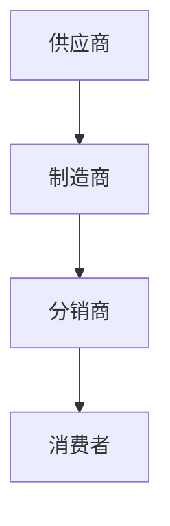
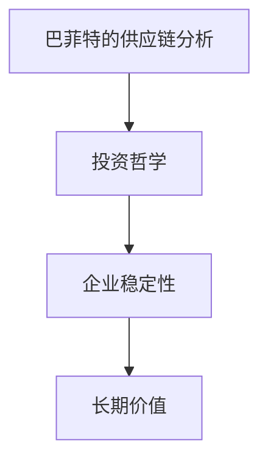
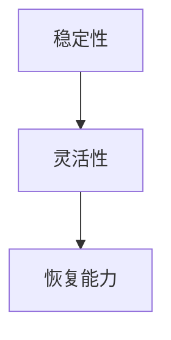
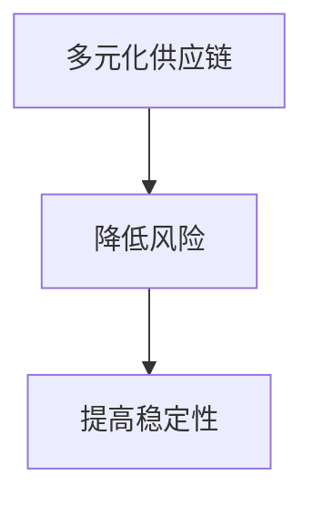
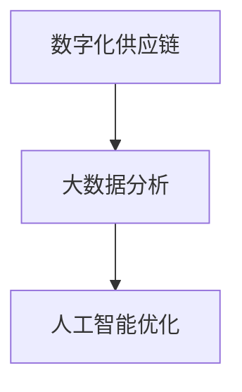
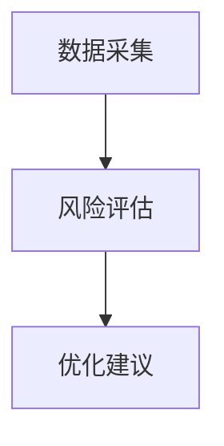

                 


# 巴菲特的供应链韧性分析：全球化挑战下的应对之策

## 关键词：供应链韧性，巴菲特，全球化挑战，投资分析，供应链管理

## 摘要：
在全球化面临挑战的背景下，供应链韧性成为企业生存和发展的关键因素。本文通过分析巴菲特的投资策略，探讨供应链韧性的重要性及其在企业经营中的应用。文章从供应链的基本概念出发，结合巴菲特的分析方法，构建供应链韧性评估框架，并通过案例分析提供应对全球化挑战的具体策略。最后，总结供应链管理的未来发展方向。

---

## # 第一部分：供应链韧性与全球化挑战

### ## 第1章：供应链韧性概述

#### ### 1.1 供应链的基本概念

供应链是由供应商、制造商、分销商和消费者组成的网络，涉及原材料采购、生产、分销和交付等环节。供应链韧性是指在面对 disruptions时，供应链能够迅速恢复并维持稳定运作的能力。

#### 关键术语：
- **供应链**：从原材料到最终产品的流动过程。
- **韧性**：供应链在面对危机时的恢复能力。

#### 图表：


#### ### 1.2 全球化背景下的供应链挑战

全球化带来了供应链的复杂性，但同时也增加了脆弱性。地缘政治冲突、疫情和自然灾害等事件可能中断供应链，导致企业面临风险。

#### ### 1.3 供应链韧性与企业竞争力

供应链韧性直接影响企业的成本、交付能力和客户满意度。具备强大供应链韧性的企业能够更快适应市场变化，增强竞争力。

---

### ## 第2章：巴菲特的供应链分析方法

#### ### 2.1 巴菲特的投资哲学与供应链分析

巴菲特的价值投资理念强调长期稳定和低成本。他关注企业的供应链稳定性，认为稳定的供应链是企业长期盈利能力的关键。

#### 图表：


#### ### 2.2 巴菲特供应链分析的核心要素

- **稳定性**：确保供应链的持续运作。
- **成本效率**：降低供应链成本，提高竞争力。
- **弹性**：应对突发事件的能力。

#### ### 2.3 巴菲特供应链分析的典型案例

以可口可乐为例，巴菲特投资该公司时，关注其全球供应链的稳定性和成本控制能力。

---

## # 第二部分：供应链韧性评估框架

### ## 第3章：供应链韧性评估的核心指标

#### ### 3.1 供应链韧性评估的基本维度

- **稳定性**：供应链在正常情况下的运作能力。
- **灵活性**：应对变化的能力。
- **恢复能力**：从中断中恢复的速度。

#### 图表：


#### ### 3.2 供应链韧性评估的数学模型

使用风险概率和影响矩阵进行评估：

$$
\text{风险优先级} = \text{概率} \times \text{影响}
$$

---

## # 第三部分：应对全球化挑战的策略

### ## 第4章：供应链多元化与区域化

#### ### 4.1 多元化供应链的优势

通过多元化供应商降低风险，确保供应的稳定性。

#### 图表：


#### ### 4.2 区域化供应链的策略

在全球不同地区建立供应链节点，缩短交付时间，降低运输成本。

---

### ## 第5章：供应链数字化转型

#### ### 5.1 数字化供应链的优势

通过大数据和人工智能优化供应链管理，提高透明度和效率。

#### 图表：


#### ### 5.2 数字化供应链的实施步骤

1. 数据采集与分析
2. 建立预测模型
3. 实施智能监控

---

## # 第四部分：系统分析与架构设计

### ## 第6章：供应链风险管理系统的架构

#### ### 6.1 供应链风险管理系统的功能模块

- 数据采集模块
- 风险评估模块
- 优化建议模块

#### 图表：


#### ### 6.2 系统架构设计


---

## # 第五部分：项目实战

### ## 第7章：构建供应链韧性评估系统

#### ### 7.1 环境安装

安装Python和相关库（如numpy、pandas）。

#### ### 7.2 核心代码实现

```python
import numpy as np

def calculate_risk(matrix):
    risk = np.sum(matrix)
    return risk

# 示例数据矩阵
matrix = np.array([[0.2, 0.5], [0.3, 0.7]])
print(calculate_risk(matrix))
```

#### ### 7.3 案例分析与解读

分析某公司供应链数据，评估风险并提出优化建议。

---

## # 第六部分：结论与展望

### ## 第8章：结论与未来方向

#### ### 8.1 结论

供应链韧性是全球化背景下企业成功的关键因素。巴菲特的分析方法为企业提供了有效的供应链管理策略。

#### ### 8.2 未来展望

随着技术进步，供应链管理将更加智能化和数字化，企业需要持续优化供应链韧性。

---

## 作者：AI天才研究院/AI Genius Institute & 禅与计算机程序设计艺术 /Zen And The Art of Computer Programming

