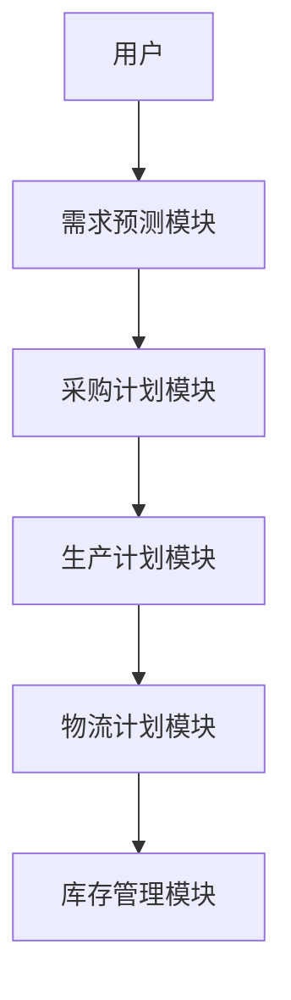

                 


# 巴菲特的供应链韧性分析：全球化时代的重要考量

## 关键词：供应链韧性，巴菲特，全球化，供应链管理，企业风险管理，投资分析

## 摘要：本文从巴菲特的投资视角出发，分析供应链韧性在全球化时代的 importance。通过介绍供应链韧性概念、全球化带来的挑战、巴菲特的供应链分析方法、供应链韧性分析的核心概念与模型、算法与优化、系统架构与设计、项目实战以及总结与展望，为读者提供全面的供应链韧性分析框架，帮助企业提升供应链管理能力，增强企业竞争力。

---

# 第一部分: 供应链韧性概述

## 第1章: 供应链韧性的概念与重要性

### 1.1 供应链的基本概念

#### 1.1.1 供应链的定义

供应链是指从原材料采购到最终产品交付给客户的整个过程，包括供应商、制造商、分销商、零售商和客户等参与者。供应链的核心目标是高效地将产品交付给客户，同时降低成本和风险。

#### 1.1.2 供应链的核心要素

供应链的核心要素包括：

1. 供应商管理：选择可靠的供应商，确保原材料供应的稳定性。
2. 生产过程：优化生产流程，提高生产效率。
3. 物流与运输：确保产品在供应链中的高效流动。
4. 库存管理：合理控制库存水平，避免积压和短缺。
5. 客户需求预测：准确预测客户需求，优化生产和交付。

#### 1.1.3 供应链的分类与特点

供应链可以根据不同的标准进行分类，如按行业、规模、地理分布等。全球化时代，供应链往往跨越多个国家和地区，具有复杂性和多样性。

---

### 1.2 供应链韧性的定义与内涵

#### 1.2.1 供应链韧性的定义

供应链韧性是指供应链在面对突发事件、市场变化或其他不确定性时，能够保持稳定运作、快速恢复并适应变化的能力。

#### 1.2.2 供应链韧性的关键特征

供应链韧性具有以下关键特征：

1. **抗风险能力**：在突发事件（如自然灾害、疫情等）下，供应链能够保持运作。
2. **快速恢复能力**：在供应链中断后，能够迅速恢复到正常运作状态。
3. **灵活性**：根据市场需求变化，快速调整供应链策略。
4. **协同性**：供应链各环节能够协同合作，共同应对挑战。

#### 1.2.3 供应链韧性与企业竞争力

供应链韧性是企业竞争力的重要组成部分。具有强大供应链韧性的企业能够在市场波动中保持稳定，快速响应客户需求，提高市场占有率。

---

### 1.3 巴菲特的供应链分析方法

#### 1.3.1 巴菲特的投资理念与供应链的关系

巴菲特的投资理念注重企业基本面分析，包括企业的盈利能力、财务状况、管理团队等。供应链作为企业运营的重要组成部分，是巴菲特分析企业竞争力时的重要考量因素。

#### 1.3.2 巴菲特分析供应链韧性的独特视角

巴菲特从以下几个方面分析供应链韧性：

1. **供应商的稳定性**：选择稳定的供应商，确保原材料供应的连续性。
2. **多元化采购**：避免依赖单一供应商，降低供应链中断的风险。
3. **成本控制**：通过优化供应链流程降低成本，提高企业的盈利能力。
4. **风险管理**：识别和评估供应链中的潜在风险，制定应对策略。

#### 1.3.3 巴菲特供应链分析的典型案例

以巴菲特投资的可口可乐公司为例，可口可乐通过全球化的供应链布局，建立了强大的分销网络，确保产品的全球供应和销售。这体现了巴菲特对供应链韧性的重视。

---

## 第2章: 全球化时代的供应链挑战

### 2.1 全球化对供应链的影响

#### 2.1.1 全球化对企业供应链布局的影响

全球化使得企业可以利用全球资源优化供应链布局，降低生产成本，提高效率。例如，企业可以将生产环节外包到劳动力成本较低的国家，同时在其他国家建立销售网络。

#### 2.1.2 全球化带来的供应链风险

全球化也带来了供应链风险，如国际贸易摩擦、地缘政治冲突、疫情等突发事件可能导致供应链中断。

#### 2.1.3 全球化时代供应链管理的新特点

全球化时代，供应链管理呈现出以下新特点：

1. **全球化与本地化结合**：企业需要在全球范围内优化供应链布局，同时考虑本地化需求。
2. **数字化与智能化**：通过大数据、人工智能等技术优化供应链管理。
3. **可持续性**：关注环保和可持续发展，减少供应链对环境的负面影响。

---

### 2.2 供应链韧性在企业运营中的作用

#### 2.2.1 供应链韧性对企业成本控制的影响

强大的供应链韧性可以帮助企业降低运营成本，优化库存管理，提高资源利用率。

#### 2.2.2 供应链韧性对企业风险应对的作用

供应链韧性是企业应对突发事件和市场变化的重要能力，能够降低供应链中断的风险，保障企业正常运作。

#### 2.2.3 供应链韧性对企业战略规划的意义

供应链韧性是企业制定长期战略规划的重要考量因素，能够帮助企业在全球化竞争中占据优势。

---

### 2.3 巴菲特视角下的供应链韧性分析框架

#### 2.3.1 巴菲特分析供应链韧性的核心维度

巴菲特从以下几个维度分析供应链韧性：

1. **供应商的稳定性与多样性**：选择稳定的供应商，并保持供应商的多样性，降低供应链中断的风险。
2. **供应链的透明度**：确保供应链的透明化管理，能够实时监控供应链各环节的运作情况。
3. **成本控制**：通过优化供应链流程降低成本，提高企业的盈利能力。
4. **风险管理**：识别和评估供应链中的潜在风险，制定应对策略。

#### 2.3.2 巴菲特供应链韧性分析的逻辑框架

巴菲特的供应链韧性分析框架包括以下几个步骤：

1. **识别供应链中的关键环节**：确定供应链中的关键环节，如供应商、生产环节、物流等。
2. **评估供应链的稳定性**：分析供应链各环节的稳定性，识别潜在风险。
3. **制定风险管理策略**：根据风险评估结果，制定相应的风险管理策略，降低供应链中断的风险。
4. **优化供应链布局**：根据市场变化和企业战略，优化供应链布局，提高供应链韧性。

#### 2.3.3 巴菲特供应链韧性分析的实践意义

通过巴菲特的供应链韧性分析框架，企业可以更好地识别和应对供应链中的潜在风险，优化供应链布局，提高供应链韧性，增强企业的竞争力。

---

# 第二部分: 供应链韧性分析的核心概念与模型

## 第3章: 供应链韧性分析的核心要素

### 3.1 供应链韧性分析的理论基础

#### 3.1.1 供应链韧性分析的基本原理

供应链韧性分析基于供应链管理的理论，结合风险管理、运筹学、系统工程等多学科知识，通过分析供应链各环节的稳定性、灵活性和协同性，评估供应链的韧性。

#### 3.1.2 供应链韧性分析的关键理论

供应链韧性分析的关键理论包括：

1. **风险管理理论**：用于识别和评估供应链中的潜在风险。
2. **系统工程理论**：用于分析供应链各环节的相互关系和整体运作。
3. **运筹学理论**：用于优化供应链的运作流程，提高效率。

#### 3.1.3 供应链韧性分析的数学模型

供应链韧性分析可以使用多种数学模型，如线性规划、网络流模型等，用于优化供应链的运作流程，降低运营成本。

---

### 3.2 供应链韧性分析的核心要素

#### 3.2.1 供应链韧性分析的核心维度

供应链韧性分析的核心维度包括：

1. **稳定性**：供应链在面对突发事件时的抗干扰能力。
2. **恢复性**：供应链在中断后恢复到正常运作状态的能力。
3. **灵活性**：供应链根据市场需求变化快速调整的能力。

#### 3.2.2 供应链韧性分析的关键指标

供应链韧性分析的关键指标包括：

1. **供应链中断的风险概率**：评估供应链中断的可能性。
2. **供应链中断的影响程度**：评估供应链中断对企业的影响程度。
3. **供应链恢复的时间**：评估供应链中断后恢复所需的时间。

#### 3.2.3 供应链韧性分析的步骤

供应链韧性分析的步骤包括：

1. **识别供应链中的关键环节**：确定供应链中的关键环节，如供应商、生产环节、物流等。
2. **评估供应链的稳定性**：分析供应链各环节的稳定性，识别潜在风险。
3. **制定风险管理策略**：根据风险评估结果，制定相应的风险管理策略，降低供应链中断的风险。
4. **优化供应链布局**：根据市场变化和企业战略，优化供应链布局，提高供应链韧性。

---

## 第4章: 供应链韧性分析的数学模型与算法

### 4.1 供应链韧性分析的数学模型

#### 4.1.1 供应链韧性分析的线性规划模型

供应链韧性分析可以使用线性规划模型，优化供应链的运作流程，降低运营成本。例如，可以通过线性规划模型优化库存管理，降低库存成本。

#### 4.1.2 供应链韧性分析的网络流模型

网络流模型可以用于分析供应链的物流网络，优化物流路径，降低物流成本。

---

### 4.2 供应链韧性分析的算法实现

#### 4.2.1 供应链韧性分析的算法步骤

供应链韧性分析的算法步骤包括：

1. **数据收集与预处理**：收集供应链各环节的数据，进行清洗和预处理。
2. **建立数学模型**：根据供应链韧性分析的数学模型，建立优化问题的数学表达式。
3. **求解优化问题**：使用优化算法求解数学模型，得到优化结果。
4. **结果分析与决策**：根据优化结果，制定相应的供应链管理策略。

#### 4.2.2 供应链韧性分析的Python实现

以下是一个简单的供应链韧性分析的Python代码示例，用于优化库存管理：

```python
import numpy as np
import pandas as pd

# 数据预处理
data = pd.read_csv('supply_chain_data.csv')

# 线性规划模型
from scipy.optimize import linprog

# 定义目标函数
c = [-1, -2, -3]  # 假设目标是最大化利润

# 定义约束条件
A = [[1, 0, 0], [0, 1, 0], [0, 0, 1]]  # 假设有三个变量
b = [100, 200, 300]  # 约束条件的右端

# 求解线性规划问题
result = linprog(c, A, b, method='highs')

# 输出结果
print(result)
```

---

## 第5章: 供应链韧性分析的系统架构与设计

### 5.1 供应链管理系统的功能设计

#### 5.1.1 供应链管理系统的功能模块

供应链管理系统主要包括以下几个功能模块：

1. **供应商管理模块**：管理供应商信息，评估供应商绩效。
2. **生产管理模块**：优化生产流程，提高生产效率。
3. **物流管理模块**：优化物流路径，降低物流成本。
4. **库存管理模块**：优化库存管理，降低库存成本。
5. **需求预测模块**：预测客户需求，优化生产和交付。

#### 5.1.2 供应链管理系统的功能流程

供应链管理系统的功能流程包括：

1. **需求预测**：根据历史数据和市场趋势，预测客户需求。
2. **采购计划**：根据需求预测，制定采购计划，选择供应商。
3. **生产计划**：根据采购计划和生产能力，制定生产计划。
4. **物流计划**：根据生产计划和客户分布，制定物流计划。
5. **库存监控**：实时监控库存水平，调整生产和采购计划。

---

### 5.2 供应链管理系统的架构设计

#### 5.2.1 供应链管理系统的架构图

以下是一个供应链管理系统的架构图：



#### 5.2.2 供应链管理系统的接口设计

供应链管理系统的接口设计包括：

1. **用户接口**：用户可以通过网页或移动应用提交需求预测和查询库存信息。
2. **数据接口**：系统可以通过API与其他系统（如ERP、CRM）进行数据交互。
3. **报警接口**：系统可以通过报警接口通知相关人员供应链中断或其他异常情况。

---

## 第6章: 供应链韧性分析的项目实战

### 6.1 项目背景与目标

#### 6.1.1 项目背景

某企业是一家全球化运营的制造企业，由于全球化供应链的复杂性，经常面临供应链中断的风险。为了提高供应链韧性，企业决定进行供应链韧性分析，并优化供应链布局。

#### 6.1.2 项目目标

1. 识别供应链中的关键环节和潜在风险。
2. 优化供应链布局，提高供应链韧性。
3. 制定风险管理策略，降低供应链中断的风险。

---

### 6.2 项目实施步骤

#### 6.2.1 数据收集与预处理

收集供应链各环节的数据，包括供应商信息、生产数据、物流数据等，并进行清洗和预处理。

#### 6.2.2 建立数学模型

根据供应链韧性分析的数学模型，建立优化问题的数学表达式。

#### 6.2.3 求解优化问题

使用优化算法求解数学模型，得到优化结果。

#### 6.2.4 结果分析与决策

根据优化结果，制定相应的供应链管理策略，优化供应链布局，提高供应链韧性。

---

### 6.3 项目成果与总结

#### 6.3.1 项目成果

通过供应链韧性分析，企业成功识别了供应链中的关键环节和潜在风险，并优化了供应链布局，提高了供应链韧性。

#### 6.3.2 项目总结

供应链韧性分析是企业在全球化竞争中保持竞争力的重要手段。通过供应链韧性分析，企业可以更好地应对市场变化和突发事件，提高供应链的稳定性和灵活性。

---

## 第7章: 总结与展望

### 7.1 总结

供应链韧性是企业在全球化竞争中保持竞争力的重要能力。通过供应链韧性分析，企业可以识别供应链中的关键环节和潜在风险，优化供应链布局，提高供应链韧性，降低供应链中断的风险。

---

### 7.2 展望

未来，随着人工智能、大数据等技术的发展，供应链韧性分析将更加智能化和精准化。企业可以通过技术手段进一步优化供应链管理，提高供应链的效率和韧性。

---

# 作者：AI天才研究院/AI Genius Institute & 禅与计算机程序设计艺术 /Zen And The Art of Computer Programming

