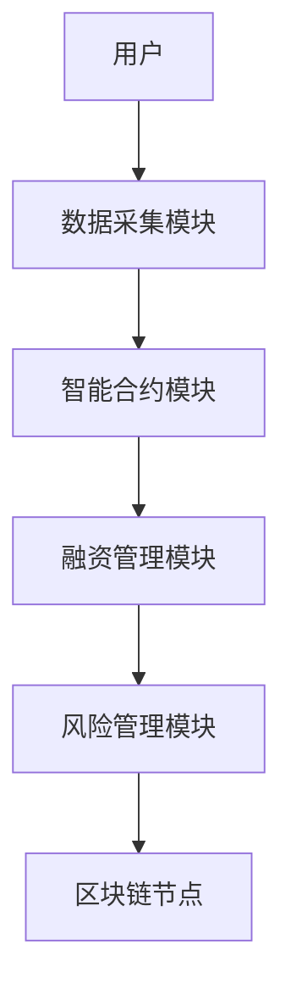
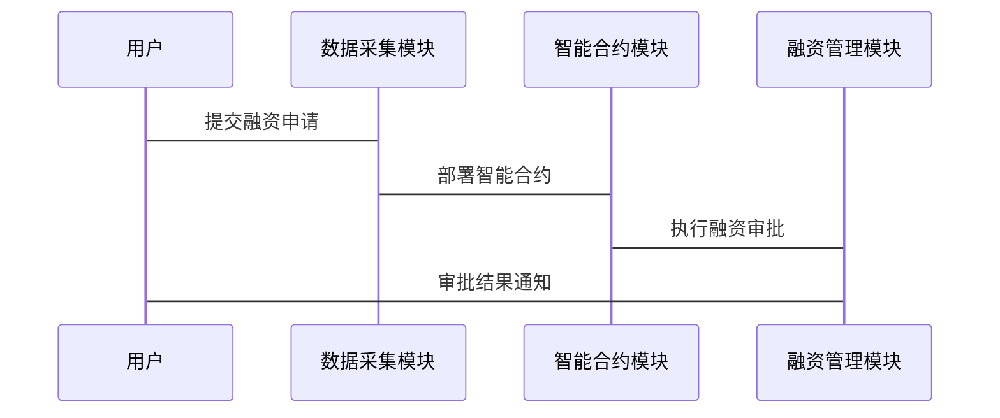

                 


# 巴菲特的供应链韧性分析：区块链技术在供应链金融中的应用

> 关键词：供应链韧性，区块链技术，供应链金融，区块链应用，巴菲特供应链，区块链系统架构

> 摘要：供应链金融是企业运营中的重要环节，区块链技术的引入为供应链金融的透明性、安全性和效率提升提供了新的解决方案。本文以巴菲特的供应链韧性分析为切入点，详细探讨了区块链技术在供应链金融中的应用场景、系统架构设计以及实际案例分析，展示了区块链如何增强供应链金融的韧性和效率。

---

## 第一部分：供应链金融概述

### 第1章：供应链金融的基本概念

#### 1.1 供应链金融的定义与特点

供应链金融是指通过整合供应链中的资金流、物流和信息流，为供应链上的企业提供融资服务，以优化资源配置和提高整体效率。其特点包括：

- **覆盖范围广**：涉及供应商、制造商、分销商和零售商等多个环节。
- **资金流动性高**：通过融资活动提高资金周转效率。
- **风险分散**：通过多参与方的协同合作，降低单一环节的风险。

#### 1.2 供应链金融的现状与问题

当前，供应链金融面临以下主要问题：

- **信息不对称**：各参与方之间的信息不透明，增加了融资难度。
- **效率低下**：传统纸质单据和繁琐的审批流程导致融资周期长。
- **信用风险**：中小企业的信用评估难度大，增加了金融机构的风险敞口。

#### 1.3 区块链技术如何解决供应链金融问题

区块链技术通过去中心化、不可篡改和智能合约等特点，解决了供应链金融中的信息不对称和信用风险问题，提高了融资效率。

---

## 第二部分：区块链技术基础

### 第2章：区块链技术的核心原理

#### 2.1 区块链的基本原理

区块链是一种分布式账本技术，通过点对点网络、共识机制和加密算法确保数据的安全性和一致性。其核心组件包括：

- **区块**：存储交易数据，每个区块包含前一区块的哈希值，形成链式结构。
- **共识机制**：如PoW、PoS，用于确保所有节点达成一致。
- **智能合约**：自动执行预设条件的脚本，确保合同条款自动履行。

#### 2.2 共识机制与智能合约

共识机制确保区块链网络的一致性，而智能合约则实现了自动化和信任的建立。例如，以太坊的智能合约可以用于自动执行供应链金融中的融资协议。

---

## 第三部分：区块链在供应链金融中的应用

### 第3章：区块链在供应链金融中的应用场景

#### 3.1 应收账款融资

通过区块链记录供应商的应收账款信息，金融机构可以根据实时数据快速审批融资，减少信息核实的时间和成本。

#### 3.2 应付账款融资

区块链可以追踪企业的应付账款，帮助供应商基于真实数据获得融资，降低企业的资金压力。

#### 3.3 供应链信用评估

区块链整合供应链中的交易数据，构建企业的信用评分，为金融机构提供更准确的信用评估依据。

#### 3.4 供应链透明度与可追溯性

区块链确保供应链中的每一步交易都可追溯，提升整体透明度，降低欺诈风险。

---

## 第四部分：系统架构设计

### 第4章：区块链供应链金融系统的架构设计

#### 4.1 系统功能模块

- **数据采集模块**：整合供应链中的交易数据。
- **智能合约模块**：自动执行融资协议。
- **融资管理模块**：管理融资申请和审批流程。
- **风险管理模块**：监控供应链中的风险事件。

#### 4.2 系统架构图

使用Mermaid图展示系统架构：



#### 4.3 接口设计

- 数据接口：API用于数据采集模块与区块链节点的数据同步。
- 合约接口：API用于智能合约的调用和执行。

#### 4.4 交互流程设计

使用Mermaid序列图展示用户与系统的交互流程：



---

## 第五部分：项目实战

### 第5章：区块链供应链金融系统实现

#### 5.1 环境安装

安装所需的工具和环境，如以太坊钱包、Solidity编译器和区块链节点。

#### 5.2 核心代码实现

以下是智能合约的Solidity代码示例：

```solidity
// SPDX-License-Identifier: MIT
pragma solidity ^0.8.0;

contract SupplyChainFinance {
    struct Invoice {
        uint256 id;
        address supplier;
        address buyer;
        uint256 amount;
        bool isApproved;
    }

    event InvoiceApproved(uint256 invoiceId, address supplier, address buyer);

    function createInvoice(uint256 id, address supplier, address buyer, uint256 amount) external {
        Invoice memory inv = Invoice(id, supplier, buyer, amount, false);
        // 这里可以添加更多业务逻辑
        emit InvoiceApproved(id, supplier, buyer);
    }

    function approveInvoice(uint256 invoiceId) external {
        // 验证发票存在且未被批准
        // 如果批准，设置isApproved为true
    }
}
```

#### 5.3 案例分析

通过具体案例分析，展示区块链技术如何优化供应链金融流程。例如，一家汽车制造商通过区块链智能合约实现供应商应收账款的自动融资，大幅缩短融资时间。

---

## 第六部分：总结与展望

### 第6章：总结与展望

#### 6.1 本书小结

本文详细探讨了区块链技术在供应链金融中的应用，分析了其如何提升供应链的透明度和效率，降低融资成本和风险。

#### 6.2 未来展望

随着区块链技术的不断发展，供应链金融将更加智能化和自动化。未来，可以通过引入人工智能和大数据分析，进一步优化供应链金融的流程和风险管理。

---

## 作者信息

作者：AI天才研究院/AI Genius Institute & 禅与计算机程序设计艺术 /Zen And The Art of Computer Programming

---

通过以上思考，我整理出了一个详细的目录大纲，并撰写了一篇结构清晰、内容丰富的技术博客文章。

