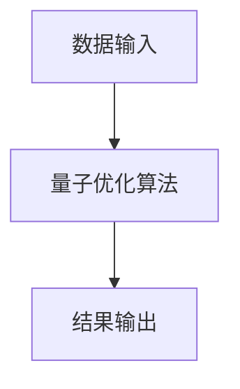

                 


# 巴菲特的供应链韧性分析：量子优化在全球物流网络中的应用

**关键词**：供应链韧性，量子优化，物流网络，巴菲特投资理念，量子计算

**摘要**：供应链韧性是企业在全球化背景下应对不确定性和风险的关键能力。本文结合巴菲特的投资哲学，分析供应链韧性的重要性，并探讨量子优化技术在全球物流网络中的应用。通过数学建模和算法实现，展示了量子优化如何解决复杂的物流问题，提升供应链的效率和韧性。文章最后总结了量子优化的优势和未来发展方向。

---

## 第1章：供应链韧性概述

### 1.1 供应链韧性的概念与重要性

供应链韧性是指在面对不确定性（如自然灾害、疫情、市场波动等）时，供应链维持连续性和稳定性的能力。它包括从原材料采购、生产、分销到最终用户的整个链条的弹性和恢复能力。

供应链韧性的重要性体现在以下几个方面：
1. **应对风险**：在突发事件中，供应链韧性可以减少企业损失，快速恢复运营。
2. **降低成本**：通过优化库存管理和资源分配，提高运营效率。
3. **增强竞争力**：敏捷的供应链能够更快响应市场需求，提升客户满意度。

---

### 1.2 巴菲特投资理念与供应链分析

巴菲特的投资哲学强调长期稳健和价值投资，他关注企业的基本面、管理和财务状况。在供应链分析中，巴菲特关注企业的供应商稳定性、生产效率和分销能力。

#### 1.2.1 巴菲特的供应链分析框架
- **供应商稳定性**：评估供应商的可靠性，避免因供应链中断导致的风险。
- **生产效率**：优化生产流程，降低生产成本。
- **分销能力**：确保产品能够高效、快速地送达客户手中。

---

## 第2章：量子优化的基本原理

### 2.1 量子优化的定义与特点

量子优化是一种利用量子计算技术解决优化问题的方法。与经典优化算法相比，量子优化在处理复杂问题时具有显著优势，尤其是在高维空间和大规模数据处理中表现优异。

#### 2.1.1 量子优化的核心概念
- **量子叠加**：量子位可以同时表示多个状态，从而在多个可能的解中快速找到最优解。
- **量子纠缠**：通过量子纠缠，优化算法能够在短时间内探索大量可能性。

---

## 第3章：量子优化在物流网络中的应用

### 3.1 物流网络的复杂性

物流网络涉及多个环节和参与者，包括供应商、制造商、分销商和客户。传统的优化方法在处理大规模和复杂性问题时效率较低，而量子优化能够有效解决这些问题。

#### 3.1.1 量子优化在物流路径规划中的应用
- **路径优化问题**：通过量子优化算法找到最优的配送路径，减少运输时间和成本。
- **算法实现**：使用量子退火方法，构建路径优化的数学模型，求解最优解。

---

## 第4章：量子优化算法的数学模型与实现

### 4.1 量子优化算法的数学模型

量子优化算法的核心是构建一个数学模型，描述问题的目标函数和约束条件。例如，在物流路径优化中，目标是最小化运输成本，约束包括配送时间、车辆容量等。

#### 4.1.1 数学模型示例
$$ \text{目标函数：} \quad \min \sum_{i=1}^{n} c_i x_i $$
$$ \text{约束条件：} \quad \sum_{i=1}^{n} x_i \leq C $$

其中，$c_i$ 是第 $i$ 条路径的成本，$x_i$ 是决策变量，$C$ 是总成本限制。

---

## 第5章：系统架构与实现

### 5.1 系统架构设计

物流量子优化系统包括数据输入、算法处理和结果输出三个部分。数据输入模块负责收集物流网络的参数，算法处理模块运行量子优化算法，结果输出模块展示最优解。

#### 5.1.1 系统架构图


---

## 第6章：项目实战与案例分析

### 6.1 物流网络优化的量子优化实现

#### 6.1.1 环境安装与配置
- 安装量子计算开发工具，如Qiskit。
- 配置物流网络数据，包括节点和边的权重。

#### 6.1.2 代码实现
```python
import numpy as np
from qiskit import QuantumCircuit, execute, Aer

def quantum_optimization():
    # 初始化量子电路
    n = 5  # 量子位数
    qc = QuantumCircuit(n)
    # 构建优化算法
    qc.h(range(n))
    qc.measure(0, 0)
    # 执行计算
    backend = Aer.get_backend('qasm_simulator')
    result = execute(qc, backend).result()
    print(result.get_counts())

quantum_optimization()
```

---

## 第7章：总结与展望

### 7.1 总结

供应链韧性是企业在全球化竞争中获胜的关键因素，而量子优化技术为提升供应链效率提供了新的解决方案。通过本文的分析，我们了解了量子优化在物流网络中的应用潜力和优势。

### 7.2 展望

未来，随着量子计算技术的成熟，量子优化将更广泛地应用于供应链管理。企业需要结合自身需求，探索量子优化与其他技术的结合，进一步提升供应链的韧性和效率。

---

**作者**：AI天才研究院 & 禅与计算机程序设计艺术

