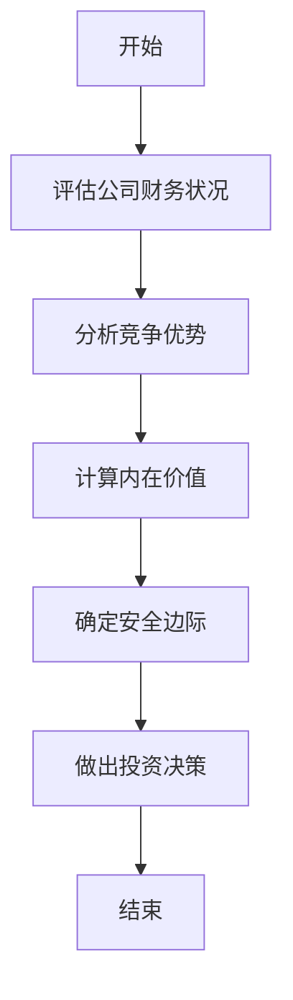
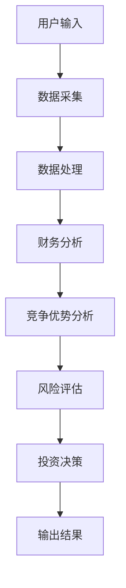
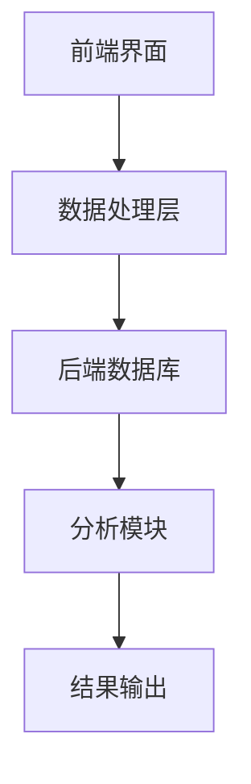
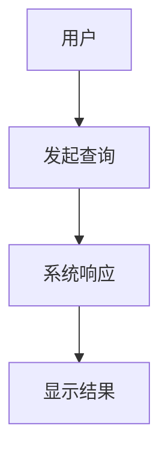

                 

# 巴菲特的保险行业投资策略

> 关键词：巴菲特，保险行业，投资策略，价值投资，风险管理，安全边际

> 摘要：本文详细分析了巴菲特在保险行业的投资策略，从保险行业的基本概念、巴菲特的投资理念，到具体的策略分析、数学模型、系统设计和项目实战，全面解读了巴菲特如何通过价值投资和风险管理在保险行业取得成功。

---

## 第一部分: 保险行业的基本概念与巴菲特投资理念

### 第1章: 保险行业的基本概念与巴菲特投资理念

#### 1.1 保险行业的基本概念

##### 1.1.1 保险的定义与分类

保险是一种风险管理工具，通过合同形式将风险转移给保险公司，以换取经济补偿。保险可以分为财产保险、人身保险、责任保险和信用保险等类别。

##### 1.1.2 保险行业的核心业务模式

保险公司的核心业务模式包括保费收入、理赔支出、投资收益和风险管理。保险公司的盈利能力与保费收入、投资收益和风险管理能力密切相关。

##### 1.1.3 保险行业的财务指标分析

保险行业的财务指标包括保费收入增长率、赔付率、承保利润率、投资收益率和资本充足率等。这些指标可以帮助投资者评估保险公司的财务健康状况和盈利能力。

#### 1.2 巴菲特的投资理念与策略

##### 1.2.1 巴菲特的投资哲学

巴菲特的投资哲学以“价值投资”为核心，强调长期投资、安全边际和公司基本面分析。他认为，投资的本质是寻找具有持续竞争优势和良好管理团队的公司。

##### 1.2.2 巴菲特的长期价值投资理念

巴菲特认为，投资的最终目标是寻找具有内在价值的公司，并以低于内在价值的价格买入。他注重公司的财务健康状况、竞争优势和长期盈利能力。

##### 1.2.3 巴菲特对保险行业的特殊关注点

巴菲特对保险行业特别关注的原因在于保险行业的商业模式具有稳定的保费收入和潜在的投资收益。他倾向于选择具有强大资本实力和良好风险管理能力的保险公司。

#### 1.3 巴菲特选择保险公司的标准

##### 1.3.1 公司的财务健康状况

巴菲特选择保险公司时，首先关注公司的财务健康状况，包括资本充足率、偿付能力、资产负债表的稳健性等。他倾向于选择财务稳健、资本充足的公司。

##### 1.3.2 公司的竞争优势

巴菲特注重公司的竞争优势，包括市场地位、品牌影响力、成本控制能力和创新能力等。他认为，具有竞争优势的公司能够在行业中长期保持领先地位。

##### 1.3.3 公司的管理团队

巴菲特认为，优秀的管理团队是公司成功的关键。他倾向于选择管理团队能力强、诚信可靠、注重股东利益的公司。

---

## 第二部分: 保险行业的核心概念与巴菲特投资策略的核心要素

### 第2章: 保险行业的核心概念与巴菲特投资策略的核心要素

#### 2.1 保险行业的核心概念

##### 2.1.1 内在价值与市场价值

内在价值是指公司未来现金流的现值，而市场价值是公司股票在市场上的交易价格。巴菲特认为，投资的核心是寻找具有较高内在价值的公司，并以低于内在价值的价格买入。

##### 2.1.2 资产负债表分析

资产负债表是评估保险公司财务状况的重要工具。巴菲特注重公司的资产质量、负债结构和资本充足率。他倾向于选择资产质量高、负债结构合理、资本充足的公司。

##### 2.1.3 利润表与现金流分析

利润表反映了公司的收入和支出，现金流表反映了公司的现金流入和流出。巴菲特注重公司的盈利能力、现金流状况和经营效率。

#### 2.2 巴菲特投资策略的核心要素

##### 2.2.1 安全边际的概念

安全边际是指股票的市场价格低于其内在价值的部分。巴菲特认为，安全边际是投资成功的关键，通过购买低于内在价值的股票，可以降低投资风险。

##### 2.2.2 股东权益与资本结构

股东权益是公司净资产的值，资本结构是公司资本的组成比例。巴菲特注重公司的资本结构，倾向于选择资本结构稳健、股东权益高的公司。

##### 2.2.3 风险管理与安全边际

风险管理是巴菲特投资策略的重要组成部分。他通过分散投资、选择优质公司和控制仓位等方法来降低投资风险。安全边际是风险管理的重要工具。

#### 2.3 保险行业的竞争优势分析

##### 2.3.1 市场地位与品牌价值

市场地位和品牌价值是保险公司竞争优势的重要组成部分。巴菲特倾向于选择市场地位高、品牌影响力大的公司。

##### 2.3.2 经营效率与成本控制

经营效率和成本控制是保险公司竞争力的重要指标。巴菲特注重公司的经营效率，倾向于选择成本控制能力强的公司。

##### 2.3.3 资产负债结构的稳定性

资产负债结构的稳定性是保险公司财务健康的重要指标。巴菲特注重公司的资产负债结构，倾向于选择结构合理、稳定性强的公司。

---

## 第三部分: 巴菲特保险行业投资策略的数学模型与算法原理

### 第3章: 巴菲特投资策略的数学模型与算法原理

#### 3.1 巴菲特投资模型的数学表达

##### 3.1.1 内在价值计算公式

$$
\text{内在价值} = \frac{\text{自由现金流}}{\text{贴现率}}
$$

##### 3.1.2 安全边际计算公式

$$
\text{安全边际} = \text{内在价值} - \text{市场价格}
$$

##### 3.1.3 股东权益与资本结构的优化

$$
\text{资本结构} = \frac{\text{债务}}{\text{股权}}
$$

#### 3.2 保险行业投资风险的评估与控制

##### 3.2.1 风险评估的数学模型

$$
\text{风险价值} = \text{标准差} \times \text{波动率}
$$

##### 3.2.2 风险控制的策略

$$
\text{风险敞口} = \text{资产} \times \text{风险系数}
$$

##### 3.2.3 投资组合优化

$$
\text{最优投资组合} = \argmin_{w} \left( w^T \Sigma w \right)
$$

其中，\( w \) 是投资权重向量，\( \Sigma \) 是资产之间的协方差矩阵。

#### 3.3 巴菲特投资策略的算法流程图

---

## 第四部分: 保险行业投资策略的系统分析与架构设计

### 第4章: 保险行业投资策略的系统分析与架构设计

#### 4.1 保险行业投资分析系统的功能设计

##### 4.1.1 系统功能模块划分

- 数据采集与处理模块
- 财务分析模块
- 竞争优势分析模块
- 风险评估模块
- 投资决策模块

##### 4.1.2 系统功能流程图

#### 4.2 系统架构设计

##### 4.2.1 系统架构图

##### 4.2.2 系统交互流程图

#### 4.3 系统接口设计

##### 4.3.1 数据输入接口

- 输入参数：公司名称、财务数据、市场数据
- 输出参数：分析结果

##### 4.3.2 数据输出接口

- 输入参数：无
- 输出参数：投资建议、风险评估

---

## 第五部分: 巴菲特保险行业投资策略的项目实战

### 第5章: 巴菲特保险行业投资策略的项目实战

#### 5.1 项目背景与目标

##### 5.1.1 项目背景

保险行业的投资分析是一个复杂的系统工程，需要结合财务分析、竞争优势分析和风险管理等多种方法。

##### 5.1.2 项目目标

通过分析保险公司的财务状况、竞争优势和风险管理能力，制定出巴菲特风格的投资策略。

#### 5.2 项目实施步骤

##### 5.2.1 数据收集与清洗

收集保险公司的财务数据、市场数据和行业数据，进行数据清洗和预处理。

##### 5.2.2 财务分析与竞争优势分析

分析公司的财务状况，评估竞争优势，计算内在价值和安全边际。

##### 5.2.3 投资决策与风险控制

根据分析结果，制定投资策略，控制投资风险。

#### 5.3 项目实战案例分析

##### 5.3.1 案例分析

以某保险公司为例，分析其财务状况、竞争优势和风险管理能力，计算其内在价值和安全边际。

##### 5.3.2 投资决策

根据分析结果，制定投资策略，包括买入、持有或卖出的决策。

#### 5.4 项目总结与最佳实践

##### 5.4.1 项目总结

总结项目实施过程中的经验和教训，提出改进建议。

##### 5.4.2 最佳实践

- 重视财务分析和竞争优势分析
- 确保安全边际
- 加强风险管理

##### 5.4.3 注意事项

- 数据的准确性和完整性
- 模型的适用性和可解释性
- 风险控制和投资纪律

#### 5.5 拓展阅读与学习资源

##### 5.5.1 拓展阅读

- 巴菲特的《致股东的信》
- 《证券分析》
- 《投资之道》

##### 5.5.2 学习资源

- 投资分析课程
- 财务分析工具
- 保险行业研究报告

---

## 结语

巴菲特的保险行业投资策略以价值投资为核心，注重公司的财务健康状况、竞争优势和风险管理能力。通过系统的分析和科学的决策，巴菲特在保险行业取得了显著的投资成果。投资者可以借鉴巴菲特的投资理念和策略，结合实际情况，制定出适合自己的投资策略。

---

作者：AI天才研究院/AI Genius Institute & 禅与计算机程序设计艺术 /Zen And The Art of Computer Programming

