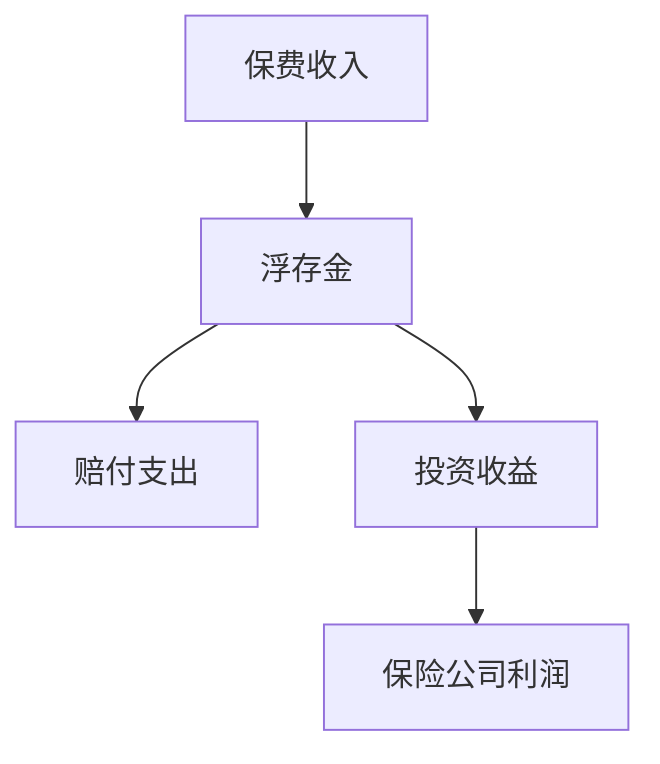
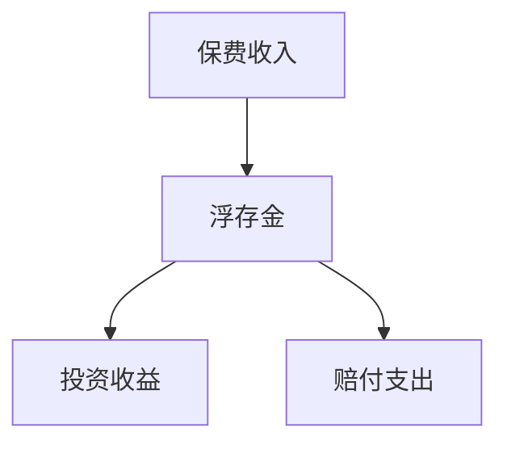
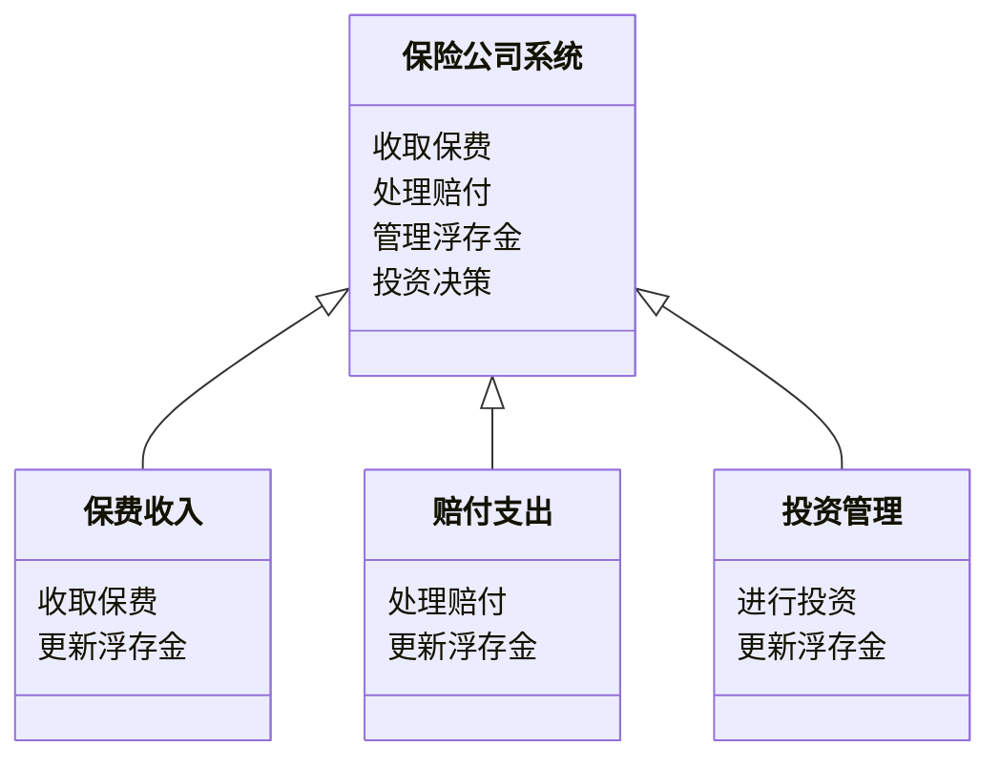
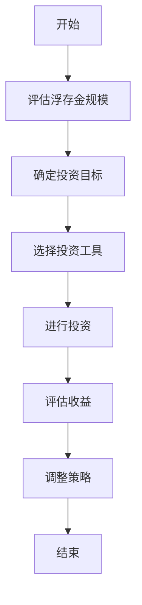

                 

# 巴菲特的保险行业投资逻辑：浮存金的魅力

---

## 关键词

- 巴菲特
- 保险行业
- 浮存金
- 投资逻辑
- 价值投资

---

## 摘要

本文深入探讨了巴菲特在保险行业中的投资逻辑，特别是浮存金这一关键概念。通过分析浮存金的定义、来源、运作机制以及其在保险公司的财务健康中的作用，本文揭示了巴菲特如何利用浮存金进行低风险投资，从而实现长期稳定的收益。文章结合实际案例和数学模型，详细阐述了浮存金的投资策略，并通过系统架构和项目实战，进一步验证了这一策略的有效性。

---

# 第一部分: 背景介绍

## 第1章: 保险行业的基本概念

### 1.1 保险公司的运作模式

保险公司的核心业务是通过收取保费来建立赔付准备金，用于赔付未来的保险索赔。这种模式本质上是一种风险转移机制，保险公司通过收取保费来获取资金，同时承担在未来赔付保险金的风险。

#### 图1-1: 保险公司的资金流

### 1.2 浮存金的定义

浮存金是指保险公司收取的保费与实际赔付金额之间的差额，这部分资金被保险公司暂时持有，用于赔付未来的保险索赔。浮存金的大小取决于保险公司的业务规模和赔付率。

---

## 第2章: 巴菲特的投资理念

### 2.1 价值投资的核心

巴菲特的价值投资理念强调购买具有持续盈利能力的优秀企业，并以合理的价格买入。他特别关注企业的内在价值，而不是市场的短期波动。

#### 表2-1: 巴菲特价值投资的核心原则

| 原则 | 描述 |
|------|------|
| 1    | 买入具有持续盈利能力的企业 |
| 2    | 以合理价格买入 |
| 3    | 长期持有优质资产 |
| 4    | 避免短期市场波动的影响 |

---

# 第二部分: 浮存金的核心概念

## 第3章: 浮存金的来源与特点

### 3.1 浮存金的来源

浮存金主要来源于保险公司的保费收入，减去已赔付的部分。这种资金的来源稳定，但规模取决于保险公司的业务量和赔付情况。

#### 图3-1: 浮存金的来源与用途

### 3.2 浮存金的特点

浮存金具有时间价值、规模效应和风险特性。时间价值体现在资金的长期持有和投资收益上，规模效应则是因为浮存金的规模越大，投资收益越显著。风险特性则与保险公司的赔付能力和财务稳定性密切相关。

---

## 第4章: 浮存金的投资策略

### 4.1 投资目标

巴菲特的浮存金投资策略注重低风险、长期稳定收益。他倾向于投资那些能够产生稳定现金流的企业，如国债、优质企业债券和股票。

#### 表4-1: 浮存金投资的目标

| 目标 | 描述 |
|------|------|
| 1    | 低风险投资 |
| 2    | 长期稳定收益 |
| 3    | 最大化投资回报 |

### 4.2 投资组合

浮存金的投资组合通常包括固定收益类资产和股票。固定收益类资产如国债和企业债券，风险较低，收益稳定；股票则选择那些具有持续盈利能力和良好管理的公司。

#### 图4-1: 投资组合构成

---

# 第三部分: 浮存金的数学模型与系统架构

## 第5章: 数学模型

### 5.1 浮存金的收益计算

浮存金的投资收益可以通过以下公式计算：

$$
\text{投资收益} = \text{初始浮存金} \times (1 + r)^t - \text{初始浮存金}
$$

其中，\( r \) 是年化收益率，\( t \) 是投资时间（年）。

### 5.2 投资策略的优化

通过优化投资组合的构成，可以最大化收益并最小化风险。这可以通过以下步骤实现：

1. 确定投资目标和风险承受能力。
2. 分配资产比例，如固定收益和股票的比例。
3. 定期评估和调整投资组合。

---

## 第6章: 系统架构

### 6.1 系统功能设计

保险公司的系统需要具备保费收取、赔付处理、浮存金管理、投资决策等功能。

#### 图6-1: 系统功能架构

---

## 第7章: 项目实战

### 7.1 案例分析

以巴菲特投资的保险公司为例，分析其浮存金的使用情况和投资策略。

#### 图7-1: 投资策略流程图

---

## 第8章: 最佳实践

### 8.1 投资策略的关键点

1. **长期持有优质资产**：选择那些具有持续盈利能力和良好管理的公司。
2. **分散投资**：通过多样化降低风险。
3. **定期评估**：根据市场变化和公司情况调整投资策略。

### 8.2 小结

浮存金是保险公司的重要资产，通过科学的投资策略可以实现长期稳定的收益。巴菲特的成功案例证明了这一策略的有效性。

---

## 作者

作者：AI天才研究院/AI Genius Institute & 禅与计算机程序设计艺术 /Zen And The Art of Computer Programming

