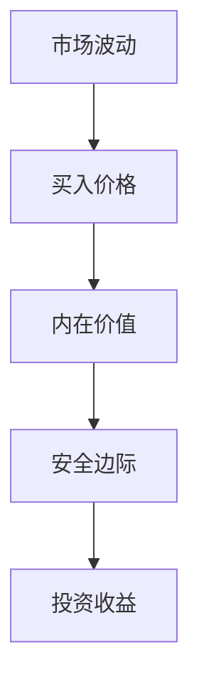
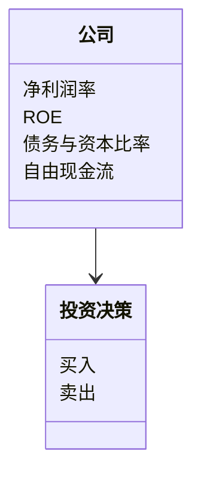
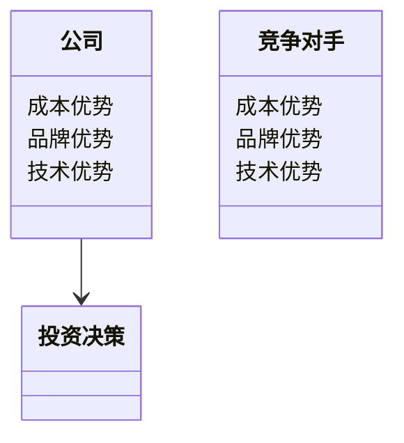
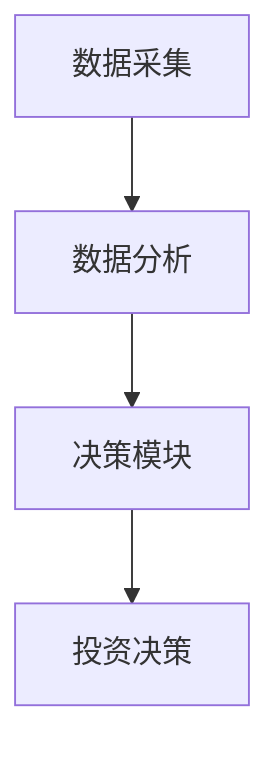

                 


# 巴菲特的公司收购哲学：寻找优质企业

---

## 关键词

- 巴菲特
- 公司收购
- 价值投资
- 安全边际
- 优质企业

---

## 摘要

本文将深入探讨巴菲特的公司收购哲学，结合其投资理念，分析如何通过寻找优质企业来实现长期稳健的投资收益。文章从巴菲特的生平、投资哲学、公司评估标准等多方面展开，结合具体案例和系统化的分析方法，帮助读者理解如何在复杂多变的市场中找到具有长期竞争优势的优质企业。通过本文的分析，读者将能够掌握巴菲特的核心思想，并将其应用到实际投资中。

---

## 第一章：背景介绍

### 1.1 巴菲特的生平简介

沃伦·巴菲特（Warren Buffett）是全球最著名的投资者之一，被誉为“股神”。他出生于1930年，早年通过股票投资积累了巨额财富，并在职业生涯中发展出一套独特的投资哲学。

- **早年经历**：巴菲特在大学期间开始接触投资，师从本杰明·格雷厄姆（Benjamin Graham），学习到了价值投资的核心理念。
- **投资生涯**：1956年，巴菲特建立了合伙公司，开始管理客户资金，并逐渐积累了丰富的投资经验。
- **成名之路**：1970年，巴菲特收购了伯克希尔哈撒韦公司（Berkshire Hathaway），并将其打造成一个多元化的企业集团。

### 1.2 价值投资的定义与内涵

价值投资是一种基于对公司内在价值评估的投资方法，强调以低于内在价值的价格买入优质企业。

- **内在价值**：公司未来现金流的现值，反映了公司的真实价值。
- **市场价格**：市场的波动性和非理性决定了价格的短期波动。

### 1.3 巴菲特收购哲学的核心观点

- **寻找优质企业**：巴菲特注重企业的长期盈利能力、财务健康状况和竞争优势。
- **安全边际**：买入价格低于内在价值，以确保投资的安全性。
- **长期持有**：价值投资强调长期持有优质企业，而非频繁交易。

### 1.4 学习巴菲特收购哲学的意义

- **个人投资**：帮助投资者避免短期市场的波动，实现长期稳健的收益。
- **企业经营**：为管理者提供如何评估和选择合作伙伴的启示。
- **财富管理**：为个人和机构提供一种系统化的财富管理方法。

---

## 第二章：巴菲特收购哲学的核心概念

### 2.1 价值投资的定义与特征

- **定义**：价值投资是一种基于对公司内在价值评估的投资方法。
- **特征**：
  1. 长期视角：关注企业的长期盈利能力。
  2. 安全边际：买入价格低于内在价值。
  3. 优质企业：选择具有竞争优势的企业。

#### 表格对比：价值投资与其他投资方法的对比

| 投资方法 | 核心理念 | 时间框架 | 风险控制 |
|----------|----------|----------|----------|
| 价值投资 | 寻找低于内在价值的企业 | 长期 | 安全边际 |
| 股票交易 | 短期价格波动 | 短期 | 技术分析 |
| 基金投资 | 依赖基金经理 | 中期 | 风险分散 |

### 2.2 安全边际的概念与重要性

- **定义**：安全边际是指买入价格与公司内在价值之间的差距。
- **重要性**：通过安全边际，投资者可以降低市场波动带来的风险。
- **公式**：安全边际 = 买入价格 - 内在价值。

#### 图表：安全边际与投资收益的关系



---

## 第三章：巴菲特的公司评估与收购框架

### 3.1 公司评估的核心指标

- **净利润率**：净利润 / 营业收入。
- **ROE（净资产收益率）**：净利润 / 净资产。
- **债务与资本比率**：总债务 / 总资本。
- **自由现金流**：经营活动产生的现金流。

#### 图表：财务指标评估框架



### 3.2 公司竞争优势的分析

- **成本优势**：企业能否以更低的成本生产产品。
- **品牌优势**：强大的品牌影响力。
- **技术优势**：拥有独特的技术或专利。

#### 图表：竞争优势分析框架



---

## 第四章：系统化分析与投资策略

### 4.1 投资系统的构成

- **数据采集**：收集公司的财务数据、行业信息。
- **数据分析**：计算各项财务指标，评估公司价值。
- **决策模块**：根据分析结果做出买入或卖出决策。

#### 图表：投资系统架构



### 4.2 投资策略的数学模型

- **内在价值计算**：使用DCF模型（Discounted Cash Flow）计算公司内在价值。
- **安全边际计算**：买入价格 = 内在价值 × (1 - 安全边际比例)。

#### DCF模型公式

$$
\text{内在价值} = \sum_{t=1}^{n} \frac{\text{现金流}}{(1 + r)^t} + \frac{\text{残值}}{(1 + r)^n}
$$

其中，\( r \) 是折现率。

---

## 第五章：项目实战与案例分析

### 5.1 项目背景

选择一家上市公司（例如：可口可乐公司）作为案例，分析其财务数据和竞争优势。

### 5.2 数据分析

使用Python代码计算公司的ROE和净利润率。

```python
import pandas as pd

# 假设财务数据存储在Excel文件中
data = pd.read_excel(' Coca-Cola Financials.xlsx ')

# 计算ROE
roe = data['净利润'] / data['净资产']
print(f"ROE: {roe[-1]:.2f}")
```

### 5.3 案例分析

通过数据分析和竞争优势评估，得出是否应该买入该公司的结论。

---

## 第六章：总结与最佳实践

### 6.1 总结

- 巴菲特的收购哲学强调长期、安全、优质。
- 通过系统化的分析和评估，可以找到具有长期竞争优势的优质企业。

### 6.2 最佳实践

- **避免短期波动**：关注企业的长期价值。
- **安全边际**：确保买入价格低于内在价值。
- **持续学习**：不断更新对市场的认识。

---

## 作者信息

作者：AI天才研究院/AI Genius Institute  
联系方式：contact@aiguru.com  
版权声明：本文版权归作者所有，转载请注明出处。  

--- 

**附录**：相关书籍推荐

1. 《巴菲特致股东的信》
2. 《价值投资入门》
3. 《投资的智慧》

