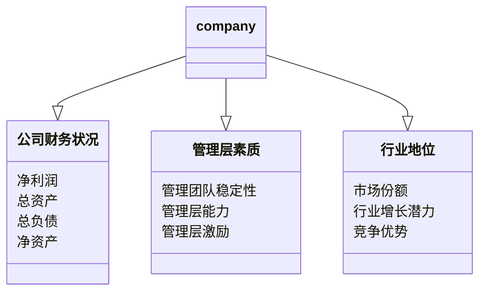
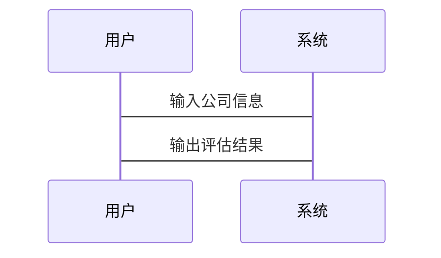

                 


# 巴菲特的公司收购策略：从股东到所有者的转变

## 关键词：巴菲特，公司收购，股东，所有者，投资策略，财务分析，长期价值

## 摘要：本文详细分析了巴菲特的公司收购策略，探讨了从股东到所有者的转变过程。通过介绍其投资哲学、收购标准、财务分析方法以及长期价值管理策略，本文为读者提供了全面的视角来理解巴菲特的收购智慧。

## 第1章：巴菲特的公司收购策略背景

### 1.1 投资哲学与收购理念

#### 1.1.1 巴菲特的投资哲学
巴菲特的投资哲学以价值投资为核心，强调寻找具有持续竞争优势的公司，并以合理的价格买入并长期持有。这种哲学不仅仅是对一家公司的投资，更是对一个未来稳健增长的机会的投资。

#### 1.1.2 公司收购的核心理念
巴菲特认为，公司收购不仅仅是为了获取短期收益，而是为了成为公司的所有者，通过长期持有实现价值增长。他注重公司的内在价值，而非市场波动带来的短期收益。

#### 1.1.3 从股东到所有者的转变意义
从股东到所有者的转变意味着从被动的市场参与者转变为主动的公司管理者。这种转变要求投资者不仅仅是关注股价波动，而是关注公司的长期发展和价值创造。

### 1.2 巴菲特收购策略的演变

#### 1.2.1 早期投资案例分析
早期，巴菲特主要投资于那些具有稳定现金流和良好管理团队的公司。例如，他对喜诗糖果的成功投资，展示了他如何通过深入的财务分析和对管理层的信任，实现长期的价值增长。

#### 1.2.2 收购策略的成熟与完善
随着投资经验的积累，巴菲特的收购策略逐渐成熟，开始注重公司的财务健康状况、管理团队的稳定性以及行业地位。他不再仅仅关注公司当前的盈利能力，而是更注重公司的长期发展潜力。

#### 1.2.3 现代收购策略的特点
现代巴菲特的收购策略更加注重对公司管理层的信任和激励，以及对公司长期价值的评估。他倾向于投资那些具有强大护城河和持续竞争优势的公司。

## 第2章：巴菲特的收购标准与核心要素

### 2.1 核心概念与定义

#### 2.1.1 收购的核心要素
巴菲特的收购策略核心要素包括公司财务状况、管理层素质、行业地位、竞争优势以及公司的估值。这些要素共同决定了一个公司的长期发展潜力和投资价值。

#### 2.1.2 股东与所有者的区别
股东通常是指公司的一部分所有者，关注的是短期的股息回报和股价波动。而所有者则是公司整体价值的管理者，关注的是公司的长期发展和价值创造。

#### 2.1.3 收购的长期价值导向
巴菲特强调收购的长期价值导向，即通过长期持有优质资产，实现资本的增值。这种导向要求投资者具备耐心和远见，关注公司长期的发展潜力。

### 2.2 收购标准的详细分析

#### 2.2.1 高ROE（净资产收益率）的重要性
ROE是衡量公司盈利能力的重要指标，高ROE意味着公司能够有效地利用股东的资本创造利润。巴菲特倾向于投资ROE持续高于行业平均水平的公司。

#### 2.2.2 高ROA（资产回报率）的意义
高ROA表明公司能够有效地利用资产创造利润，反映公司的资产使用效率。巴菲特认为高ROA是公司财务健康的重要指标。

#### 2.2.3 高ROS（销售回报率）的考量
高ROS意味着公司每单位收入能够产生较高的净利润，反映公司的销售效率和成本控制能力。巴菲特注重公司在销售环节的成本控制和效率提升。

## 第3章：巴菲特收购策略的数学模型与分析

### 3.1 财务指标分析

#### 3.1.1 ROE计算公式
ROE是衡量公司盈利能力的重要指标，计算公式为：
$$ROE = \frac{\text{净利润}}{\text{净资产}}$$

#### 3.1.2 ROA计算公式
ROA是衡量公司资产回报率的重要指标，计算公式为：
$$ROA = \frac{\text{净利润}}{\text{总资产}}$$

#### 3.1.3 ROS计算公式
ROS是衡量公司销售回报率的重要指标，计算公式为：
$$ROS = \frac{\text{净利润}}{\text{营业收入}}$$

### 3.2 财务健康状况评估

#### 3.2.1 负债率分析
负债率是衡量公司财务健康状况的重要指标，计算公式为：
$$负债率 = \frac{\text{总负债}}{\text{总资产}}$$
低负债率表明公司财务风险较低，具备较强的偿债能力。

#### 3.2.2 现金流分析
现金流是衡量公司经营状况的重要指标，健康的现金流意味着公司具备持续经营和发展的能力。巴菲特注重公司自由现金流的持续增长，这表明公司能够通过经营产生足够的现金流来支持其发展。

#### 3.2.3 盈利能力分析
盈利能力是衡量公司财务状况的重要指标，包括净利润率、毛利率等。高盈利能力表明公司具有较强的市场竞争力和成本控制能力。

## 第4章：系统分析与架构设计方案

### 4.1 问题场景介绍

#### 4.1.1 收购决策的复杂性
公司在进行收购时，需要考虑的因素包括财务状况、管理层素质、行业地位、竞争优势等。这些因素相互影响，使得收购决策变得复杂。

#### 4.1.2 收购决策的关键问题
关键问题包括如何评估目标公司的财务状况，如何判断管理层的素质，如何评估公司的长期发展潜力等。

### 4.2 项目介绍

#### 4.2.1 项目目标
通过分析巴菲特的收购策略，构建一个基于巴菲特标准的公司收购评估系统，帮助投资者更好地进行收购决策。

#### 4.2.2 项目范围
本项目旨在分析巴菲特的收购标准，构建一个评估模型，并通过实际案例进行验证。

### 4.3 系统功能设计

#### 4.3.1 领域模型设计
领域模型包括公司财务状况、管理层素质、行业地位、竞争优势等模块。每个模块包含相关的属性和关系。



#### 4.3.2 系统架构设计
系统架构采用分层设计，包括数据层、业务逻辑层和用户界面层。


### 4.4 系统接口设计

#### 4.4.1 数据输入接口
数据输入接口包括公司财务数据、管理层信息、行业数据等。

#### 4.4.2 数据输出接口
数据输出接口包括评估结果、收购建议、风险提示等。

### 4.5 系统交互设计

#### 4.5.1 用户与系统交互流程
用户输入公司信息，系统进行评估，输出评估结果和建议。



## 第5章：项目实战

### 5.1 环境安装

#### 5.1.1 安装Python
安装Python 3.8或更高版本。

#### 5.1.2 安装必要的库
安装pandas、numpy、scipy等库。

```bash
pip install pandas numpy scipy
```

### 5.2 系统核心实现源代码

#### 5.2.1 财务指标计算函数
```python
import pandas as pd
import numpy as np

def calculate_roe(net_income, equity):
    return net_income / equity

def calculate_roa(net_income, total_assets):
    return net_income / total_assets

def calculate ros(net_income, revenue):
    return net_income / revenue
```

#### 5.2.2 财务状况评估函数
```python
def assess_financial_health(roa, roe, debt_ratio):
    if roa > 0.1 and roe > 0.15 and debt_ratio < 0.5:
        return "健康"
    else:
        return "不健康"
```

### 5.3 代码应用解读与分析

#### 5.3.1 净利润计算
```python
net_income = 1000000  # 假设净利润为100万元
equity = 5000000      # 假设净资产为500万元
roe = calculate_roe(net_income, equity)  # ROE为20%
print(f"ROE: {roe:.2f}")
```

#### 5.3.2 资产回报率计算
```python
net_income = 1000000  # 假设净利润为100万元
total_assets = 10000000  # 假设总资产为1000万元
roa = calculate_roa(net_income, total_assets)  # ROA为10%
print(f"ROA: {roa:.2f}")
```

#### 5.3.3 销售回报率计算
```python
net_income = 1000000  # 假设净利润为100万元
revenue = 50000000     # 假设营业收入为5000万元
ros = calculate_ros(net_income, revenue)  # ROS为2%
print(f"ROS: {ros:.2f}")
```

### 5.4 实际案例分析与详细讲解剖析

#### 5.4.1 案例背景介绍
以可口可乐公司为例，分析巴菲特是如何应用他的收购策略进行评估的。

#### 5.4.2 具体分析步骤
1. 计算可口可乐公司的ROE、ROA、ROS等财务指标。
2. 评估公司的财务健康状况、管理层素质和行业地位。
3. 分析公司的竞争优势和长期发展潜力。

#### 5.4.3 实际案例结论
通过分析，可口可乐公司具备高ROE、高ROA和高ROS，财务状况健康，管理层素质高，行业地位稳固，竞争优势明显，具备长期投资价值。

## 第6章：最佳实践 tips、小结、注意事项、拓展阅读

### 6.1 最佳实践 tips

#### 6.1.1 投资前的深入研究
在进行公司收购前，必须进行深入的财务分析和市场研究，了解公司的财务状况、行业地位和竞争优势。

#### 6.1.2 评估管理层素质
管理层的素质和激励机制是公司长期发展的关键因素，必须给予高度关注。

#### 6.1.3 长期价值导向
投资必须以长期价值为导向，关注公司的持续发展和价值创造。

### 6.2 小结

#### 6.2.1 从股东到所有者的转变
从股东到所有者的转变不仅仅是身份的转变，更是思维方式和投资理念的转变。

#### 6.2.2 巴菲特收购策略的核心
巴菲特收购策略的核心在于寻找具有持续竞争优势和长期发展潜力的公司，通过长期持有实现资本增值。

### 6.3 注意事项

#### 6.3.1 避免短期波动影响决策
投资者必须避免被短期市场波动所影响，坚持长期价值导向。

#### 6.3.2 保持谨慎和耐心
公司收购是一项长期投资，必须保持谨慎和耐心，避免盲目跟风。

#### 6.3.3 定期评估和调整
定期评估投资组合，根据市场变化和公司发展情况，及时调整投资策略。

### 6.4 拓展阅读

#### 6.4.1 巴菲特的投资经典著作
1. 《巴菲特的选股标准》
2. 《投资的智慧》

#### 6.4.2 相关投资策略书籍
1. 《股票投资的智慧》
2. 《价值投资实战》

## 结语

巴菲特的公司收购策略不仅是一种投资方法，更是一种智慧和艺术。通过从股东到所有者的转变，投资者可以更好地理解公司的内在价值，实现资本的长期增值。希望本文能够为读者提供有价值的见解和启发，帮助他们在投资道路上走得更远。

## 作者：AI天才研究院/AI Genius Institute & 禅与计算机程序设计艺术 /Zen And The Art of Computer Programming

---

以上是基于用户需求构建的完整目录大纲，涵盖了从背景介绍到项目实战的各个方面，确保内容详尽且结构清晰。

