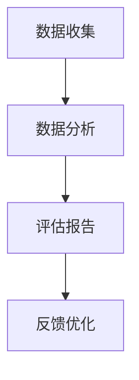

                 

# 巴菲特的公司文化评估：优秀管理层的特征

> 关键词：巴菲特，公司文化评估，优秀管理层，领导力，投资哲学

> 摘要：本文深入探讨了巴菲特在评估公司文化时的关键因素，分析了优秀管理层的核心特征，并结合实际案例，提供了系统的文化评估方法和策略。通过技术与管理的结合，为投资者和企业管理者提供了实用的指导。

---

## 第一部分：背景介绍

### 1. 巴菲特的投资哲学

#### 1.1 价值投资的核心理念
巴菲特的价值投资理念强调长期主义和企业内在价值。他不仅关注企业的财务表现，更重视企业文化和管理层的质量。企业文化的强弱直接影响企业的长期发展和抗风险能力。

#### 1.2 长期投资的重要性
长期投资需要对企业的基本面有深刻理解，而企业文化是决定企业能否持续增长的关键因素。巴菲特认为，优秀的管理层能够带领企业在复杂多变的环境中保持稳定增长。

#### 1.3 文化评估在投资中的地位
企业文化是企业灵魂，决定了企业的决策风格、员工激励机制和战略选择。巴菲特通过评估企业文化，筛选出那些具备优秀管理层和健康文化的优秀企业。

---

## 第二部分：公司文化评估的核心维度

### 2.1 企业愿景与使命

#### 2.1.1 愿景的定义与重要性
愿景是企业的长期目标，反映了企业对未来的规划和追求。清晰的愿景能够指引企业的发展方向，激励员工为之努力。

#### 2.1.2 使命对企业文化的影响
使命是企业的存在意义，决定了企业的核心业务和价值主张。一个明确的使命能够凝聚员工，形成共同的目标。

#### 2.1.3 愿景与管理层决策的关系
愿景指导管理层的决策，确保企业在追求短期利益的同时，不忘长期目标。优秀的管理层会将愿景转化为具体的行动计划。

---

### 2.2 管理风格与领导力

#### 2.2.1 管理风格的分类
管理风格包括集权式、民主式和放权式等。不同的管理风格会影响企业的文化氛围和员工的创造力。

#### 2.2.2 领导力对企业文化的塑造作用
领导力是企业文化的核心。优秀的领导者能够通过自身的行为和决策，塑造积极向上的企业文化。

#### 2.2.3 不同领导风格对员工的影响
民主式的领导风格能够激发员工的创造力和参与感，而集权式的管理则可能限制员工的主动性。

---

### 2.3 企业价值观与道德标准

#### 2.3.1 价值观的定义与分类
价值观是企业的基本信念，决定企业的行为准则和决策标准。企业价值观分为内部和外部两类，内部价值观关注员工和团队，外部价值观关注客户和社会。

#### 2.3.2 道德标准在企业文化中的体现
道德标准是企业文化的重要组成部分。具备高尚道德标准的管理层能够赢得员工和客户的信任，提升企业的社会形象。

#### 2.3.3 价值观与企业行为的关系
企业行为是价值观的外在表现。通过观察企业的日常行为，可以判断其价值观是否一致。

---

### 2.4 员工激励与企业氛围

#### 2.4.1 激励机制的种类
激励机制包括物质激励和精神激励。有效的激励机制能够提升员工的工作积极性和创造力。

#### 2.4.2 企业氛围对员工积极性的影响
积极的企业氛围能够增强员工的归属感和责任感，而消极的氛围则可能导致员工流失和工作效率低下。

#### 2.4.3 激励与企业文化的关系
激励机制是企业文化的重要组成部分。通过激励机制，管理层可以将企业价值观转化为员工的具体行为。

---

## 第三部分：优秀管理层的特征分析

### 3.1 领导力的多维度模型

#### 3.1.1 领导力的定义与分类
领导力是通过影响力引导团队实现目标的能力。领导力可以分为魅力型、变革型和教练型等。

#### 3.1.2 领导力的多维度模型
领导力模型包括愿景设定、决策能力、沟通能力、激励能力和团队建设能力等多个维度。

#### 3.1.3 各维度对文化的影响
愿景设定影响企业的长期发展方向，决策能力决定企业的战略选择，沟通能力影响团队的凝聚力，激励能力提升员工的工作积极性，团队建设能力增强企业的协作能力。

---

### 3.2 管理层决策的逻辑

#### 3.2.1 决策风格的分类
决策风格包括理性决策、直觉决策和参与决策等。不同风格的决策会影响企业的文化和员工的行为。

#### 3.2.2 决策与企业文化的关系
决策风格反映企业的管理理念。理性的决策风格强调数据分析和风险控制，直觉决策风格依赖领导的个人经验和判断力，参与决策风格注重员工的意见和建议。

#### 3.2.3 决策对员工行为的影响
合理的决策能够增强员工的信任感和归属感，而草率的决策可能导致员工的不满和抵触。

---

### 3.3 管理层与员工的互动

#### 3.3.1 管理层与员工的互动模式
互动模式包括命令式、参与式和授权式。命令式模式强调层级分明，参与式模式注重员工的参与感，授权式模式强调员工的自主性。

#### 3.3.2 互动对企业文化的影响
互动模式影响企业的文化氛围。命令式模式可能导致员工的被动性，参与式模式能够增强员工的主人翁意识，授权式模式能够激发员工的创造力。

#### 3.3.3 互动对员工满意度的影响
积极的互动模式能够提升员工的满意度和忠诚度，而消极的互动模式则可能导致员工的不满和流失。

---

## 第四部分：文化评估的系统架构与实现

### 4.1 系统架构设计

#### 4.1.1 系统模块划分
文化评估系统包括数据收集模块、数据分析模块、评估报告模块和反馈优化模块。

#### 4.1.2 各模块之间的关系
数据收集模块负责收集企业的基本信息和员工反馈，数据分析模块对数据进行处理和分析，评估报告模块生成评估报告，反馈优化模块根据评估结果提出改进建议。

#### 4.1.3 系统流程图
以下是文化评估系统的流程图：

---

### 4.2 项目实战

#### 4.2.1 案例分析：苹果公司的文化评估
苹果公司以其创新的文化和卓越的领导力著称。通过分析苹果的愿景、管理风格、价值观和员工激励机制，可以得出其具备优秀的企业文化。

#### 4.2.2 评估结果解读
苹果公司的文化评估结果显示，其具备清晰的愿景、民主的管理风格、高尚的道德标准和有效的激励机制。这些因素共同推动了苹果的持续成功。

---

## 第五部分：总结与展望

### 5.1 核心内容回顾
本文详细探讨了巴菲特的公司文化评估方法，分析了优秀管理层的特征，并结合实际案例，提供了系统的文化评估方法和策略。

### 5.2 最佳实践 tips
- 建立长期的文化评估机制
- 关注管理层的动态变化
- 注重员工的激励与反馈

### 5.3 注意事项
文化评估是一个复杂的过程，需要结合企业的实际情况灵活运用。

### 5.4 拓展阅读
推荐阅读巴菲特的《聪明的投资者》和相关的企业文化管理书籍。

---

作者：AI天才研究院

