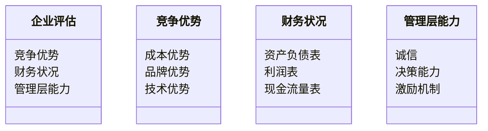
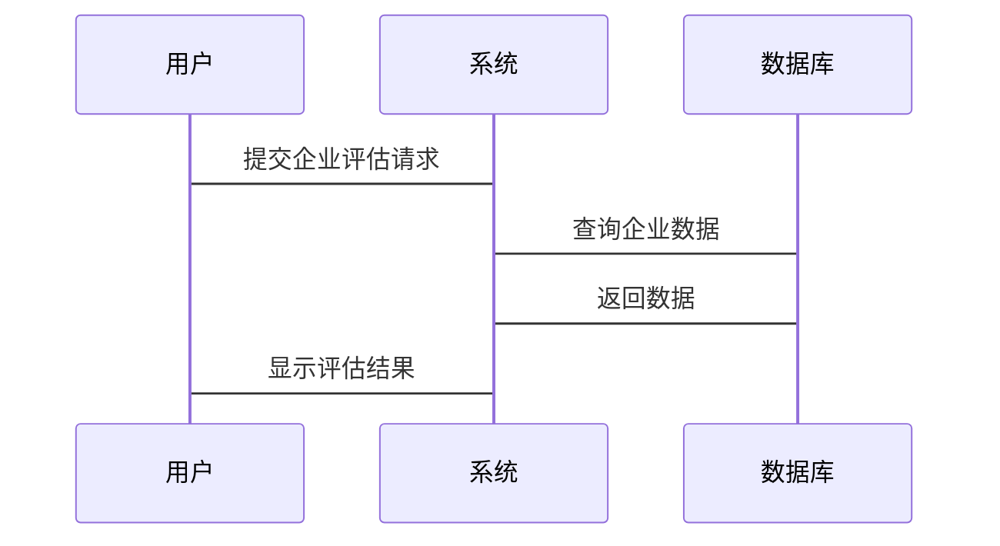

                 


# 巴菲特的公司管理哲学

> 关键词：巴菲特，价值投资，公司治理，投资策略，企业评估，管理哲学

> 摘要：本文深入探讨了巴菲特的公司管理哲学，从他的投资理念、企业评估标准到公司治理和投资策略，结合技术博客的特点，以清晰的逻辑和专业的语言，系统地分析了巴菲特的管理哲学及其对现代企业的影响。文章通过详细的案例分析和系统架构设计，帮助读者全面理解巴菲特的管理思想，并将其应用于实际的企业管理实践中。

---

## 第一部分：巴菲特的管理哲学概述

### 第1章：巴菲特的生平与投资理念

#### 1.1 巴菲特的生平与成就

沃伦·巴菲特（Warren Buffett）是世界上最著名的投资者之一，被誉为“股神”。他出生于1930年8月31日，美国堪萨斯州奥马哈市。巴菲特从小就展现出对数字和投资的天赋，15岁时完成了第一笔股票投资。他通过不断学习和实践，逐步形成了自己的投资哲学，并在职业生涯中取得了巨大的成功。

巴菲特的成就包括：
1. 创立伯克希尔·哈撒韦公司（Berkshire Hathaway），将其打造成一个多元化的企业帝国。
2. 通过长期价值投资，积累了巨额财富，成为世界知名的富豪。
3. 他的投资理念影响了全球无数投资者和企业管理者。

#### 1.2 巴菲特的价值投资理论

巴菲特的价值投资理论是其管理哲学的核心。他强调以低于内在价值的价格购买优秀的公司，并长期持有。以下是价值投资的核心理念：

1. **内在价值**：巴菲特认为，股票的内在价值是其未来现金流的现值。投资者需要通过分析公司的财务状况、行业地位和竞争优势来估算内在价值。
2. **安全边际**：为了避免市场波动和估值错误带来的风险，巴菲特建议以低于内在价值的价格买入股票。安全边际越大，投资风险越小。
3. **长期视角**：巴菲特反对短期交易，主张长期持有优质资产，以获得复利效应。

#### 1.3 巴菲特的管理哲学基础

巴菲特的管理哲学不仅体现在投资上，还体现在他对企业的管理与治理上。他强调：
1. **管理层的信任与监督**：巴菲特倾向于投资那些由诚信、有能力的管理层掌管的企业，并通过董事会进行监督。
2. **长期投资与企业治理**：巴菲特认为，企业治理的核心是确保管理层和股东的利益一致，避免短期行为。

---

## 第二部分：巴菲特的企业管理哲学

### 第2章：巴菲特的企业评估标准

#### 2.1 企业竞争优势的分析

巴菲特认为，企业的核心竞争力是其长期竞争优势的来源。他将企业竞争优势分为以下几类：

1. **成本优势**：企业通过技术创新或规模效应降低成本，从而获得竞争优势。
2. **品牌优势**：强大的品牌影响力可以提高客户忠诚度和市场占有率。
3. **技术优势**：拥有独特的技术或专利，可以防止竞争对手的模仿。

#### 2.2 企业的财务健康状况

巴菲特非常重视企业的财务健康状况，他通过以下几个关键指标来评估企业的财务状况：

1. **资产负债表**：关注企业的资产、负债和所有者权益结构，确保企业没有过度杠杆。
2. **利润表**：关注企业的收入、成本和利润情况，尤其是净利润率和ROE（净资产收益率）。
3. **现金流量表**：关注企业的现金流状况，尤其是经营活动产生的现金流是否为正。

#### 2.3 企业的长期发展潜力

巴菲特的长期投资理念要求他评估企业的长期发展潜力。他关注以下方面：

1. **行业趋势**：企业所处行业的增长潜力和未来趋势。
2. **企业创新**：企业是否有持续创新能力，能否适应市场变化。
3. **管理层能力**：管理层是否有能力推动企业长期发展。

### 第3章：巴菲特的管理层与公司治理

#### 3.1 管理层的素质与能力

巴菲特认为，优秀的管理层是企业成功的关键。他注重以下几点：

1. **诚信与责任感**：管理层必须诚实守信，以股东利益为重。
2. **决策能力**：管理层需要具备良好的决策能力和战略眼光。
3. **激励机制**：合理的激励机制可以激发管理层的积极性。

#### 3.2 公司治理的巴菲特原则

巴菲特的公司治理原则包括：

1. **股东、董事会与管理层的关系**：股东是最终的所有者，董事会是管理层的监督者，管理层是企业的经营者。
2. **股权结构**：合理的股权结构可以避免控制权的过度集中或分散。
3. **透明与责任**：企业治理需要透明化，确保股东和利益相关者的知情权。

#### 3.3 管理层与股东的长期利益一致性

巴菲特强调，管理层和股东的利益应该一致。他通过以下方式实现这一点：

1. **长期激励**：通过股票期权等方式，将管理层的利益与股东的利益绑定。
2. **避免短期行为**：避免管理层为了短期业绩而牺牲长期利益。

---

## 第三部分：巴菲特的投资策略与管理实践

### 第4章：巴菲特的投资策略

#### 4.1 价值投资的选股标准

巴菲特的选股标准可以总结为以下几点：

1. **低市盈率与市净率**：选择市盈率和市净率低于行业平均水平的股票。
2. **高ROE**：选择净资产收益率高的公司，因为ROE反映企业的盈利能力。
3. **盈利稳定性**：选择盈利稳定、波动性小的公司。

#### 4.2 巴菲特的分散投资与集中投资

巴菲特的投资策略既包括分散投资，也包括集中投资：

1. **分散投资**：通过投资多个行业和公司来降低风险。
2. **集中投资**：将大部分资金投资于少数优质公司。

#### 4.3 长期投资与市场波动的应对

巴菲特的长期投资策略要求投资者：

1. **保持耐心**：市场波动是短期的，长期来看，优质公司的价值会显现。
2. **避免非理性决策**：投资者应该避免被市场情绪左右，坚持自己的投资策略。

### 第5章：巴菲特的管理实践

#### 5.1 巴菲特的并购与资本运作

巴菲特在并购和资本运作中注重以下几点：

1. **并购逻辑**：选择具有竞争优势和良好财务状况的企业进行并购。
2. **风险控制**：通过合理的估值和尽职调查，降低并购风险。

#### 5.2 巴菲特的企业文化与员工激励

巴菲特的企业文化强调：

1. **员工激励**：通过股权激励等方式，激发员工的积极性。
2. **企业文化**：培养长期、稳定的企业文化，增强员工的归属感。

#### 5.3 巴菲特的风险管理与决策

巴菲特的风险管理原则包括：

1. **分散风险**：通过投资多样化来降低风险。
2. **避免过度杠杆**：避免因过度负债导致企业风险过高。

---

## 第四部分：系统分析与架构设计

### 第6章：系统分析与架构设计方案

#### 6.1 问题场景介绍

我们以一家拟上市的企业为例，分析其是否符合巴菲特的管理哲学和投资标准。我们需要评估企业的竞争优势、财务健康状况、管理层能力等方面。

#### 6.2 系统功能设计

我们可以通过领域模型图来描述企业评估的核心要素：



#### 6.3 系统架构设计

以下是企业评估系统的架构设计：

```mermaid
idpArchitecture
title 企业评估系统架构
client -> server: HTTP 请求
server --> db: 数据库查询
db --> server: 返回数据
server --> client: 返回 HTML
```

#### 6.4 系统接口设计

企业评估系统的接口设计如下：



---

## 第五部分：项目实战

### 第7章：项目实战

#### 7.1 环境安装

我们需要安装以下工具：

1. Python 3.x
2. Jupyter Notebook 或 PyCharm
3. 数据分析库：Pandas、NumPy
4. 可视化库：Matplotlib、Seaborn

#### 7.2 核心实现源代码

以下是一个简单的价值评估模型的Python代码：

```python
import pandas as pd
import numpy as np

# 假设我们有以下数据
data = {
    '收入': [100, 200, 300],
    '成本': [50, 100, 150],
    '净利润': [20, 50, 80],
    'ROE': [15, 20, 25]
}

df = pd.DataFrame(data)

# 计算内在价值（简单示例）
def calculate_intrinsic_value(roa, roe, growth_rate):
    return roe * (1 + growth_rate) / (discount_rate)

# 假设ROE为20%，增长率5%，贴现率为10%
intrinsic_value = calculate_intrinsic_value(df['ROE'][0], 0.2, 0.05, 0.1)
print(f"内在价值：{intrinsic_value}")
```

#### 7.3 代码应用解读与分析

上述代码计算了企业的内在价值。通过ROE（净资产收益率）和增长率，我们可以估算企业的未来现金流，从而计算内在价值。这帮助投资者确定股票是否被低估或高估。

#### 7.4 案例分析

以某公司为例，计算其内在价值，并与市场价格进行对比。如果内在价值高于市场价格，则该股票具有投资价值。

---

## 第六部分：总结与建议

### 第8章：总结与建议

#### 8.1 总结

巴菲特的公司管理哲学以价值投资为核心，强调长期视角、企业竞争优势和稳健的财务状况。他的投资理念和管理实践对现代企业具有重要的启示意义。

#### 8.2 建议

1. **投资者**：坚持价值投资，选择具有竞争优势和良好财务状况的公司。
2. **企业管理者**：注重企业治理，培养长期发展的能力，建立良好的激励机制。
3. **管理层**：以股东利益为重，避免短期行为，注重企业的长期价值。

---

## 作者信息

作者：AI天才研究院/AI Genius Institute & 禅与计算机程序设计艺术 /Zen And The Art of Computer Programming

