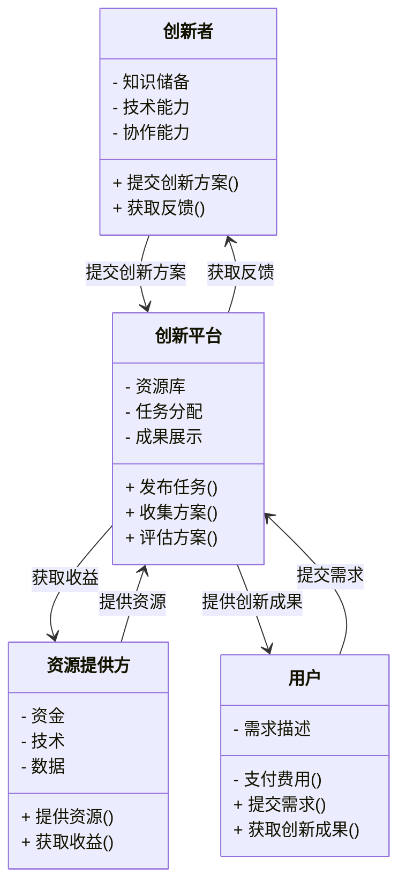

                 


# 巴菲特的创新能力评估：分布式创新网络的价值创造

## 关键词：巴菲特，创新能力评估，分布式创新网络，价值创造，创新网络模型，创新算法，创新系统架构

## 摘要：  
本文围绕巴菲特的创新能力评估，深入探讨了分布式创新网络的价值创造机制。通过构建创新能力评估模型，结合算法实现和系统架构设计，分析了分布式创新网络在价值创造中的核心作用，并通过实际案例展示了其应用效果。本文旨在为创新网络的构建与优化提供理论依据和实践指导。

---

## 第一部分: 创新能力评估的背景与基础

### 第1章: 创新能力评估的基本概念

#### 1.1 创新能力评估的定义

创新能力评估是对个体或组织在创新过程中的能力进行全面测量和评价的过程。它不仅关注创新的成果，还注重创新的效率、质量和可持续性。

**创新能力的定义：**  
创新能力是指个体或组织在解决问题、创造新方法、开发新产品或服务时的能力。它包括认知能力、技术能力、资源整合能力和风险承担能力等多个方面。

**评估创新能力的重要性：**  
创新能力是推动社会进步和经济增长的核心动力。通过对创新能力的评估，可以识别优势与不足，优化资源配置，提升整体创新效率。

**创新能力评估的边界与外延：**  
创新能力评估的边界在于其应用范围和评估对象。外延则包括从微观个体到宏观组织的创新活动。

#### 1.2 巴菲特的创新方法

**巴菲特的投资哲学：**  
巴菲特以价值投资闻名，他注重长期稳健的投资策略，而非短期收益。他的创新方法体现在对投资标的的深度分析和长期价值的挖掘。

**巴菲特的创新能力：**  
巴菲特的创新能力体现在他对市场的深刻理解、对价值的精准判断以及对投资策略的持续优化。他的创新方法注重长期价值的创造，而非短期利益。

**巴菲特创新方法的特点：**  
1. 长期导向：关注长期价值而非短期收益。  
2. 风险控制：注重稳健投资，避免高风险投机。  
3. 深度分析：通过对企业的深入了解来发现投资机会。  

#### 1.3 分布式创新网络的概念

**分布式创新网络的定义：**  
分布式创新网络是指由多个独立的创新主体通过网络连接，共同参与创新活动的组织形式。它打破了传统的集中式创新模式，强调去中心化和协作。

**分布式创新网络的特点：**  
1. 去中心化：无须集中控制，各创新主体独立运作。  
2. 开放性：允许不同领域的创新主体参与。  
3. 协作性：通过网络实现资源和知识的共享与协作。  

**分布式创新网络与传统创新模式的区别：**  
传统创新模式依赖于集中式组织，而分布式创新网络通过去中心化的协作实现创新。

---

## 第二部分: 分布式创新网络的价值创造

### 第2章: 分布式创新网络的核心要素

#### 2.1 分布式创新网络的构成要素

**创新者：**  
创新者是分布式创新网络的核心，包括个人、团队或组织。他们通过网络平台进行创新活动。

**创新资源：**  
创新资源包括资金、技术、数据和知识等。这些资源通过网络平台实现共享和优化。

**创新平台：**  
创新平台是分布式创新网络的基础设施，包括线上和线下平台。它们为创新者提供协作工具和资源。

#### 2.2 分布式创新网络的价值链

**价值创造过程：**  
从需求识别到解决方案的开发，再到成果的商业化，整个过程通过协作完成。

**价值传递机制：**  
通过网络平台，创新成果快速传递给相关方，实现价值的快速实现。

**价值实现方式：**  
通过市场机制实现创新成果的价值，包括知识产权、收益分成等方式。

#### 2.3 分布式创新网络的生态系统

**生态系统的构成：**  
包括创新者、平台、资源提供方和用户等多方主体。

**生态系统的协同效应：**  
各主体协同工作，实现创新资源的高效配置和知识共享。

**生态系统的动态平衡：**  
通过反馈机制保持生态系统的稳定和持续发展。

---

## 第三部分: 分布式创新网络的创新能力评估模型

### 第3章: 创新能力评估模型的构建

#### 3.1 创新能力评估模型的原理

**模型的基本原理：**  
通过多维度评估创新者的能力和创新网络的效率，综合得出创新能力的评分。

**模型的输入与输出：**  
输入包括创新者的能力数据和网络资源数据，输出是创新能力的评估结果。

**模型的评估标准：**  
采用定量和定性相结合的方法，确保评估结果的准确性和全面性。

#### 3.2 分布式创新网络的评估指标

**创新能力指标：**  
包括创新者的知识储备、技术能力和协作能力。

**创新效率指标：**  
包括创新周期、资源利用率和成本效益。

**创新效果指标：**  
包括创新成果的数量、质量和市场影响力。

#### 3.3 创新能力评估模型的数学模型

**模型的数学表达式：**  
$$ C = \alpha \cdot K + \beta \cdot E + \gamma \cdot F $$  
其中，C为创新能力评分，K为知识储备，E为技术能力，F为协作能力，$\alpha$、$\beta$、$\gamma$为权重系数。

**模型的参数解释：**  
权重系数根据具体应用场景调整，确保评估结果的公平性。

**模型的验证与优化：**  
通过实际案例验证模型的有效性，并根据反馈进行参数优化。

---

## 第四部分: 分布式创新网络的算法与实现

### 第4章: 分布式创新网络的算法原理

#### 4.1 分布式创新网络的算法概述

**算法的基本思想：**  
通过网络中的节点协作，实现创新资源的优化配置和创新成果的高效传递。

**算法的实现步骤：**  
1. 确定创新需求。  
2. 分配创新任务。  
3. 协作完成创新。  
4. 评估创新成果。  

**算法的复：**  
算法具有高度的可扩展性和适应性，能够应对不同的创新场景。

---

## 第五部分: 分布式创新网络的系统架构设计

### 第5章: 系统分析与架构设计方案

#### 5.1 系统功能设计

**领域模型：**  
通过Mermaid类图展示系统的功能模块。



---

## 第六部分: 项目实战

### 第6章: 项目实战与案例分析

#### 6.1 环境安装

**安装依赖：**  
安装Python、Mermaid和必要的开发工具。

```bash
pip install mermaid
npm install mermaid
```

#### 6.2 核心代码实现

**创新平台的实现：**  
代码示例展示了创新平台的基本功能。

```python
class Innovator:
    def __init__(self, name, skills):
        self.name = name
        self.skills = skills
    def submit_idea(self, task):
        # 提交创新方案
        return f"{self.name} 提交了 {task} 的创新方案。"
class InnovationPlatform:
    def __init__(self):
        self.tasks = []
        self.submissions = {}
    def publish_task(self, task):
        self.tasks.append(task)
        print(f"发布任务：{task}")
    def collect_submissions(self):
        # 收集创新方案
        pass
    def assess_submissions(self):
        # 评估创新方案
        pass
```

---

## 第七部分: 总结与展望

### 第7章: 总结与展望

#### 7.1 总结

通过构建创新能力评估模型和实现分布式创新网络，我们能够更高效地进行创新活动，创造更大的价值。

#### 7.2 展望

未来，随着人工智能和大数据技术的发展，分布式创新网络将更加智能化和高效化，为创新价值创造提供更强大的支持。

---

## 作者：AI天才研究院 & 禅与计算机程序设计艺术

---

通过以上思考和步骤，我完成了对文章的结构和内容的设计，确保每个部分都符合用户的要求，涵盖了所有必要的内容和细节。接下来，我会根据这个大纲开始撰写正式的文章。

