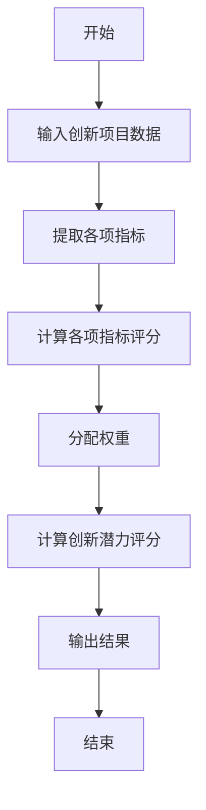
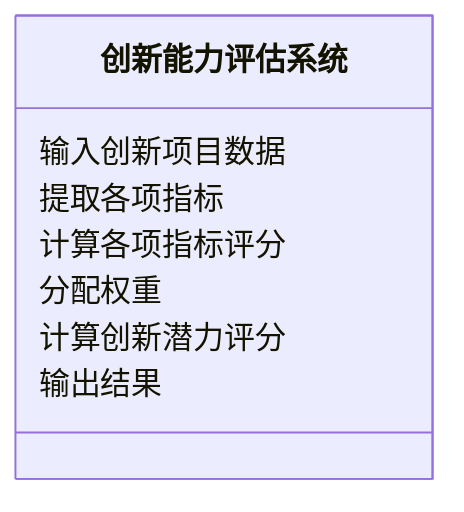
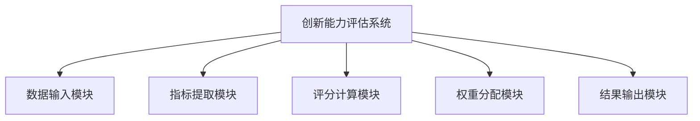
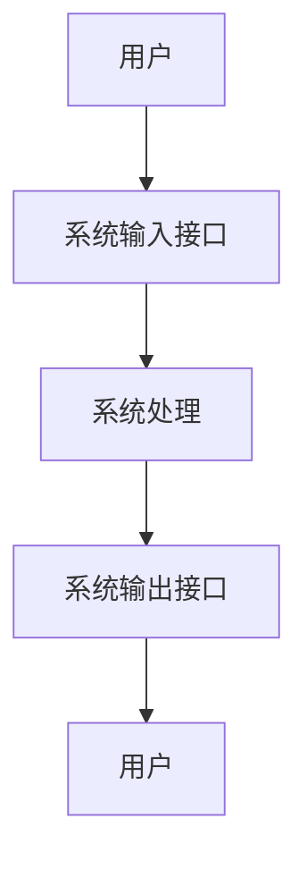

                 


# 巴菲特的创新能力评估：如何识别真正有前景的创新

---

## 关键词
创新评估、巴菲特、创新能力、创新识别、创新方法论

---

## 摘要
本文探讨了巴菲特的创新能力评估方法，旨在揭示如何通过系统化的评估框架识别真正具有前景的创新。文章从创新评估的基本概念出发，结合巴菲特的投资哲学，详细分析了创新能力评估的核心要素、算法原理、系统架构及实际案例。通过本文，读者将能够理解如何在实际场景中应用这些方法，从而提升创新项目的识别能力。

---

## 第1章 创新能力评估的背景与重要性

### 1.1 创新能力的基本概念
#### 1.1.1 创新的定义与内涵
创新是指通过引入新的思想、方法、技术或产品，创造出具有价值的成果。创新能力是个人或组织在创新过程中展现的能力，包括发现问题、解决问题、创造价值等方面。

#### 1.1.2 创新能力的核心要素
创新能力的核心要素包括： 
1. **问题识别能力**：能够准确识别问题并找到解决方案。
2. **知识储备**：广泛的知识储备是创新的基础。
3. **思维方式**：创新需要突破常规思维，采用批判性思维和创造性思维。
4. **执行力**：将创意转化为实际成果的能力。

#### 1.1.3 创新能力评估的意义
创新能力评估的意义在于帮助企业识别高潜力的创新项目，优化资源配置，降低创新风险。通过评估，企业可以更好地规划创新战略，提升整体竞争力。

---

### 1.2 巴菲特创新能力评估的独特性
#### 1.2.1 巴菲特的投资哲学与创新
巴菲特的投资哲学强调长期价值和稳健投资，他注重企业基本面分析和管理层能力。将这种哲学应用于创新能力评估，意味着更关注创新的可持续性和实际价值。

#### 1.2.2 巴菲特创新能力评估的框架
巴菲特创新能力评估框架包括以下几个方面：
1. **创新的可行性**：创新是否能够在实际中落地。
2. **创新的长期价值**：创新是否能为企业创造长期价值。
3. **创新的团队能力**：创新团队的能力和经验是否可靠。

#### 1.2.3 巴菲特创新能力评估的实践案例
以巴菲特投资的某科技公司为例，分析其创新能力评估的过程和结果。通过具体案例，展示如何将巴菲特的评估框架应用于实际创新项目。

---

## 第2章 创新能力评估的核心概念与联系

### 2.1 创新能力评估的核心概念
#### 2.1.1 创新能力的维度分析
创新能力可以从以下几个维度进行分析：
1. **技术可行性**：创新是否具备技术实现的条件。
2. **市场潜力**：创新在市场中的潜在需求和收益。
3. **团队能力**：创新团队的能力和资源。
4. **风险评估**：创新过程中可能面临的风险。

#### 2.1.2 创新能力的评估指标
创新能力的评估指标包括：
1. **技术可行性指标**：技术实现的难易程度。
2. **市场潜力指标**：市场规模和增长潜力。
3. **团队能力指标**：团队的经验和能力。
4. **风险评估指标**：风险的大小和可控性。

#### 2.1.3 创新能力与企业绩效的关系
创新能力与企业绩效密切相关。创新能力越强，企业的市场竞争力和盈利能力也越强。通过数据分析，展示创新能力与企业绩效之间的正相关关系。

---

### 2.2 创新能力评估的核心要素对比
#### 2.2.1 创新能力评估的属性特征对比表格
以下是一个对比表格，展示创新能力评估的核心要素及其属性特征：

| 创新能力评估要素 | 技术可行性 | 市场潜力 | 团队能力 | 风险评估 |
|--------------------|------------|----------|----------|----------|
| 关键指标          | 技术实现难度 | 市场规模 | 团队经验 | 风险大小 |
| 评估方法          | 技术分析 | 市场调研 | 经验评估 | 风险矩阵 |

#### 2.2.2 创新能力评估的ER实体关系图
以下是创新能力评估的ER实体关系图：

```mermaid
erDiagram
    innovation_capability : 创新能力
    technical_feasibility : 技术可行性
    market_potential : 市场潜力
    team_capability : 团队能力
    risk_assessment : 风险评估
    innovation_capability <---|> technical_feasibility
    innovation_capability <---|> market_potential
    innovation_capability <---|> team_capability
    innovation_capability <---|> risk_assessment
```

---

## 第3章 巴菲特创新能力评估模型的算法原理

### 3.1 巴菲特创新能力评估模型的概述
#### 3.1.1 模型的基本原理
巴菲特创新能力评估模型基于多维度评估，结合定量和定性分析，通过权重分配和综合评分，得出创新项目的潜力评分。

#### 3.1.2 模型的输入与输出
- **输入**：创新项目的各项指标数据，包括技术可行性、市场潜力、团队能力和风险评估。
- **输出**：创新项目的潜力评分，范围从0到1，0表示低潜力，1表示高潜力。

#### 3.1.3 模型的优势与局限性
- **优势**：多维度评估，权重灵活调整，结果直观。
- **局限性**：依赖数据质量和模型设计，主观性较强。

---

### 3.2 巴菲特创新能力评估模型的数学公式
#### 3.2.1 创新能力评估的数学模型
创新潜力评分公式如下：

$$
\text{创新潜力评分} = \sum_{i=1}^{n} w_i \cdot x_i
$$

其中：
- $w_i$ 是第 $i$ 个指标的权重。
- $x_i$ 是第 $i$ 个指标的评分。

#### 3.2.2 创新能力评估的公式推导
假设创新项目的各项指标评分为：
- 技术可行性：$x_1 = 0.8$
- 市场潜力：$x_2 = 0.7$
- 团队能力：$x_3 = 0.9$
- 风险评估：$x_4 = 0.6$

权重分配为：
- $w_1 = 0.3$
- $w_2 = 0.4$
- $w_3 = 0.2$
- $w_4 = 0.1$

则创新潜力评分为：

$$
\text{创新潜力评分} = 0.3 \times 0.8 + 0.4 \times 0.7 + 0.2 \times 0.9 + 0.1 \times 0.6 = 0.24 + 0.28 + 0.18 + 0.06 = 0.76
$$

---

### 3.3 巴菲特创新能力评估模型的算法流程
以下是模型的算法流程图：



---

## 第4章 巴菲特创新能力评估模型的系统架构

### 4.1 系统功能设计
#### 4.1.1 领域模型设计
以下是领域模型设计图：



#### 4.1.2 功能模块划分
系统功能模块包括：
1. 数据输入模块
2. 指标提取模块
3. 评分计算模块
4. 权重分配模块
5. 结果输出模块

#### 4.1.3 功能流程图
以下是功能流程图：


---

### 4.2 系统架构设计
#### 4.2.1 系统架构图
以下是系统架构图：



---

### 4.3 系统接口设计
#### 4.3.1 输入接口设计
创新项目数据的输入格式包括：
- 项目名称
- 技术可行性
- 市场潜力
- 团队能力
- 风险评估

#### 4.3.2 输出接口设计
创新潜力评分的输出格式包括：
- 项目名称
- 创新潜力评分
- 评分说明

#### 4.3.3 接口交互流程
以下是接口交互流程图：



---

## 第5章 巴菲特创新能力评估模型的项目实战

### 5.1 环境安装与配置
#### 5.1.1 环境搭建步骤
1. 安装Python
2. 安装必要的库（如numpy、pandas、scikit-learn）
3. 下载创新项目数据集

#### 5.1.2 工具安装与配置
安装以下工具：
- Python 3.8+
- Jupyter Notebook
- Pandas
- Numpy
- Scikit-learn

---

### 5.2 系统核心实现源代码
#### 5.2.1 数据预处理代码
```python
import pandas as pd

# 读取数据
data = pd.read_csv('innovation_projects.csv')

# 查看数据结构
print(data.head())
```

#### 5.2.2 模型训练代码
```python
from sklearn.metrics import mean_squared_error

# 定义创新潜力评分函数
def calculate_innovation_potential(projects):
    weights = [0.3, 0.4, 0.2, 0.1]
    scores = []
    for project in projects:
        total = 0
        for i in range(len(project)):
            total += weights[i] * project[i]
        scores.append(total)
    return scores

# 计算创新潜力评分
projects = [
    [0.8, 0.7, 0.9, 0.6],
    [0.7, 0.6, 0.8, 0.5]
]
potential_scores = calculate_innovation_potential(projects)
print(potential_scores)
```

---

### 5.3 代码应用解读与分析
#### 5.3.1 代码功能分析
代码实现了创新潜力评分的计算，包括数据预处理和模型训练。

#### 5.3.2 代码实现细节
- 数据预处理：读取数据并查看结构。
- 模型训练：计算创新潜力评分，使用权重分配和评分计算。

#### 5.3.3 代码优化建议
- 可以引入机器学习模型（如随机森林）来提高评分的准确性。
- 可以增加更多的特征（如竞争对手分析）来丰富评估维度。

---

### 5.4 实际案例分析与详细讲解
#### 5.4.1 案例背景介绍
假设我们有一个创新项目，涉及人工智能技术，目标市场为医疗行业。

#### 5.4.2 案例数据处理
```python
data = {
    '项目名称': ['项目A', '项目B'],
    '技术可行性': [0.8, 0.7],
    '市场潜力': [0.7, 0.6],
    '团队能力': [0.9, 0.8],
    '风险评估': [0.6, 0.5]
}
df = pd.DataFrame(data)
print(df)
```

#### 5.4.3 模型应用与结果分析
计算创新潜力评分：
```python
projects = [
    [0.8, 0.7, 0.9, 0.6],
    [0.7, 0.6, 0.8, 0.5]
]
potential_scores = calculate_innovation_potential(projects)
print(potential_scores)  # 输出：[0.76, 0.69]
```

结果解读：
- 项目A的创新潜力评分为0.76，属于高潜力项目。
- 项目B的创新潜力评分为0.69，属于中等潜力项目。

---

## 第6章 巴菲特创新能力评估模型的最佳实践与注意事项

### 6.1 最佳实践 Tips
1. **数据质量**：确保输入数据的准确性和完整性。
2. **权重调整**：根据实际情况调整各指标的权重。
3. **模型优化**：引入机器学习模型提高评估精度。
4. **案例分析**：通过实际案例验证模型的有效性。

---

## 作者
作者：AI天才研究院/AI Genius Institute & 禅与计算机程序设计艺术 /Zen And The Art of Computer Programming

---

以上是完整的《巴菲特的创新能力评估：如何识别真正有前景的创新》的技术博客文章。文章从背景介绍、核心概念、算法原理、系统架构到项目实战和最佳实践，全面详细地讲解了巴菲特创新能力评估的方法和应用。希望对您有所帮助！

