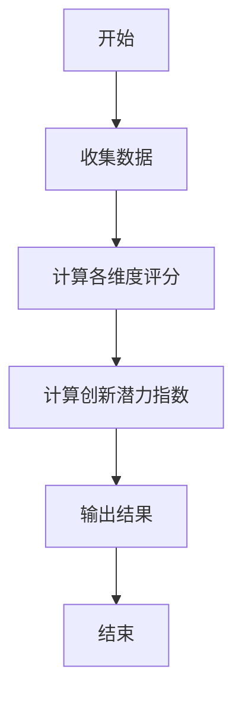
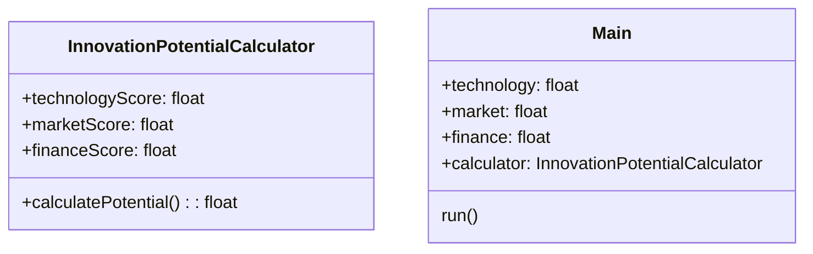
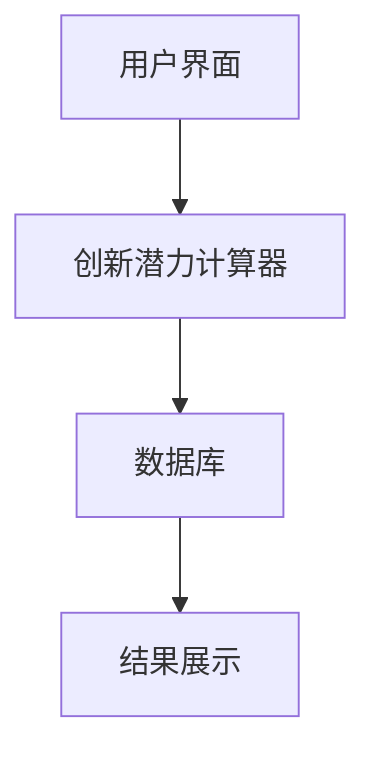
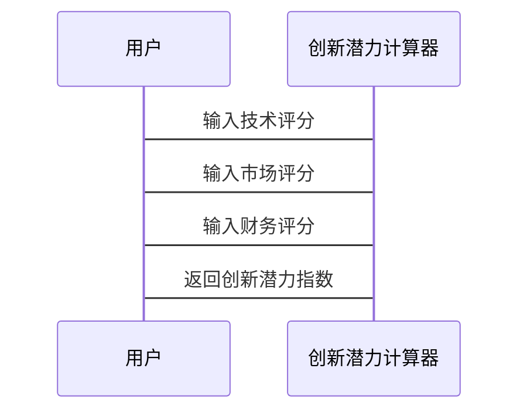

                 


# 巴菲特的创新能力评估：开放式创新生态系统的价值

## 关键词：巴菲特、创新能力、开放式创新、生态系统、创新评估

## 摘要：本文章探讨了巴菲特如何通过创新能力评估来分析开放式创新生态系统。从创新潜力模型到数学公式，结合实际案例，深入分析创新生态系统的设计与实现，提供评估框架和方法。

---

### 第一部分：背景与概述

#### 第1章：巴菲特的创新理念与开放式创新概述

##### 1.1 巴菲特的创新评估方法

###### 1.1.1 巴菲特投资理念的核心要素

巴菲特的投资理念以长期价值为导向，注重企业基本面分析、财务稳健性和管理团队能力。他通过评估企业的竞争优势、盈利能力、财务健康状况等因素，寻找具有持续增长潜力的企业。

###### 1.1.2 创新能力在投资决策中的作用

创新能力是企业长期增长的关键因素。巴菲特通过评估企业的创新能力，判断其在市场中的竞争力和持续发展的潜力。创新能力包括技术创新、产品创新、管理创新等方面，直接影响企业的市场地位和盈利能力。

###### 1.1.3 开放式创新的定义与特点

开放式创新是一种以外部资源和合作为核心的企业创新模式。它打破了传统的封闭创新模式，通过与外部合作伙伴（如供应商、用户、研究机构等）共享资源、知识和能力，加速创新过程，降低创新成本，提高创新效率。

##### 1.2 开放式创新生态系统的基本概念

###### 1.2.1 开放式创新的起源与发展

开放式创新的概念由亨利·切萨布鲁夫在2003年提出，强调企业应通过外部合作获取创新资源，突破企业边界限制。随着数字化和全球化的发展，开放式创新已成为企业创新的重要模式。

###### 1.2.2 创新生态系统的核心要素

创新生态系统包括创新主体（企业、个人、政府）、创新资源（技术、资金、人才）、创新环境（政策、文化、基础设施）等要素。这些要素相互作用，形成支持创新的生态系统。

###### 1.2.3 巴菲特视角下的创新生态系统价值

巴菲特认为，一个强大的创新生态系统能够为企业提供持续的创新动力，增强企业的市场竞争力。他倾向于投资那些能够融入创新生态系统、具备持续创新能力的企业。

##### 1.3 本书的研究目标与框架

###### 1.3.1 研究背景与问题提出

随着市场竞争加剧，企业创新面临更多挑战。如何评估创新能力，构建开放式创新生态系统，成为企业战略的重要课题。

###### 1.3.2 研究目标与方法

本研究旨在探索巴菲特的创新能力评估方法，分析开放式创新生态系统的设计与实现，为企业创新战略提供理论支持和实践指导。

###### 1.3.3 本书结构概述

文章分为背景与概述、核心概念与理论基础、开放式创新生态系统的分析、数学模型与算法、系统分析与架构设计、项目实战、总结与展望等部分，全面探讨创新能力评估与开放式创新生态系统的关系。

---

### 第二部分：核心概念与理论基础

#### 第2章：创新能力评估的核心模型与方法

##### 2.1 创新能力评估的主要模型

###### 2.1.1 3C模型：技术、市场和财务评估

3C模型从技术可行性、市场需求和财务可行性三个维度评估创新能力。技术可行性评估产品或技术的可行性；市场需求评估市场潜力；财务可行性评估投资回报。

###### 2.1.2 SWOT分析法在创新评估中的应用

SWOT分析法通过分析优势（Strengths）、劣势（Weaknesses）、机会（Opportunities）和威胁（Threats），帮助企业识别创新过程中的关键因素，制定有效的创新策略。

###### 2.1.3 技术经济性评估框架

技术经济性评估框架从技术性能、成本效益、市场适应性等方面评估创新的经济价值。

##### 2.2 开放式创新生态系统中的关键要素

###### 2.2.1 创新主体：企业、政府与个人

企业是创新的主体，政府通过政策支持和资金投入推动创新，个人则是创新的源泉。

###### 2.2.2 创新资源：技术、资金与人才

技术是创新的核心，资金是创新的保障，人才是创新的关键。

###### 2.2.3 创新环境：政策、文化和基础设施

政策支持、文化氛围和基础设施建设对创新生态系统的发展至关重要。

##### 2.3 创新能力评估的核心维度

###### 2.3.1 技术可行性评估

评估创新的技术成熟度、研发难度和风险。

###### 2.3.2 市场需求评估

评估创新的市场潜力、用户需求和竞争状况。

###### 2.3.3 经济效益评估

评估创新的投资回报率、成本效益和长期收益。

---

### 第三部分：开放式创新生态系统的分析

#### 第3章：开放式创新生态系统的结构与功能

##### 3.1 开放式创新生态系统的组成

###### 3.1.1 核心企业：创新的主导者

核心企业在生态系统中起主导作用，通过与外部合作伙伴共同创新。

###### 3.1.2 供应商与合作伙伴：资源提供者

供应商和合作伙伴为企业提供技术、资源和能力支持。

###### 3.1.3 用户与消费者：创新的反馈者

用户和消费者为创新提供反馈和需求，推动创新的持续改进。

###### 3.1.4 政府与非营利组织：政策支持者

政府通过政策和资金支持创新，非营利组织通过公共服务推动创新。

##### 3.2 开放式创新生态系统的运行机制

###### 3.2.1 创新资源的流动与整合

创新资源通过合作、共享和整合，实现资源的优化配置。

###### 3.2.2 创新价值的传递与共享

创新价值通过合作和共享，实现利益相关者的共赢。

###### 3.2.3 创新风险的分担与管理

创新风险通过合作和分散，降低企业的创新风险。

##### 3.3 开放式创新生态系统中的协同创新

###### 3.3.1 协同创新的定义与特点

协同创新是通过多方合作，共同解决问题，实现创新目标。

###### 3.3.2 协同创新的实现机制

通过合作、共享和协同，实现创新资源的高效利用。

###### 3.3.3 协同创新的优势与挑战

优势包括资源互补、风险分担；挑战包括协调困难、利益冲突。

---

### 第四部分：数学模型与算法

#### 第4章：创新能力评估的数学模型与算法

##### 4.1 创新潜力评估模型

###### 4.1.1 创新潜力指数公式

创新潜力指数公式：$$IP = 0.4T + 0.3M + 0.3F$$

其中，T为技术可行性，M为市场需求，F为财务可行性。

###### 4.1.2 创新潜力指数计算流程

1. 收集技术、市场和财务数据。
2. 计算各维度的评分。
3. 加权计算创新潜力指数。

##### 4.2 协同创新效益评估模型

###### 4.2.1 协同创新效益计算公式

协同创新效益公式：$$CB = 0.5C + 0.3R + 0.2S$$

其中，C为合作能力，R为资源贡献度，S为协同效果。

###### 4.2.2 协同创新效益计算流程

1. 评估各合作伙伴的合作能力。
2. 评估资源贡献度。
3. 评估协同效果。
4. 计算协同创新效益指数。

##### 4.3 创新能力评估的算法实现

###### 4.3.1 算法流程图



###### 4.3.2 Python源代码实现

```python
def calculate_innovation_potential(technology, market, finance):
    weight_t = 0.4
    weight_m = 0.3
    weight_f = 0.3
    ip = weight_t * technology + weight_m * market + weight_f * finance
    return ip

# 示例数据
technology_score = 0.8
market_score = 0.7
finance_score = 0.6

ip = calculate_innovation_potential(technology_score, market_score, finance_score)
print(f"创新潜力指数：{ip}")
```

---

### 第五部分：系统分析与架构设计

#### 第5章：创新潜力评估系统的架构与实现

##### 5.1 系统功能设计

###### 5.1.1 功能需求

- 用户输入技术、市场、财务评分。
- 计算创新潜力指数。
- 显示评估结果。

###### 5.1.2 领域模型类图



##### 5.2 系统架构设计

###### 5.2.1 系统架构图



##### 5.3 系统接口设计

###### 5.3.1 输入接口

- 用户输入技术、市场、财务评分。

###### 5.3.2 输出接口

- 显示创新潜力指数和评估结果。

##### 5.4 系统交互流程

###### 5.4.1 交互序列图



---

### 第六部分：项目实战

#### 第6章：创新潜力评估系统的实现与应用

##### 6.1 环境安装与配置

- 安装Python和必要的库（如numpy、pandas）。

##### 6.2 核心代码实现

```python
def calculate_innovation_potential(technology, market, finance):
    weight_t = 0.4
    weight_m = 0.3
    weight_f = 0.3
    ip = technology * weight_t + market * weight_m + finance * weight_f
    return ip

# 示例代码
technology_score = 0.8
market_score = 0.7
finance_score = 0.6

potential = calculate_innovation_potential(technology_score, market_score, finance_score)
print(f"创新潜力指数：{potential}")
```

##### 6.3 代码应用解读与分析

- 代码实现创新潜力指数的计算，用户输入评分后，系统自动计算并返回结果。

##### 6.4 实际案例分析

假设一家企业的技术评分为0.8，市场评分为0.7，财务评分为0.6，计算其创新潜力指数为0.73，表明其创新潜力较高。

##### 6.5 项目小结

通过Python代码实现创新潜力评估模型，企业可以快速评估自身的创新能力，为投资决策提供支持。

---

### 第七部分：总结与展望

#### 第7章：总结与未来研究方向

##### 7.1 小结

本文探讨了巴菲特创新能力评估方法，分析了开放式创新生态系统，提出了创新潜力评估模型，并通过Python代码实现了评估系统。

##### 7.2 注意事项

- 数据的准确性和完整性影响评估结果。
- 模型的适用性需根据实际情况调整。

##### 7.3 未来研究方向

- 开发更复杂的评估模型。
- 探讨创新生态系统与其他商业模型的结合。

---

### 作者

作者：AI天才研究院/AI Genius Institute & 禅与计算机程序设计艺术/Zen And The Art of Computer Programming

