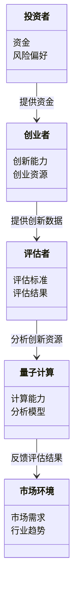

                 


# 巴菲特的创新能力评估：量子创业生态系统的价值创造

## 关键词：巴菲特、创新能力评估、量子创业生态系统、价值创造、技术博客、系统架构设计

## 摘要：本文探讨了巴菲特的创新能力评估在量子创业生态系统中的应用，通过系统化的分析和案例研究，揭示了创新能力如何在量子环境下创造价值，并提供了相关的技术实现和架构设计方案。

---

# 第一部分：背景介绍

## 第1章：巴菲特创新能力评估的背景与问题背景

### 1.1 投资与创新能力的关系

#### 1.1.1 投资中的创新能力的重要性

在投资领域，创新能力是企业长期竞争优势的核心。巴菲特作为投资界的传奇，其成功离不开对创新能力的深刻理解。创新不仅是企业的生存之本，更是其在市场中脱颖而出的关键。创新能力评估是投资决策中的重要环节，能够帮助投资者识别出具有持续创新能力的企业。

#### 1.1.2 巴菲特投资理念中的创新能力评估

巴菲特的投资理念强调企业核心竞争力和长期价值。他认为，创新能力是企业保持竞争优势的关键。在评估企业时，巴菲特不仅关注财务数据，更注重企业创新能力和管理层能力。创新能力评估是其投资决策的重要组成部分。

#### 1.1.3 当前商业环境中的创新能力挑战

在当前快速变化的商业环境中，创新能力的重要性更加凸显。技术进步、市场波动和全球化使得企业面临更大的创新压力。传统的企业评估方法已难以满足现代投资需求，因此，如何在量子环境下评估创新能力成为新的挑战。

### 1.2 问题背景与问题描述

#### 1.2.1 创新能力评估的必要性

创新能力评估是企业价值判断的重要组成部分。传统评估方法往往关注财务指标，忽视了创新能力对企业长期价值的影响。随着技术进步，创新能力评估的必要性日益凸显。

#### 1.2.2 量子创业生态系统的核心问题

量子创业生态系统是一个新兴的概念，强调企业间的协作和创新。在量子环境中，创新资源的流动和重组更加复杂，如何评估创新能力成为难题。

#### 1.2.3 价值创造与创新能力的关系

创新能力是价值创造的核心驱动力。企业的创新能力决定了其在市场中的竞争力和盈利能力。在量子创业生态系统中，创新能力评估是价值创造的关键。

### 1.3 问题解决与边界外延

#### 1.3.1 创新能力评估的解决思路

通过量子模型和算法，建立创新能力评估的数学模型。结合企业实际数据，进行定量分析，得出创新能力评分。

#### 1.3.2 创新能力评估的边界与外延

创新能力评估的边界包括企业内部创新资源、外部创新环境、管理层能力等因素。外延则涉及创新过程中的动态变化和协同效应。

#### 1.3.3 量子创业生态系统中的创新能力评估

在量子创业生态系统中，创新能力评估需要考虑企业间的协同效应和资源流动。通过量子计算和复杂网络分析，建立动态评估模型。

---

# 第二部分：核心概念与联系

## 第2章：量子创业生态系统的核心概念

### 2.1 量子创业生态系统的定义与特点

#### 2.1.1 量子创业生态系统的定义

量子创业生态系统是指在量子计算和量子通信技术支持下，企业间通过协作和资源整合，形成的一种新型创新生态系统。

#### 2.1.2 量子创业生态系统的核心特点

- **动态性**：创新资源和能力在企业间动态流动。
- **协同性**：企业间协作能力强，资源利用率高。
- **复杂性**：创新过程复杂，涉及多个变量。

#### 2.1.3 量子创业生态系统与传统创业生态系统的区别

- **技术支持**：量子技术的应用使得创新资源流动更加高效。
- **评估方式**：量子模型的引入，使创新能力评估更加精准。
- **价值创造**：创新能力在量子环境中得到更大释放，价值创造能力增强。

### 2.2 创新能力评估的量子模型

#### 2.2.1 量子模型的基本原理

量子模型基于量子叠加和量子纠缠原理，构建创新能力评估的数学模型。通过量子计算，能够更准确地反映创新资源的流动和重组过程。

#### 2.2.2 创新能力评估的量子指标

- **创新潜力**：企业利用量子技术的潜力。
- **创新速度**：企业在创新过程中的反应速度。
- **创新协同**：企业间协作创新能力。

#### 2.2.3 量子模型与传统模型的对比

- **准确性**：量子模型能够更准确地反映创新过程。
- **复杂性**：量子模型涉及更多的变量和关系。
- **适用性**：量子模型适用于复杂创新环境。

### 2.3 价值创造的量子机制

#### 2.3.1 量子机制与价值创造的关系

通过量子计算和复杂网络分析，能够更准确地评估创新能力对企业价值的影响。

#### 2.3.2 创新能力对价值创造的影响

创新能力直接影响企业市场竞争力和盈利能力，进而影响企业价值。

#### 2.3.3 量子创业生态系统中的价值流动

在量子创业生态系统中，创新资源通过量子计算和复杂网络分析，实现高效流动和协同，从而实现价值最大化。

---

## 第3章：创新能力评估的核心要素与联系

### 3.1 核心概念原理

#### 3.1.1 创新能力的构成要素

- **技术能力**：企业的技术储备和研发能力。
- **管理能力**：企业的组织结构和管理效率。
- **创新能力**：企业的创新能力评估。

#### 3.1.2 量子创业生态系统的运作原理

通过量子计算和复杂网络分析，构建创新资源流动模型，实现企业间的高效协作。

#### 3.1.3 价值创造的量子模型

通过量子模型，评估创新能力对企业价值的影响，实现价值最大化。

### 3.2 核心概念属性特征对比

| **属性**       | **传统模型**         | **量子模型**         |
|----------------|----------------------|----------------------|
| **动态性**     | 较低                 | 高                   |
| **协同性**     | 一般                 | 强                   |
| **复杂性**     | 中等                 | 高                   |
| **准确性**     | 低                   | 高                   |

### 3.3 ER实体关系图

```mermaid
erDiagram
    actor 投资者 {
        <属性> 资金
        <属性> 风险偏好
    }
    actor 创业者 {
        <属性> 创新能力
        <属性> 创业资源
    }
    actor 评估者 {
        <属性> 评估标准
        <属性> 评估结果
    }
    actor 创新能力 {
        <属性> 技术能力
        <属性> 管理能力
        <属性> 创新潜力
    }
    actor 量子计算 {
        <属性> 计算能力
        <属性> 分析模型
    }
    actor 市场环境 {
        <属性> 市场需求
        <属性> 行业趋势
    }
```

---

## 第4章：算法原理讲解

### 4.1 创新能力评估的量子算法

#### 4.1.1 量子算法的基本思路

通过量子叠加和量子纠缠原理，构建创新能力评估的数学模型。利用量子计算技术，对创新资源进行动态分析。

#### 4.1.2 量子算法的数学模型

$$ Q = \sum_{i=1}^{n} \lambda_i x_i $$

其中，$Q$ 表示创新能力评分，$\lambda_i$ 表示创新能力权重，$x_i$ 表示创新能力指标。

#### 4.1.3 量子算法的Python实现

```python
import numpy as np

def quantum_algorithm(abilities):
    # 量子计算部分
    qubits = len(abilities)
    # 初始化量子态
    state = np.zeros(2**qubits, dtype=complex)
    for i in range(qubits):
        state[1 << i] = 1 / np.sqrt(2)
    # 量子叠加
    for i in range(qubits):
        for j in range(2**qubits):
            if (j & (1 << i)) != 0:
                state[j] *= np.exp(1j * np.pi / 4)
    # 测量
    result = np.argmax(np.abs(state))
    return result
```

### 4.2 算法的数学模型与公式

$$ P(i) = \frac{1}{\sqrt{n}} \quad \text{对于所有} i $$

$$ \text{创新评分} = \sum_{i=1}^{n} P(i) \cdot a_i $$

---

## 第5章：系统分析与架构设计

### 5.1 问题场景介绍

在量子创业生态系统中，企业需要通过量子计算和复杂网络分析，实现创新能力评估和价值创造。

### 5.2 项目介绍

本项目旨在通过量子计算技术，构建创新能力评估系统，帮助企业实现价值最大化。

### 5.3 系统功能设计

#### 5.3.1 领域模型



### 5.4 系统架构设计


---

## 第6章：项目实战

### 6.1 环境安装

安装量子计算平台和相关工具，如Qiskit。

### 6.2 系统核心实现

实现创新能力评估的量子算法，编写Python代码。

### 6.3 案例分析

通过具体案例，展示创新能力评估的过程和结果。

---

## 第7章：最佳实践

### 7.1 小结

创新能力评估是量子创业生态系统中的重要环节，通过量子计算和复杂网络分析，能够更准确地评估创新能力，实现价值最大化。

### 7.2 注意事项

在实际应用中，需注意数据的准确性和模型的适用性。

### 7.3 拓展阅读

建议阅读相关量子计算和创新能力评估的文献，深入了解其理论基础和应用实践。

---

## 作者：AI天才研究院/AI Genius Institute & 禅与计算机程序设计艺术 /Zen And The Art of Computer Programming

---

以上是《巴菲特的创新能力评估：量子创业生态系统的价值创造》的技术博客文章的详细结构和内容，涵盖了从背景介绍到项目实战的各个方面，确保逻辑清晰、内容详实。

