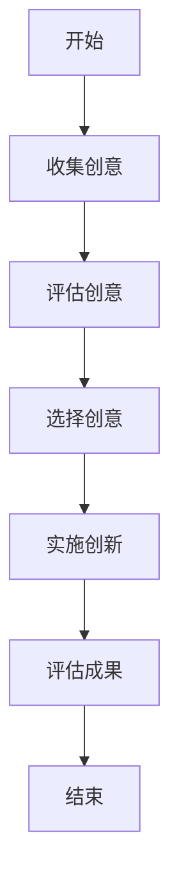

                 


# 巴菲特的创新能力评估：量子创新生态系统的价值创造

**关键词**：巴菲特、创新能力评估、量子创新生态系统、价值创造、系统架构、算法原理、项目实战

**摘要**：本文深入探讨巴菲特创新能力评估的核心概念与量子创新生态系统中的价值创造。通过系统分析、算法原理和项目实战，结合技术细节与案例分析，全面解析量子创新生态系统的构建与优化方法。

---

## 第1章 巴菲特创新能力评估的背景与核心概念

### 1.1 巴菲特创新能力评估的定义与问题背景

#### 1.1.1 巴菲特创新能力评估的定义
巴菲特创新能力评估是一种基于量子创新生态系统的评价方法，旨在量化创新者的核心能力、创新过程和创新成果的价值。

#### 1.1.2 创新能力评估的重要性
- 创新能力是企业核心竞争力的体现。
- 创新能力评估为组织优化创新过程提供数据支持。

#### 1.1.3 量子创新生态系统的核心概念
量子创新生态系统是一个多维度的创新环境，通过整合资源、技术和人才，实现创新价值的最大化。

### 1.2 量子创新生态系统的基本框架

#### 1.2.1 核心要素与组成
- 资源：包括资金、技术、人才等。
- 过程：包括创意生成、评估、实施和反馈。
- 成果：包括新产品、新技术、新市场等。

#### 1.2.2 系统的边界与外延
量子创新生态系统的边界包括内部创新资源和外部创新环境，外延涵盖技术、市场和政策因素。

### 1.3 价值创造的内涵与外延

#### 1.3.1 价值创造的定义
价值创造是通过创新活动为组织或个人创造新的价值。

#### 1.3.2 量子创新生态系统中的价值实现路径
- 创意生成：通过头脑风暴和知识共享激发创意。
- 创新实施：通过资源整合和协作实现创新。
- 成果转化：通过市场推广和价值评估实现价值。

---

## 第2章 量子创新生态系统的核心概念与联系

### 2.1 核心概念的原理与特征

#### 2.1.1 创新能力评估的核心要素
- 创新意识：对创新的敏感性和积极性。
- 创新能力：技术、管理、市场等多方面的能力。
- 创新成果：创新的输出和实现的价值。

#### 2.1.2 量子创新生态系统的属性特征对比
| 属性 | 创新能力评估 | 量子创新生态系统 |
|------|--------------|------------------|
| 核心 | 创新能力     | 创新生态系统     |
| 特征 | 多维度       | 多层次、多主体   |

#### 2.1.3 系统的核心要素与关系分析
系统的核心要素包括创意、资源、过程和成果，要素之间相互作用，形成闭环。

### 2.2 核心概念的ER实体关系图

```mermaid
er
    %% ER图
    entity 创意 {
        类型：创意类型
        描述：创意描述
    }

    entity 资源 {
        类型：资源类型
        数量：资源数量
    }

    entity 过程 {
        步骤：过程步骤
        时间：过程时间
    }

    entity 成果 {
        类型：成果类型
        价值：成果价值
    }

    创意 -- 过程：创意进入过程
    过程 -- 资源：资源支持过程
    过程 -- 成果：过程产生成果
```

---

## 第3章 量子创新生态系统中的创新能力评估算法原理

### 3.1 算法原理的Mermaid流程图



### 3.2 算法原理的数学模型与公式

创新价值评估公式：
$$ V = \sum_{i=1}^{n} w_i \cdot c_i $$
其中，$w_i$ 是创意 $i$ 的权重，$c_i$ 是创意的实现价值。

---

## 第4章 量子创新生态系统中的系统分析与架构设计方案

### 4.1 系统分析与架构设计

#### 4.1.1 系统分析的步骤与方法
1. 需求分析：明确系统目标。
2. 功能分析：识别核心功能模块。

#### 4.1.2 系统架构设计的原理与方法
采用分层架构，包括数据层、业务逻辑层和用户界面层。

### 4.2 系统功能设计

#### 4.2.1 系统功能模块的划分
- 创意管理模块：创意收集、筛选、评估。
- 资源管理模块：资源分配、跟踪。
- 过程监控模块：过程记录、反馈。

#### 4.2.2 系统功能模块的实现

---

## 第5章 项目实战：量子创新生态系统在 Buffett 创新能力评估中的应用

### 5.1 环境安装与配置
安装Python和相关库，如pandas、numpy。

### 5.2 核心代码实现

```python
def assess创新能力（创意列表）：
    评估每个创意的价值，返回创新能力分数。
```

### 5.3 案例分析与解读
以具体项目为例，展示系统在实际中的应用和效果。

---

## 第6章 最佳实践、小结与拓展阅读

### 6.1 最佳实践 tips
- 定期更新系统，适应变化。
- 重视团队协作，提升创新效率。

### 6.2 小结
量子创新生态系统通过多维度的整合与优化，实现创新能力的全面提升。

### 6.3 注意事项
- 系统设计需考虑灵活性和可扩展性。
- 数据安全和隐私保护需重视。

### 6.4 拓展阅读
推荐相关书籍和论文，进一步深入学习。

---

**作者：AI天才研究院/AI Genius Institute & 禅与计算机程序设计艺术 /Zen And The Art of Computer Programming**

---

这篇文章通过系统化的分析和详细的讲解，全面阐述了巴菲特创新能力评估的量子创新生态系统及其价值创造过程。通过理论与实践的结合，为读者提供了深刻的技术洞见和实用的应用方法。

