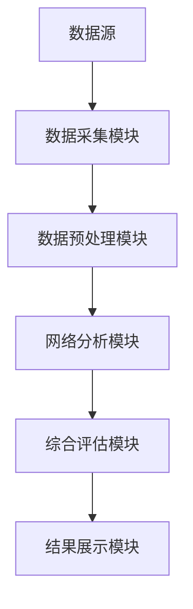
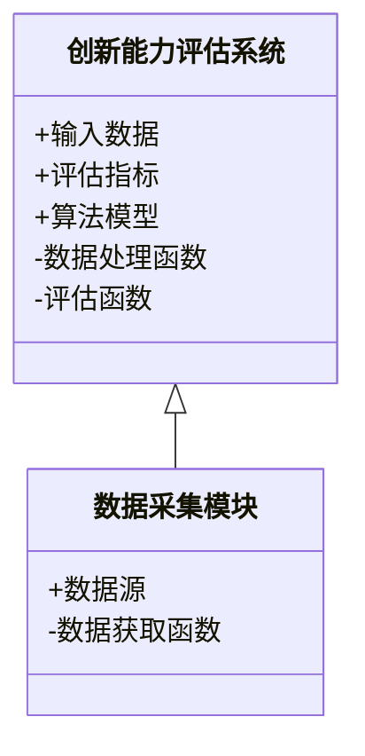
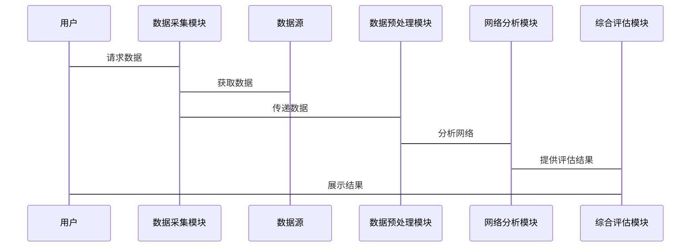

                 


# 巴菲特的创新能力评估：量子创新生态系统的价值网络分析

## 关键词：创新能力评估，量子创新生态系统，价值网络分析，巴菲特，投资理念

## 摘要：  
本文探讨了巴菲特投资理念与创新能力评估的结合，重点分析量子创新生态系统中的价值网络。通过构建数学模型、算法实现和系统架构设计，展示了如何利用量子创新生态系统进行创新能力评估，为投资决策提供科学依据。

---

## 第1章: 创新能力评估的基本概念

### 1.1 创新能力评估的定义与背景

#### 1.1.1 创新能力评估的定义  
创新能力评估是对个体或组织在创新过程中的能力进行测量和评价。它涉及创新思维、技术应用和成果产出等方面。

#### 1.1.2 创新能力评估的重要性  
创新能力是推动经济增长和企业发展的关键因素。科学的评估方法能帮助企业识别优势与改进点。

#### 1.1.3 巴菲特投资理念与创新能力评估的结合  
巴菲特注重长期价值和竞争优势。创新能力评估为其投资决策提供了新的视角，帮助识别具有持续创新能力的企业。

### 1.2 量子创新生态系统的核心要素

#### 1.2.1 量子创新生态系统的定义  
量子创新生态系统是整合量子技术、创新文化和生态系统方法的综合体系，旨在提升创新效率和成果。

#### 1.2.2 量子创新生态系统的核心要素  
| 要素 | 描述 |
|------|------|
| 技术 | 包括量子计算等前沿技术 |
| 文化 | 创新文化与价值观 |
| 组织 | 创新团队与结构 |
| 资源 | 人才、资金等 |

#### 1.2.3 量子创新生态系统与传统创新模式的区别  
量子创新生态系统强调技术整合与文化驱动，而传统模式侧重个体创新。

### 1.3 价值网络分析的基本原理

#### 1.3.1 价值网络的定义  
价值网络是企业与其利益相关者之间的关系网络，反映资源流动和价值创造过程。

#### 1.3.2 价值网络的构成要素  
| 要素 | 描述 |
|------|------|
| 企业 | 核心企业 |
| 供应商 | 提供资源的供应商 |
| 客户 | 产品服务对象 |
| 合作伙伴 | 战略合作企业 |

#### 1.3.3 价值网络分析在创新能力评估中的应用  
通过分析网络关系，识别关键节点和价值流，评估企业创新潜力。

### 1.4 本章小结  
本章介绍了创新能力评估的基本概念，探讨了量子创新生态系统的核心要素，并分析了价值网络在创新能力评估中的应用。

---

## 第2章: 巴菲特创新能力评估的框架

### 2.1 巴菲特投资理念与创新能力的关系

#### 2.1.1 巴菲特投资理念的核心要素  
巴菲特注重企业护城河、管理层素质和长期盈利能力。

#### 2.1.2 创新能力在巴菲特投资决策中的作用  
创新能力是企业长期竞争优势的重要来源，直接影响投资价值。

#### 2.1.3 巴菲特创新能力评估的框架设计  
从技术创新、管理创新和商业模式创新三个维度进行评估。

### 2.2 量子创新生态系统中的价值网络分析

#### 2.2.1 价值网络的构建过程  
通过数据采集、关系建模和网络分析，构建企业价值网络。

#### 2.2.2 价值网络的量化方法  
采用社会网络分析方法，计算节点中心性和网络密度。

#### 2.2.3 价值网络分析的工具与技术  
使用Gephi和NetworkX等工具进行网络分析。

### 2.3 创新能力评估的指标体系

#### 2.3.1 创新能力评估的主要指标  
包括研发投入占比、创新成果数量、创新团队能力等。

#### 2.3.2 指标权重的确定方法  
使用层次分析法（AHP）确定各指标的权重。

#### 2.3.3 指标数据的采集与处理  
通过企业财报、专利数据库和市场调研获取数据。

### 2.4 本章小结  
本章构建了基于巴菲特投资理念的创新能力评估框架，探讨了量子创新生态系统中的价值网络分析，并设计了指标体系。

---

## 第3章: 量子创新生态系统的核心算法

### 3.1 量子创新生态系统的数学模型

#### 3.1.1 创新能力评估的数学表达式  
$$ S = \sum_{i=1}^{n} w_i x_i $$  
其中，$S$为综合得分，$w_i$为指标权重，$x_i$为指标得分。

#### 3.1.2 价值网络分析的数学模型  
构建社会网络分析模型，计算节点间关系强度。

#### 3.1.3 算法的输入与输出  
输入：企业数据、网络关系数据；输出：创新能力评估结果。

### 3.2 创新能力评估的算法实现

#### 3.2.1 算法的步骤分解  
1. 数据采集与预处理  
2. 构建价值网络模型  
3. 计算各指标得分  
4. 综合评估结果  

#### 3.2.2 算法的伪代码实现  

```python
def创新能力评估():
    数据采集()
    数据预处理()
    构建网络模型()
    计算指标得分()
    综合评估()
    返回结果()
```

#### 3.2.3 算法的复杂度分析  
时间复杂度为$O(n^2)$，空间复杂度为$O(n)$。

### 3.3 价值网络分析的算法优化

#### 3.3.1 算法优化的目标  
提升计算效率和准确性。

#### 3.3.2 优化策略的实施  
采用并行计算和分布式处理技术。

#### 3.3.3 优化效果的评估  
通过实验对比分析优化效果。

### 3.4 本章小结  
本章详细介绍了量子创新生态系统的核心算法，包括数学模型、算法实现和优化策略。

---

## 第4章: 量子创新生态系统中的价值网络分析

### 4.1 价值网络的构建与分析

#### 4.1.1 价值网络的构建方法  
使用社会网络分析方法，构建企业价值网络。

#### 4.1.2 价值网络的分析步骤  
1. 数据清洗  
2. 网络可视化  
3. 关键节点识别  

#### 4.1.3 价值网络的可视化  
使用Gephi工具进行网络可视化，展示节点关系。

### 4.2 价值网络分析的工具与技术

#### 4.2.1 常用工具的介绍  
- Gephi：网络可视化工具  
- NetworkX：Python网络分析库  

#### 4.2.2 技术实现的细节  
- 使用Python代码进行数据处理和网络分析  
- 通过Matplotlib进行结果可视化  

#### 4.2.3 工具与技术的优缺点对比  
| 工具 | 优点 | 缺点 |
|------|------|------|
| Gephi | 可视化强大 | 学习曲线陡峭 |
| NetworkX | 易用性高 | 可视化功能有限 |

### 4.3 价值网络分析的案例研究

#### 4.3.1 案例背景介绍  
以某科技公司为例，分析其价值网络结构。

#### 4.3.2 分析过程展示  
1. 数据采集与清洗  
2. 构建网络模型  
3. 分析关键节点  

#### 4.3.3 分析结果解读  
识别出核心合作伙伴和关键供应商，为企业优化网络关系提供建议。

### 4.4 本章小结  
本章通过案例分析展示了量子创新生态系统中的价值网络分析方法，强调了其在创新能力评估中的应用。

---

## 第5章: 巴菲特创新能力评估的系统架构设计

### 5.1 系统架构的总体设计

#### 5.1.1 系统架构的目标  
构建一个支持量子创新生态系统分析的评估系统。

#### 5.1.2 系统架构的组成部分  
- 数据采集模块  
- 网络分析模块  
- 综合评估模块  

#### 5.1.3 系统架构  



### 5.2 系统功能设计

#### 5.2.1 领域模型类图  



#### 5.2.2 系统架构图  


#### 5.2.3 系统接口设计  
- 数据接口：数据输入与输出接口  
- 用户接口：可视化界面  

#### 5.2.4 系统交互序列图  



### 5.3 本章小结  
本章设计了基于量子创新生态系统的评估系统架构，展示了系统功能和交互流程。

---

## 第6章: 巴菲特创新能力评估的项目实战

### 6.1 环境安装

#### 6.1.1 安装Python  
安装Python 3.8及以上版本。

#### 6.1.2 安装依赖库  
安装numpy、networkx、matplotlib等库。

#### 6.1.3 安装Gephi  
下载并安装Gephi软件。

### 6.2 核心代码实现

#### 6.2.1 数据采集与预处理代码  

```python
import networkx as nx
import matplotlib.pyplot as plt

# 数据采集
G = nx.Graph()
G.add_nodes_from(["A", "B", "C", "D"])
G.add_edges_from([("A", "B"), ("B", "C"), ("C", "D")])

# 数据预处理
edges = G.edges()
nodes = G.nodes()
```

#### 6.2.2 网络分析代码  

```python
# 计算中心性
centrality = nx.degree_centrality(G)
print(centrality)
```

#### 6.2.3 综合评估代码  

```python
# 综合评估
scores = centrality.values()
average_score = sum(scores) / len(scores)
print(average_score)
```

#### 6.2.4 结果可视化代码  

```python
nx.draw(G, with_labels=True)
plt.show()
```

### 6.3 代码应用解读与分析  
通过代码实现量子创新生态系统中的价值网络分析，识别关键节点和网络结构。

### 6.4 案例分析  
以某科技公司为例，展示如何利用代码进行创新能力评估。

### 6.5 本章小结  
本章通过项目实战，展示了如何利用Python代码实现量子创新生态系统中的价值网络分析，帮助读者掌握实际操作方法。

---

## 第7章: 最佳实践与总结

### 7.1 最佳实践 tips

#### 7.1.1 数据质量的重要性  
确保数据准确性和完整性。

#### 7.1.2 模型选择的策略  
根据实际需求选择合适的分析模型。

#### 7.1.3 结果解读的关键点  
关注关键节点和网络结构特征。

### 7.2 小结  
本文详细探讨了巴菲特创新能力评估的框架，展示了量子创新生态系统中的价值网络分析方法。

### 7.3 注意事项  
- 数据隐私保护  
- 模型的适用性  
- 结果的可解释性  

### 7.4 拓展阅读  
建议阅读相关领域的最新研究论文和书籍，深入理解量子创新生态系统和价值网络分析的应用。

---

## 作者：AI天才研究院/AI Genius Institute & 禅与计算机程序设计艺术 /Zen And The Art of Computer Programming

