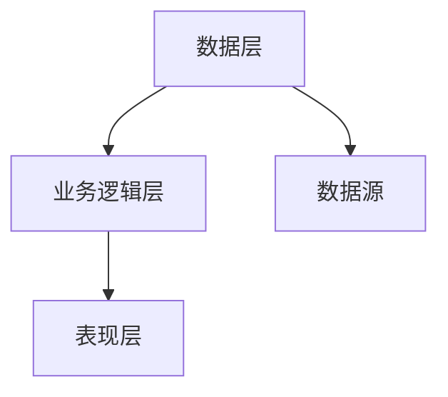
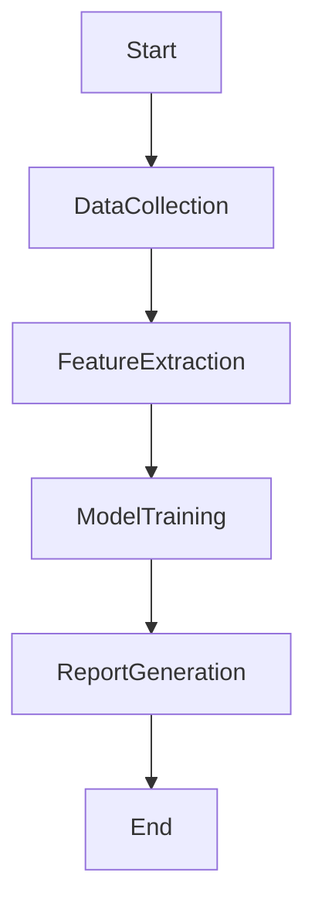

                 


# 巴菲特的创新能力评估：颠覆性技术的识别与投资

## 关键词：巴菲特，创新能力，颠覆性技术，投资决策，技术评估，市场潜力

## 摘要：  
本文深入探讨了巴菲特创新能力评估的理论与实践，重点分析了如何识别颠覆性技术及其在投资决策中的应用。通过详细讲解核心概念、算法原理和系统设计，本文为投资者提供了科学的评估方法和实际案例分析，帮助他们在技术投资中做出明智决策。

---

## 第1章：背景介绍

### 1.1 创新能力评估的背景与意义

#### 1.1.1 创新能力评估的背景
在现代投资领域，技术的创新性和颠覆性已成为决定投资价值的关键因素。巴菲特的长期成功部分归功于他对创新企业的精准判断。随着技术进步加速，识别颠覆性技术变得尤为重要。

#### 1.1.2 创新能力评估的意义
创新能力评估是衡量企业未来增长潜力的核心指标。通过评估技术的创新性和市场适应性，投资者可以更准确地预测企业的长期表现，从而做出更明智的投资决策。

#### 1.1.3 巴菲特投资理念中的创新能力评估
巴菲特注重企业核心竞争力，而创新能力是核心竞争力的关键。本文将探讨如何通过创新评估识别具有长期增长潜力的企业。

### 1.2 颠覆性技术的定义与特征

#### 1.2.1 颠覆性技术的定义
颠覆性技术是指能够从根本上改变市场格局的技术，通常以更低的成本提供更好的产品或服务，从而取代现有技术。

#### 1.2.2 颠覆性技术的特征
- 技术创新性：采用新技术或新方法。
- 成本优势：通常以更低的成本实现更好的效果。
- 市场潜力：能够开拓新市场或扩大现有市场。

#### 1.2.3 颠覆性技术与传统技术的对比
| 特性             | 颠覆性技术           | 传统技术             |
|------------------|----------------------|----------------------|
| 技术来源         | 创新驱动             | 渐进式改进             |
| 市场影响         | 根本性改变             | 局部优化             |
| 竞争优势         | 降低成本，提升效率     | 提升性能或功能         |

### 1.3 创新能力评估的核心要素

#### 1.3.1 技术创新性
评估技术是否采用了新颖的方法或技术，具有显著的技术突破。

#### 1.3.2 市场适应性
评估技术是否能够满足市场需求，解决实际问题，并具有市场可行性。

#### 1.3.3 可持续性
评估技术是否具备长期发展潜力，能否持续创新并保持竞争优势。

### 1.4 本章小结
本章介绍了创新能力评估的背景、意义以及颠覆性技术的定义和特征，为后续分析奠定了基础。

---

## 第2章：核心概念与联系

### 2.1 创新能力评估的原理与方法

#### 2.1.1 创新能力评估的原理
创新能力评估基于技术的创新性和市场适应性，通过定性和定量分析，评估技术的潜力和投资价值。

#### 2.1.2 创新能力评估的理论基础
- 技术生命周期理论：技术从引入到成熟再到衰退的阶段分析。
- 市场需求理论：技术能否满足当前市场的需求。

#### 2.1.3 创新能力评估的模型与框架
模型框架包括技术创新性评估、市场适应性评估和可持续性评估三个维度。

### 2.2 颠覆性技术识别的核心要素

#### 2.2.1 技术成熟度
评估技术的成熟阶段，确保其具备商业化潜力。

#### 2.2.2 市场潜力
分析技术在市场中的应用前景和潜在收益。

#### 2.2.3 技术的颠覆性特征
评估技术是否具有根本性改变市场的潜力。

### 2.3 创新能力评估与投资决策的关系

#### 2.3.1 创新能力评估在投资决策中的作用
通过评估技术潜力，帮助投资者识别高增长企业，优化投资组合。

#### 2.3.2 投资决策中的关键因素
市场潜力、技术成熟度、竞争优势是投资决策的重要考量。

#### 2.3.3 创新能力评估对投资回报的影响
准确的创新能力评估能够降低投资风险，提高投资回报率。

### 2.4 本章小结
本章分析了创新能力评估的核心原理和关键要素，强调了颠覆性技术识别的重要性，并探讨了其在投资决策中的应用。

---

## 第3章：算法原理讲解

### 3.1 创新能力评估的算法概述

#### 3.1.1 算法的基本原理
基于机器学习的创新能力评估模型，通过特征提取和分类器训练，预测技术的颠覆性潜力。

#### 3.1.2 算法的主要特点
- 数据驱动：利用历史数据进行特征分析。
- 可扩展性：适用于不同规模和技术类型的数据。

### 3.2 算法实现的详细步骤

#### 3.2.1 数据预处理
- 数据清洗：处理缺失值和异常值。
- 特征提取：提取关键特征，如技术专利数量、市场增长率等。

#### 3.2.2 模型训练
- 特征工程：选择对结果影响较大的特征。
- 模型选择：采用随机森林或支持向量机进行分类。

#### 3.2.3 模型评估与优化
- 交叉验证：评估模型性能。
- 调参优化：提升模型准确率和召回率。

### 3.3 算法的数学模型与公式

#### 3.3.1 创新能力评估的数学模型
采用逻辑回归模型，公式为：
$$ P(y=1|x) = \frac{1}{1 + e^{-\beta x}} $$
其中，$\beta$ 是系数，$x$ 是特征向量。

#### 3.3.2 算法实现的伪代码
```python
def evaluate_innovation(data):
    # 数据预处理
    preprocess_data = preprocess(data)
    # 特征提取
    features = extract_features(preprocess_data)
    # 模型训练
    model = train_model(features)
    # 预测结果
    prediction = predict(model, features)
    return prediction
```

### 3.4 本章小结
本章详细讲解了创新能力评估的算法原理，包括数据预处理、模型训练和评估优化，并通过伪代码展示了实现步骤。

---

## 第4章：系统分析与架构设计方案

### 4.1 系统需求分析

#### 4.1.1 系统的目标与范围
构建一个基于机器学习的创新能力评估系统，帮助投资者识别颠覆性技术。

#### 4.1.2 系统的功能需求
- 数据采集：收集企业技术数据。
- 特征分析：提取关键特征。
- 模型评估：预测技术潜力。
- 报告生成：输出评估结果。

#### 4.1.3 系统的性能需求
- 处理速度：快速处理大量数据。
- 精度要求：确保预测准确性。

### 4.2 系统架构设计

#### 4.2.1 系统架构的选择
采用分层架构，包括数据层、业务逻辑层和表现层。

#### 4.2.2 系统架构的详细设计
使用Mermaid图展示系统架构：


### 4.3 系统功能设计

#### 4.3.1 系统功能模块划分
- 数据采集模块：收集企业数据。
- 特征分析模块：提取和分析特征。
- 模型评估模块：训练和评估模型。
- 报告生成模块：输出评估结果。

#### 4.3.2 功能模块的交互设计
使用Mermaid图展示功能交互：


### 4.4 本章小结
本章详细分析了系统的需求和架构，展示了各功能模块的交互设计，为后续实现提供了蓝图。

---

## 第5章：项目实战

### 5.1 环境安装与配置

#### 5.1.1 安装Python和相关库
安装Python 3.8及以上版本，安装Scikit-learn、Pandas、NumPy等库。

#### 5.1.2 数据源获取
获取企业技术数据，清洗并预处理。

### 5.2 系统核心实现

#### 5.2.1 数据预处理代码
```python
import pandas as pd
import numpy as np

data = pd.read_csv('technologies.csv')
data = data.dropna()
```

#### 5.2.2 模型训练代码
```python
from sklearn.ensemble import RandomForestClassifier
from sklearn.metrics import accuracy_score

model = RandomForestClassifier()
model.fit(X_train, y_train)
y_pred = model.predict(X_test)
print("Accuracy:", accuracy_score(y_test, y_pred))
```

### 5.3 实际案例分析

#### 5.3.1 案例选择
选择具有代表性的企业，分析其技术创新性和市场潜力。

#### 5.3.2 案例分析
通过模型预测，评估某技术的颠覆性潜力，并结合市场趋势做出投资建议。

### 5.4 项目总结
本项目通过实际案例展示了创新能力评估系统的实现，验证了模型的有效性和实用性。

---

## 第6章：总结与展望

### 6.1 最佳实践 tips
- 数据质量是模型性能的关键，确保数据清洗和特征选择。
- 结合市场分析和模型预测，提高评估准确性。

### 6.2 小结
本文系统探讨了巴菲特创新能力评估的理论与实践，通过算法和系统设计，提供了科学的评估方法。

### 6.3 注意事项
- 投资需谨慎，评估结果仅供参考。
- 定期更新模型，适应市场变化。

### 6.4 拓展阅读
推荐阅读相关书籍和论文，深入学习创新能力评估和机器学习技术。

---

## 作者：AI天才研究院  
禅与计算机程序设计艺术

