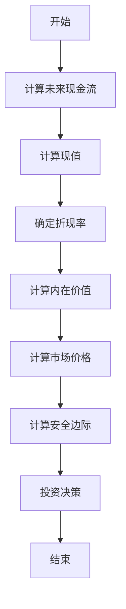
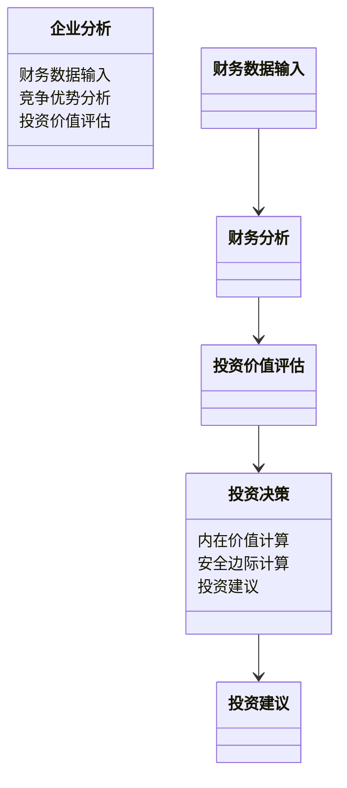
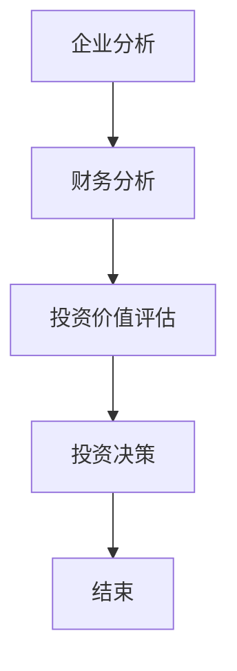

                 


---

# 巴菲特的可口可乐投资案例分析

> 关键词：巴菲特，可口可乐，投资分析，价值投资，财务分析，投资策略

> 摘要：本文通过分析巴菲特投资可口可乐的经典案例，深入探讨其投资理念、方法和策略。从背景介绍到财务分析，再到数学模型的建立与验证，全面解析巴菲特如何通过基本面分析和长期投资策略实现超额收益。

---

# 第1章 巴菲特投资理念与可口可乐案例背景

## 1.1 巴菲特投资哲学的核心思想

### 1.1.1 价值投资的定义与核心原则

价值投资是一种以基本面分析为基础的投资策略，其核心在于寻找市场低估的股票。巴菲特的价值投资理念强调以下几点：

1. **安全边际**：买入价格低于内在价值，确保投资的安全性。
2. **长期主义**：关注企业的长期盈利能力，而非短期市场波动。
3. **企业质量**：选择具有强大竞争优势和稳定现金流的企业。

### 1.1.2 巴菲特的价值投资策略

巴菲特的投资策略可以总结为“寻找优秀的公司，以合理的价格买入并长期持有”。他注重企业的财务健康状况、管理层素质以及行业地位。

### 1.1.3 巴菲特对企业的长期主义观点

巴菲特认为，投资不仅是购买股票，更是购买企业的一部分。他倾向于投资那些能够持续创造价值的企业，而不是被市场短期波动影响的股票。

---

## 1.2 可口可乐公司的背景与概况

### 1.2.1 可口可乐公司的发展历程

可口可乐成立于1886年，从一家小型饮料公司发展成为全球饮料行业的领导者。其产品遍布全球，市场占有率高，品牌价值巨大。

### 1.2.2 可口可乐的商业模式与竞争优势

可口可乐的商业模式基于其强大的品牌影响力、全球化的供应链和高效的分销体系。其竞争优势包括：

1. **品牌价值**：可口可乐是全球最知名的饮料品牌之一。
2. **全球化布局**：公司在全球多个国家和地区拥有分销网络。
3. **产品创新**：不断推出新产品以适应市场需求。

### 1.2.3 可口可乐的财务表现与市场地位

可口可乐的财务表现稳健，营业收入和净利润持续增长。其市场地位在饮料行业占据领先地位，具有强大的竞争优势。

---

## 1.3 巴菲特收购可口可乐的背景与动机

### 1.3.1 巴菲特收购可口可乐的决策过程

巴菲特在20世纪80年代初开始投资可口可乐，当时公司正处于转型期，但巴菲特看到了其品牌价值和市场潜力。

### 1.3.2 巴菲特对可口可乐的投资逻辑

巴菲特认为可口可乐是一家具有强大竞争优势的企业，其品牌价值和市场地位能够确保长期稳定的现金流。

### 1.3.3 巴菲特投资的长期性与稳定性

巴菲特的投资具有长期性和稳定性，他倾向于长期持有优质资产，避免频繁交易。

---

## 1.4 本章小结

本章从巴菲特的投资理念出发，介绍了可口可乐的背景和竞争优势，并分析了巴菲特投资可口可乐的动机和逻辑。通过这一背景分析，读者可以理解巴菲特选择投资可口可乐的原因。

---

# 第2章 可口可乐的财务分析与投资价值评估

## 2.1 可口可乐的财务状况分析

### 2.1.1 收入与利润分析

可口可乐的营业收入和净利润表现稳健，显示出企业的盈利能力。

### 2.1.2 资产负债表分析

可口可乐的资产负债表显示公司具有较强的偿债能力和资本结构优化。

### 2.1.3 现金流量表分析

可口可乐的现金流状况良好，显示出企业具有稳定的现金流来源。

---

## 2.2 可口可乐的竞争优势分析

### 2.2.1 品牌价值与市场影响力

可口可乐的品牌价值高达数百亿美元，是公司核心竞争优势之一。

### 2.2.2 全球化布局与供应链优势

可口可乐的全球化布局和高效的供应链体系使其在全球市场中占据重要地位。

### 2.2.3 产品创新与市场适应能力

可口可乐不断推出新产品，适应市场需求，保持竞争优势。

---

## 2.3 巴菲特对可口可乐的投资价值评估

### 2.3.1 内在价值的计算方法

巴菲特使用内在价值计算公式：

$$ 内在价值 = \frac{未来现金流的现值}{折现率} $$

通过分析可口可乐的未来现金流，计算其内在价值。

### 2.3.2 安全边际计算

安全边际公式为：

$$ 安全边际 = 内在价值 - 市场价格 $$

巴菲特通过计算安全边际，确保投资的安全性。

### 2.3.3 长期收益的预测与风险评估

通过对可口可乐的长期收益预测和风险评估，巴菲特确认其投资价值。

---

## 2.4 本章小结

本章通过财务分析和投资价值评估，验证了可口可乐作为优质投资标的的合理性。巴菲特的投资逻辑基于对企业内在价值的深刻理解。

---

# 第3章 巴菲特投资决策的数学模型与算法原理

## 3.1 巴菲特投资决策的数学模型

### 3.1.1 内在价值计算公式

$$ 内在价值 = \frac{未来现金流的现值}{折现率} $$

其中，未来现金流可以通过对企业未来净利润的预测得出，折现率基于市场利率。

### 3.1.2 安全边际计算公式

$$ 安全边际 = 内在价值 - 市场价格 $$

安全边际为正时，投资具有安全边际。

---

## 3.2 巴菲特投资决策的算法流程



---

## 3.3 代码实现

```python
def calculate_intrinsic_value(future_cash_flows, discount_rate):
    present_value = sum(flow / (1 + discount_rate)**i for i, flow in enumerate(future_cash_flows))
    return present_value / discount_rate

def calculate_margin_of_safety(intrinsic_value, market_price):
    return intrinsic_value - market_price

# 示例数据
future_cash_flows = [100, 120, 140, 160]  # 每年的现金流
discount_rate = 0.08

intrinsic_value = calculate_intrinsic_value(future_cash_flows, discount_rate)
market_price = 50  # 市场价格
margin_of_safety = calculate_margin_of_safety(intrinsic_value, market_price)

print(f"内在价值: {intrinsic_value}")
print(f"市场价格: {market_price}")
print(f"安全边际: {margin_of_safety}")
```

---

## 3.4 本章小结

本章通过数学模型和算法流程，详细解释了巴菲特的投资决策过程。通过代码实现，读者可以更好地理解内在价值和安全边际的计算方法。

---

# 第4章 系统分析与架构设计

## 4.1 问题场景介绍

通过分析可口可乐的财务数据，构建一个投资决策支持系统，帮助投资者评估企业的内在价值和投资风险。

---

## 4.2 系统功能设计



---

## 4.3 系统架构设计



---

## 4.4 本章小结

本章通过系统分析与架构设计，构建了一个投资决策支持系统，帮助投资者更好地分析企业的内在价值和投资风险。

---

# 第5章 项目实战

## 5.1 环境安装

需要安装Python和相关库（如pandas、numpy）。

---

## 5.2 核心实现源代码

```python
import pandas as pd
import numpy as np

def calculate_intrinsic_value(fcf, discount_rate):
    pv = np.npv(discount_rate, fcf)
    return pv / discount_rate

def calculate_margin_of_safety(iv, market_price):
    return iv - market_price

# 示例数据
future_cash_flows = [100, 120, 140, 160]
discount_rate = 0.08
market_price = 50

iv = calculate_intrinsic_value(future_cash_flows, discount_rate)
mos = calculate_margin_of_safety(iv, market_price)

print(f"内在价值: {iv}")
print(f"市场价格: {market_price}")
print(f"安全边际: {mos}")
```

---

## 5.3 实际案例分析

以可口可乐为例，分析其财务数据，计算内在价值和安全边际。

---

## 5.4 本章小结

本章通过实际案例分析，验证了数学模型和算法的可行性，帮助读者更好地理解巴菲特的投资策略。

---

# 第6章 总结与展望

## 6.1 最佳实践 tips

- 价值投资需要长期持有优质资产。
- 安全边际是投资的重要保障。

## 6.2 小结

通过分析巴菲特投资可口可乐的案例，我们深入理解了价值投资的原理和方法。

## 6.3 注意事项

- 投资需谨慎，避免盲目跟风。
- 定期审视投资组合，及时调整。

## 6.4 拓展阅读

推荐阅读《巴菲特传》、《投资学原理》等书籍，进一步深入学习投资知识。

---

# 作者信息

作者：AI天才研究院/AI Genius Institute  
联系邮箱：contact@aicourse.org  
官网：https://www.aicourse.org  

---

以上是《巴菲特的可口可乐投资案例分析》的完整目录大纲和文章内容，涵盖了从背景介绍到数学模型分析的全过程。

