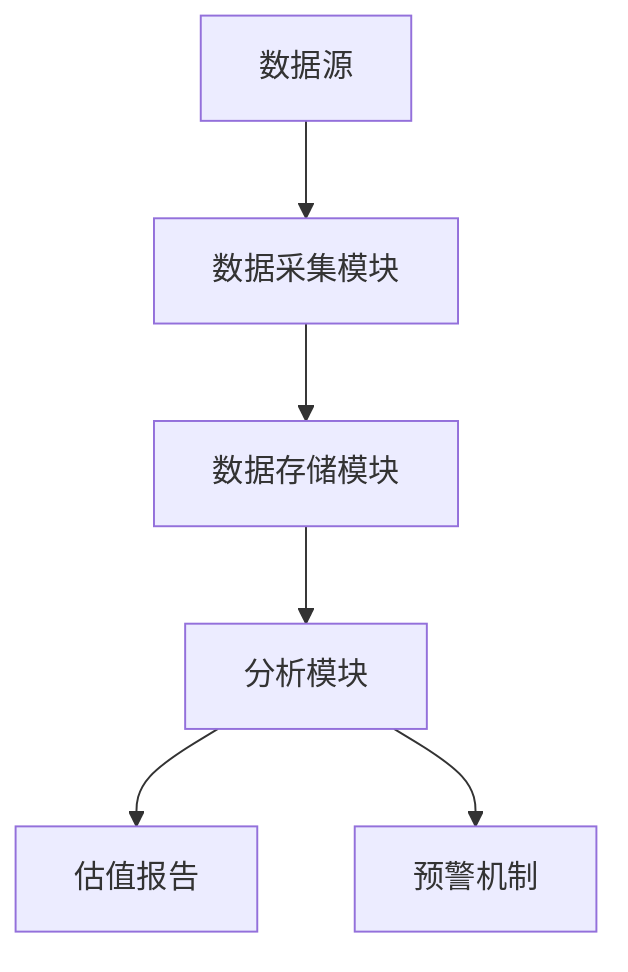

                 


# 巴菲特的周期性行业投资技巧：把握时机的艺术

---

## 关键词
- 巴菲特
- 周期性行业
- 投资技巧
- 时机选择
- 经济周期
- 供需分析

---

## 摘要
本文深入探讨了巴菲特在周期性行业投资中的独特技巧，重点分析了如何通过经济周期、供需关系和财务分析来把握投资时机。文章结合理论与实践，详细讲解了周期性行业的定义、特征、估值方法以及巴菲特的成功案例，为投资者提供了系统的投资策略和实战指导。

---

## 第一部分：周期性行业的定义与特点

### 第1章：周期性行业的定义与特点

#### 1.1 周期性行业的定义
- **周期性行业**：指收益和经济周期高度相关的行业，通常在经济繁荣时表现优异，在衰退时受到较大冲击。
- **行业分类**：常见的周期性行业包括能源、材料、工业和可选消费等。

#### 1.2 巴菲特的周期性行业投资策略
- **核心原则**：巴菲特认为周期性行业的投资机会在于其低估值和高利润率的阶段。
- **选股标准**：选择行业龙头，具有强大竞争优势和良好财务状况的企业。

#### 1.3 投资时机的选择
- **经济周期分析**：通过分析GDP增长率、失业率等指标，判断经济所处阶段。
- **市场情绪分析**：利用恐慌指数、市场波动率等指标，把握市场低估阶段。

---

## 第二部分：周期性行业的供需关系与价格波动

### 第2章：周期性行业的供需关系与价格波动

#### 2.1 供需关系对价格的影响
- **供需模型**：使用均衡价格模型（Equilibrium Price Model）分析供需变化对价格的影响。
  $$ P = f(Q_d, Q_s) $$
  其中，$P$ 是价格，$Q_d$ 是需求量，$Q_s$ 是供给量。

#### 2.2 周期性行业的价格波动模型
- **价格波动周期**：分为上升、峰值、下降和底部四个阶段。
- **数学模型**：使用移动平均线（MA）和相对强弱指数（RSI）预测价格走势。
  ```python
  import pandas as pd
  data = pd.read_csv('industry_data.csv')
  data['MA_20'] = data['Price'].rolling(20).mean()
  data['RSI'] = (data['Price'].diff().apply(lambda x: x if x > 0 else 0).rolling(14).sum() / data['Price'].rolling(14).count()) * 100
  ```

#### 2.3 巴菲特的供需分析方法
- **案例分析**：以能源行业为例，分析供需变化对价格的影响。
- **实战技巧**：关注行业龙头企业的市场份额和成本优势。

---

## 第三部分：周期性行业的财务分析与估值

### 第3章：周期性行业的财务分析与估值

#### 3.1 财务指标分析
- **关键指标**：ROE、净利率、资产负债率等。
  $$ ROE = \frac{\text{净利润}}{\text{股东权益}} $$

#### 3.2 估值方法
- **市盈率法**：适用于利润波动较小的行业。
- **市净率法**：适用于资产密集型行业。
  $$ P/E = \frac{\text{股价}}{\text{每股收益}} $$

#### 3.3 巴菲特的估值方法
- **安全边际**：买入价格低于内在价值20%的企业。
- **长期盈利能力**：关注企业的ROE和利润率。

---

## 第四部分：系统架构与项目实战

### 第4章：周期性行业投资系统的架构设计

#### 4.1 系统功能设计
- **数据采集**：获取行业数据和企业财务报表。
- **分析模块**：计算财务指标，生成估值报告。
- **预警机制**：设置价格波动和经济指标的预警阈值。

#### 4.2 系统架构图


#### 4.3 项目实战
- **环境安装**：安装Python和相关库（Pandas、Matplotlib）。
- **代码实现**：
  ```python
  import pandas as pd
  import matplotlib.pyplot as plt

  # 数据加载
  data = pd.read_csv('industry.csv')

  # 数据可视化
  plt.plot(data['Year'], data['Price'], label='行业价格')
  plt.xlabel('年份')
  plt.ylabel('价格')
  plt.legend()
  plt.show()
  ```

---

## 第五部分：总结与建议

### 5.1 总结
- 巴菲特的成功在于对经济周期的深刻理解、对供需关系的精准把握以及对财务指标的严格筛选。
- 投资周期性行业需要耐心等待低谷，果断出击底部。

### 5.2 建议
- **长期视角**：避免短期波动，关注企业长期价值。
- **风险管理**：设置止损点，分散投资组合。

### 5.3 注意事项
- 避免追涨杀跌，警惕市场泡沫。
- 定期复盘，调整投资策略。

### 5.4 拓展阅读
- 《巴菲特传》
- 《周期性行业的投资策略》

---

## 作者：AI天才研究院/AI Genius Institute & 禅与计算机程序设计艺术 /Zen And The Art of Computer Programming

---

这篇博客系统地介绍了巴菲特的周期性行业投资技巧，从理论到实践，帮助读者掌握如何在经济周期中把握投资时机，实现稳健收益。

