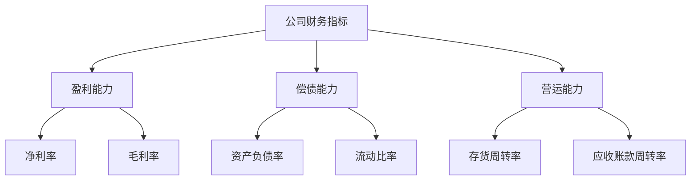
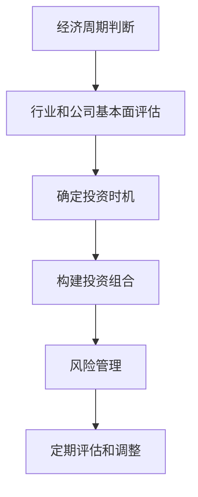
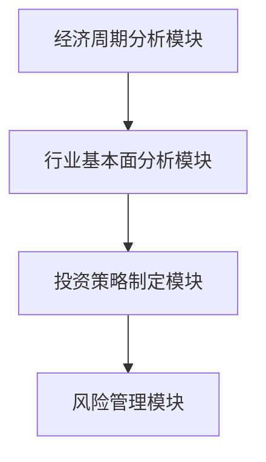
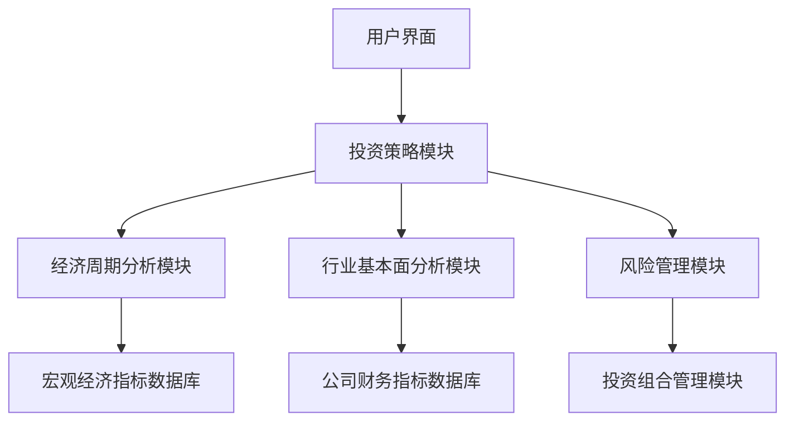
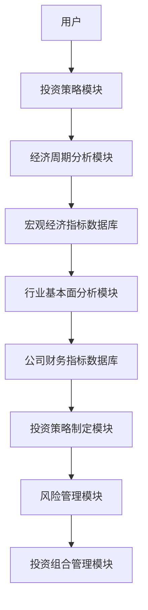

                 


# 巴菲特的周期性行业投资技巧：把握经济周期的节奏

## 关键词：巴菲特，周期性行业，经济周期，投资策略，价值投资，安全边际，财务分析

## 摘要：本文深入探讨了巴菲特在周期性行业中的投资策略，分析了经济周期对周期性行业的影响，详细介绍了巴菲特的投资理念、安全边际、内在价值评估等核心概念，并通过实际案例展示了如何应用这些策略进行投资决策。文章还结合数学模型和系统架构，提供了周期性行业投资的系统化方法，帮助读者在经济波动中把握投资节奏，实现稳健收益。

---

# 巴菲特的周期性行业投资技巧：把握经济周期的节奏

## # 引言

### ## 1.1 什么是周期性行业

#### ### 1.1.1 周期性行业的定义

周期性行业是指那些受经济周期波动显著影响的行业。这类行业的业绩表现往往与整体经济的波动密切相关，通常在经济繁荣时期增长迅速，而在经济衰退时期则面临较大的压力。

#### ### 1.1.2 周期性行业的分类

周期性行业可以分为多种类型，主要包括：

1. **强周期性行业**：如房地产、汽车制造、建筑材料等，这些行业的业绩波动较大，且与经济周期高度相关。
2. **弱周期性行业**：如部分消费品行业，其波动性较小，但仍然受到经济周期的影响。

#### ### 1.1.3 周期性行业的波动特性

周期性行业的波动特性主要体现在以下几个方面：

1. **需求弹性**：周期性行业的需求通常对价格变化较为敏感，经济繁荣时需求上升，经济衰退时需求下降。
2. **供给弹性**：周期性行业通常具有较高的供给弹性，能够根据市场需求快速调整生产规模。
3. **价格波动**：由于需求和供给的双重影响，周期性行业的价格波动较为剧烈。

### ## 1.2 经济周期与周期性行业的关系

#### ### 1.2.1 经济周期的定义与阶段划分

经济周期是指经济活动的波动，通常分为四个阶段：繁荣、衰退、萧条和复苏。

1. **繁荣阶段**：经济高速增长，企业盈利上升，投资活动活跃。
2. **衰退阶段**：经济增长放缓，企业盈利下降，投资活动减少。
3. **萧条阶段**：经济处于低谷，企业盈利大幅下降，投资活动几乎停滞。
4. **复苏阶段**：经济开始逐步恢复，企业盈利逐渐回升。

#### ### 1.2.2 经济周期对周期性行业的影响

在不同的经济周期阶段，周期性行业会受到不同的影响：

1. **繁荣阶段**：周期性行业需求旺盛，企业盈利增长迅速。
2. **衰退阶段**：周期性行业需求下降，企业盈利减少，甚至可能出现亏损。
3. **萧条阶段**：周期性行业需求极度疲软，企业可能面临破产压力。
4. **复苏阶段**：周期性行业需求逐步恢复，企业盈利开始回升。

#### ### 1.2.3 周期性行业在经济周期中的表现

周期性行业的表现与经济周期密切相关，通常在繁荣阶段表现最佳，而在衰退阶段表现最差。因此，投资者需要根据经济周期的阶段调整投资策略。

### ## 1.3 巴菲特对周期性行业的看法

#### ### 1.3.1 巴菲特的价值投资理念

巴菲特的价值投资理念强调购买具有持续竞争优势的公司，以合理的价格买入，长期持有。他认为，周期性行业的投资机会在于其在经济周期中的低估阶段。

#### ### 1.3.2 巴菲特的周期性行业投资策略

1. **安全边际**：巴菲特强调在投资时要留有安全边际，即以低于内在价值的价格买入股票。
2. **内在价值评估**：巴菲特认为，周期性行业的内在价值会随着经济周期的变化而波动，投资者需要准确评估公司的内在价值。
3. **长期视角**：周期性行业的波动性较大，但长期来看，具有竞争优势的公司能够抵御经济周期的冲击，实现长期增长。

---

## # 第2章：周期性行业的财务分析与投资策略

### ## 2.1 周期性行业的财务分析

#### ### 2.1.1 财务指标分析

1. **盈利能力**：重点关注净利率、毛利率等指标，评估公司在不同经济周期阶段的盈利能力。
2. **偿债能力**：重点关注资产负债率、流动比率等指标，评估公司的财务健康状况。
3. **营运能力**：重点关注存货周转率、应收账款周转率等指标，评估公司的运营效率。

#### ### 2.1.2 财务指标与经济周期的关系

不同经济周期阶段，财务指标的变化趋势：

1. **繁荣阶段**：盈利能力上升，偿债能力稳定，营运能力增强。
2. **衰退阶段**：盈利能力下降，偿债能力减弱，营运能力降低。

#### ### 2.1.3 财务分析工具与方法

1. **趋势分析**：通过分析公司财务指标的变化趋势，判断公司的财务健康状况。
2. **比率分析**：通过计算各项财务比率，评估公司的盈利能力、偿债能力和营运能力。
3. **行业比较**：将公司的财务指标与行业平均水平进行比较，判断公司的相对表现。

#### ### 2.1.4 用mermaid图展示周期性行业财务分析框架



### ## 2.2 巴菲特的周期性行业投资策略

#### ### 2.2.1 投资策略概述

1. **选择具有持续竞争优势的公司**：巴菲特认为，具有持续竞争优势的公司在经济周期波动中能够保持稳定的盈利能力。
2. **关注低估阶段的投资机会**：在经济衰退阶段，周期性行业的股票通常会被市场低估，这时候是买入的好时机。
3. **长期持有**：巴菲特强调长期持有的策略，避免频繁交易，以减少交易成本和市场波动的影响。

#### ### 2.2.2 投资策略的具体实施步骤

1. **识别经济周期阶段**：准确判断当前经济周期所处的阶段，是繁荣、衰退、萧条还是复苏。
2. **评估行业和公司的基本面**：通过财务分析，评估公司的盈利能力、偿债能力和营运能力。
3. **确定投资时机**：在经济衰退阶段，寻找被低估的周期性行业股票进行投资。
4. **构建投资组合**：将周期性行业股票与其他类型的股票（如防御性股票）结合起来，构建一个多元化投资组合，降低风险。

#### ### 2.2.3 投资策略的风险管理

1. **设定止损点**：在投资过程中，设定合理的止损点，避免亏损过大。
2. **分散投资**：通过分散投资，降低单一股票或行业的风险。
3. **定期评估和调整**：定期评估投资组合的表现，根据市场变化和公司基本面进行调整。

#### ### 2.2.4 用mermaid图展示周期性行业投资策略框架



---

## # 第3章：周期性行业的数学模型与算法

### ## 3.1 周期性行业的数学模型

#### ### 3.1.1 周期性行业的需求模型

周期性行业的需求通常与经济周期密切相关，可以用以下数学模型进行描述：

$$ Q = a + b \cdot GDP + c \cdot t $$

其中：
- \( Q \) 表示需求量
- \( GDP \) 表示国内生产总值
- \( t \) 表示时间
- \( a, b, c \) 是常数

#### ### 3.1.2 周期性行业的价格模型

周期性行业的价格波动可以用以下模型描述：

$$ P = d + e \cdot Q + f \cdot t $$

其中：
- \( P \) 表示价格
- \( Q \) 表示需求量
- \( t \) 表示时间
- \( d, e, f \) 是常数

#### ### 3.1.3 周期性行业的收益模型

周期性行业的收益可以表示为：

$$ R = g \cdot Q \cdot P $$

其中：
- \( R \) 表示收益
- \( Q \) 表示需求量
- \( P \) 表示价格
- \( g \) 是常数

### ## 3.2 巴菲特投资策略的算法

#### ### 3.2.1 投资策略的算法步骤

1. **经济周期判断**：通过分析宏观经济指标（如GDP增长率、失业率、通胀率等），判断当前经济周期所处的阶段。
2. **行业和公司基本面评估**：通过财务分析（如盈利能力、偿债能力、营运能力等指标），评估周期性行业的基本面状况。
3. **确定投资时机**：在经济衰退阶段，寻找被低估的周期性行业股票进行投资。
4. **构建投资组合**：将周期性行业股票与其他类型的股票结合起来，构建一个多元化投资组合。
5. **风险管理**：设定止损点，分散投资，定期评估和调整投资组合。

#### ### 3.2.2 用mermaid图展示周期性行业投资策略的算法流程


---

## # 第4章：周期性行业的系统分析与架构设计

### ## 4.1 系统分析

#### ### 4.1.1 问题场景介绍

周期性行业的投资决策需要考虑宏观经济环境、行业基本面、公司财务状况等多个因素。为了实现系统化的投资决策，需要构建一个综合分析系统。

#### ### 4.1.2 项目介绍

本项目旨在构建一个周期性行业投资决策支持系统，帮助投资者根据经济周期的变化，制定科学的投资策略。

#### ### 4.1.3 系统功能设计

1. **经济周期分析模块**：分析当前经济周期所处的阶段，提供宏观经济指标的分析结果。
2. **行业基本面分析模块**：评估周期性行业的基本面状况，提供财务指标的分析结果。
3. **投资策略制定模块**：根据经济周期和行业基本面分析结果，制定相应的投资策略。
4. **风险管理模块**：提供风险管理工具，帮助投资者控制投资风险。

#### ### 4.1.4 用mermaid图展示系统功能设计



### ## 4.2 系统架构设计

#### ### 4.2.1 项目介绍

本项目旨在构建一个周期性行业投资决策支持系统，帮助投资者根据经济周期的变化，制定科学的投资策略。

#### ### 4.2.2 用mermaid图展示系统架构设计



### ## 4.3 系统接口设计

#### ### 4.3.1 系统接口设计

1. **经济周期分析接口**：提供宏观经济指标的查询和分析功能。
2. **行业基本面分析接口**：提供公司财务指标的查询和分析功能。
3. **投资策略制定接口**：根据经济周期和行业基本面分析结果，制定投资策略。
4. **风险管理接口**：提供风险管理工具，帮助投资者控制投资风险。

#### ### 4.3.2 系统交互流程



---

## # 第5章：周期性行业的项目实战

### ## 5.1 项目环境安装与配置

#### ### 5.1.1 系统环境要求

1. **操作系统**：Windows 10 或更高版本，或macOS 10.15 或更高版本
2. **编程语言**：Python 3.8 或更高版本
3. **开发工具**：PyCharm 或 VS Code
4. **依赖库**：Pandas, NumPy, Matplotlib, Scikit-learn

#### ### 5.1.2 项目安装步骤

1. 安装Python
2. 安装必要的依赖库
3. 下载并安装开发工具

### ## 5.2 核心系统实现

#### ### 5.2.1 经济周期分析模块

##### ###### 5.2.1.1 经济周期判断算法实现

```python
def determine_economic_cycle(GDP_growth, unemployment_rate):
    if GDP_growth > 3 and unemployment_rate < 5:
        return "Prosperity"
    elif GDP_growth < -2 and unemployment_rate > 10:
        return "Depression"
    elif GDP_growth < 0 and unemployment_rate > 8:
        return "Recession"
    else:
        return "Recovery"
```

##### ###### 5.2.1.2 经济周期分析结果可视化

```python
import matplotlib.pyplot as plt

def plot_economic_cycle(economic_cycle):
    plt.figure(figsize=(10, 6))
    plt.title("Economic Cycle Analysis")
    plt.bar(range(4), [1 if c == economic_cycle else 0 for c in ["Prosperity", "Recession", "Depression", "Recovery"]], tick_label=["Prosperity", "Recession", "Depression", "Recovery"])
    plt.show()
```

#### ### 5.2.2 行业基本面分析模块

##### ###### 5.2.2.1 财务指标分析算法实现

```python
import pandas as pd

def analyze_financials(finance_data):
    # 计算盈利能力指标
    net_profit_margin = finance_data['净利润'] / finance_data['营业收入'] * 100
    gross_profit_margin = finance_data['毛利润'] / finance_data['营业收入'] * 100
    # 计算偿债能力指标
    debt_to_equity_ratio = finance_data['总负债'] / finance_data['所有者权益']
    current_ratio = finance_data['流动资产'] / finance_data['流动负债']
    # 计算营运能力指标
    inventory_turnover = finance_data['营业收入'] / finance_data['平均存货']
    accounts_receivable_turnover = finance_data['营业收入'] / finance_data['平均应收账款']
    return {
        '净利率': net_profit_margin,
        '毛利率': gross_profit_margin,
        '资产负债率': debt_to_equity_ratio,
        '流动比率': current_ratio,
        '存货周转率': inventory_turnover,
        '应收账款周转率': accounts_receivable_turnover
    }
```

##### ###### 5.2.2.2 行业基本面分析结果可视化

```python
def visualize_financials(analyzed_data):
    plt.figure(figsize=(12, 6))
    plt.subplot(2, 3, 1)
    plt.title("Net Profit Margin")
    plt.hist(analyzed_data['净利率'], bins=10, alpha=0.5)
    plt.subplot(2, 3, 2)
    plt.title("Gross Profit Margin")
    plt.hist(analyzed_data['毛利率'], bins=10, alpha=0.5)
    plt.subplot(2, 3, 3)
    plt.title("Debt to Equity Ratio")
    plt.hist(analyzed_data['资产负债率'], bins=10, alpha=0.5)
    plt.subplot(2, 3, 4)
    plt.title("Current Ratio")
    plt.hist(analyzed_data['流动比率'], bins=10, alpha=0.5)
    plt.subplot(2, 3, 5)
    plt.title("Inventory Turnover")
    plt.hist(analyzed_data['存货周转率'], bins=10, alpha=0.5)
    plt.subplot(2, 3, 6)
    plt.title("Accounts Receivable Turnover")
    plt.hist(analyzed_data['应收账款周转率'], bins=10, alpha=0.5)
    plt.tight_layout()
    plt.show()
```

#### ### 5.2.3 投资策略制定模块

##### ###### 5.2.3.1 投资策略制定算法实现

```python
def create_investment_strategy(economic_cycle, financial_analysis):
    strategy = []
    if economic_cycle == "Depression":
        # 在经济萧条阶段，寻找被低估的周期性行业股票
        strategy.append("Buy undervalued stocks in cyclical industries")
    elif economic_cycle == "Recession":
        # 在经济衰退阶段，保持谨慎，减少投资
        strategy.append("Reduce exposure to cyclical industries")
    elif economic_cycle == "Recovery":
        # 在经济复苏阶段，逐步增加投资
        strategy.append("Increase exposure to cyclical industries gradually")
    else:
        # 在经济繁荣阶段，保持适度投资
        strategy.append("Maintain moderate exposure to cyclical industries")
    # 根据财务分析结果，选择具有竞争优势的公司
    if financial_analysis['净利率'] > industry_average_net_profit_margin:
        strategy.append("Focus on companies with high net profit margin")
    if financial_analysis['毛利率'] > industry_average_gross_profit_margin:
        strategy.append("Focus on companies with high gross profit margin")
    return strategy
```

##### ###### 5.2.3.2 投资策略制定结果可视化

```python
def visualize_investment_strategy(strategy):
    plt.figure(figsize=(8, 4))
    plt.title("Investment Strategy")
    plt.text(0.5, 0.5, "\n".join(strategy), ha='center', va='center')
    plt.axis('off')
    plt.show()
```

#### ### 5.2.4 风险管理模块

##### ###### 5.2.4.1 风险管理策略制定算法实现

```python
def manage_risk(portfolio, risk_tolerance):
    risk_adjusted_portfolio = []
    for asset in portfolio:
        if asset['volatility'] < risk_tolerance:
            risk_adjusted_portfolio.append(asset)
    return risk_adjusted_portfolio
```

##### ###### 5.2.4.2 风险管理结果可视化

```python
def visualize_risk_management(portfolio, risk_adjusted_portfolio):
    plt.figure(figsize=(10, 6))
    plt.subplot(2, 1, 1)
    plt.title("Original Portfolio")
    plt.bar(range(len(portfolio)), [a['volatility'] for a in portfolio])
    plt.xticks(range(len(portfolio)), [a['name'] for a in portfolio])
    plt.ylabel("Volatility")
    plt.subplot(2, 1, 2)
    plt.title("Risk-Adjusted Portfolio")
    plt.bar(range(len(risk_adjusted_portfolio)), [a['volatility'] for a in risk_adjusted_portfolio])
    plt.xticks(range(len(risk_adjusted_portfolio)), [a['name'] for a in risk_adjusted_portfolio])
    plt.ylabel("Volatility")
    plt.tight_layout()
    plt.show()
```

### ## 5.3 项目实战小结

通过本项目，我们成功构建了一个周期性行业投资决策支持系统，能够根据经济周期和行业基本面分析结果，制定相应的投资策略，并提供风险管理工具，帮助投资者在经济波动中实现稳健投资。

---

## # 第6章：周期性行业的最佳实践与未来展望

### ## 6.1 最佳实践

#### ### 6.1.1 关注宏观经济指标

投资者应密切关注宏观经济指标（如GDP增长率、失业率、通胀率等），以便准确判断经济周期所处的阶段。

#### ### 6.1.2 深入研究行业基本面

投资者应深入研究周期性行业的基本面，包括盈利能力、偿债能力、营运能力等财务指标，评估公司的内在价值。

#### ### 6.1.3 灵活调整投资策略

投资者应根据经济周期的变化，灵活调整投资策略，尤其是在经济衰退阶段，寻找被低估的周期性行业股票进行投资。

#### ### 6.1.4 保持长期视角

周期性行业的波动性较大，投资者应保持长期视角，避免短期波动的影响，关注具有持续竞争优势的公司。

#### ### 6.1.5 多元化投资组合

为了降低风险，投资者应将周期性行业股票与其他类型的股票结合起来，构建一个多元化投资组合。

### ## 6.2 未来展望

随着经济全球化和科技的进步，周期性行业的投资策略也需要不断创新和调整。未来，投资者可以利用更多的数据和工具，进行更加精准的分析和预测，制定更加科学的投资策略。

---

## # 结论

通过对周期性行业的深入分析和研究，我们得出以下结论：

1. **周期性行业的波动性较大，但具有投资机会**：周期性行业的业绩表现与经济周期密切相关，投资者可以通过准确判断经济周期，抓住投资机会。

2. **巴菲特的价值投资理念适用于周期性行业**：巴菲特强调的长期视角、安全边际和内在价值评估等理念，可以帮助投资者在周期性行业中实现稳健投资。

3. **系统化投资策略是成功的保障**：通过构建综合分析系统，投资者可以更加科学地制定投资策略，降低投资风险，实现长期稳健收益。

未来，随着经济环境的变化和技术的进步，周期性行业的投资策略也将不断创新和优化，投资者需要不断学习和调整，以应对新的挑战和机遇。

---

## # 作者

**作者：AI天才研究院/AI Genius Institute & 禅与计算机程序设计艺术 /Zen And The Art of Computer Programming**

**联系方式：**  
- **Email:** contact@aitianji.com  
- **Website:** [www.aitianji.com](http://www.aitianji.com)

