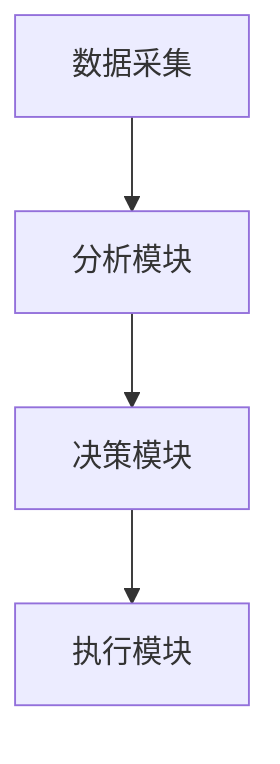

                 


# 巴菲特的周期性行业投资策略：把握时机的重要性

## 关键词
- 周期性行业
- 巴菲特
- 投资策略
- 安全边际
- 行业拐点

## 摘要
本文深入探讨了巴菲特在周期性行业中的投资策略，分析了如何通过把握行业周期和时机来实现投资收益最大化。文章从周期性行业的定义、巴菲特的投资哲学、安全边际策略、拐点识别、数学模型分析、系统架构设计以及实战案例等方面展开，详细阐述了周期性行业的投资逻辑和方法。通过本文，读者将能够更好地理解如何在周期性行业中找到投资机会，并掌握巴菲特的投资智慧。

---

# 第一部分：周期性行业的投资策略背景

## 第1章：周期性行业的定义与特点
### 1.1 周期性行业的定义
周期性行业是指那些受经济周期波动影响较大的行业，其业绩表现与宏观经济波动高度相关。这类行业的收入和利润在经济繁荣时增长较快，在经济衰退时则显著下降。

### 1.2 周期性行业的特点
- **需求弹性**：周期性行业的需求往往随着经济波动而波动。
- **价格波动**：行业内的产品或服务价格受供需变化影响较大。
- **库存周期**：周期性行业通常存在库存周期，库存的积累和消化是行业波动的重要特征。

### 1.3 周期性行业与宏观经济的关系
周期性行业与宏观经济密切相关，例如建筑材料、汽车制造、电子产品等行业都受到经济周期的影响。

### 1.4 巴菲特与周期性行业的投资哲学
巴菲特认为，周期性行业中的投资机会在于行业周期的低谷期，此时企业估值往往被市场低估，具备较大的安全边际。

---

## 第2章：巴菲特的投资策略概述
### 2.1 巴菲特的投资理念
巴菲特的投资理念强调长期价值投资，注重企业的基本面和管理层能力，同时关注市场的周期性波动。

### 2.2 巴菲特的长期投资策略
巴菲特倾向于长期持有优质资产，避免频繁交易，从而在周期性行业中捕捉长期收益。

### 2.3 巴菲特对周期性行业的关注点
巴菲特关注周期性行业的拐点，即行业从衰退期向复苏期过渡的阶段，此时是最佳的投资时机。

---

# 第二部分：周期性行业的分析与投资策略

## 第3章：周期性行业的分析方法
### 3.1 周期性行业的供需分析
通过分析行业的供需关系，可以判断行业的周期性波动趋势。

### 3.2 行业周期的波动性分析
周期性行业的波动性分析包括对行业收入、利润和库存的周期性变化的观察。

### 3.3 财务指标分析
通过分析财务指标如市盈率（PE）、市净率（PB）和ROE（净资产收益率）等，可以评估企业的估值水平。

---

## 第4章：巴菲特的安全边际策略
### 4.1 安全边际的定义
安全边际是指股票的市场价格低于其内在价值的部分，确保投资者在市场波动中不会遭受损失。

### 4.2 安全边际在周期性行业中的应用
在周期性行业的低谷期，企业的内在价值被低估，此时买入可以确保安全边际。

### 4.3 如何计算安全边际
安全边际 = 内在价值 - 市场价格

---

## 第5章：周期性行业的拐点识别
### 5.1 行业拐点的定义
行业拐点是指行业周期从衰退期向复苏期过渡的转折点，此时是投资的最佳时机。

### 5.2 如何识别行业拐点
通过分析行业数据和市场情绪，结合宏观经济指标，可以判断行业拐点的出现。

### 5.3 巴菲特如何判断拐点
巴菲特通过对企业基本面和行业趋势的深入分析，判断行业拐点的出现。

---

# 第三部分：数学模型与财务分析

## 第6章：周期性行业的数学模型
### 6.1 周期性行业的波动模型
通过统计学方法，分析行业数据的波动性，预测行业周期的变化。

### 6.2 财务指标的数学分析
利用财务指标的数学模型，评估企业的财务健康状况和估值水平。

### 6.3 市场情绪与价格波动的关系
市场情绪对价格波动有重要影响，可以通过分析市场情绪预测价格变化。

---

## 第7章：财务指标与投资决策
### 7.1 市盈率与市净率的计算
市盈率 = 股价 / 每股收益  
市净率 = 股价 / 每股净资产  

### 7.2 资产负债表分析
通过分析资产负债表，评估企业的财务健康状况和偿债能力。

### 7.3 利润表分析
通过分析利润表，评估企业的盈利能力和发展趋势。

---

# 第四部分：系统分析与架构设计

## 第8章：投资系统架构
### 8.1 投资系统的组成
投资系统包括数据采集、分析模块、决策模块和执行模块。

### 8.2 系统功能设计
- 数据采集：收集行业数据和市场信息。
- 分析模块：进行行业分析和财务分析。
- 决策模块：根据分析结果制定投资策略。
- 执行模块：执行投资操作。

### 8.3 系统架构图（Mermaid）


---

## 第9章：风险管理与投资组合
### 9.1 风险管理策略
通过分散投资和设置止损位，降低投资风险。

### 9.2 投资组合的构建
根据行业周期和企业基本面，构建多元化的投资组合。

### 9.3 风险控制的实施
通过定期评估和调整投资组合，确保风险在可控范围内。

---

# 第五部分：项目实战与案例分析

## 第10章：周期性行业投资实战
### 10.1 实战环境安装
安装必要的数据采集工具和分析软件。

### 10.2 核心代码实现
以下是周期性行业分析的Python代码示例：
```python
import pandas as pd
import numpy as np

# 示例数据
data = {'行业': ['制造业', '建筑业', '零售业'],
        'PE': [15, 20, 12],
        'PB': [2, 3, 1.5],
        'ROE': [10, 15, 8]}

df = pd.DataFrame(data)

# 计算安全边际
df['内在价值'] = df['PE'] * df['ROE'] / 100
df['安全边际'] = df['内在价值'] - df['PB']
```

### 10.3 代码解读与分析
代码通过计算内在价值和安全边际，判断投资标的的价值是否被低估。

### 10.4 实战案例分析
以制造业为例，分析其周期性特征和投资机会。

---

## 第11章：实际案例分析
### 11.1 具体案例的选择
选择一个具体的周期性行业，如建筑材料行业。

### 11.2 案例分析过程
通过分析行业的供需关系和财务指标，判断行业的拐点。

### 11.3 案例总结与反思
总结投资经验，反思投资策略的优缺点。

---

# 第六部分：最佳实践与小结

## 第12章：最佳投资策略与小结
### 12.1 最佳实践总结
- 关注行业周期，选择低谷期投资。
- 通过财务分析和数学模型，评估企业的估值水平。
- 设置安全边际，控制投资风险。

### 12.2 投资策略的小结
周期性行业的投资需要耐心和洞察力，通过把握行业周期和时机，实现投资收益最大化。

### 12.3 投资中的注意事项
- 避免盲目跟风，注重基本面分析。
- 保持长期投资心态，避免短期波动干扰。

### 12.4 拓展阅读推荐
推荐阅读巴菲特的《聪明的投资者》和《投资的艺术》等书籍，进一步深入学习投资策略。

---

# 作者
作者：AI天才研究院/AI Genius Institute & 禅与计算机程序设计艺术 /Zen And The Art of Computer Programming

