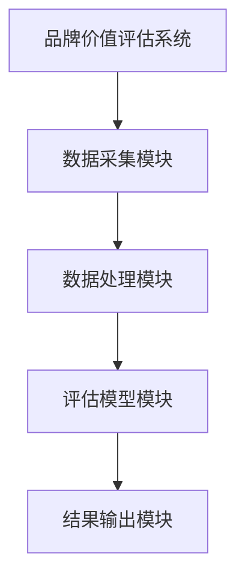

                 


# 巴菲特的品牌价值投资理念

> 关键词：巴菲特，品牌价值，投资理念，价值投资，企业分析

> 摘要：本文深入探讨了巴菲特的品牌价值投资理念，分析了品牌价值在投资中的重要性，结合实际案例和数学模型，详细讲解了品牌价值的评估方法和投资策略。通过系统设计和项目实战，帮助读者掌握如何运用品牌价值进行投资决策。

---

## 第一部分: 投资的基础知识

### 第1章: 投资的基本概念

#### 1.1 什么是投资

**1.1.1 投资的定义与分类**

投资是指将资金投入到某个项目或资产中，以期获得未来收益的行为。投资可以分为以下几类：

- **实物投资**：如房地产、基础设施等。
- **金融投资**：如股票、债券、基金等。
- **股权投资**：通过购买企业的股份成为股东。

**1.1.2 投资的基本原则**

- **分散投资**：避免将所有资金投入到单一项目中。
- **长期投资**：注重资产的长期增值。
- **价值投资**：寻找具有潜在价值的低估资产。

**1.1.3 投资的目标与风险**

- **目标**：实现财富增值。
- **风险**：投资可能面临市场波动、经济周期变化等风险。

---

### 第2章: 巴菲特的价值投资理念

#### 2.1 巴菲特投资理念的核心

**2.1.1 价值投资的定义**

价值投资是一种以低于内在价值的价格购买优质资产的投资策略。巴菲特认为，投资的核心在于找到具有持续竞争优势和良好管理的公司。

**2.1.2 巴菲特的价值投资策略**

- **长期持有**：巴菲持长期持有优质资产，不因短期波动而改变策略。
- **寻找护城河**：选择具有竞争优势，能够抵御竞争的企业。
- **关注管理层**：管理层的诚信和能力是企业成功的关键。

**2.1.3 巴菲特的投资哲学**

- **安全边际**：以低于内在价值的价格买入资产，确保有足够的安全空间。
- **简化投资**：专注于自己理解的少数投资机会。

---

### 第3章: 品牌价值在投资中的重要性

#### 3.1 品牌价值的定义

**3.1.1 品牌的定义**

品牌是企业在市场中提供的产品或服务的标识，代表企业的形象和声誉。

**3.1.2 品牌价值的构成要素**

- **品牌知名度**：品牌在市场中的认知度。
- **品牌忠诚度**：客户对品牌的忠诚程度。
- **品牌声誉**：品牌在消费者中的信任度。
- **品牌强度**：品牌的市场地位和竞争优势。

**3.1.3 品牌价值与企业价值的关系**

品牌价值是企业整体价值的重要组成部分，尤其是在服务行业，品牌价值可能占企业总价值的很大比例。

---

#### 3.2 品牌价值的评估方法

**3.2.1 品牌价值的定量评估**

- **收益法**：通过预测未来现金流，评估品牌为企业带来的收益。
- **市场法**：通过比较同类企业的品牌价值进行评估。
- **成本法**：评估品牌建设的成本，但这种方法在实际中较少使用。

**3.2.2 品牌价值的定性评估**

- **品牌强度指标**：评估品牌的市场地位和竞争优势。
- **品牌忠诚度指标**：通过消费者调研评估品牌忠诚度。
- **品牌声誉指标**：通过媒体和公众的评价评估品牌声誉。

---

### 第4章: 巴菲特对品牌价值的分析方法

#### 4.1 巴菲特的品牌价值分析框架

**4.1.1 品牌的市场地位**

- **市场领导者**：品牌在市场中占据领先地位。
- **竞争优势**：品牌是否具有独特的优势，如技术、成本或营销。

**4.1.2 品牌的盈利能力**

- **净利润率**：品牌为企业带来的净利润占收入的比例。
- **ROE（净资产收益率）**：衡量企业资产使用效率的重要指标。

**4.1.3 品牌的持续性与稳定性**

- **持续盈利能力**：品牌是否能够在长期保持盈利能力。
- **管理团队**：管理层的稳定性和能力对品牌价值的影响。

#### 4.2 巴菲特的品牌价值评估模型

**4.2.1 品牌价值的公式**

$$ \text{品牌价值} = \text{净利润} \times \text{品牌价值倍数} $$

其中，品牌价值倍数可以根据行业平均值或特定公司的历史数据确定。

---

### 第5章: 品牌价值投资的实战案例

#### 5.1 巴菲特的经典投资案例

**5.1.1 可口可乐案例**

可口可乐拥有强大的品牌价值和市场地位，巴菲持长期持有该股票，获得了丰厚的回报。

**5.1.2 伯克希尔哈撒韦案例**

伯克希尔哈撒韦作为巴菲特的投资公司，长期持有具有强大品牌价值的企业，如苹果和 Kraft Heinz。

---

## 第二部分: 品牌价值评估的数学模型与系统设计

### 第6章: 品牌价值的数学模型与公式

#### 6.1 品牌价值的数学模型

$$ \text{品牌价值} = \beta \times R_f + \alpha \times \text{市场地位} + \gamma \times \text{盈利} $$

其中，$\beta$ 是市场风险溢价，$R_f$ 是无风险利率，$\alpha$ 和 $\gamma$ 是市场地位和盈利的权重系数。

---

### 第7章: 品牌价值评估系统的设计与实现

#### 7.1 系统架构设计



#### 7.2 系统功能设计

- **数据采集模块**：收集企业的财务数据、市场地位数据等。
- **数据处理模块**：对数据进行清洗和预处理。
- **评估模型模块**：应用数学模型计算品牌价值。
- **结果输出模块**：生成品牌价值评估报告。

---

### 第8章: 项目实战与代码实现

#### 8.1 环境安装

- **Python**：安装Python 3.8以上版本。
- **库的安装**：安装numpy、pandas、scikit-learn等库。

#### 8.2 核心代码实现

```python
import numpy as np
import pandas as pd

def calculate_brand_value(revenue, net_profit_margin, market_share):
    brand_value = revenue * net_profit_margin * market_share
    return brand_value

# 示例数据
revenue = 100000000  # 收入
net_profit_margin = 0.15  # 净利润率
market_share = 0.3  # 市场占有率

# 计算品牌价值
brand_value = calculate_brand_value(revenue, net_profit_margin, market_share)
print(f"品牌价值为：{brand_value}")
```

#### 8.3 实际案例分析

以可口可乐为例，假设其收入为 $10$ 亿美元，净利润率为 $15\%$，市场占有率为 $30\%$，则其品牌价值为：

$$ \text{品牌价值} = 100,000,000 \times 0.15 \times 0.3 = 45,000,000 \text{美元} $$

---

### 第9章: 最佳实践与总结

#### 9.1 小结

品牌价值是企业投资的重要因素，巴菲持长期关注具有强大品牌价值的企业，投资者应结合定量和定性分析，选择具有持续竞争优势和良好管理的公司。

#### 9.2 注意事项

- **数据准确性**：确保输入数据的准确性和完整性。
- **模型选择**：根据具体情况选择合适的评估模型。
- **风险控制**：分散投资，避免过度集中。

#### 9.3 拓展阅读

- 巴菲特的《投资的艺术》
- 品牌价值评估的相关学术论文

---

## 作者

作者：AI天才研究院 & 禅与计算机程序设计艺术

---

通过以上内容，读者可以系统地了解巴菲特的品牌价值投资理念，并掌握实际的评估方法和系统设计。

