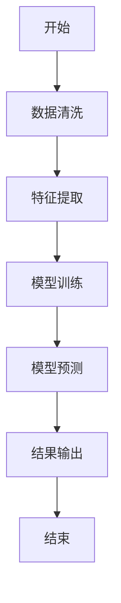
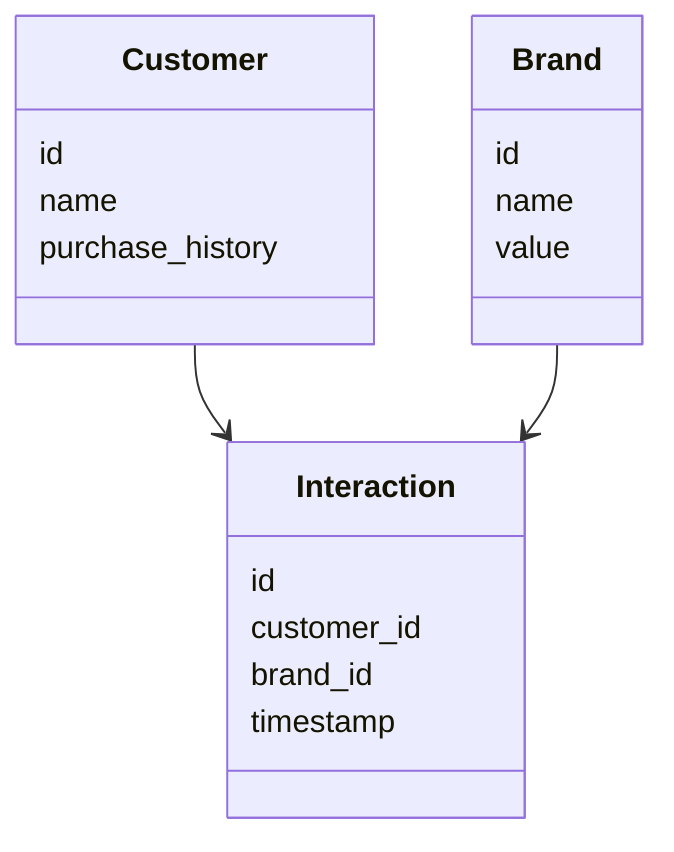
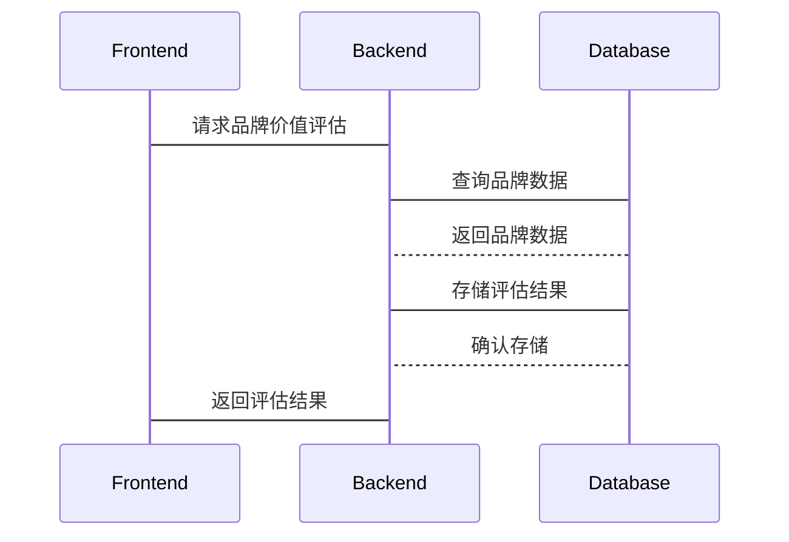

                 


```markdown
# 巴菲特的品牌价值评估更新：数字化时代的品牌资产

> 关键词：品牌价值评估，巴菲特，数字化，品牌资产，投资理念，数据驱动

> 摘要：在数字化时代，品牌价值评估的体系和方法正在发生根本性的变化。本文将结合巴菲特的投资理念，探讨如何在数字化时代重新评估品牌资产。通过分析品牌资产的核心概念、算法原理、系统架构设计、项目实战和最佳实践，本文旨在为读者提供一个全面的视角，理解数字化时代品牌价值评估的新趋势和新方法。

---

## 第一部分：品牌价值评估的背景与演变

### 第1章：品牌价值评估的背景

#### 1.1 品牌价值评估的传统方法
- 1.1.1 品牌价值的传统定义与评估指标
- 1.1.2 品牌资产评估的历史演变
- 1.1.3 传统品牌评估的局限性

#### 1.2 数字化时代的品牌资产新特征
- 1.2.1 数字化品牌资产的核心要素
- 1.2.2 品牌资产在数字化转型中的变化
- 1.2.3 数据驱动的品牌价值评估

#### 1.3 巴菲特投资理念与品牌价值评估
- 1.3.1 巴菲特的品牌投资哲学
- 1.3.2 长期主义与品牌价值的关系
- 1.3.3 巴菲特视角下的品牌评估框架

---

## 第二部分：品牌资产的核心概念与联系

### 第2章：品牌资产的核心要素

#### 2.1 品牌资产的核心要素
- 2.1.1 品牌认知
- 2.1.2 品牌忠诚度
- 2.1.3 品牌联想

#### 2.2 数字化时代品牌资产的特征对比
- 2.2.1 传统品牌资产与数字化品牌资产的对比
- 2.2.2 数据驱动的品牌资产特征
- 2.2.3 用户行为数据在品牌评估中的作用

#### 2.3 品牌资产的ER实体关系图
```mermaid
erDiagram
    customer[顾客] {
        <属性>
        id : 整数
        name : 字符串
        age : 整数
        purchase_history : 整数数组
    }
    brand[品牌] {
        <属性>
        id : 整数
        name : 字符串
        value : 浮点数
        market_position : 字符串
    }
    interaction[交互]

    customer --|{多次}-- interaction
    brand --|{多次}-- interaction
```

---

## 第三部分：品牌价值评估的算法原理

### 第3章：品牌价值评估的数学模型

#### 3.1 品牌价值评估的因子分析模型
- 3.1.1 因子分析模型的构建
- 3.1.2 品牌价值评估的公式推导

#### 3.2 数据驱动的品牌价值评估算法
- 3.2.1 数据清洗与预处理
- 3.2.2 基于机器学习的评估模型
- 3.2.3 算法实现步骤

#### 3.3 品牌价值评估算法的Mermaid流程图


#### 3.4 品牌价值评估算法的Python实现
```python
# 示例代码
import pandas as pd
from sklearn.decomposition import FactorAnalyzer

# 数据加载
data = pd.read_csv('brand_data.csv')

# 数据清洗
data.dropna(inplace=True)

# 特征提取
features = data[['feature1', 'feature2', 'feature3']]

# 模型训练
fa = FactorAnalyzer(n_factors=3, random_state=42)
fa.fit(features)

# 提取因子得分
factor_scores = pd.DataFrame(fa.components_, columns=['factor1', 'factor2', 'factor3'])

# 品牌价值评估
brand_value = factor_scores.mean(axis=1)
print(brand_value)
```

---

## 第四部分：系统分析与架构设计

### 第4章：系统架构设计

#### 4.1 问题场景介绍
- 4.1.1 问题背景
- 4.1.2 项目目标

#### 4.2 系统功能设计
- 4.2.1 领域模型Mermaid类图


- 4.2.2 系统架构设计Mermaid架构图


- 4.2.3 系统接口设计
- 4.2.4 系统交互Mermaid序列图


---

## 第五部分：项目实战

### 第5章：品牌价值评估系统实战

#### 5.1 环境安装与配置
- 5.1.1 安装Python和相关库
- 5.1.2 数据库安装与配置

#### 5.2 系统核心代码实现
- 5.2.1 数据清洗与特征提取
- 5.2.2 模型训练与预测
- 5.2.3 系统接口实现

#### 5.3 项目案例分析与解读
- 5.3.1 案例背景
- 5.3.2 数据分析与评估
- 5.3.3 评估结果解读

#### 5.4 项目小结
- 成功经验总结
- 可能的改进方向

---

## 第六部分：最佳实践与总结

### 第6章：最佳实践与未来展望

#### 6.1 评估中的常见问题与解决方案
- 数据质量问题
- 模型选择与调优
- 结果解释与应用

#### 6.2 数字化时代的品牌管理策略
- 数据驱动的品牌策略
- 用户体验与品牌价值的关系
- 数字化工具的应用

#### 6.3 未来的发展趋势
- AI在品牌价值评估中的应用
- 新兴技术对品牌管理的影响
- 可持续发展与品牌价值的关系

---

## 作者：AI天才研究院/AI Genius Institute & 禅与计算机程序设计艺术 /Zen And The Art of Computer Programming
```

