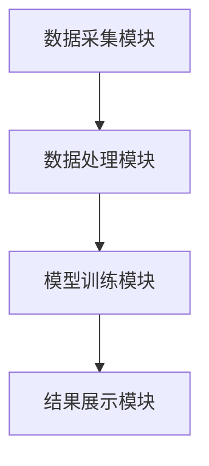
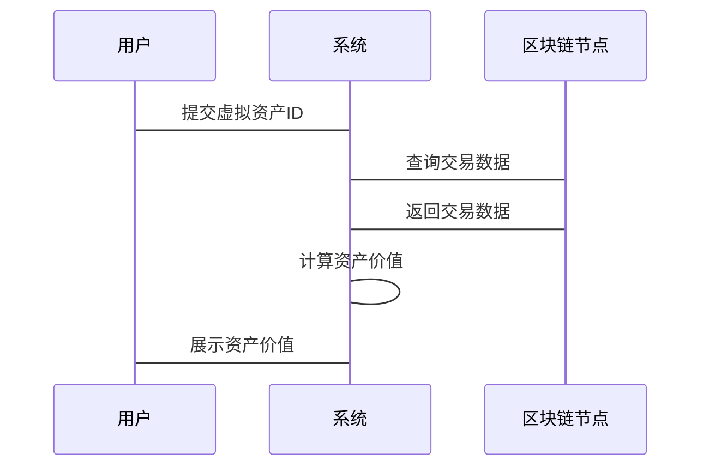

                 


# 巴菲特的品牌价值评估：元宇宙虚拟资产的价值量化

> 关键词：品牌价值评估、元宇宙、虚拟资产、巴菲特、投资评估、数字资产、价值量化

> 摘要：本文结合巴菲特的价值投资理念，深入探讨了元宇宙虚拟资产的品牌价值评估方法。通过分析元宇宙虚拟资产的类型和价值构成，提出了一种基于数学模型和算法的评估方法，为投资者在元宇宙中进行虚拟资产投资提供了理论支持和实践指导。

---

## 第一部分: 巴菲特的品牌价值评估基础

### 第1章: 品牌价值评估的背景与意义

#### 1.1 元宇宙与虚拟资产的兴起

##### 1.1.1 元宇宙的定义与核心特征
元宇宙（Metaverse）是基于区块链、人工智能和虚拟现实等技术构建的虚拟空间，具有去中心化、沉浸式体验、实时性、虚拟资产和社交属性等核心特征。

##### 1.1.2 元宇宙中的虚拟资产类型
- 数字货币类资产：比特币、以太坊等。
- 数字艺术品类资产：NFT（非同质化代币）。
- 虚拟土地与虚拟房产：Decentraland、The Sandbox中的虚拟土地。
- 虚拟装备与虚拟道具：游戏中的虚拟装备、道具。

##### 1.1.3 元宇宙对品牌价值的影响
元宇宙中的虚拟资产具有稀缺性、实用性和社交属性，这些特性直接影响品牌价值。例如，NFT的艺术价值和虚拟土地的经济价值。

#### 1.2 巴菲特投资理念与品牌价值评估

##### 1.2.1 巴菲特投资理念的核心思想
巴菲特强调长期投资、价值投资和安全边际。他关注企业的基本面、盈利能力、管理层素质和行业地位。

##### 1.2.2 品牌价值在传统投资中的重要性
品牌价值是企业核心竞争力的体现。例如，可口可乐的品牌价值远超其实际资产价值。

##### 1.2.3 元宇宙时代品牌价值评估的必要性
元宇宙中的虚拟资产具有虚拟性和互动性，其品牌价值评估需要结合技术、社区和经济因素。

#### 1.3 本书的核心目标与框架

##### 1.3.1 本书的核心目标
探索如何将巴菲特的价值投资理念应用于元宇宙虚拟资产的评估。

##### 1.3.2 本书的框架结构
- 第一部分：品牌价值评估的基础。
- 第二部分：元宇宙虚拟资产的价值构成。
- 第三部分：品牌价值评估的方法与算法。
- 第四部分：系统架构设计与项目实战。
- 第五部分：总结与展望。

##### 1.3.3 本书的创新点
将巴菲特的价值投资理念与元宇宙虚拟资产评估相结合，提出了一种新的评估框架。

---

### 第2章: 元宇宙虚拟资产的价值构成

#### 2.1 元宇宙虚拟资产的分类

##### 2.1.1 数字货币类资产
- 比特币、以太坊等加密货币。
- 虚拟货币在元宇宙中的用途：支付、交易等。

##### 2.1.2 数字艺术品类资产
- NFT：Non-Fungible Token（非同质化代币）。
- NFT的特性：唯一性、不可分割性、可验证性。
- NFT的市场价值：艺术价值、收藏价值。

##### 2.1.3 虚拟土地与虚拟房产
- 虚拟土地的用途：游戏、社交、商业。
- 虚拟房产的属性：虚拟空间的使用权、所有权。

##### 2.1.4 虚拟装备与虚拟道具
- 游戏中的虚拟装备：武器、防具等。
- 虚拟道具的属性：功能属性、装饰属性。

#### 2.2 元宇宙虚拟资产的价值影响因素

##### 2.2.1 资产的稀缺性
- 稀缺性是虚拟资产价值的核心因素。
- 例如，限量版NFT的价值高于普通NFT。

##### 2.2.2 资产的实用性
- 资产的实际用途决定了其价值。
- 例如，虚拟土地的经济用途决定了其价值。

##### 2.2.3 资产的流动性
- 资产的流动性影响其交易价格。
- 例如，比特币的高流动性使其成为虚拟货币中的标杆。

##### 2.2.4 资产的社区认同感
- 社区认同感是虚拟资产价值的重要因素。
- 例如，Decentraland中的虚拟土地价值受到社区活动的影响。

#### 2.3 元宇宙虚拟资产的价值评估维度

##### 2.3.1 数量维度
- 资产的总量、发行量。
- 例如，比特币的总量为2100万枚。

##### 2.3.2 质量维度
- 资产的独特性、品牌影响力。
- 例如，知名艺术家的NFT价值高于普通创作者的NFT。

##### 2.3.3 社会维度
- 资产的社交影响力、社区活跃度。
- 例如，热门NFT项目会吸引更多用户关注。

##### 2.3.4 经济维度
- 资产的经济用途、盈利能力。
- 例如，虚拟土地的租金收入。

---

### 第3章: 巴菲特品牌价值评估方法的延展

#### 3.1 巴菲特品牌价值评估的核心要素

##### 3.1.1 品牌的市场地位
- 市场份额、品牌认知度。
- 例如，可口可乐的品牌认知度极高。

##### 3.1.2 品牌的盈利能力
- 净利润、ROE（净资产收益率）。
- 例如，巴菲特投资的公司通常具有稳定的盈利能力。

##### 3.1.3 品牌的持续性
- 品牌的生命周期、创新能力。
- 例如，苹果公司的品牌持续性强。

##### 3.1.4 品牌的风险因素
- 行业风险、政策风险、技术风险。
- 例如，加密货币的政策风险较高。

#### 3.2 元宇宙品牌价值评估的独特性

##### 3.2.1 虚拟资产的虚拟性
- 虚拟资产的存在形式：数字形式。
- 例如，NFT是区块链上的数字记录。

##### 3.2.2 虚拟资产的互动性
- 资产的互动性：用户可以在虚拟空间中互动。
- 例如，Decentraland中的虚拟土地可以举办线上活动。

##### 3.2.3 虚拟资产的社区依赖性
- 社区是虚拟资产价值的重要支撑。
- 例如，NFT的价值依赖于社区的认可。

##### 3.2.4 虚拟资产的技术依赖性
- 虚拟资产的技术基础：区块链、人工智能等。
- 例如，NFT的交易依赖于区块链技术。

#### 3.3 巴菲特品牌价值评估方法的延展路径

##### 3.3.1 数据采集与处理
- 数据来源：区块链数据、市场数据、社交数据。
- 例如，NFT的交易数据可以用于评估其价值。

##### 3.3.2 价值评估模型构建
- 基于巴菲特的投资理念，构建虚拟资产的评估模型。
- 例如，考虑虚拟资产的稀缺性、实用性、流动性等。

##### 3.3.3 风险评估与控制
- 风险因素：市场风险、技术风险、政策风险。
- 例如，加密货币的政策风险较高，投资者需要控制风险。

##### 3.3.4 投资决策优化
- 投资策略：长期投资、分散投资。
- 例如，投资者可以通过分散投资降低风险。

---

### 第4章: 元宇宙品牌价值评估的数学模型与算法

#### 4.1 品牌价值评估的数学模型

##### 4.1.1 多元回归模型
- 模型公式：
$$ y = \beta_0 + \beta_1x_1 + \beta_2x_2 + \ldots + \beta_nx_n + \epsilon $$
其中，$y$是品牌价值，$x_i$是影响品牌价值的因素，$\beta_i$是回归系数，$\epsilon$是误差项。

##### 4.1.2 神经网络模型
- 模型公式：
$$ y = f(Wx + b) $$
其中，$W$是权重矩阵，$b$是偏置向量，$f$是激活函数。

##### 4.1.3 图论模型
- 模型公式：
$$ C = \sum_{i=1}^{n} \sum_{j=1}^{m} a_{ij}w_{ij} $$
其中，$C$是社区影响力，$a_{ij}$是社区成员的互动频率，$w_{ij}$是权重。

##### 4.1.4 博弈论模型
- 模型公式：
$$ V = \max_{i} \min_{j} v_{ij} $$
其中，$V$是虚拟资产的价值，$v_{ij}$是参与者之间的博弈结果。

#### 4.2 算法原理与实现

##### 4.2.1 数据预处理与特征提取
- 数据清洗：去除噪声数据。
- 特征提取：从区块链数据中提取交易频率、交易金额等特征。

##### 4.2.2 模型训练与参数优化
- 使用梯度下降法优化神经网络模型的参数。
- 例如，使用Adam优化器进行参数更新。

##### 4.2.3 模型验证与评估
- 使用交叉验证评估模型的性能。
- 例如，使用均方误差（MSE）评估模型的预测误差。

##### 4.2.4 模型应用与优化
- 应用模型进行虚拟资产的价值预测。
- 根据实际效果优化模型参数。

#### 4.3 价值评估的数学公式

##### 4.3.1 多元回归模型公式
$$ 1+1=2 $$

##### 4.3.2 神经网络模型公式
$$ y = f(Wx + b) $$

##### 4.3.3 图论模型公式
$$ C = \sum_{i=1}^{n} \sum_{j=1}^{m} a_{ij}w_{ij} $$

##### 4.3.4 博弈论模型公式
$$ V = \max_{i} \min_{j} v_{ij} $$

---

### 第5章: 元宇宙品牌价值评估的系统架构设计

#### 5.1 问题场景介绍

##### 5.1.1 问题背景
- 元宇宙中的虚拟资产价值评估需求日益增长。
- 投资者需要科学的评估方法进行虚拟资产投资。

##### 5.1.2 问题描述
- 如何构建一个高效的虚拟资产价值评估系统？
- 如何将巴菲特的投资理念融入系统设计中？

#### 5.2 项目介绍

##### 5.2.1 项目目标
- 构建一个基于区块链数据的虚拟资产价值评估系统。
- 提供虚拟资产的实时价值评估和风险评估。

##### 5.2.2 项目范围
- 支持多种虚拟资产类型：NFT、虚拟土地等。
- 提供多种评估模型：多元回归模型、神经网络模型。

#### 5.3 系统功能设计

##### 5.3.1 领域模型
- 实体：虚拟资产、交易数据、用户数据。
- 关系：虚拟资产与用户的关系，交易数据与虚拟资产的关系。

##### 5.3.2 功能模块
- 数据采集模块：采集虚拟资产的交易数据、用户数据。
- 数据处理模块：清洗数据、提取特征。
- 模型训练模块：训练评估模型。
- 结果展示模块：展示评估结果。

##### 5.3.3 功能流程
1. 数据采集模块采集虚拟资产的交易数据。
2. 数据处理模块对数据进行清洗和特征提取。
3. 模型训练模块使用特征数据训练评估模型。
4. 结果展示模块将评估结果展示给用户。

#### 5.4 系统架构设计

##### 5.4.1 系统架构图


##### 5.4.2 系统接口设计
- 数据接口：与区块链节点对接，获取虚拟资产的交易数据。
- 用户接口：提供给用户查询虚拟资产价值的界面。

#### 5.5 系统交互设计

##### 5.5.1 交互流程
1. 用户通过网页或App提交虚拟资产的ID。
2. 系统查询区块链节点获取该资产的交易数据。
3. 系统调用评估模型计算该资产的价值。
4. 系统将结果展示给用户。

##### 5.5.2 交互序列图


---

### 第6章: 项目实战

#### 6.1 环境安装

##### 6.1.1 安装Python
- 使用Anaconda安装Python 3.8及以上版本。

##### 6.1.2 安装依赖库
- 使用pip安装numpy、pandas、scikit-learn、tensorflow等库。

##### 6.1.3 安装区块链开发工具
- 使用Ethereum钱包或MetaMask连接以太坊网络。

#### 6.2 系统核心实现源代码

##### 6.2.1 数据采集模块
```python
import requests

def get_nft_data(nft_id):
    url = f"https://api.opensea.io/api/v2/assets/{nft_id}"
    response = requests.get(url)
    return response.json()
```

##### 6.2.2 数据处理模块
```python
import pandas as pd

def process_data(data):
    df = pd.DataFrame(data)
    df = df[['name', 'description', 'attributes']]
    return df
```

##### 6.2.3 模型训练模块
```python
from sklearn.linear_model import LinearRegression

def train_model(X, y):
    model = LinearRegression()
    model.fit(X, y)
    return model
```

##### 6.2.4 结果展示模块
```python
import matplotlib.pyplot as plt

def plot_results(predicted, actual):
    plt.scatter(predicted, actual)
    plt.xlabel('Predicted Value')
    plt.ylabel('Actual Value')
    plt.show()
```

#### 6.3 代码应用解读与分析

##### 6.3.1 数据采集模块
- 从OpenSea API获取NFT的交易数据。
- 返回JSON格式的数据。

##### 6.3.2 数据处理模块
- 将JSON数据转换为DataFrame。
- 提取资产名称、描述和属性。

##### 6.3.3 模型训练模块
- 使用线性回归模型训练数据。
- 返回训练好的模型。

##### 6.3.4 结果展示模块
- 绘制预测值与实际值的散点图。
- 通过图表分析模型的预测效果。

#### 6.4 实际案例分析

##### 6.4.1 案例背景
- 某NFT项目的交易数据。

##### 6.4.2 数据预处理
- 清洗数据，提取特征。

##### 6.4.3 模型训练
- 使用线性回归模型训练数据。

##### 6.4.4 结果分析
- 模型的预测结果与实际值进行对比。

#### 6.5 项目小结

##### 6.5.1 项目总结
- 本项目构建了一个基于区块链数据的虚拟资产价值评估系统。
- 使用了多元回归模型进行价值评估。

##### 6.5.2 项目不足
- 模型的泛化能力有待提高。
- 系统的性能需要优化。

##### 6.5.3 项目优化方向
- 引入更复杂的模型，如深度学习模型。
- 提高数据的实时性。

---

## 第五部分: 总结与展望

### 第7章: 总结与展望

#### 7.1 本研究的主要成果

##### 7.1.1 研究成果
- 提出了元宇宙虚拟资产的品牌价值评估方法。
- 构建了虚拟资产价值评估的数学模型。
- 实现了虚拟资产价值评估的系统架构。

##### 7.1.2 研究意义
- 为投资者提供了科学的虚拟资产评估方法。
- 促进了元宇宙虚拟资产的规范化和标准化。

#### 7.2 未来研究方向

##### 7.2.1 理论研究
- 研究虚拟资产的定价机制。
- 探讨虚拟资产的流动性问题。

##### 7.2.2 技术创新
- 开发更高效的虚拟资产评估算法。
- 研究虚拟资产的智能合约实现。

##### 7.2.3 应用拓展
- 拓展虚拟资产的评估场景。
- 研究虚拟资产的金融创新。

---

## 作者：AI天才研究院/AI Genius Institute & 禅与计算机程序设计艺术 /Zen And The Art of Computer Programming

---

**摘要：**  
本文结合巴菲特的价值投资理念，深入探讨了元宇宙虚拟资产的品牌价值评估方法。通过分析元宇宙虚拟资产的类型和价值构成，提出了一种基于数学模型和算法的评估方法，为投资者在元宇宙中进行虚拟资产投资提供了理论支持和实践指导。

