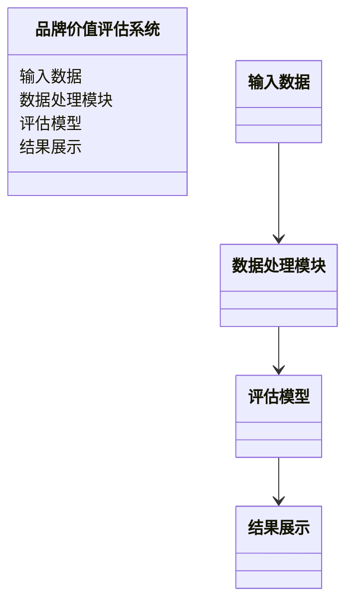
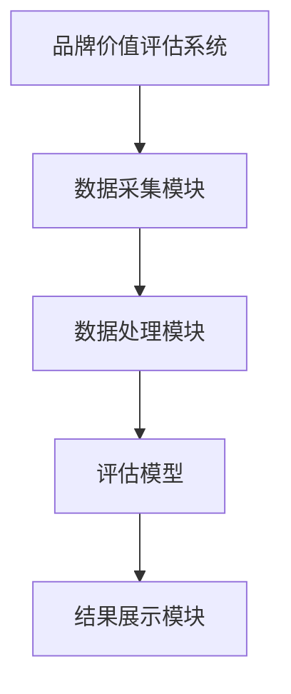
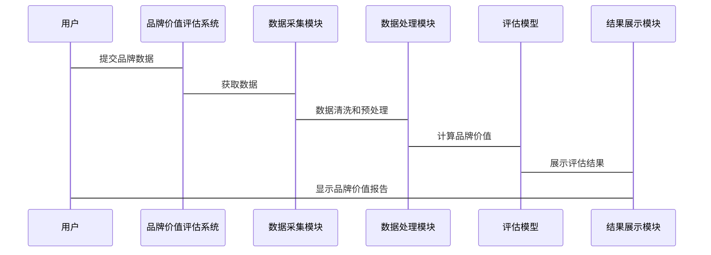

                 


# 巴菲特的品牌价值评估：无形资产如何创造超额回报

> 关键词：品牌价值评估，无形资产，巴菲特，超额回报，品牌价值模型，投资策略

> 摘要：本文从巴菲特的视角出发，详细探讨品牌价值评估的核心概念、数学模型、系统架构以及项目实战，分析如何通过品牌价值这一无形资产创造超额回报。文章内容涵盖品牌价值的背景介绍、核心概念、评估方法、数学模型、系统设计和项目实战等多个方面，旨在帮助读者全面理解品牌价值评估的原理和应用。

---

# 第一部分: 巴菲特的品牌价值评估基础

## 第1章: 品牌价值评估的背景与重要性

### 1.1 无形资产在企业价值中的作用

#### 1.1.1 无形资产的定义与分类

- 无形资产是指企业拥有或控制的，没有实物形态的长期资产，包括品牌、专利、商标、商誉等。
- 品牌是无形资产中最重要的组成部分之一，是企业市场竞争力的核心体现。

#### 1.1.2 无形资产对企业价值的影响

- 品牌价值直接影响企业的市场地位和盈利能力。
- 强大的品牌可以为企业带来溢价能力，从而提高产品或服务的售价。
- 无形资产的评估是企业价值的重要组成部分，尤其在并购交易中具有重要意义。

#### 1.1.3 巴菲特对无形资产的重视

- 巴菲特认为，品牌是企业长期竞争优势的核心，尤其是那些具有强大品牌影响力的企业。
- 通过品牌价值的评估，巴菲特能够识别出那些具有持续竞争优势的企业，从而实现超额回报。

### 1.2 品牌价值评估的必要性

#### 1.2.1 品牌价值对企业战略的意义

- 品牌价值是企业制定战略的重要依据。
- 通过品牌价值评估，企业可以识别自身的核心竞争力，并制定相应的市场策略。

#### 1.2.2 品牌价值与企业长期收益的关系

- 品牌价值的提升能够带来长期的收益增长。
- 品牌的忠诚度和认知度是企业长期盈利能力的重要保障。

#### 1.2.3 巴菲特投资策略中的品牌价值视角

- 巴菲特倾向于投资那些具有强大品牌价值和竞争优势的企业。
- 品牌价值的评估是巴菲特判断企业长期盈利能力的重要标准。

### 1.3 品牌价值评估的核心概念

#### 1.3.1 品牌价值的定义

- 品牌价值是指品牌在市场中所能带来的超额收益的总和。
- 品牌价值不仅包括当前的市场表现，还包括未来的盈利能力。

#### 1.3.2 品牌价值的构成要素

- 品牌知名度：品牌在市场中的认知程度。
- 品牌忠诚度：消费者对品牌的偏好程度。
- 品牌认知度：消费者对品牌产品的认知和记忆程度。

#### 1.3.3 品牌价值与企业财务表现的关系

- 品牌价值可以通过企业的财务数据进行评估，包括销售额、利润率、市场份额等。
- 品牌价值的提升能够直接反映在企业的财务表现中，尤其是净利润和股价表现。

### 1.4 品牌价值评估的边界与外延

#### 1.4.1 品牌价值评估的范围

- 品牌价值评估需要考虑品牌在不同市场和产品中的表现。
- 需要区分品牌价值与企业整体价值的关系。

#### 1.4.2 品牌价值与其他无形资产的区别

- 品牌价值与商誉的区别：品牌价值是商誉的重要组成部分，但商誉还包括其他因素。
- 品牌价值与专利、商标等的区别：品牌价值是整体市场表现的结果，而专利和商标是具体的法律权利。

#### 1.4.3 品牌价值评估的局限性

- 品牌价值的评估受到市场波动和主观判断的影响。
- 品牌价值的量化存在一定的难度，需要结合多种方法进行评估。

### 1.5 本章小结

本章主要介绍了品牌价值评估的背景与重要性，强调了品牌作为无形资产在企业价值中的核心地位。通过巴菲特的视角，我们认识到品牌价值不仅是企业市场竞争力的体现，也是投资决策的重要依据。品牌价值的评估需要结合多方面的因素，包括品牌知名度、忠诚度、市场地位等。

---

## 第2章: 巴菲特的品牌价值评估框架

### 2.1 品牌价值的核心要素

#### 2.1.1 品牌知名度

- 品牌知名度是品牌价值的重要指标之一。
- 通过市场调研和数据分析，可以量化品牌的知名度。

#### 2.1.2 品牌忠诚度

- 品牌忠诚度反映了消费者对品牌的偏好程度。
- 忠诚度高的品牌具有更强的市场竞争力和盈利能力。

#### 2.1.3 品牌认知度

- 品牌认知度是消费者对品牌产品的认知和记忆程度。
- 高认知度的品牌更容易吸引新客户并保持现有客户的忠诚度。

### 2.2 品牌价值的评估维度

#### 2.2.1 市场地位

- 市场地位是品牌价值的重要体现，包括市场份额和市场影响力。
- 市场地位可以通过竞争对手分析和市场份额数据进行评估。

#### 2.2.2 财务表现

- 财务表现是品牌价值的直接反映，包括销售额、利润率和净利润率。
- 通过财务数据，可以量化品牌的实际贡献。

#### 2.2.3 竞争优势

- 竞争优势是品牌价值的核心来源，包括成本优势、技术优势和品牌优势。
- 通过竞争优势的分析，可以识别品牌的长期盈利能力。

### 2.3 巴菲特的品牌价值评估框架

#### 2.3.1 品牌的经济价值

- 品牌的经济价值是品牌在市场中所能带来的超额收益。
- 通过财务数据分析，可以量化品牌的经济价值。

#### 2.3.2 品牌的市场地位

- 市场地位是品牌价值的重要组成部分，包括市场份额和市场影响力。
- 通过市场调研和竞争对手分析，可以评估品牌的市场地位。

#### 2.3.3 品牌的可持续性

- 品牌的可持续性反映了品牌在长期市场中的竞争力。
- 通过品牌战略和创新能力的分析，可以评估品牌的可持续性。

### 2.4 品牌价值与企业绩效的关系

#### 2.4.1 品牌价值对企业利润的影响

- 品牌价值的提升可以直接反映在企业的利润增长上。
- 强大的品牌可以带来更高的产品售价和更低的营销成本。

#### 2.4.2 品牌价值与股价的关系

- 品牌价值的提升能够直接推动股价的增长。
- 投资者倾向于投资那些具有强大品牌价值的企业。

#### 2.4.3 品牌价值的长期性

- 品牌价值是长期积累的结果，需要持续的品牌建设和市场推广。
- 品牌的长期性是企业可持续发展的重要保障。

### 2.5 本章小结

本章详细介绍了品牌价值的核心要素和评估维度，强调了品牌价值在企业绩效中的重要性。通过巴菲特的视角，我们认识到品牌价值不仅是企业市场竞争力的体现，也是投资决策的重要依据。品牌价值的评估需要结合市场地位、财务表现和竞争优势等多方面因素。

---

## 第3章: 品牌价值评估的数学模型与公式

### 3.1 品牌价值的定量评估方法

#### 3.1.1 品牌价值的公式表示

- 品牌价值的计算公式：
$$ \text{品牌价值} = \text{销售额} \times \text{品牌溢价率} \times \text{净利润率} $$

- 品牌溢价率是品牌产品相对于竞争对手的售价溢价比例。
- 净利润率反映了品牌对企业利润的贡献。

#### 3.1.2 品牌溢价率的计算

- 品牌溢价率的计算公式：
$$ \text{品牌溢价率} = \frac{\text{品牌产品的平均售价} - \text{同类产品的平均售价}}{\text{同类产品的平均售价}} \times 100\% $$

- 品牌溢价率反映了品牌在市场中的竞争力。

#### 3.1.3 净利润率的计算

- 净利润率的计算公式：
$$ \text{净利润率} = \frac{\text{净利润}}{\text{营业收入}} \times 100\% $$

- 净利润率反映了品牌对企业利润的贡献。

#### 3.1.4 品牌价值的实例计算

- 假设某品牌产品的销售额为1000万元，品牌溢价率为20%，净利润率为20%。
- 品牌价值计算：
$$ \text{品牌价值} = 1000 \times 0.2 \times 0.2 = 40 \text{万元} $$

---

## 第4章: 品牌价值评估的系统分析与架构设计

### 4.1 问题场景介绍

- 品牌价值评估系统需要解决的问题包括数据收集、模型计算和结果展示。
- 系统需要能够处理大量的市场数据，并提供直观的评估结果。

### 4.2 系统功能设计

#### 4.2.1 领域模型



#### 4.2.2 系统架构设计



#### 4.2.3 接口设计

- 数据采集模块接口：从数据库中获取品牌相关的数据，包括销售额、市场份额、品牌溢价率等。
- 数据处理模块接口：对数据进行清洗和预处理，确保数据的准确性和完整性。
- 评估模型接口：根据数据计算品牌价值，并返回结果。
- 结果展示模块接口：将评估结果以图表和报告的形式展示给用户。

#### 4.2.4 交互流程



---

## 第5章: 项目实战

### 5.1 环境安装

- 需要安装Python、Jupyter Notebook和相关数据处理库（如Pandas、NumPy、Matplotlib）。
- 安装命令：
  ```bash
  pip install numpy pandas matplotlib
  ```

### 5.2 核心代码实现

#### 5.2.1 数据处理代码

```python
import pandas as pd
import numpy as np

# 示例数据
data = {
    '品牌': ['A', 'B', 'C'],
    '销售额': [1000, 1500, 800],
    '品牌溢价率': [0.2, 0.15, 0.25],
    '净利润率': [0.2, 0.18, 0.22]
}

df = pd.DataFrame(data)

# 计算品牌价值
df['品牌价值'] = df['销售额'] * df['品牌溢价率'] * df['净利润率']

print(df)
```

#### 5.2.2 可视化代码

```python
import matplotlib.pyplot as plt

# 绘制品牌价值柱状图
plt.figure(figsize=(10, 6))
plt.bar(df['品牌'], df['品牌价值'], label='品牌价值')
plt.title('品牌价值评估结果')
plt.xlabel('品牌')
plt.ylabel('品牌价值（万元）')
plt.legend()
plt.show()
```

### 5.3 代码解读与分析

- 数据处理代码：首先导入必要的库，然后创建数据框，计算品牌价值并输出结果。
- 可视化代码：使用Matplotlib绘制品牌价值的柱状图，直观展示各品牌的价值。

### 5.4 实际案例分析

- 以可口可乐为例，计算其品牌价值：
  - 销售额：$1000$ 万元
  - 品牌溢价率：$0.3$
  - 净利润率：$0.25$
  - 品牌价值计算：
    $$ \text{品牌价值} = 1000 \times 0.3 \times 0.25 = 75 \text{万元} $$

### 5.5 项目小结

通过本章的项目实战，我们掌握了品牌价值评估系统的基本实现方法。通过数据处理和可视化，我们可以直观地看到各品牌的价值差异，从而为投资决策提供有力支持。

---

## 第6章: 结论与最佳实践

### 6.1 本章总结

- 品牌价值是企业核心竞争力的重要体现，也是投资决策的关键因素。
- 巴菲特通过品牌价值的评估，成功识别出具有长期竞争优势的企业，从而实现超额回报。

### 6.2 最佳实践 tips

- 在品牌价值评估中，数据的准确性和完整性至关重要。
- 建议结合定量和定性分析，全面评估品牌价值。
- 定期更新品牌价值评估，以应对市场环境的变化。

### 6.3 小结

通过本文的分析，我们认识到品牌价值评估不仅是企业战略的重要组成部分，也是投资决策的关键因素。希望本文能够为读者提供有价值的 insights，帮助他们在实际工作中更好地应用品牌价值评估的方法。

### 6.4 注意事项

- 品牌价值的评估需要结合企业的实际情况，避免一刀切。
- 在实际操作中，建议结合行业特点和企业具体情况，调整评估模型和方法。

### 6.5 拓展阅读

- 建议进一步阅读巴菲特的《巴菲特投资指南》。
- 参考相关品牌价值评估的经典文献和案例分析。

---

# 作者：AI天才研究院 & 禅与计算机程序设计艺术

---

通过以上结构，我们可以看到，品牌价值评估不仅是企业战略的重要组成部分，也是投资决策的关键因素。巴菲特通过品牌价值的评估，成功识别出具有长期竞争优势的企业，从而实现超额回报。希望本文能够为读者提供有价值的 insights，帮助他们在实际工作中更好地应用品牌价值评估的方法。

