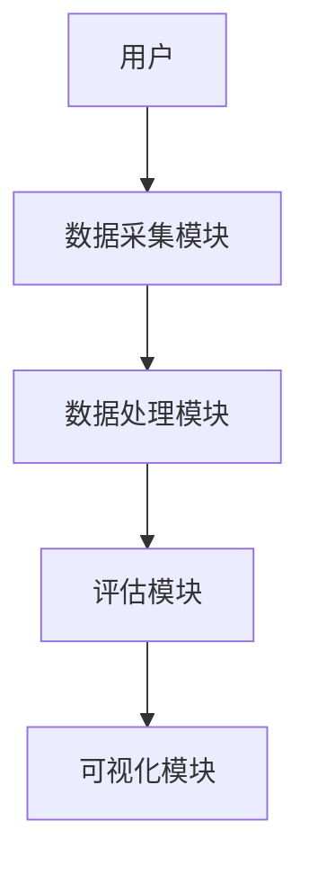

                 

# 巴菲特的品牌价值评估：社交媒体影响力的量化

> 关键词：品牌价值评估、社交媒体影响力、巴菲特、量化分析、数据驱动决策、社交媒体数据、品牌价值模型

> 摘要：本文详细探讨了如何通过社交媒体影响力来量化评估巴菲特的品牌价值。文章首先介绍了品牌价值的传统评估方法及其局限性，然后分析了社交媒体影响力在品牌价值评估中的重要性。接着，文章详细阐述了品牌价值与社交媒体影响力的核心概念及其相互关系，并通过具体的算法和数学模型展示了如何将社交媒体数据转化为可量化的品牌价值指标。最后，文章结合实际案例，展示了如何通过系统设计和项目实战来实现品牌价值的量化评估，并总结了最佳实践和未来研究方向。

---

## 第1章: 巴菲特的品牌价值评估与社交媒体影响力

### 1.1 品牌价值的传统评估方法

#### 1.1.1 品牌价值的定义与传统评估指标
品牌价值是衡量一个品牌在市场上的综合价值的重要指标。传统的品牌价值评估方法主要包括以下几种：
- **品牌知名度**：衡量品牌在目标市场中的认知程度。
- **品牌忠诚度**：衡量消费者对品牌的忠诚程度。
- **品牌认知度**：衡量消费者对品牌的理解和记忆程度。

#### 1.1.2 传统品牌价值评估的局限性
传统品牌价值评估方法主要依赖于市场调研和消费者调查，存在以下局限性：
- 数据采集成本高，耗时长。
- 数据样本有限，可能导致评估结果偏差。
- 无法实时捕捉品牌在市场上的动态变化。

#### 1.1.3 社交媒体对品牌价值的影响
社交媒体的兴起为品牌价值评估提供了新的数据来源。通过社交媒体数据，可以实时捕捉品牌在消费者中的影响力和口碑传播效果。

---

### 1.2 社交媒体影响力的定义与量化

#### 1.2.1 社交媒体影响力的定义
社交媒体影响力是指品牌在社交媒体平台上所获得的关注度和互动能力。它通常通过以下指标来衡量：
- **粉丝数量**：品牌在社交媒体上的关注者数量。
- **互动频率**：粉丝与品牌之间的互动次数，如点赞、评论、分享等。
- **内容传播广度**：品牌内容在社交媒体上的传播范围。

#### 1.2.2 社交媒体影响力量化的重要性
通过量化社交媒体影响力，可以更准确地评估品牌在市场上的表现，同时为企业制定精准的营销策略提供数据支持。

#### 1.2.3 社交媒体影响力与品牌价值的关系
社交媒体影响力是品牌价值的重要组成部分。通过分析社交媒体数据，可以更全面地评估品牌价值，尤其是在数字化时代，社交媒体影响力已成为品牌价值评估不可或缺的因素。

---

### 1.3 巴菲特品牌价值评估的核心要素

#### 1.3.1 巴菲特品牌的核心价值
巴菲特作为投资界的传奇人物，其品牌价值主要体现在以下几个方面：
- **投资理念**：巴菲特的价值投资理念在全球范围内具有广泛的影响力。
- **个人声誉**：巴菲特作为投资大师的个人声誉为其品牌价值提供了强大的支撑。
- **投资业绩**：巴菲特长期的投资业绩是其品牌价值的重要体现。

#### 1.3.2 社交媒体在巴菲特品牌价值评估中的作用
社交媒体为评估巴菲特的品牌价值提供了新的数据来源。通过分析巴菲特在社交媒体上的互动数据，可以更全面地了解其品牌影响力。

#### 1.3.3 巴菲特品牌价值评估的边界与外延
在评估巴菲特的品牌价值时，需要明确其边界与外延。边界主要指评估的范围和时间跨度，外延则包括品牌在不同市场和文化背景下的表现。

---

## 第2章: 品牌价值与社交媒体影响力的核心概念

### 2.1 品牌价值的核心要素

#### 2.1.1 品牌知名度
品牌知名度是品牌在目标市场中的认知程度。通过社交媒体数据分析，可以实时监测品牌知名度的变化。

#### 2.1.2 品牌忠诚度
品牌忠诚度是消费者对品牌的忠诚程度。通过分析社交媒体上的用户评论和互动数据，可以评估品牌忠诚度。

#### 2.1.3 品牌认知度
品牌认知度是消费者对品牌的理解和记忆程度。社交媒体数据可以帮助企业了解消费者对品牌的认知程度。

---

### 2.2 社交媒体影响力的关键指标

#### 2.2.1 用户互动数据（点赞、评论、分享）
用户互动数据是衡量社交媒体影响力的重要指标。通过分析这些数据，可以评估品牌在社交媒体上的影响力。

#### 2.2.2 内容传播广度
内容传播广度是衡量品牌内容在社交媒体上扩散范围的重要指标。通过分析内容的传播路径，可以评估品牌内容的影响力。

#### 2.2.3 粉丝增长速度
粉丝增长速度是衡量品牌在社交媒体上吸引力的重要指标。快速的粉丝增长通常意味着品牌的影响力在不断提升。

---

## 第3章: 品牌价值与社交媒体影响力的量化方法

### 3.1 数据采集与预处理

#### 3.1.1 数据来源
社交媒体数据主要来源于以下几个方面：
- **社交媒体平台**：如Twitter、LinkedIn等。
- **品牌官网**：品牌官网上的用户评论和互动数据。
- **第三方数据平台**：如Google Analytics等。

#### 3.1.2 数据清洗
数据清洗是数据预处理的重要步骤，主要包括：
- 去除无效数据（如重复数据、噪声数据）。
- 处理缺失数据。

---

### 3.2 特征提取与模型构建

#### 3.2.1 特征提取
特征提取是将社交媒体数据转化为可量化的指标。常用特征包括：
- **用户互动频率**：如点赞、评论、分享的频率。
- **内容传播广度**：如转发次数、评论次数。

#### 3.2.2 模型选择
在品牌价值评估中，常用的模型包括：
- **回归模型**：用于预测品牌价值。
- **分类模型**：用于评估品牌影响力等级。

---

## 第4章: 数学模型与算法实现

### 4.1 品牌价值指数计算公式
品牌价值指数可以通过以下公式计算：
$$
\text{品牌价值指数} = w_1 \times \text{互动频率} + w_2 \times \text{内容传播广度} + w_3 \times \text{粉丝数量}
$$
其中，\( w_1, w_2, w_3 \) 是权重系数，表示各指标在品牌价值评估中的重要性。

---

## 第5章: 系统设计与项目实战

### 5.1 系统架构设计

#### 5.1.1 功能模块
系统主要功能模块包括：
- **数据采集模块**：负责采集社交媒体数据。
- **数据处理模块**：负责数据清洗和特征提取。
- **评估模块**：负责品牌价值评估。
- **可视化模块**：负责结果展示。

#### 5.1.2 系统架构图
以下是系统架构的Mermaid图：

---

## 第6章: 总结与展望

### 6.1 本章小结
通过社交媒体数据的量化分析，可以更全面地评估品牌价值。本文详细介绍了品牌价值与社交媒体影响力的核心概念、量化方法和系统设计，并通过实际案例展示了如何实现品牌价值的量化评估。

### 6.2 未来研究方向
未来的研究可以进一步探索以下方向：
- 如何结合自然语言处理技术，提升品牌价值评估的准确性。
- 如何利用实时数据流，实现品牌价值的动态评估。

---

## 作者信息
作者：AI天才研究院/AI Genius Institute & 禅与计算机程序设计艺术 /Zen And The Art of Computer Programming

---

这篇文章详细探讨了如何通过社交媒体影响力量化评估巴菲特的品牌价值，结合了技术、算法和实际案例，为读者提供了全面的视角。

