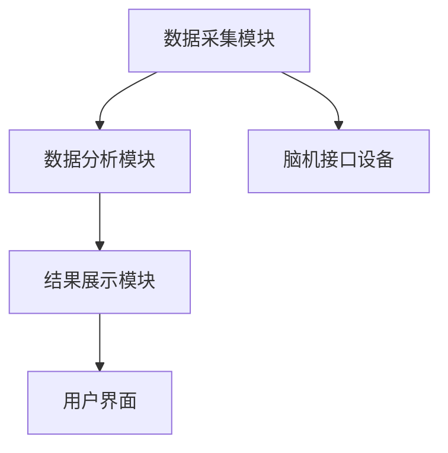

                 


# 巴菲特的品牌价值评估：脑机接口体验经济的量化模型

## 关键词：巴菲特、品牌价值、脑机接口、体验经济、量化模型

## 摘要：本文探讨了巴菲特品牌价值评估的创新方法，结合脑机接口技术在体验经济中的应用，构建了品牌价值的量化模型，并通过系统架构设计和项目实战展示了其实现与应用。

---

## 第一部分: 巴菲特的品牌价值评估基础

### 第1章: 巴菲特投资哲学与品牌价值

#### 1.1 巴菲特价值投资理念
巴菲特的价值投资理念强调长期稳健的投资策略，重视企业的内在价值和品牌忠诚度。品牌不仅是企业的资产，更是长期收益的重要来源。品牌价值的评估需要考虑企业的长期盈利能力、市场地位和客户忠诚度。

#### 1.2 脑机接口技术的背景与发展
脑机接口（BCI）技术是一种连接人类大脑与外部设备的桥梁，通过采集和分析大脑活动，实时反馈用户体验。随着神经科学和人工智能技术的发展，BCI在医疗、教育和娱乐等领域展现出广泛的应用潜力。特别是在体验经济时代，BCI技术为品牌价值评估提供了新的工具和方法。

---

### 第2章: 体验经济与品牌价值的关系

#### 2.1 体验经济的定义与特征
体验经济是以消费者体验为核心价值的经济形态，强调个性化和即时反馈。与传统的产品经济和服务经济不同，体验经济注重消费者在消费过程中的情感和认知体验，这使得品牌价值的评估更加依赖于用户体验数据。

#### 2.2 品牌价值的多维度评估
品牌价值的评估需要考虑多个维度，包括品牌知名度、品牌忠诚度、品牌认知度和品牌联想等。其中，品牌忠诚度和品牌联想与用户体验密切相关，而脑机接口技术能够实时捕捉消费者的认知和情感体验，为品牌价值的评估提供了更精准的数据支持。

---

## 第二部分: 脑机接口技术在品牌价值评估中的应用

### 第3章: 脑机接口技术的核心原理

#### 3.1 脑机接口的工作原理
脑机接口通过采集和分析大脑电信号，将其转化为可读的数据，用于控制外部设备或反馈用户体验。常用的采集方法包括EEG（脑电图）和fMRI（功能性磁共振成像），其中EEG因其非侵入性和实时性，在用户体验研究中更具优势。

#### 3.2 脑机接口在品牌体验测量中的应用
通过脑机接口技术，可以实时监测消费者在品牌互动中的神经活动，分析其情绪波动、注意力集中度和认知负荷。这些数据能够帮助企业更准确地评估品牌体验对消费者行为的影响。

---

### 第4章: 品牌价值评估的数学模型

#### 4.1 数学模型的基本框架
品牌价值评估模型将用户体验数据与传统品牌评估指标相结合，构建了一个多维度的量化模型。模型的核心公式如下：

$$ V = \sum_{i=1}^{n} w_i \cdot x_i $$

其中，\( V \) 表示品牌价值，\( w_i \) 表示第 \( i \) 个因素的权重，\( x_i \) 表示第 \( i \) 个因素的评分。

#### 4.2 体验经济中的品牌价值权重分配
在体验经济中，品牌体验的相关因素权重较高，例如情感体验、互动性和个性化体验。通过脑机接口技术采集的数据，可以动态调整这些权重，以反映消费者的真实体验。

---

### 第5章: 品牌价值评估系统的架构设计

#### 5.1 系统需求分析
系统旨在实时采集和分析用户体验数据，评估品牌价值。主要功能包括数据采集、数据分析和结果展示。

#### 5.2 系统功能设计
- 数据采集模块：通过脑机接口设备采集用户神经数据。
- 数据分析模块：利用机器学习算法分析数据，计算品牌价值。
- 结果展示模块：以可视化方式呈现评估结果，供企业决策参考。

#### 5.3 系统架构设计
系统采用模块化架构，各模块通过API接口进行通信。以下是系统的架构图：



---

## 第三部分: 项目实战与总结

### 第6章: 项目实战

#### 6.1 环境安装与配置
需要安装脑机接口设备、数据采集软件和数据分析工具。推荐使用Python和相关库（如numpy、pandas、scikit-learn）进行数据处理。

#### 6.2 核心代码实现
以下是品牌价值评估模型的核心代码示例：

```python
import numpy as np
from sklearn.linear_model import LinearRegression

# 用户体验数据
X = np.array([[4, 3, 5],  # 情感体验、互动性、个性化
              [2, 5, 4],
              [3, 4, 6]])

# 权重向量
weights = [0.4, 0.3, 0.3]

# 计算加权和
V = np.dot(X, weights)

# 品牌价值预测
model = LinearRegression()
model.fit(X.reshape(-1, 3), V)
print(model.predict(X))
```

#### 6.3 实际案例分析
通过一个具体案例，展示如何利用脑机接口技术和量化模型评估品牌价值，并根据结果调整品牌策略。

---

### 第7章: 总结与展望

#### 7.1 全文总结
本文提出了基于脑机接口技术的品牌价值评估方法，构建了数学模型，并设计了系统架构。通过项目实战验证了方法的有效性。

#### 7.2 未来展望
未来的研究可以进一步优化模型，探索更精确的用户体验测量方法，并扩展在不同行业的应用。

---

## 作者：AI天才研究院 & 禅与计算机程序设计艺术

---

这篇文章系统地介绍了如何利用脑机接口技术量化品牌价值，结合了巴菲特的价值投资理念和现代科技手段，为品牌评估提供了新的视角和方法。通过理论分析和实际案例，展示了该方法在体验经济中的应用前景。

