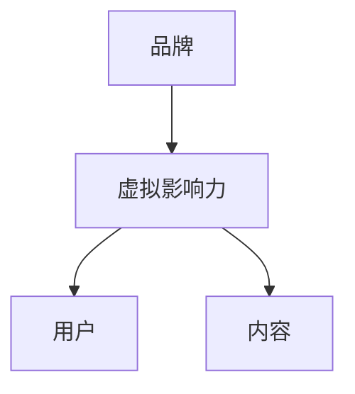
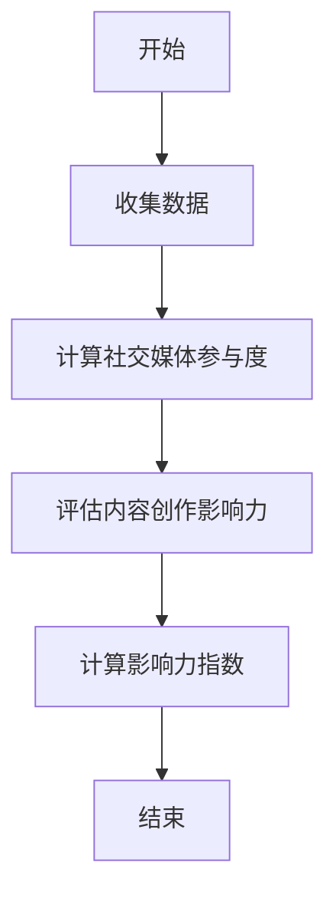
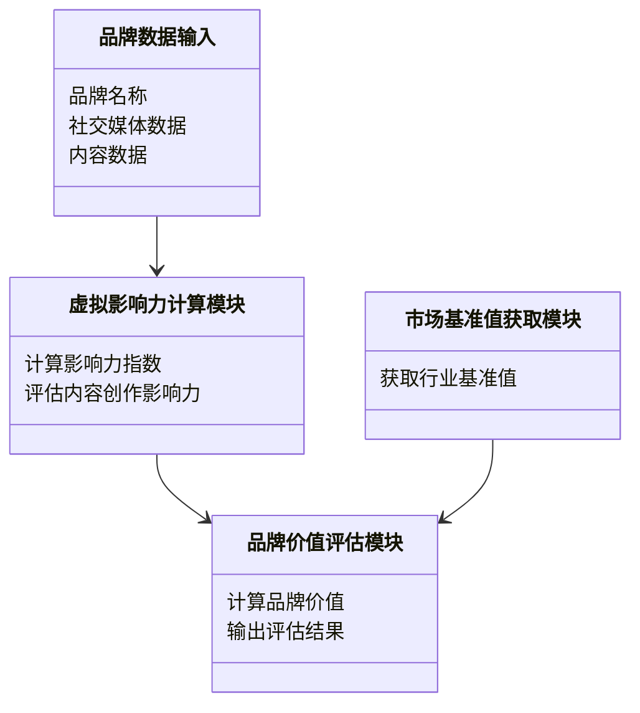

                 


# 巴菲特的品牌价值评估：虚拟影响力经济的量化

> **关键词**：巴菲特，品牌价值评估，虚拟影响力经济，量化，投资策略，影响力经济模型

> **摘要**：本文探讨了如何将巴菲特的长期主义投资理念应用于品牌价值的量化评估，特别是在虚拟影响力经济中的应用。通过分析虚拟经济时代品牌价值的新挑战，提出了基于影响力指数模型的量化方法，并结合实际案例展示了如何将这些理论应用于品牌价值评估的实践中。

---

## 第一部分：品牌价值评估的背景与挑战

### 第1章：品牌价值评估的背景与问题背景

#### 1.1 问题背景

- **1.1.1 品牌价值的传统评估方法**  
  品牌价值的传统评估方法主要依赖于财务指标、市场份额和品牌知名度等。然而，在虚拟经济时代，品牌价值的内涵发生了变化，传统的评估方法难以全面反映品牌在虚拟影响力经济中的价值。

- **1.1.2 虚拟经济时代品牌价值的新挑战**  
  虚拟经济时代，品牌价值不仅体现在实体资产上，还体现在社交媒体影响力、用户参与度和内容创作能力等方面。这些虚拟影响力因素需要被量化，才能全面评估品牌价值。

- **1.1.3 巴菲特投资理念与品牌价值的关系**  
  巴菲特的投资理念强调长期主义和基本面分析。将这一理念应用于品牌价值评估，可以帮助投资者更好地识别具有长期价值潜力的品牌。

#### 1.2 问题描述

- **1.2.1 虚拟影响力经济的定义**  
  虚拟影响力经济是指通过虚拟资产（如社交媒体影响力、粉丝经济等）创造经济价值的经济形态。

- **1.2.2 品牌价值在虚拟经济中的外延**  
  品牌价值的外延包括社交媒体影响力、用户参与度、内容创作影响力等虚拟资产。

- **1.2.3 虚拟影响力经济的核心问题**  
  如何将虚拟影响力经济中的品牌价值进行量化评估，以帮助投资者做出更明智的投资决策。

#### 1.3 问题解决

- **1.3.1 品牌价值量化的核心目标**  
  将品牌在虚拟影响力经济中的价值转化为可量化的指标，为投资决策提供依据。

- **1.3.2 虚拟影响力经济的量化方法**  
  通过影响力指数模型，将社交媒体参与度、内容创作影响力等指标转化为可量化的影响力指数。

- **1.3.3 巴菲特长期主义投资理念的适用性**  
  巴菲特的长期主义投资理念可以帮助投资者识别具有长期价值潜力的品牌，并通过影响力指数模型进行量化评估。

#### 1.4 边界与外延

- **1.4.1 品牌价值评估的边界条件**  
  品牌价值评估的边界条件包括数据的可获得性、模型的适用性以及评估的时间范围。

- **1.4.2 虚拟影响力经济的外延范围**  
  虚拟影响力经济的外延范围包括社交媒体、短视频平台、网红经济等。

- **1.4.3 巴菲特投资理念的适用范围**  
  巴菲特投资理念的适用范围主要集中在具有长期价值潜力的品牌和企业。

#### 1.5 概念结构与核心要素

- **1.5.1 品牌价值的核心要素**  
  品牌价值的核心要素包括品牌知名度、品牌忠诚度、品牌认知度等。

- **1.5.2 虚拟影响力经济的关键指标**  
  虚拟影响力经济的关键指标包括社交媒体参与度、内容创作影响力、粉丝增长率等。

- **1.5.3 巴菲特投资理念的量化模型**  
  巴菲特投资理念的量化模型包括影响力指数、长期价值潜力指数等。

---

## 第二部分：虚拟影响力经济的核心概念与联系

### 第2章：虚拟影响力经济的核心概念

#### 2.1 核心概念原理

- **2.1.1 虚拟影响力经济的定义**  
  虚拟影响力经济是指通过虚拟资产（如社交媒体影响力、粉丝经济等）创造经济价值的经济形态。

- **2.1.2 品牌价值的虚拟化表现**  
  品牌价值的虚拟化表现包括社交媒体影响力、用户参与度、内容创作影响力等。

- **2.1.3 巴菲特投资理念的数字化延申**  
  巴菲特投资理念的数字化延申包括通过影响力指数模型将品牌价值进行量化评估。

#### 2.2 核心概念属性对比

- **2.2.1 品牌价值的传统属性与虚拟属性对比**  
  | 属性 | 传统品牌价值 | 虚拟影响力经济中的品牌价值 |
  |------|--------------|-----------------------------|
  | 表现形式 | 实体资产、市场份额 | 社交媒体影响力、用户参与度 |
  | 评估方法 | 财务指标、市场份额 | 影响力指数、内容创作影响力 |

- **2.2.2 虚拟影响力经济的量化指标**  
  虚拟影响力经济的量化指标包括社交媒体参与度、内容创作影响力、粉丝增长率等。

- **2.2.3 巴菲特投资理念的数字化特征**  
  巴菲特投资理念的数字化特征包括长期价值潜力、基本面分析、影响力指数等。

#### 2.3 ER实体关系图



---

## 第三部分：虚拟影响力经济的量化模型

### 第3章：虚拟影响力经济的量化模型

#### 3.1 影响力指数模型

- **影响力指数公式**  
  影响力指数 = （社交媒体参与度 + 内容创作影响力） / 市场基准值

$$ \text{影响力指数} = \frac{(\text{社交媒体参与度} + \text{内容创作影响力})}{\text{市场基准值}} $$

- **计算步骤**  
  1. 收集品牌在社交媒体上的参与度数据（如点赞、评论、分享等）。  
  2. 评估品牌内容的创作影响力（如内容的传播率、用户互动率等）。  
  3. 确定市场基准值（如行业平均水平）。  
  4. 计算影响力指数。

#### 3.2 算法原理



#### 3.3 算法实现

```python
# 影响力指数计算函数
def calculate_influence_index(social_engagement, content_impact, market_baseline):
    influence_index = (social_engagement + content_impact) / market_baseline
    return influence_index

# 示例数据
social_engagement = 10000  # 社交媒体参与度
content_impact = 5000      # 内容创作影响力
market_baseline = 10000    # 市场基准值

# 计算影响力指数
influence_index = calculate_influence_index(social_engagement, content_impact, market_baseline)
print(f"影响力指数: {influence_index}")
```

---

## 第四部分：系统分析与架构设计

### 第4章：系统分析与架构设计

#### 4.1 系统功能设计

- **领域模型（Mermaid 类图）**



- **系统架构设计（Mermaid 架构图）**


- **系统接口设计**  
  - 输入接口：品牌数据输入接口、市场基准值接口  
  - 输出接口：影响力指数输出接口、品牌价值评估结果输出接口

- **系统交互设计（Mermaid 序列图）**

```mermaid
sequenceDiagram
    用户 -> 前端: 提交品牌数据
    前端 -> 中间件: 调用虚拟影响力计算模块
    中间件 -> 后端: 获取市场基准值
    后端 -> 数据库: 查询品牌数据
    后端 -> 中间件: 返回影响力指数
    中间件 -> 前端: 返回品牌价值评估结果
    用户 <- 前端: 显示评估结果
```

---

## 第五部分：项目实战

### 第5章：项目实战

#### 5.1 环境安装

- 安装Python和必要的库（如pandas、numpy等）。  
- 安装Mermaid和系统架构设计工具（如PlantUML、Lucidchart等）。

#### 5.2 系统核心实现源代码

```python
# 品牌价值评估系统实现
class BrandValueAssessmentSystem:
    def __init__(self):
        self.social_engagement = 0
        self.content_impact = 0
        self.market_baseline = 0
        self.influence_index = 0

    def set_social_engagement(self, engagement):
        self.social_engagement = engagement

    def set_content_impact(self, impact):
        self.content_impact = impact

    def set_market_baseline(self, baseline):
        self.market_baseline = baseline

    def calculate_influence_index(self):
        if self.market_baseline == 0:
            return 0
        self.influence_index = (self.social_engagement + self.content_impact) / self.market_baseline
        return self.influence_index

    def assess_brand_value(self):
        # 假设品牌价值与影响力指数成正比
        self.brand_value = self.influence_index * 1000
        return self.brand_value

# 示例用法
brand = BrandValueAssessmentSystem()
brand.set_social_engagement(10000)
brand.set_content_impact(5000)
brand.set_market_baseline(10000)
brand.calculate_influence_index()
print(f"影响力指数: {brand.influence_index}")
print(f"品牌价值: {brand.assess_brand_value()}")
```

#### 5.3 代码应用解读与分析

- **代码功能解读**  
  该代码实现了一个品牌价值评估系统，通过设置社交媒体参与度、内容创作影响力和市场基准值，计算影响力指数，并评估品牌价值。

- **代码实现细节**  
  - `BrandValueAssessmentSystem`类封装了品牌数据输入、虚拟影响力计算和品牌价值评估功能。  
  - `calculate_influence_index`方法计算影响力指数，`assess_brand_value`方法根据影响力指数评估品牌价值。

#### 5.4 实际案例分析

- **案例背景**  
  假设某品牌在社交媒体上的参与度为10000，内容创作影响力为5000，市场基准值为10000。  

- **计算过程**  
  影响力指数 = (10000 + 5000) / 10000 = 1.5  
  品牌价值 = 1.5 * 1000 = 1500  

- **结果解读**  
  该品牌在虚拟影响力经济中的价值为1500，表明其在市场中具有较高的影响力和价值潜力。

#### 5.5 项目小结

- 通过影响力指数模型，品牌价值评估系统可以量化品牌在虚拟影响力经济中的价值。  
- 该系统可以帮助投资者识别具有长期价值潜力的品牌，并做出更明智的投资决策。

---

## 第六部分：最佳实践与小结

### 第6章：最佳实践与小结

#### 6.1 小结

- 本文探讨了如何将巴菲特的长期主义投资理念应用于品牌价值评估，特别是在虚拟影响力经济中的应用。  
- 通过影响力指数模型，品牌价值可以被量化，为投资者提供了新的评估工具。

#### 6.2 注意事项

- **数据质量**：虚拟影响力经济的评估依赖于高质量的数据，数据的准确性和及时性对评估结果至关重要。  
- **算法可扩展性**：影响力指数模型需要根据市场变化和品牌特点进行调整和优化。  
- **多维度指标**：品牌价值评估应结合多个维度的指标，以全面反映品牌在虚拟影响力经济中的价值。

#### 6.3 拓展阅读

- 《巴菲特的投资哲学》  
- 《影响力经济：社交媒体与品牌价值的新维度》  
- 《大数据与品牌价值评估》

---

## 作者：AI天才研究院/AI Genius Institute & 禅与计算机程序设计艺术/Zen And The Art of Computer Programming

