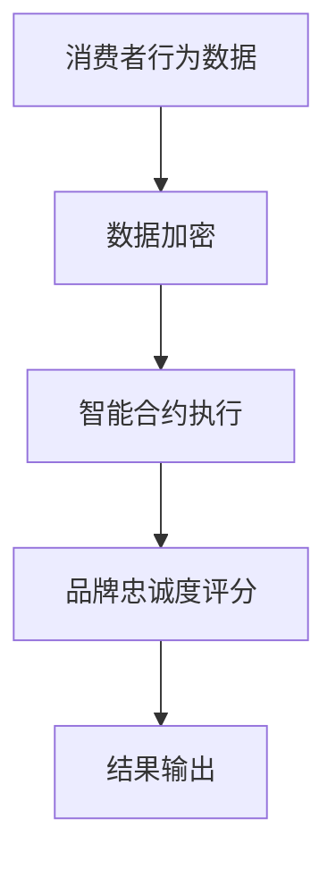

                 


# 巴菲特的品牌忠诚度分析：区块链技术对消费者行为的影响

> 关键词：巴菲特，品牌忠诚度，区块链技术，消费者行为，数据隐私，投资分析

> 摘要：本文从巴菲特的投资哲学出发，结合区块链技术的特点，深入分析区块链技术对消费者行为的影响，特别是其如何重塑品牌忠诚度。通过理论分析、算法设计和系统架构的研究，本文提出了基于区块链的品牌忠诚度分析系统的构建方法，并通过实际案例展示了其应用价值。

---

# 第一部分：引言

## 第1章：巴菲特的品牌忠诚度分析概述

### 1.1 品牌忠诚度的定义与重要性

品牌忠诚度是指消费者对某一品牌长期偏好并持续购买的行为。它不仅是消费者对品牌信任的体现，也是企业核心竞争力的重要组成部分。品牌忠诚度高的消费者会主动选择该品牌的产品或服务，并在面对竞争对手时表现出更强的抵抗力。

### 1.2 巴菲特投资理念与品牌忠诚度

巴菲特的投资理念强调长期价值和企业基本面分析。他认为，选择那些具有强大品牌力和持续盈利能力的企业是投资成功的关键。品牌忠诚度高的企业能够通过稳定的消费者需求实现长期增长，这与巴菲特的投资逻辑高度契合。

### 1.3 区块链技术与消费者行为的结合

区块链技术的去中心化、不可篡改和透明性特点为消费者行为分析提供了新的可能性。通过区块链技术，消费者数据可以更加安全地存储和传输，从而为企业提供更准确的品牌忠诚度分析依据。

---

## 第2章：品牌忠诚度分析的背景与问题

### 2.1 消费者行为分析的背景

消费者行为分析是企业制定市场策略的重要依据。随着互联网和大数据技术的发展，消费者行为数据的采集和分析变得更加高效。然而，数据隐私和安全问题也随之凸显，这为区块链技术的应用提供了契机。

### 2.2 区块链技术在消费者行为分析中的应用背景

区块链技术的去中心化特性可以有效解决消费者数据的安全性和隐私问题。通过区块链技术，消费者行为数据可以以一种不可篡改的方式记录，确保数据的真实性和可靠性。

### 2.3 问题描述与研究目标

传统的消费者行为分析依赖于中心化数据存储，容易受到数据泄露和篡改的风险。而区块链技术的应用可以有效解决这些问题，同时提高数据的可信度。本文旨在探讨如何利用区块链技术提升品牌忠诚度分析的准确性和效率。

---

# 第二部分：品牌忠诚度分析的核心概念与联系

## 第3章：品牌忠诚度分析的核心概念

### 3.1 品牌忠诚度的理论模型

品牌忠诚度的理论模型包括情感忠诚、行为忠诚和认知忠诚等多个维度。情感忠诚是指消费者对品牌的情感认同，行为忠诚是指消费者持续购买行为，而认知忠诚则是指消费者对品牌的理性认知。

### 3.2 区块链技术的核心原理

区块链技术的核心原理包括去中心化、共识机制和智能合约。这些特性使得区块链技术在数据存储和传输过程中具有高度的安全性和透明性。

### 3.3 消费者行为分析的理论框架

消费者行为分析的理论框架包括消费者决策过程、消费心理和行为预测模型。通过这些模型，企业可以更好地理解消费者需求和行为。

---

## 第4章：核心概念的联系与对比

### 4.1 品牌忠诚度与区块链技术的对比分析

品牌忠诚度关注的是消费者对品牌的长期偏好，而区块链技术关注的是数据的安全性和不可篡改性。尽管两者关注点不同，但区块链技术可以通过提高数据的可信度来增强品牌忠诚度。

### 4.2 品牌忠诚度分析中的区块链技术应用

区块链技术可以通过去中心化的方式存储消费者行为数据，从而提高数据的准确性和可靠性。同时，区块链技术还可以通过智能合约实现消费者行为数据的自动分析和处理。

### 4.3 核心概念的ER实体关系图

```mermaid
er
    Customer: {
        id: int,
        name: string,
        age: int,
        gender: string,
        preferences: string,
        purchase_history: string,
        brand Loyalty Score: float
    }
    
    Transaction: {
        id: int,
        customer_id: int,
        product_id: int,
        timestamp: datetime,
        amount: float
    }
    
    Product: {
        id: int,
        name: string,
        brand: string,
        price: float,
        category: string
    }
    
    Loyalty Program: {
        id: int,
        brand_id: int,
        customer_id: int,
        points: int,
        rewards: string
    }
```

---

## 第5章：算法原理与区块链技术的结合

### 5.1 品牌忠诚度评分算法

品牌忠诚度评分算法可以通过消费者的历史购买记录、产品偏好和消费频率等多个维度进行综合评估。常用的算法包括线性回归和聚类分析。

### 5.2 区块链技术在算法中的应用

区块链技术可以通过智能合约实现算法的自动执行和数据的安全存储。例如，消费者行为数据可以通过区块链技术进行加密存储，确保数据的安全性和隐私性。

### 5.3 算法流程图



---

## 第6章：系统分析与架构设计

### 6.1 系统功能设计

系统功能包括消费者数据采集、品牌忠诚度评分、数据存储和分析报告生成。功能设计需要结合区块链技术的特点，确保数据的安全性和可靠性。

### 6.2 系统架构设计

系统架构设计包括前端界面、后端逻辑、区块链节点和数据存储。通过合理的架构设计，可以实现系统的高效运行和数据的安全性。

### 6.3 系统接口设计

系统接口设计需要考虑区块链节点之间的通信和数据的交互。通过合理的接口设计，可以实现系统的模块化管理和功能扩展。

---

## 第7章：项目实战与案例分析

### 7.1 项目环境安装

项目环境需要安装区块链框架（如Ethereum）和相关开发工具。同时，还需要安装数据分析工具（如Python的Pandas库）。

### 7.2 核心代码实现

核心代码包括区块链节点的搭建、智能合约的编写和品牌忠诚度评分算法的实现。代码实现需要结合区块链技术和数据分析技术。

### 7.3 案例分析

通过实际案例分析，展示区块链技术在品牌忠诚度分析中的应用价值。例如，可以分析某个品牌在区块链技术应用前后的品牌忠诚度变化。

---

## 第8章：结论与展望

### 8.1 研究结论

本文通过结合巴菲特的投资理念和区块链技术，提出了一种新的品牌忠诚度分析方法。通过区块链技术的应用，可以有效提高消费者行为数据的可信度，从而为企业制定更精准的市场策略提供支持。

### 8.2 未来研究方向

未来的研究方向包括区块链技术的进一步优化、品牌忠诚度分析的算法创新以及系统的实际应用推广。通过不断的优化和完善，区块链技术在品牌忠诚度分析中的应用前景将更加广阔。

---

作者：AI天才研究院/AI Genius Institute & 禅与计算机程序设计艺术 /Zen And The Art of Computer Programming

