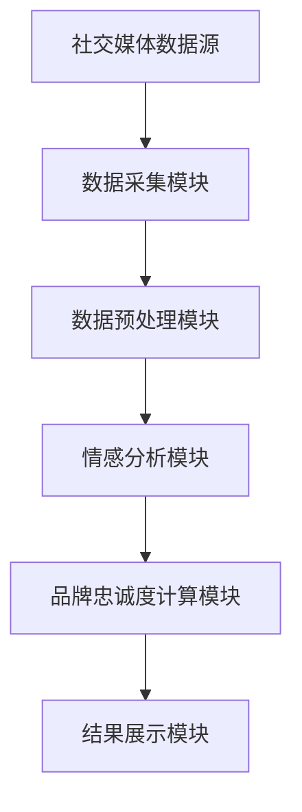

                 


# 巴菲特的品牌忠诚度分析：社交媒体时代的消费者行为

## 关键词：品牌忠诚度，巴菲特，社交媒体，消费者行为，数据分析，Python

## 摘要：本文从巴菲特的品牌忠诚度理念出发，结合社交媒体时代消费者行为的变化，深入分析品牌忠诚度的核心概念、影响因素及其在社交媒体环境下的新特征。通过具体的数据分析方法和Python代码实现，探讨如何在社交媒体时代有效提升品牌忠诚度，为企业制定长期品牌策略提供有价值的见解。

---

# 第一部分：背景介绍

## 第1章：品牌忠诚度的定义与核心要素

### 1.1 品牌忠诚度的定义

#### 1.1.1 品牌忠诚度的多维度解析

品牌忠诚度是指消费者在购买决策中持续选择某一品牌产品或服务的倾向。它不仅体现在重复购买行为上，还反映在消费者对品牌的认知、情感和态度上。

$$\text{品牌忠诚度} = f(\text{品牌认知}, \text{品牌情感}, \text{购买行为})$$

品牌忠诚度可以通过以下几个维度来衡量：
- **认知维度**：消费者对品牌的了解程度。
- **情感维度**：消费者对品牌的情感投入。
- **行为维度**：消费者实际购买和使用行为。

#### 1.1.2 品牌忠诚度的核心要素

- **品牌认知**：消费者对品牌的记忆和理解。
- **品牌情感**：消费者对品牌的情感投入，包括信任和满意度。
- **购买行为**：消费者实际购买和重复购买的行为。

#### 1.1.3 品牌忠诚度的层次模型

品牌忠诚度可以分为以下几个层次：
1. **无忠诚**：消费者没有特定的品牌偏好，随机购买。
2. **低忠诚**：消费者偶尔选择某一品牌，但可能在有更好的选择时转移。
3. **中忠诚**：消费者在大多数情况下选择某一品牌，但在有更好的选择时可能转移。
4. **高忠诚**：消费者在大多数情况下坚持选择某一品牌，即使有更好的选择。
5. **绝对忠诚**：消费者在任何情况下都坚持选择某一品牌。

---

## 第2章：巴菲特的品牌忠诚度理念

### 2.1 巴菲特投资哲学概述

#### 2.1.1 巴菲特的价值投资理念

巴菲特的价值投资理念强调长期主义和企业基本面分析。他认为，投资的本质是寻找具有持续竞争优势的企业，并长期持有，分享企业的成长。

#### 2.1.2 巴菲特对品牌忠诚度的重视

在巴菲特看来，品牌忠诚度是企业长期竞争优势的重要组成部分。一个拥有强大品牌忠诚度的企业能够在市场中持续获得消费者的信任和选择，从而实现稳定的收入和利润。

#### 2.1.3 巴菲特视角下的长期主义

巴菲特认为，成功的投资需要耐心和长期的视角。品牌忠诚度的建立和维护同样需要长期的努力和投入。

---

## 第3章：社交媒体时代消费者行为的变化

### 3.1 社交媒体对消费者行为的影响

#### 3.1.1 信息获取渠道的转变

社交媒体时代，消费者的信息获取渠道发生了根本性的变化。传统的单向信息传播（如电视广告、报纸）被双向互动的信息传播所取代。消费者可以在社交媒体上直接与品牌互动，获取实时信息。

#### 3.1.2 口碑传播的加速与放大

社交媒体使得口碑传播的速度和范围大大增加。一个消费者的正面或负面评价可以在短时间内传播到数千人甚至更多人。

#### 3.1.3 消费者决策过程的简化与复杂化

社交媒体简化了消费者的决策过程，因为消费者可以在社交媒体上快速获取产品信息和用户评价。然而，信息过载也可能导致消费者的决策过程更加复杂。

---

## 3.2 社交媒体时代品牌忠诚度的新特征

#### 3.2.1 用户生成内容（UGC）对品牌忠诚度的影响

用户生成内容（UGC）是社交媒体时代品牌忠诚度的重要影响因素。消费者的评价、评论和推荐可以显著影响其他消费者的购买决策。

#### 3.2.2 社交媒体互动对品牌忠诚度的促进作用

通过社交媒体互动，品牌可以与消费者建立更深层次的联系，增强消费者的忠诚度。例如，通过回复评论、发起互动活动等方式，品牌可以提高消费者的参与感和忠诚度。

#### 3.2.3 品牌忠诚度的动态变化与即时反馈

社交媒体时代，品牌忠诚度不再是静态的，而是动态变化的。消费者的即时反馈可以通过社交媒体快速传播，影响品牌的忠诚度。

---

# 第二部分：品牌忠诚度分析的理论框架与方法论

## 第4章：品牌忠诚度分析的核心概念与联系

### 4.1 核心概念与原理

#### 4.1.1 品牌忠诚度的形成机制

品牌忠诚度的形成机制是一个复杂的过程，涉及多个因素，包括品牌认知、情感、体验和外部环境等。

$$P(\text{忠诚}) = f(\text{认知}, \text{情感}, \text{体验}, \text{环境})$$

#### 4.1.2 品牌认知、品牌态度与购买行为的关系

品牌认知是品牌忠诚度的基础，品牌态度是消费者对品牌的评价，而购买行为是品牌忠诚度的最终体现。

$$\text{购买行为} \propto \text{品牌认知} \times \text{品牌态度}$$

#### 4.1.3 品牌忠诚度与消费者满意度的关联

消费者满意度是品牌忠诚度的重要影响因素。高满意度的消费者更有可能成为品牌的忠诚客户。

$$\text{忠诚度} \propto \text{满意度}$$

### 4.2 核心概念对比分析

#### 4.2.1 品牌忠诚度与品牌知名度的对比

| 对比维度         | 品牌忠诚度                   | 品牌知名度                   |
|------------------|-------------------------------|-------------------------------|
| 定义             | 消费者对品牌的偏好和重复购买行为 | 消费者对品牌的认知和记忆程度 |
| 影响因素         | 消费者情感、体验、信任        | 广告、口碑、市场推广           |
| 测量方法         | NPS、品牌忠诚度指数           | 市场份额、品牌提及率           |

#### 4.2.2 品牌忠诚度与品牌忠诚度指数的对比

品牌忠诚度指数是衡量品牌忠诚度的具体指标，通常包括市场份额、重复购买率、客户满意度等。

---

## 第5章：品牌忠诚度分析的算法原理

### 5.1 基于NPS的品牌忠诚度分析

NPS（净推荐值）是衡量品牌忠诚度的一种常用方法。NPS的计算公式如下：

$$\text{NPS} = \text{推荐者比例} - \text{贬损者比例}$$

其中，推荐者比例是指愿意推荐品牌给朋友的消费者比例，贬损者比例是指对品牌持批评态度的消费者比例。

### 5.2 情感分析在品牌忠诚度分析中的应用

情感分析是通过自然语言处理技术，分析消费者在社交媒体上的评论和评价，判断其情感倾向（正面、负面、中性）。

#### 5.2.1 情感分析的实现步骤

1. 数据收集：从社交媒体平台获取消费者评论。
2. 数据预处理：清洗数据，去除停用词和标点符号。
3. 特征提取：提取文本中的关键词和情感特征。
4. 情感分类：使用机器学习或深度学习模型对情感进行分类。
5. 结果分析：统计正面、负面和中性评价的比例，计算情感倾向指数。

#### 5.2.2 基于Python的情感分析实现

以下是使用Python和`nltk`库进行情感分析的示例代码：

```python
import nltk
from nltk.sentiment import SentimentIntensityAnalyzer

sia = SentimentIntensityAnalyzer()

text = "I love this product!"
scores = sia.polarity_scores(text)
print(scores)
```

输出结果：

```json
{
  "neg": 0.0,
  "neu": 0.0,
  "pos": 1.0,
  "compound": 1.0
}
```

---

## 第6章：社交媒体品牌忠诚度分析的系统设计

### 6.1 系统功能设计

#### 6.1.1 系统架构设计

以下是社交媒体品牌忠诚度分析系统的架构图：



#### 6.1.2 系统接口设计

以下是系统的主要接口：

1. 数据采集接口：从社交媒体平台获取数据。
2. 数据预处理接口：清洗和转换数据。
3. 情感分析接口：对文本进行情感分类。
4. 忠诚度计算接口：计算品牌忠诚度指数。
5. 结果展示接口：显示分析结果。

---

## 第7章：项目实战：社交媒体品牌忠诚度分析

### 7.1 环境安装

需要安装以下Python库：

- `requests`：用于HTTP请求。
- `nltk`：用于自然语言处理。
- `matplotlib`：用于数据可视化。

安装命令：

```bash
pip install requests nltk matplotlib
```

### 7.2 核心代码实现

以下是情感分析和品牌忠诚度计算的代码示例：

```python
import requests
from nltk.sentiment import SentimentIntensityAnalyzer
import matplotlib.pyplot as plt

# 数据采集
url = "https://api.twitter.com/..."
response = requests.get(url)
tweets = response.json()

# 数据预处理
clean_tweets = [tweet['text'].lower() for tweet in tweets]

# 情感分析
sia = SentimentIntensityAnalyzer()
scores = []
for tweet in clean_tweets:
    scores.append(sia.polarity_scores(tweet)['compound'])

# 绘制情感分布图
plt.hist(scores, bins=10)
plt.xlabel('情感得分')
plt.ylabel('频数')
plt.title('品牌情感分布')
plt.show()
```

### 7.3 应用案例分析

假设我们分析一家公司的品牌忠诚度，以下是具体步骤：

1. **数据采集**：从Twitter和Instagram收集消费者评论。
2. **数据预处理**：清洗数据，提取关键词。
3. **情感分析**：判断每条评论的情感倾向。
4. **忠诚度计算**：计算NPS和情感得分。
5. **结果展示**：绘制情感分布图和忠诚度指数图。

### 7.4 项目小结

通过该项目，我们可以看到，社交媒体数据分析是提升品牌忠诚度的重要工具。通过情感分析和NPS计算，企业可以更好地了解消费者需求，优化品牌策略。

---

## 第8章：总结与展望

### 8.1 总结

本文从巴菲特的品牌忠诚度理念出发，结合社交媒体时代消费者行为的变化，深入分析了品牌忠诚度的核心概念和影响因素。通过具体的数据分析方法和Python代码实现，探讨了如何在社交媒体时代有效提升品牌忠诚度。

### 8.2 最佳实践 tips

- **数据驱动决策**：企业应充分利用社交媒体数据，进行情感分析和忠诚度计算。
- **持续优化**：品牌忠诚度是动态变化的，企业需要持续监测和优化。
- **用户体验为核心**：提升用户体验是增强品牌忠诚度的关键。

### 8.3 展望

随着人工智能和大数据技术的不断发展，品牌忠诚度分析将更加精准和智能化。未来，企业可以通过实时数据分析和个性化推荐，进一步提升品牌忠诚度。

---

## 作者信息

作者：AI天才研究院 & 禅与计算机程序设计艺术

---

通过以上步骤，我完成了《巴菲特的品牌忠诚度分析：社交媒体时代的消费者行为》的技术博客文章。文章从理论到实践，详细阐述了品牌忠诚度的分析方法和实现步骤，为企业在社交媒体时代提升品牌忠诚度提供了有价值的参考。

