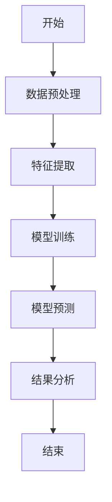
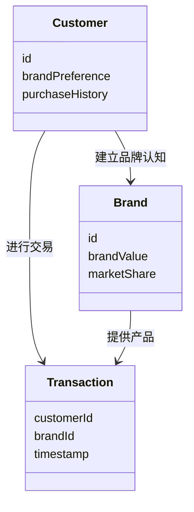

                 


```markdown
# 巴菲特的品牌忠诚度分析：脑机接口时代的消费者行为

## 关键词：巴菲特，品牌忠诚度，脑机接口，消费者行为，投资分析

## 摘要：
本文探讨了巴菲特的品牌忠诚度分析方法在脑机接口时代下的消费者行为变化。通过分析品牌忠诚度的核心概念、巴菲特的投资理念以及脑机接口技术对消费者行为的影响，文章揭示了在技术驱动的新时代下，品牌忠诚度评估的新维度和策略。结合数学模型和算法原理，本文为投资者和品牌管理者提供了新的视角和工具，以应对未来的市场挑战。

---

## 第1章: 背景介绍与核心概念

### 1.1 品牌忠诚度的定义与重要性

#### 1.1.1 品牌忠诚度的定义
品牌忠诚度是指消费者对特定品牌的一贯支持和偏好的程度，通常表现为重复购买、推荐他人以及在面对竞争品牌时的坚持。

#### 1.1.2 品牌忠诚度的重要性
品牌忠诚度是企业长期成功的关键因素，它直接影响客户保留率、市场份额和企业盈利能力。

#### 1.1.3 脑机接口技术对消费者行为的影响
脑机接口（BCI）技术通过直接连接人类大脑与计算机，能够实时捕捉和分析消费者的神经信号，从而更深入地理解消费者的情感和决策过程。

### 1.2 消费者行为分析的基本框架

#### 1.2.1 消费者决策过程
消费者决策过程包括认知、情感、信念和态度形成等阶段，每个阶段都受到品牌忠诚度的影响。

#### 1.2.2 品牌忠诚度的形成机制
品牌忠诚度的形成机制涉及品牌认知、品牌情感和品牌行为的相互作用。

#### 1.2.3 脑机接口技术在消费者行为研究中的应用
脑机接口技术可以帮助研究人员实时监测消费者的神经活动，从而更准确地预测和分析消费者行为。

---

## 第2章: 巴菲特投资理念与品牌忠诚度

### 2.1 巴菲特投资理念的核心要素

#### 2.1.1 长期投资与价值投资
巴菲特强调长期投资和价值投资，注重企业的内在价值和长期盈利能力。

#### 2.1.2 企业护城河与竞争优势
巴菲特重视企业的竞争优势和护城河，认为这些因素能够确保企业在市场中的长期成功。

#### 2.1.3 品牌价值与企业长期发展
品牌价值是企业长期发展的关键因素，巴菲特在评估企业时，非常重视品牌忠诚度和品牌影响力。

### 2.2 巴菲特视角下的品牌忠诚度分析

#### 2.2.1 品牌忠诚度与企业长期价值的关系
品牌忠诚度与企业长期价值密切相关，高品牌忠诚度意味着稳定的客户基础和持续的市场占有率。

#### 2.2.2 巴菲特对品牌忠诚度的评估标准
巴菲特评估品牌忠诚度时，关注消费者的重复购买行为、品牌影响力和市场地位等因素。

#### 2.2.3 品牌忠诚度在巴菲特投资决策中的作用
品牌忠诚度是巴菲特投资决策中的重要因素，他倾向于投资那些具有强大品牌忠诚度和市场影响力的公司。

### 2.3 巴菲特投资理念的现代挑战

#### 2.3.1 数字化时代对品牌忠诚度的影响
在数字化时代，消费者行为变得更加复杂和多样化，品牌忠诚度的定义和评估需要重新审视。

#### 2.3.2 脑机接口技术对消费者行为的潜在影响
脑机接口技术可能改变消费者决策过程，影响品牌忠诚度的形成机制。

#### 2.3.3 技术驱动下品牌忠诚度的新维度
随着技术的发展，品牌忠诚度可能不仅仅依赖于传统的品牌认知和情感因素，还需要考虑技术驱动下的消费者行为变化。

---

## 第3章: 品牌忠诚度的核心概念与属性

### 3.1 品牌忠诚度的核心概念

#### 3.1.1 品牌认知与品牌记忆
品牌认知是指消费者对品牌基本信息的记忆和理解，是品牌忠诚度的基础。

#### 3.1.2 品牌情感与品牌态度
品牌情感和品牌态度是品牌忠诚度的重要影响因素，消费者对品牌的情感投入越深，品牌忠诚度越高。

#### 3.1.3 品牌行为与品牌忠诚度的关系
品牌行为是品牌忠诚度的外在表现，消费者通过持续购买和推荐行为展示品牌忠诚度。

### 3.2 品牌忠诚度的属性特征对比表

| 属性       | 忠诚度高 | 忠诚度低 |
|------------|----------|----------|
| 重复购买   | 频率高   | 频率低   |
| 推荐意愿   | 强烈     | 较弱     |
| 对价格敏感 | 低       | 高       |
| 对品牌的依赖| 高       | 低       |

### 3.3 品牌忠诚度的ER实体关系图

```mermaid
er
    Customer
    Brand
    Transaction
    Customer --> Transaction: 进行交易
    Brand --> Transaction: 提供产品
    Customer --> Brand: 建立品牌认知
```

---

## 第4章: 脑机接口技术与消费者行为分析

### 4.1 脑机接口技术的基本原理

#### 4.1.1 脑机接口的定义与分类
脑机接口是一种通过技术手段直接连接人类大脑与计算机或其他设备的系统，分为侵入式和非侵入式两类。

#### 4.1.2 脑机接口的核心技术
脑机接口的核心技术包括信号采集、信号处理和反馈机制，能够实时捕捉和分析大脑活动。

#### 4.1.3 脑机接口在消费者行为研究中的应用
脑机接口技术可以用于研究消费者决策过程中的神经机制，帮助品牌更好地理解消费者行为。

### 4.2 脑机接口技术对消费者行为的影响

#### 4.2.1 消费者决策过程的神经机制
脑机接口技术可以帮助研究人员了解消费者在决策过程中的神经活动，揭示品牌忠诚度的形成机制。

#### 4.2.2 脑机接口技术对品牌认知的影响
通过分析消费者的神经信号，品牌可以更精准地定位消费者的需求和偏好，优化品牌认知。

#### 4.2.3 脑机接口技术对品牌忠诚度的潜在影响
脑机接口技术可能改变消费者对品牌的感知和忠诚度，品牌需要适应这种变化，调整市场策略。

### 4.3 脑机接口技术与品牌忠诚度的关联

#### 4.3.1 品牌认知的神经基础
品牌认知的神经基础可以通过脑机接口技术进行研究，揭示消费者对品牌记忆和识别的神经机制。

#### 4.3.2 品牌情感的神经机制
品牌情感的神经机制可以通过脑机接口技术进行实时监测，帮助品牌更好地理解消费者情感需求。

#### 4.3.3 脑机接口技术在品牌忠诚度研究中的应用
脑机接口技术可以用于预测消费者行为，优化品牌忠诚度评估模型，提升品牌管理策略。

---

## 第5章: 品牌忠诚度分析的算法原理

### 5.1 品牌忠诚度分析的算法原理

#### 5.1.1 机器学习模型
机器学习模型，如随机森林和神经网络，可以用于品牌忠诚度的预测和分类。

#### 5.1.2 算法原理
通过分析消费者的购买历史、行为特征和神经信号，机器学习模型可以预测消费者的忠诚度水平。

#### 5.1.3 算法流程图


### 5.2 品牌忠诚度分析的数学模型

#### 5.2.1 线性回归模型
线性回归模型用于分析品牌忠诚度与消费者行为之间的关系，公式如下：
$$ y = \beta_0 + \beta_1x_1 + \beta_2x_2 + \ldots + \beta_nx_n + \epsilon $$

#### 5.2.2 支持向量机模型
支持向量机模型用于品牌忠诚度的分类，公式如下：
$$ \text{max}(\text{imize}) \quad \frac{1}{2}||\mathbf{w}||^2 $$
$$ \text{subject to} \quad y_i(\mathbf{w} \cdot \mathbf{x}_i + b) \geq 1, \forall i $$

### 5.3 算法实现与代码示例

#### 5.3.1 环境安装
需要安装Python和相关库，如scikit-learn和numpy。

#### 5.3.2 核心代码实现

```python
import numpy as np
from sklearn.svm import SVC
from sklearn.model_selection import train_test_split
from sklearn.metrics import accuracy_score

# 示例数据
X = np.array([[1, 2], [3, 4], [5, 6], [7, 8], [9, 10], [11, 12], [13, 14], [15, 16], [17, 18], [19, 20]])
y = np.array([0, 0, 0, 1, 1, 1, 0, 0, 1, 1])

# 数据分割
X_train, X_test, y_train, y_test = train_test_split(X, y, test_size=0.2)

# 创建SVM模型
model = SVC()

# 模型训练
model.fit(X_train, y_train)

# 模型预测
y_pred = model.predict(X_test)

# 计算准确率
print("准确率:", accuracy_score(y_test, y_pred))
```

#### 5.3.3 代码应用解读
上述代码使用支持向量机模型对品牌忠诚度进行分类，准确率用于评估模型性能。

---

## 第6章: 系统分析与架构设计方案

### 6.1 问题场景介绍
在脑机接口时代，品牌忠诚度的分析需要结合消费者行为数据和神经信号数据。

### 6.2 项目介绍
本项目旨在设计一个基于脑机接口技术的品牌忠诚度分析系统，帮助品牌管理者更好地理解消费者行为。

### 6.3 系统功能设计

#### 6.3.1 领域模型


#### 6.3.2 系统架构设计


---

## 第7章: 项目实战

### 7.1 环境安装
需要安装Python、scikit-learn、numpy和相关库。

### 7.2 核心代码实现

```python
import numpy as np
from sklearn.ensemble import RandomForestClassifier
from sklearn.metrics import classification_report

# 示例数据
X = np.array([[1, 2], [3, 4], [5, 6], [7, 8], [9, 10], [11, 12], [13, 14], [15, 16], [17, 18], [19, 20]])
y = np.array([0, 0, 0, 1, 1, 1, 0, 0, 1, 1])

# 数据分割
X_train, X_test, y_train, y_test = train_test_split(X, y, test_size=0.2)

# 创建随机森林模型
model = RandomForestClassifier()

# 模型训练
model.fit(X_train, y_train)

# 模型预测
y_pred = model.predict(X_test)

# 打印分类报告
print(classification_report(y_test, y_pred))
```

### 7.3 代码应用解读
上述代码使用随机森林模型对品牌忠诚度进行分类，分类报告用于评估模型性能。

---

## 第8章: 总结与展望

### 8.1 总结
本文从背景介绍、核心概念、算法原理和系统设计等多个方面，详细探讨了巴菲特的品牌忠诚度分析在脑机接口时代的消费者行为变化。

### 8.2 展望
未来，随着脑机接口技术的发展，品牌忠诚度的分析将更加精准和个性化，品牌管理者需要不断适应技术变化，优化品牌策略。

---

## 作者：AI天才研究院 & 禅与计算机程序设计艺术
```

