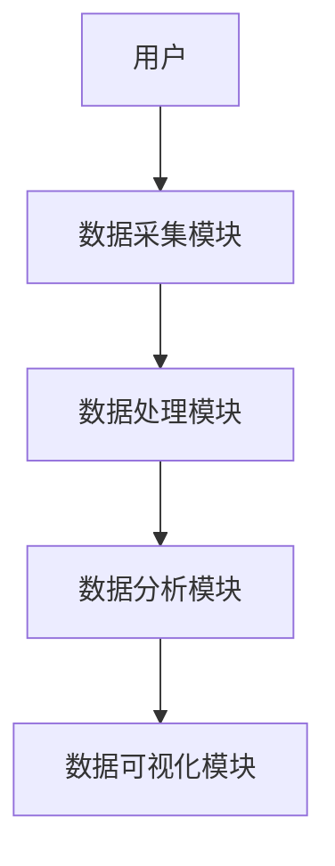
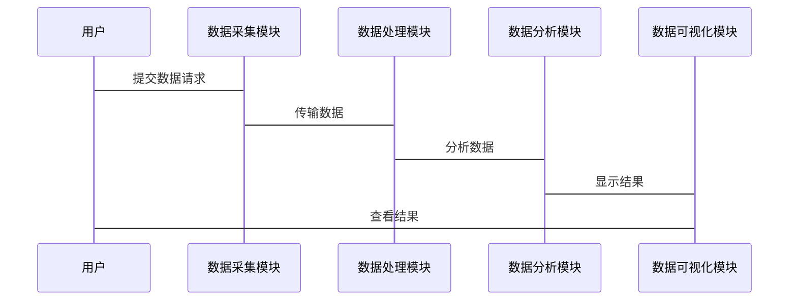

                 


# 巴菲特的品牌忠诚度分析：虚拟身份经济下的消费者行为

## 关键词：巴菲特，品牌忠诚度，消费者行为，虚拟身份经济，数据分析

## 摘要：  
本文深入分析了巴菲特的投资理念与品牌忠诚度之间的关系，特别是在虚拟身份经济下的消费者行为。通过结合心理学、经济学和数据分析等多学科知识，探讨了品牌忠诚度的形成机制、评估方法及其在数字经济中的应用。文章从理论到实践，结合实际案例，提出了基于虚拟身份的品牌忠诚度分析系统设计方案，为企业的品牌管理提供了新的视角和方法。

---

## 第一部分：背景与基础

### 第1章：巴菲特的投资理念与品牌忠诚度

#### 1.1 投资哲学与品牌价值

##### 1.1.1 巴菲特的价值投资理论  
巴菲特的价值投资理论强调长期投资、注重企业的内在价值和管理层质量。他认为，企业的品牌价值和客户忠诚度是决定企业长期盈利能力的关键因素。品牌忠诚度高的企业能够在市场波动中保持稳定的收入来源，从而为投资者带来长期回报。

##### 1.1.2 品牌在长期投资中的重要性  
品牌是企业的无形资产，其价值体现在消费者的认知、情感和行为上。巴菲特的投资决策中，品牌忠诚度高的企业往往具有更强的市场竞争力和抗风险能力。例如，他长期持有的可口可乐公司，正是因为其强大的品牌影响力和消费者忠诚度。

##### 1.1.3 品牌忠诚度与企业长期价值的关系  
品牌忠诚度与企业长期价值呈正相关。高忠诚度的消费者会持续选择同一品牌，为企业带来稳定的收入和利润。这种稳定性使得企业在面对市场变化时更具韧性，从而提升企业的长期投资价值。

#### 1.2 虚拟身份经济的兴起

##### 1.2.1 数字经济的定义与特征  
数字经济是以数字化技术为核心驱动力的经济形态，涵盖互联网、大数据、人工智能等领域。虚拟身份经济是数字经济的重要组成部分，消费者通过虚拟身份进行线上交易、社交互动和品牌互动。

##### 1.2.2 虚拟身份在经济活动中的作用  
虚拟身份不仅是用户在线身份的标识，更是消费者与品牌互动的重要媒介。通过虚拟身份，消费者可以建立个性化品牌偏好，形成品牌忠诚度。例如，社交媒体上的用户行为数据可以反映消费者的虚拟身份特征和品牌偏好。

##### 1.2.3 数字时代消费者行为的变化  
数字技术的普及改变了消费者的行为模式。消费者通过虚拟身份进行购物、评价、社交互动等行为，这些行为数据为品牌忠诚度的分析提供了丰富的数据来源。

---

### 第2章：品牌忠诚度的定义与维度

#### 2.1 品牌忠诚度的多维度分析

##### 2.1.1 忠诚度的层次模型  
品牌忠诚度可以分为情感忠诚、行为忠诚和认知忠诚三个层次。情感忠诚是指消费者对品牌的情感依赖；行为忠诚是指消费者持续选择同一品牌；认知忠诚是指消费者对企业价值的认可。

##### 2.1.2 影响忠诚度的因素：价格、质量、情感等  
价格和质量是传统经济中影响忠诚度的主要因素，但在虚拟身份经济中，情感和体验的重要性逐渐上升。消费者更倾向于选择与自身价值观和生活方式一致的品牌。

##### 2.1.3 数字经济中的品牌忠诚度特征  
在数字经济中，品牌忠诚度不仅体现在消费行为上，还体现在虚拟身份的互动中。消费者通过虚拟身份与品牌进行深度互动，形成更强的情感纽带。

#### 2.2 虚拟身份经济下的忠诚度特征

##### 2.2.1 数字互动对忠诚度的影响  
数字互动（如社交媒体、电子商务）使得品牌与消费者之间的互动更加频繁和深入。通过虚拟身份，消费者可以随时随地与品牌互动，形成更强的忠诚度。

##### 2.2.2 社交媒体与品牌关系的演变  
社交媒体成为品牌与消费者互动的重要平台。消费者通过虚拟身份在社交媒体上表达对品牌的看法，形成品牌口碑，进而影响其他消费者的忠诚度。

---

## 第二部分：消费者行为分析

### 第3章：消费者决策过程中的心理机制

#### 3.1 消费者决策模型

##### 3.1.1 认知阶段：信息收集与处理  
消费者在购买决策前会通过多种渠道收集信息，包括社交媒体、搜索引擎、朋友推荐等。信息的来源和内容会影响消费者的品牌认知和忠诚度。

##### 3.1.2 情感阶段：品牌偏好形成  
消费者在情感阶段会对品牌产生偏好，这种偏好往往与品牌的情感价值和用户体验密切相关。

##### 3.1.3 行为阶段：购买决策  
消费者在行为阶段会根据自己的认知和情感偏好做出购买决策，这种决策直接影响品牌忠诚度。

#### 3.2 心理因素对品牌忠诚度的影响

##### 3.2.1 情感投入与品牌忠诚度的关系  
情感投入是品牌忠诚度的重要影响因素。消费者对品牌的情感投入越高，忠诚度也越高。

##### 3.2.2 信任在消费者决策中的作用  
信任是消费者决策的重要心理因素。消费者对品牌的信任度越高，越愿意持续选择该品牌。

### 第4章：虚拟身份与消费行为的关联

#### 4.1 虚拟身份对消费行为的影响

##### 4.1.1 用户画像与消费习惯  
虚拟身份数据可以帮助企业构建用户画像，分析消费者的消费习惯和偏好，从而制定更有针对性的品牌策略。

##### 4.1.2 社交网络对购买决策的影响  
消费者在虚拟身份上的社交网络互动会影响其购买决策。例如，朋友或网红的推荐会增加消费者对品牌的信任和忠诚度。

#### 4.2 数据驱动的消费者行为分析

##### 4.2.1 数据收集方法：日志分析、问卷调查等  
企业可以通过分析虚拟身份的行为日志、社交数据和问卷调查等方法，收集消费者的消费行为数据。

##### 4.2.2 数据分析工具与技术  
常用的消费者行为分析工具包括大数据分析平台（如Hadoop）、数据可视化工具（如Tableau）和机器学习算法（如聚类分析、分类分析）。

---

## 第三部分：品牌忠诚度的评估与分析

### 第5章：品牌忠诚度的量化指标

#### 5.1 忠诚度的测量方法

##### 5.1.1 Net Promoter Score (NPS)  
NPS是一种常用的忠诚度测量指标，通过询问消费者“你会向朋友推荐该品牌吗？”的问题，计算净推荐值。NPS值越高，品牌忠诚度越高。

##### 5.1.2 客户生命周期价值 (CLV)  
CLV是衡量客户Lifetime价值的指标，反映了客户为企业带来的长期收益。高忠诚度的客户通常具有更高的CLV。

##### 5.1.3 购买频率与购买忠诚度  
购买频率是衡量忠诚度的重要指标。高忠诚度的消费者通常具有更高的购买频率和更长的消费周期。

#### 5.2 数据分析与预测模型

##### 5.2.1 回归分析预测忠诚度  
回归分析是一种常用的统计方法，可以通过分析消费者行为数据，预测品牌忠诚度。

##### 5.2.2 聚类分析识别忠诚客户群体  
聚类分析可以将消费者分为不同的群体，识别出高忠诚度客户群体，从而制定更有针对性的品牌策略。

### 第6章：基于虚拟身份的忠诚度分析

#### 6.1 虚拟身份数据的特征提取

##### 6.1.1 用户行为模式分析  
通过分析虚拟身份的行为数据，识别消费者的购买习惯、浏览路径和互动频率，从而判断其忠诚度。

##### 6.1.2 社交网络影响力评估  
评估消费者在虚拟身份上的社交影响力，识别品牌忠诚度高的意见领袖，从而影响其他消费者的行为。

#### 6.2 机器学习在忠诚度预测中的应用

##### 6.2.1 使用决策树模型分类客户  
决策树是一种常用的机器学习算法，可以通过分析消费者行为数据，分类出高忠诚度和低忠诚度客户。

##### 6.2.2 集成学习提升预测准确性  
集成学习通过组合多个算法的预测结果，可以提高品牌忠诚度预测的准确性。

---

## 第四部分：系统设计与实现

### 第7章：系统架构设计

#### 7.1 系统目标与范围

##### 7.1.1 系统目标：品牌忠诚度分析平台  
系统目标是构建一个基于虚拟身份数据的品牌忠诚度分析平台，帮助企业量化和管理品牌忠诚度。

##### 7.1.2 用户需求：企业市场部、数据分析师  
目标用户包括企业市场部和数据分析师，他们需要通过系统获取品牌忠诚度分析结果，制定品牌策略。

#### 7.2 系统功能设计

##### 7.2.1 数据采集模块  
数据采集模块负责收集消费者行为数据，包括社交媒体数据、购买记录和问卷调查数据。

##### 7.2.2 数据处理模块  
数据处理模块对采集的数据进行清洗、转换和整合，为后续分析提供高质量数据。

##### 7.2.3 数据分析模块  
数据分析模块使用机器学习算法，对数据进行建模和预测，生成品牌忠诚度分析结果。

##### 7.2.4 数据可视化模块  
数据可视化模块将分析结果以图表形式呈现，帮助用户直观理解品牌忠诚度情况。

#### 7.3 系统架构设计

##### 7.3.1 系统架构图（使用 Mermaid 绘制）  


##### 7.3.2 系统接口设计  
系统接口包括数据采集接口、数据处理接口和数据可视化接口，支持API调用和数据导出功能。

##### 7.3.3 系统交互序列图（使用 Mermaid 绘制）  


### 第8章：项目实战

#### 8.1 环境安装

##### 8.1.1 安装 Python 环境  
安装 Python 3.x 及其依赖库，包括 NumPy、Pandas、Scikit-learn、Matplotlib 和 Seaborn。

##### 8.1.2 安装数据分析工具  
安装 Jupyter Notebook 或 VS Code 等数据分析工具，方便数据处理和可视化。

#### 8.2 系统核心实现源代码

##### 8.2.1 数据采集模块  
```python
import requests
from bs4 import BeautifulSoup

def collect_data(url):
    response = requests.get(url)
    soup = BeautifulSoup(response.text, 'html.parser')
    # 提取数据并存储到数据库
    return data
```

##### 8.2.2 数据分析模块  
```python
from sklearn.tree import DecisionTreeClassifier
from sklearn.model_selection import train_test_split

def predict忠诚度(data):
    X = data.drop('忠诚度', axis=1)
    y = data['忠诚度']
    X_train, X_test, y_train, y_test = train_test_split(X, y, test_size=0.2)
    model = DecisionTreeClassifier()
    model.fit(X_train, y_train)
    accuracy = model.score(X_test, y_test)
    return accuracy
```

##### 8.2.3 数据可视化模块  
```python
import matplotlib.pyplot as plt
import seaborn as sns

def visualize_results(data):
    sns.heatmap(data.corr(), annot=True)
    plt.show()
```

#### 8.3 实际案例分析与解读  
以巴菲特投资的某品牌为例，分析其品牌忠诚度数据，展示如何通过系统分析提升品牌忠诚度。

#### 8.4 项目小结  
总结项目实现过程中的关键点和经验教训，强调系统在实际应用中的价值和潜力。

---

## 第五部分：总结与展望

### 第9章：总结与展望

#### 9.1 核心内容回顾  
总结全文的核心内容，包括品牌忠诚度的定义、影响因素、评估方法和系统设计方案。

#### 9.2 未来研究方向  
提出未来的研究方向，包括更复杂的数据分析方法、人工智能在品牌忠诚度分析中的应用等。

#### 9.3 注意事项与最佳实践  
提醒读者在实际应用中需要注意的数据隐私、模型局限性等问题，并提出最佳实践建议。

---

## 作者信息

作者：AI天才研究院/AI Genius Institute & 禅与计算机程序设计艺术/Zen And The Art of Computer Programming

---

通过以上结构，文章内容将逐步展开，详细分析巴菲特的品牌忠诚度分析，结合虚拟身份经济下的消费者行为，为企业品牌管理提供新的思路和方法。

