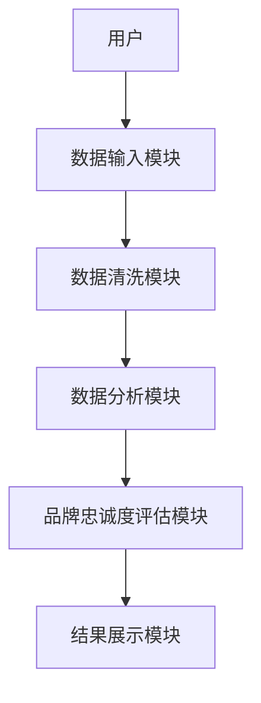

                 


# 巴菲特的品牌忠诚度评估：消费者行为对投资的影响

## 关键词：巴菲特，品牌忠诚度，消费者行为，投资影响，数据分析，价值投资，品牌评估

## 摘要：本文深入探讨巴菲特的品牌忠诚度评估方法，分析消费者行为对投资决策的影响。通过数据分析和数学模型，揭示品牌忠诚度与投资价值之间的关系，提供实用的评估策略和工具。

---

# 第1章: 巴菲特投资理念概述

## 1.1 巴菲特投资哲学的核心思想

### 1.1.1 价值投资的定义与特点

价值投资是一种长期投资策略，旨在以低于内在价值的价格购买优质资产。巴菲特是这一策略的代表人物，他强调企业基本面分析、安全边际和长期持有的理念。价值投资的核心在于识别那些被市场低估的企业，通过长期持有分享其成长带来的收益。

### 1.1.2 巴菲特的价值投资体系

巴菲特的价值投资体系包括以下几个关键要素：
1. **企业基本面分析**：关注企业的盈利能力、财务状况和竞争优势。
2. **安全边际**：购买价格低于企业的内在价值，以降低投资风险。
3. **长期持有**：避免频繁交易，降低交易成本，享受复利效应。

### 1.1.3 巴菲特投资理念的演变

巴菲特的投资理念从早期的烟蒂股策略逐渐转向购买具有持续竞争优势的优质企业。这种演变反映了他对企业内在价值和长期竞争优势的重视。

---

## 1.2 品牌忠诚度的定义与评估

### 1.2.1 品牌忠诚度的定义

品牌忠诚度是指消费者对某一品牌产品的偏好程度，通常表现为重复购买、推荐给他人以及在品牌面临竞争时仍选择该品牌。品牌忠诚度是企业市场竞争力的重要指标，也是巴菲特评估企业价值的重要因素。

### 1.2.2 品牌忠诚度的分类与层次

品牌忠诚度可以分为以下层次：
1. **无品牌忠诚度**：消费者对品牌无偏好，选择价格最低或最方便的产品。
2. **习惯性忠诚度**：消费者因习惯或便利选择某一品牌。
3. **满意型忠诚度**：消费者对产品或服务感到满意，因此选择该品牌。
4. **情感型忠诚度**：消费者对品牌有强烈的情感纽带，即使有竞争产品出现，仍会选择该品牌。

### 1.2.3 品牌忠诚度评估的核心要素

评估品牌忠诚度的核心要素包括：
1. **市场份额**：品牌在市场上的占有率。
2. **重复购买率**：消费者重复购买该品牌产品的比例。
3. **客户满意度**：消费者对品牌产品或服务的满意程度。
4. **品牌忠诚度指数**：通过问卷调查或数据分析得出的量化指标。

---

## 1.3 消费者行为对品牌忠诚度的影响

### 1.3.1 消费者行为的定义与分类

消费者行为是指消费者在购买、使用和处置产品或服务过程中表现出的所有行为。消费者行为受多种因素影响，包括心理、社会、文化和技术因素。

### 1.3.2 消费者行为对品牌忠诚度的影响因素

影响消费者行为的关键因素包括：
1. **价格敏感性**：消费者对价格变动的敏感程度。
2. **品牌认知度**：消费者对品牌的熟悉程度。
3. **产品质量**：产品或服务的质量和性能。
4. **品牌形象**：品牌在消费者心中的形象和地位。
5. **服务体验**：售前、售中和售后的服务质量。

### 1.3.3 消费者行为与品牌忠诚度的关系

消费者行为与品牌忠诚度密切相关。消费者的行为不仅影响其自身的购买决策，还会影响品牌的市场表现。例如，满意的消费者更可能成为品牌忠诚者，而忠诚的消费者更可能推荐品牌给他人，从而扩大品牌的市场份额。

---

## 1.4 巴菲特投资理念与品牌忠诚度的结合

### 1.4.1 巴菲特投资理念中的品牌价值

在巴菲特的投资理念中，品牌价值是企业长期竞争优势的重要组成部分。他认为，强大的品牌可以为企业带来持续的市场份额和定价能力，从而提高企业的盈利能力。

### 1.4.2 品牌忠诚度对投资决策的影响

品牌忠诚度是评估企业市场地位的重要指标。高品牌忠诚度意味着企业有稳定的客户群体和较高的市场占有率，这通常意味着较高的盈利能力和较低的经营风险。

### 1.4.3 巴菲特如何通过品牌忠诚度评估企业价值

巴菲特通过分析消费者行为数据，评估企业的品牌忠诚度，进而判断企业的长期竞争优势和内在价值。他倾向于投资那些具有强大品牌忠诚度和持续竞争优势的企业。

---

## 1.5 本章小结

本章介绍了巴菲特的投资理念，特别是品牌忠诚度在其中的重要作用。品牌忠诚度不仅影响企业的市场地位，还直接影响企业的盈利能力。通过对消费者行为的分析，巴菲特能够准确评估企业的品牌忠诚度，从而做出明智的投资决策。

---

# 第2章: 品牌忠诚度评估的核心模型

## 2.1 品牌忠诚度评估的理论基础

### 2.1.1 品牌忠诚度的理论模型

品牌忠诚度的理论模型包括以下几种：
1. **认知模型**：消费者对品牌认知的深度影响其忠诚度。
2. **情感模型**：消费者与品牌之间的情感纽带影响其忠诚度。
3. **行为模型**：消费者的行为模式（如重复购买率）是衡量品牌忠诚度的重要指标。

### 2.1.2 品牌忠诚度评估的数学模型

常用的数学模型包括：
1. **品牌忠诚度指数（CLI）**：通过消费者调查数据计算得出。
2. **重复购买率（RR）**：通过统计消费者重复购买某品牌的比例计算。
3. **净推荐值（NPS）**：通过消费者对品牌的推荐意愿进行评估。

### 2.1.3 品牌忠诚度评估的指标体系

品牌忠诚度评估的指标体系包括：
1. 市场份额（Market Share）
2. 重复购买率（Repurchase Rate）
3. 客户满意度（Customer Satisfaction）
4. 净推荐值（Net Promoter Score）

---

## 2.2 消费者行为数据的收集与分析

### 2.2.1 数据收集方法

消费者行为数据可以通过以下方式收集：
1. **问卷调查**：通过设计合理的问卷收集消费者对品牌的看法和行为。
2. **数据分析**：利用企业的销售数据、市场调研数据等进行分析。
3. **实验设计**：通过实验方法（如A/B测试）研究消费者行为的变化。

### 2.2.2 数据分析方法

常用的分析方法包括：
1. **描述性分析**：总结消费者行为的基本特征。
2. **回归分析**：研究变量之间的关系，如价格与购买意愿。
3. **聚类分析**：将消费者分成不同的群体，分析各群体的行为特征。

### 2.2.3 数据挖掘与机器学习的应用

数据挖掘和机器学习技术可以用于消费者行为分析，如：
1. **预测分析**：预测消费者未来的购买行为。
2. **分类分析**：将消费者分为不同的类别，识别忠诚客户。
3. **关联规则挖掘**：发现消费者购买行为中的关联性。

---

## 2.3 品牌忠诚度评估的数学模型

### 2.3.1 品牌忠诚度指数的计算公式

品牌忠诚度指数（CLI）可以通过以下公式计算：
$$ CLI = \frac{\text{忠诚客户数}}{\text{总客户数}} \times 100 $$

### 2.3.2 品牌忠诚度评估的回归分析

回归分析可以用于研究品牌忠诚度与消费者行为之间的关系。例如，建立如下回归模型：
$$ Y = \beta_0 + \beta_1 X_1 + \beta_2 X_2 + \epsilon $$
其中，\( Y \) 是品牌忠诚度，\( X_1 \) 是价格敏感性，\( X_2 \) 是品牌形象。

### 2.3.3 品牌忠诚度评估的聚类分析

聚类分析可以将消费者分为不同的群体，识别忠诚客户和非忠诚客户。例如，使用K-means算法将消费者分为忠诚和非忠诚群体。

---

## 2.4 巴菲特投资模型中的品牌忠诚度评估

### 2.4.1 巴菲特投资模型的结构

巴菲特的投资模型包括以下几个步骤：
1. **识别优质企业**：选择具有持续竞争优势和强大品牌的公司。
2. **评估企业价值**：通过财务分析和品牌忠诚度评估确定企业的内在价值。
3. **安全边际分析**：确保购买价格低于企业的内在价值。

### 2.4.2 品牌忠诚度评估在巴菲特模型中的应用

巴菲特通过分析消费者的购买行为和品牌忠诚度，评估企业的市场地位和竞争优势。例如，他可能会选择那些市场份额高、重复购买率高的企业。

### 2.4.3 品牌忠诚度评估对投资决策的指导作用

品牌忠诚度评估帮助巴菲特识别出那些具有长期竞争优势的企业，从而做出明智的投资决策。高品牌忠诚度意味着企业具有较强的市场竞争力和盈利能力。

---

## 2.5 本章小结

本章介绍了品牌忠诚度评估的核心模型和方法，包括数学模型和数据分析技术。通过这些模型和方法，投资者可以更好地评估企业的品牌忠诚度，从而做出更明智的投资决策。

---

# 第3章: 消费者行为对品牌忠诚度的影响分析

## 3.1 消费者行为的分类与影响因素

### 3.1.1 消费者行为的分类

消费者行为可以分为以下几类：
1. **理性行为**：基于理性和分析的决策。
2. **感性行为**：基于情感和感觉的决策。
3. **习惯性行为**：基于习惯的决策。

### 3.1.2 消费者行为的影响因素

消费者行为受多种因素影响，包括：
1. **个人因素**：如年龄、性别、收入水平。
2. **社会因素**：如文化、社会阶层。
3. **产品因素**：如产品质量、价格。
4. **心理因素**：如需求、动机。

### 3.1.3 消费者行为与品牌忠诚度的关系

消费者行为与品牌忠诚度密切相关。例如，消费者的情感投入和品牌认知度直接影响其忠诚度。

---

## 3.2 品牌忠诚度的形成机制

### 3.2.1 品牌忠诚度的形成过程

品牌忠诚度的形成通常包括以下几个阶段：
1. **认知阶段**：消费者首次接触到品牌。
2. **情感阶段**：消费者对品牌产生情感共鸣。
3. **行为阶段**：消费者开始重复购买并推荐给他人。

### 3.2.2 品牌忠诚度的影响因素

影响品牌忠诚度的因素包括：
1. **产品质量**：产品的性能和质量直接影响消费者的满意度。
2. **品牌形象**：品牌在消费者心中的形象和地位。
3. **服务体验**：售前、售中和售后的服务质量。

### 3.2.3 品牌忠诚度的动态变化

品牌忠诚度并不是一成不变的，它会受到市场环境、竞争产品和消费者需求变化的影响。例如，竞争对手推出新产品可能会影响消费者的忠诚度。

---

## 3.3 消费者行为数据的分析与应用

### 3.3.1 数据分析方法

常用的分析方法包括：
1. **描述性分析**：总结消费者行为的基本特征。
2. **因果分析**：研究消费者行为变化的原因。
3. **预测分析**：预测消费者未来的购买行为。

### 3.3.2 数据挖掘技术的应用

数据挖掘技术可以用于消费者行为分析，如：
1. **关联规则挖掘**：发现消费者购买行为中的关联性。
2. **聚类分析**：将消费者分为不同的群体，分析各群体的行为特征。

### 3.3.3 数据可视化与结果解读

数据可视化可以帮助更好地理解和分析消费者行为。例如，使用图表展示消费者购买行为的变化趋势。

---

## 3.4 巴菲特投资策略中的消费者行为分析

### 3.4.1 巴菲特如何分析消费者行为

巴菲特通过分析企业的销售数据、市场份额和消费者调查数据，评估企业的品牌忠诚度和市场地位。

### 3.4.2 消费者行为对巴菲特投资决策的影响

消费者行为数据帮助巴菲特识别出那些具有持续竞争优势的企业，从而做出明智的投资决策。例如，他可能会选择那些市场份额高、重复购买率高的企业。

### 3.4.3 巴菲特如何通过消费者行为数据评估品牌忠诚度

巴菲特通过分析消费者的购买行为和品牌忠诚度，评估企业的市场竞争力和长期盈利能力。例如，他可能会关注企业的净推荐值和客户满意度。

---

## 3.5 本章小结

本章分析了消费者行为对品牌忠诚度的影响，探讨了消费者行为的分类、影响因素和形成机制。同时，介绍了消费者行为数据的分析方法和应用，帮助投资者更好地评估企业的品牌忠诚度。

---

# 第4章: 品牌忠诚度评估的实证分析

## 4.1 数据收集

### 4.1.1 数据来源

数据来源包括：
1. **企业财务报表**：获取企业的收入、利润等财务数据。
2. **市场调研数据**：获取消费者对品牌的看法和行为数据。
3. **政府统计数据**：获取行业整体的市场数据。

### 4.1.2 数据清洗

数据清洗包括：
1. **去除异常值**：剔除不符合逻辑的数据。
2. **填补缺失值**：通过插值法填补缺失数据。
3. **数据标准化**：将数据转换为统一的格式。

---

## 4.2 数据分析与建模

### 4.2.1 数据分析方法

常用的分析方法包括：
1. **回归分析**：研究品牌忠诚度与其他变量之间的关系。
2. **聚类分析**：将消费者分为不同的群体，分析各群体的行为特征。

### 4.2.2 数据挖掘技术

数据挖掘技术包括：
1. **关联规则挖掘**：发现消费者购买行为中的关联性。
2. **分类分析**：将消费者分为忠诚和非忠诚群体。

---

## 4.3 模型验证

### 4.3.1 模型验证方法

模型验证方法包括：
1. **交叉验证**：将数据分为训练集和验证集，评估模型的准确性。
2. **ROC曲线分析**：评估模型的分类性能。

### 4.3.2 模型优化

模型优化包括：
1. **参数调整**：通过调整模型参数提高模型性能。
2. **特征选择**：选择对品牌忠诚度影响最大的特征。

---

## 4.4 案例分析

### 4.4.1 案例背景

以一家知名消费品企业为例，分析其品牌忠诚度和消费者行为数据。

### 4.4.2 数据分析

通过数据分析，计算该企业的品牌忠诚度指数和净推荐值，分析消费者行为对品牌忠诚度的影响。

### 4.4.3 结果解读

解读分析结果，提出优化品牌忠诚度的建议，如提高产品质量、改善服务体验等。

---

## 4.5 本章小结

本章通过实证分析，验证了品牌忠诚度评估模型的可行性和有效性。通过案例分析，展示了如何通过消费者行为数据评估品牌忠诚度，并为企业制定有效的市场策略提供依据。

---

# 第5章: 品牌忠诚度评估的系统架构与实现

## 5.1 系统功能设计

### 5.1.1 系统功能模块

系统功能模块包括：
1. **数据输入模块**：输入消费者行为数据和企业财务数据。
2. **数据分析模块**：进行数据清洗、特征提取和建模。
3. **结果展示模块**：展示品牌忠诚度评估结果和可视化图表。

### 5.1.2 系统功能流程

系统功能流程包括：
1. **数据输入**：用户输入消费者行为数据和企业财务数据。
2. **数据清洗**：系统自动清洗数据，去除异常值和填补缺失值。
3. **数据分析**：系统进行数据分析和建模，评估品牌忠诚度。
4. **结果展示**：系统展示评估结果和可视化图表。

---

## 5.2 系统架构设计

### 5.2.1 系统架构图

以下是一个品牌忠诚度评估系统的架构图：



### 5.2.2 系统接口设计

系统接口设计包括：
1. **数据输入接口**：用户输入消费者行为数据和企业财务数据。
2. **数据清洗接口**：系统清洗数据，去除异常值和填补缺失值。
3. **数据分析接口**：系统进行数据分析和建模，评估品牌忠诚度。
4. **结果展示接口**：系统展示评估结果和可视化图表。

---

## 5.3 项目实战

### 5.3.1 环境安装

安装所需的环境包括：
1. **Python**：用于数据分析和建模。
2. **Pandas**：用于数据处理。
3. **Scikit-learn**：用于机器学习算法。
4. **Matplotlib/Seaborn**：用于数据可视化。

### 5.3.2 核心代码实现

以下是一个品牌忠诚度评估的核心代码实现：

```python
import pandas as pd
from sklearn.cluster import KMeans
from sklearn.metrics import silhouette_score

# 数据清洗
data = pd.read_csv('consumer_behavior.csv')
data = data.dropna()
data = data.replace(' ', 0)

# 特征提取
X = data[['price', 'quality', 'service']]

# 聚类分析
kmeans = KMeans(n_clusters=2, random_state=0)
clusters = kmeans.fit_predict(X)

# 模型评估
score = silhouette_score(X, clusters)
print('模型 silhouette 分数:', score)
```

### 5.3.3 代码解读

上述代码实现了一个品牌忠诚度评估的聚类分析模型。首先，读取数据并进行数据清洗，然后提取特征并进行聚类分析，最后评估模型的 silhouette 分数，判断模型的性能。

---

## 5.4 本章小结

本章介绍了品牌忠诚度评估系统的功能设计和系统架构，并通过项目实战展示了如何通过数据分析和机器学习技术评估品牌忠诚度。代码实现部分详细讲解了数据处理、特征提取和模型评估的具体步骤。

---

# 第6章: 总结与展望

## 6.1 总结

本文深入探讨了巴菲特的品牌忠诚度评估方法，分析了消费者行为对投资决策的影响。通过数据分析和数学模型，揭示了品牌忠诚度与投资价值之间的关系，为投资者提供了实用的评估策略和工具。

## 6.2 未来展望

未来，随着大数据和人工智能技术的发展，品牌忠诚度评估将更加精准和智能化。投资者可以利用先进的技术手段，如深度学习和自然语言处理，进一步提升品牌忠诚度评估的准确性和效率。

---

# 作者：AI天才研究院 & 禅与计算机程序设计艺术

---

感谢您的阅读！希望本文能为您提供有价值的品牌忠诚度评估方法和投资策略。

