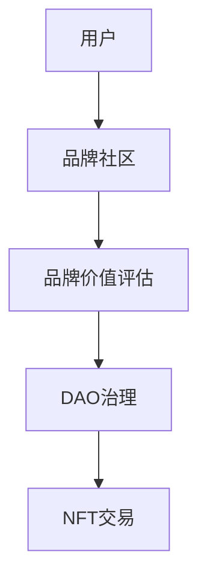
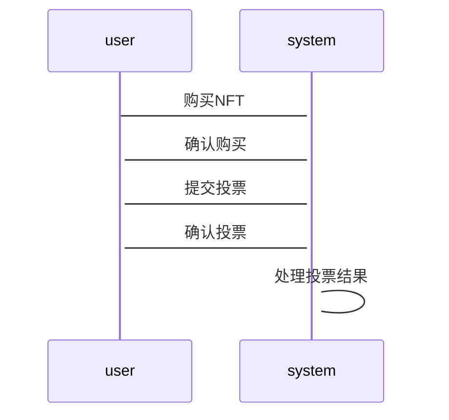

                 


# 巴菲特的品牌溢价理论：元宇宙原生品牌的价值重估

> 关键词：品牌溢价，元宇宙，NFT，DAO，品牌价值评估，数字资产，品牌治理

> 摘要：本文通过分析巴菲特的品牌溢价理论，探讨其在元宇宙中的应用，特别是原生品牌的评估与价值重估。文章从背景介绍、核心概念、数学模型、系统架构、项目实战等多维度展开，结合NFT和DAO等技术，详细阐述了品牌溢价在元宇宙中的评估方法和实现方案。

---

# 第一部分：背景介绍

## 第1章：巴菲特的品牌溢价理论概述

### 1.1 品牌溢价的核心概念

#### 1.1.1 品牌溢价的定义与内涵

品牌溢价是指消费者对某一品牌的产品或服务愿意支付的价格超出同类产品或服务的基准价格。它反映了品牌在市场中的独特价值和消费者对品牌的忠诚度。例如，苹果手机的价格远高于其硬件成本，这就是品牌溢价的体现。

#### 1.1.2 品牌溢价的形成机制

品牌溢价的形成机制主要包括品牌知名度、品牌忠诚度、品牌质量认知和品牌差异化策略。通过长期的品牌建设和营销，企业能够建立品牌资产，从而在市场中获得更高的价格溢价。

#### 1.1.3 品牌溢价与企业价值的关系

品牌溢价是企业价值的重要组成部分。高品牌溢价意味着企业在市场中具有更强的竞争力和盈利能力。巴菲特的投资策略中，品牌溢价是评估企业长期价值的重要指标。

### 1.2 元宇宙的定义与特征

#### 1.2.1 元宇宙的定义与技术基础

元宇宙是一个虚拟的、去中心化的数字世界，通过区块链、虚拟现实、增强现实等技术构建。它是一个平行于现实世界的虚拟空间，用户可以通过 avatar 进行互动和交易。

#### 1.2.2 元宇宙的经济体系

元宇宙的经济体系基于区块链技术，具有去中心化的特点。虚拟货币、NFT（非同质化代币）和 DAO（去中心化自治组织）是元宇宙经济的核心要素。这些技术为品牌价值的评估和交易提供了新的可能性。

#### 1.2.3 元宇宙中的品牌价值特点

在元宇宙中，品牌价值的评估不再仅依赖于传统指标，而是更多地考虑用户的参与度、社区影响力和数字资产的持有情况。元宇宙的去中心化特性使得品牌价值更加透明和公平。

### 1.3 元宇宙原生品牌的独特性

#### 1.3.1 元宇宙原生品牌的定义

元宇宙原生品牌是指在元宇宙中从零开始构建的品牌，它们通常与虚拟世界中的特定场景或社区密切相关。例如，一个专注于虚拟音乐会的品牌可能在元宇宙中建立其品牌价值。

#### 1.3.2 元宇宙原生品牌的竞争优势

元宇宙原生品牌具有高度的灵活性和创新性。它们可以利用虚拟现实技术快速迭代和调整品牌形象，同时通过NFT和DAO等技术建立用户社区，增强品牌忠诚度。

#### 1.3.3 元宇宙原生品牌的生态特征

元宇宙原生品牌通常依赖于虚拟生态系统的支持，例如虚拟土地、虚拟商品和虚拟服务。这些生态特征使得品牌价值与元宇宙的经济发展紧密相关。

---

## 第2章：品牌溢价理论在元宇宙中的应用

### 2.1 元宇宙中的品牌价值评估

#### 2.1.1 元宇宙品牌价值的多维度评估

在元宇宙中，品牌价值的评估需要考虑多个维度，包括用户数量、用户活跃度、品牌影响力和数字资产持有情况。例如，一个拥有大量用户的虚拟品牌可能具有较高的品牌溢价。

#### 2.1.2 品牌忠诚度与用户参与度的量化

品牌忠诚度可以通过用户的参与度和复购率来量化。在元宇宙中，用户的参与度可以通过其在虚拟社区中的活跃程度来衡量。高参与度通常意味着更高的品牌忠诚度和更高的品牌溢价。

#### 2.1.3 元宇宙品牌溢价的驱动因素

元宇宙品牌溢价的驱动因素包括品牌独特性、技术创新和用户社区的活跃度。品牌独特性通过NFT和虚拟商品的稀缺性来体现，技术创新则通过虚拟现实和区块链技术来实现。

### 2.2 NFT与品牌价值的关系

#### 2.2.1 NFT在品牌溢价中的作用

NFT（非同质化代币）是元宇宙中品牌溢价的重要工具。通过NFT，品牌可以证明数字资产的唯一性和所有权，从而提升品牌价值。例如，限量版NFT艺术品可以带来更高的品牌溢价。

#### 2.2.2 NFT对品牌稀缺性和独特性的提升

NFT通过区块链技术确保了数字资产的唯一性和不可篡改性。这种稀缺性使得品牌能够通过NFT实现更高的品牌溢价。例如，限量版虚拟商品可以通过NFT实现更高的市场价值。

#### 2.2.3 NFT对品牌资产的长期影响

NFT为品牌提供了长期的品牌资产积累机会。通过NFT，品牌可以在元宇宙中建立可持续的用户社区和数字资产，从而实现长期的品牌溢价。

### 2.3 DAO与品牌治理的结合

#### 2.3.1 DAO在元宇宙品牌治理中的应用

DAO（去中心化自治组织）是一种基于区块链的组织形式，可以在元宇宙中用于品牌治理。通过DAO，品牌可以实现去中心化的决策过程，增强用户的参与感和品牌忠诚度。

#### 2.3.2 DAO对品牌决策的民主化影响

DAO通过去中心化的治理机制，使得品牌决策更加民主化。用户可以通过投票参与品牌的重要决策，从而增强品牌与用户的互动，提升品牌溢价。

#### 2.3.3 DAO对品牌长期价值的提升

DAO通过用户参与和去中心化治理，使得品牌能够更好地适应市场变化，增强品牌的长期价值。例如，通过DAO治理，品牌可以快速调整其市场策略，以应对市场变化。

---

## 第3章：元宇宙品牌溢价的数学模型与算法原理

### 3.1 品牌溢价的数学模型

#### 3.1.1 品牌溢价的公式推导

品牌溢价可以通过以下公式计算：

$$ \text{品牌溢价} = \text{品牌价值} - \text{基础价值} $$

其中，品牌价值可以通过用户数量、用户活跃度和品牌影响力来评估，而基础价值则是同类产品的基准价格。

#### 3.1.2 品牌价值的评估公式

品牌价值的评估公式如下：

$$ \text{品牌价值} = \text{用户数量} \times \text{用户活跃度} \times \text{品牌影响力} $$

其中，用户活跃度可以通过用户的互动频率和参与度来衡量，品牌影响力则可以通过品牌的市场占有率和用户忠诚度来评估。

### 3.2 基于NFT的品牌溢价算法

#### 3.2.1 NFT对品牌溢价的影响

NFT通过提供数字资产的唯一性和所有权，提升了品牌的价值。例如，限量版NFT艺术品可以通过其稀缺性实现更高的品牌溢价。

#### 3.2.2 NFT的市场流动性对品牌溢价的影响

NFT的市场流动性越高，其品牌溢价能力越强。通过提高NFT的交易活跃度，品牌可以实现更高的市场价值。

### 3.3 DAO对品牌溢价的算法影响

#### 3.3.1 DAO在品牌治理中的算法实现

通过DAO的治理机制，品牌可以实现用户参与的品牌决策，从而提升品牌价值。例如，通过DAO投票，品牌可以实现市场策略的优化。

#### 3.3.2 DAO对品牌溢价的长期影响

通过DAO的长期治理，品牌可以实现更加稳定和可持续的品牌溢价。例如，通过DAO治理，品牌可以更好地适应市场变化，提升品牌的长期价值。

---

## 第4章：元宇宙品牌溢价的系统分析与架构设计

### 4.1 系统功能设计

#### 4.1.1 用户互动功能

系统需要提供用户互动功能，例如虚拟社区的互动、NFT的购买和交易等。

#### 4.1.2 品牌价值评估功能

系统需要提供品牌价值评估功能，包括用户数量、用户活跃度和品牌影响力等指标的评估。

#### 4.1.3 去中心化治理功能

系统需要提供去中心化治理功能，例如DAO的投票和决策机制。

### 4.2 系统架构设计

#### 4.2.1 领域模型设计

领域模型设计需要涵盖用户、品牌、NFT和DAO等核心实体。例如，用户可以通过购买NFT成为品牌社区的成员，并参与DAO的治理。

#### 4.2.2 系统架构图

以下是系统的架构图：



#### 4.2.3 接口设计

系统需要提供以下接口：NFT购买接口、DAO投票接口、品牌价值查询接口等。

### 4.3 系统交互设计

#### 4.3.1 用户与系统的交互流程

用户可以通过以下步骤参与品牌治理：

1. 用户购买NFT，成为品牌社区的成员。
2. 用户参与DAO投票，参与品牌的重要决策。
3. 系统根据投票结果调整品牌策略，提升品牌价值。

#### 4.3.2 系统交互序列图

以下是系统的交互序列图：



---

## 第5章：项目实战

### 5.1 环境安装

#### 5.1.1 安装必要的工具

需要安装以下工具：Python、Solidity、Node.js、NPM。

### 5.2 核心代码实现

#### 5.2.1 NFT代币的实现

以下是NFT代币的实现代码：

```python
def create_nft(token_id, owner, metadata):
    return {
        'token_id': token_id,
        'owner': owner,
        'metadata': metadata
    }
```

#### 5.2.2 DAO治理的实现

以下是DAO治理的实现代码：

```python
def vote(proposal, voter):
    return {
        'proposal': proposal,
        'voter': voter,
        'vote_count': 1
    }
```

### 5.3 案例分析

#### 5.3.1 案例背景

假设我们有一个虚拟音乐会品牌，希望通过NFT和DAO提升品牌溢价。

#### 5.3.2 案例分析

通过NFT，品牌可以实现虚拟音乐会门票的唯一性，提升品牌价值。通过DAO，品牌可以实现用户参与的音乐会策划，增强用户忠诚度。

---

## 第6章：总结与展望

### 6.1 总结

本文通过分析巴菲特的品牌溢价理论，探讨了其在元宇宙中的应用。结合NFT和DAO等技术，详细阐述了品牌溢价的评估方法和实现方案。通过系统设计和项目实战，展示了如何在元宇宙中实现品牌溢价的价值重估。

### 6.2 未来展望

未来，元宇宙中的品牌溢价将更加依赖于技术创新和用户参与。随着区块链、虚拟现实和人工智能等技术的不断发展，品牌溢价的评估和实现将更加智能化和个性化。

---

## 作者信息

作者：AI天才研究院/AI Genius Institute & 禅与计算机程序设计艺术 /Zen And The Art of Computer Programming

---

希望这篇文章能够为您提供有价值的见解，并帮助您更好地理解巴菲特的品牌溢价理论在元宇宙中的应用。

