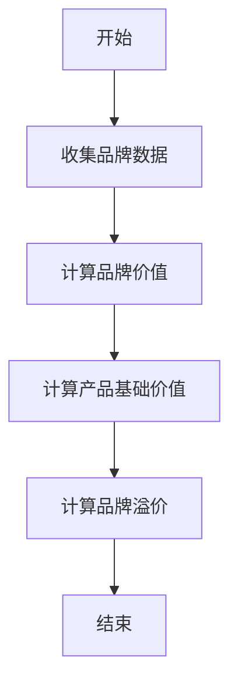
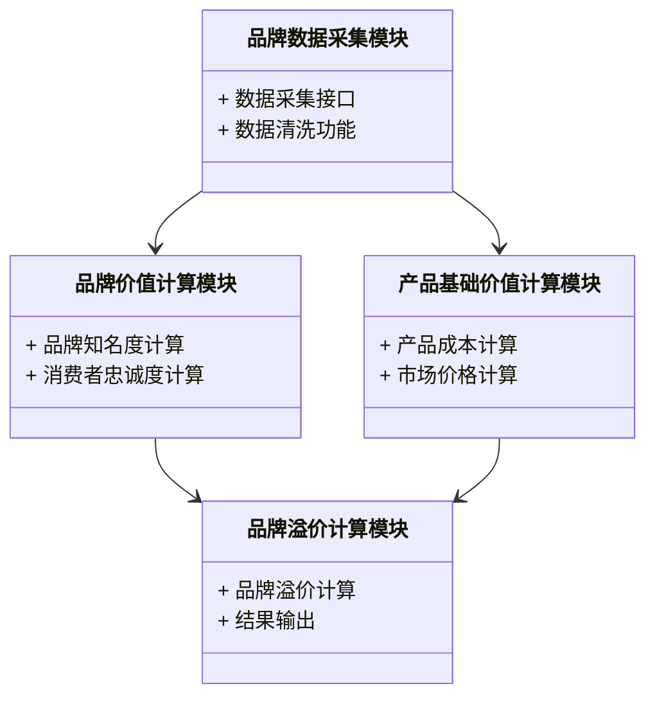
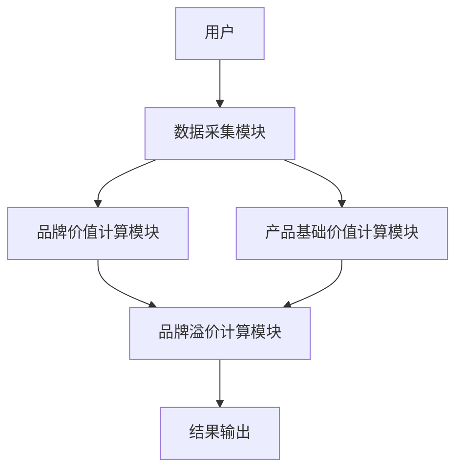

                 


# 巴菲特的品牌溢价理论：数字原生品牌的价值重估

## 关键词
- 巴菲特品牌溢价理论
- 数字原生品牌
- 品牌价值评估
- 数字化品牌
- 品牌溢价模型

## 摘要
本文深入探讨了巴菲特的品牌溢价理论，并将其应用于数字原生品牌的分析。通过结合品牌溢价的基本理论与数字技术的创新应用，文章揭示了数字原生品牌如何在数字化时代实现价值重估。文章不仅详细解释了品牌溢价的核心概念，还通过数学模型和算法原理，展示了如何量化数字原生品牌的溢价价值。最后，通过实际案例分析和系统架构设计，本文为数字原生品牌的价值评估提供了全新的视角和方法。

---

# 第一部分：背景介绍

## 第1章：品牌溢价理论的起源与核心概念

### 1.1 品牌溢价的定义与内涵
品牌溢价是指品牌产品相对于同类非品牌产品的额外价值。这种额外价值源于品牌在市场中的独特地位、消费者忠诚度、品牌认知度以及品牌背后的文化和情感价值。品牌溢价的核心在于品牌能够通过差异化策略，在消费者心中建立独特的位置，从而实现价格上的优势。

### 1.2 巴菲特投资理念与品牌溢价
巴菲特的投资理念强调长期价值和品牌的重要性。他认为，具有强大品牌溢价能力的企业能够在市场中长期保持竞争优势。例如，可口可乐之所以能够长期保持高利润率，很大程度上得益于其强大的品牌影响力和消费者忠诚度。

### 1.3 数字原生品牌的定义与特征
数字原生品牌是指在数字化时代从互联网或移动应用等数字平台直接诞生的品牌。这些品牌利用数字技术与消费者互动，通过数据驱动的方式优化用户体验，从而建立独特的品牌价值。数字原生品牌的特征包括：高度依赖数据驱动的运营模式、快速迭代的产品更新、以及与消费者实时互动的能力。

---

## 第2章：数字原生品牌的核心概念与价值评估

### 2.1 数字原生品牌的竞争优势
数字原生品牌通过数字化技术实现了与消费者的深度互动。例如，社交媒体的广泛应用使得品牌能够实时了解消费者的需求和偏好，从而快速调整产品策略。这种互动能力是传统品牌难以企及的。

### 2.2 数字原生品牌的溢价驱动力
数字原生品牌的溢价驱动力主要包括：数据驱动的精准营销、用户生成内容（UGC）的传播效应、以及通过数字化工具实现的个性化服务。这些因素共同作用，使得数字原生品牌能够在竞争中占据优势地位。

---

# 第二部分：品牌溢价的数学模型与算法原理

## 第3章：品牌溢价的数学模型

### 3.1 品牌溢价的基本模型
品牌溢价可以通过以下公式进行量化：
$$
\text{品牌溢价} = \text{品牌价值} - \text{产品基础价值}
$$

其中，品牌价值可以通过品牌知名度、消费者忠诚度、品牌认知度等指标进行评估。

### 3.2 数字原生品牌溢价的扩展模型
针对数字原生品牌，我们可以进一步扩展品牌溢价模型，引入数据和技术因素：
$$
\text{数字原生品牌溢价} = \text{品牌价值} + \text{数据价值} + \text{技术价值} - \text{产品基础价值}
$$

---

## 第4章：品牌溢价的算法实现

### 4.1 品牌溢价的算法流程
以下是品牌溢价计算的流程图：



### 4.2 Python代码实现
以下是实现品牌溢价计算的Python代码示例：

```python
def calculate_brand_premium(brand_value, product_value):
    return brand_value - product_value

# 示例数据
brand_value = 100  # 品牌价值（假设单位为万元）
product_value = 80   # 产品基础价值
premium = calculate_brand_premium(brand_value, product_value)
print(f"品牌溢价为：{premium}万元")
```

---

# 第三部分：系统分析与架构设计

## 第5章：数字原生品牌价值评估的系统架构

### 5.1 系统功能设计
以下是数字原生品牌价值评估系统的功能模块设计：



### 5.2 系统架构设计
以下是系统的整体架构图：



---

# 第四部分：项目实战

## 第6章：数字原生品牌价值评估的实战分析

### 6.1 实战背景
以一家新兴的数字原生品牌为例，分析其品牌溢价的计算过程。

### 6.2 数据采集与清洗
首先，我们需要采集品牌相关的数据，包括品牌知名度、消费者忠诚度等。

### 6.3 品牌溢价计算
根据前面的模型，计算品牌溢价：

```python
brand_value = 90  # 品牌价值
product_value = 70  # 产品基础价值
premium = brand_value - product_value
print(f"品牌溢价为：{premium}万元")
```

---

## 第7章：总结与展望

### 7.1 总结
本文通过结合巴菲特的品牌溢价理论与数字原生品牌的特征，提出了一种新的品牌价值评估方法。通过数学模型和算法实现，我们能够更准确地量化数字原生品牌的价值溢价。

### 7.2 展望
未来，随着数字技术的不断发展，品牌溢价的计算方法将更加复杂和精细。我们需要进一步研究如何将更多的数字化因素纳入品牌溢价的计算模型中，以更准确地评估数字原生品牌的价值。

---

## 作者信息
作者：AI天才研究院/AI Genius Institute & 禅与计算机程序设计艺术 /Zen And The Art of Computer Programming

---

通过以上内容，我们详细探讨了巴菲特的品牌溢价理论，并将其应用于数字原生品牌的分析。文章通过理论分析、数学建模和实际案例，为读者提供了一个全新的视角来理解数字原生品牌的价值重估问题。

