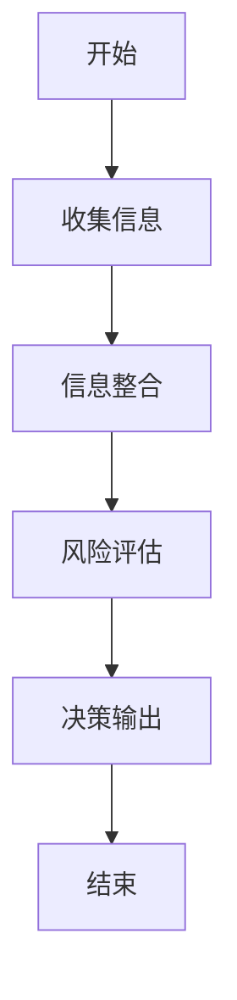
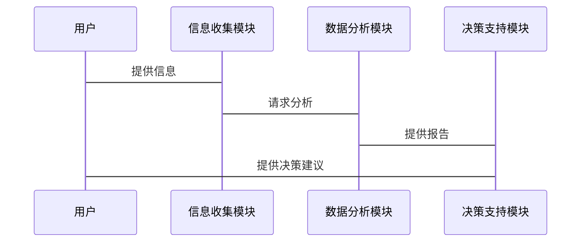

                 


# 巴菲特的圈子理论

> 关键词：巴菲特，投资哲学，圈子理论，决策算法，系统架构，价值投资

> 摘要：本文探讨巴菲特的圈子理论，分析其核心概念、与其他投资理论的联系，以及其在决策算法和系统架构中的应用。通过实际案例和系统设计，总结圈子理论在投资中的优势与实践应用。

---

## 第一部分：背景介绍

### 第1章：巴菲特的生平与投资哲学

#### 1.1 巴菲特的生平简介

- **早年经历与教育背景**
  - 出生与成长：巴菲特出生于1934年，早年展现出对金融的兴趣。
  - 教育背景：就读于哥伦比亚商学院，师从价值投资之父本杰明·格雷厄姆。
- **投资生涯的起点**
  - 初期投资：通过合伙企业模式开始投资生涯。
  - 成名之路：通过巴菲特定律和伯克希尔·哈撒韦公司的收购策略迅速崛起。

#### 1.2 巴菲特的投资哲学

- **价值投资的核心理念**
  - 购买股票的内在价值：寻找市场低估的公司。
  - 长期持有：避免短期波动，专注长期增长。
- **长期投资的重要性**
  - 时间的力量：复利效应在长期投资中的重要性。
  - 耐心与纪律：坚持投资计划，避免情绪化决策。
- **耐心与纪律在投资中的作用**
  - 纪律的重要性：严格遵循投资原则，避免盲目跟风。
  - 耐心的必要性：长期持有优质资产，等待价值体现。

### 第2章：圈子理论的核心概念

#### 2.1 圈子理论的定义与特点

- **圈子理论的定义**
  - 理解：通过身边可信的人脉网络获取信息，做出投资决策。
  - 独特之处：依赖于可靠的人脉，而非单纯依赖市场数据。
- **圈子理论的核心特点**
  - 信息来源：依赖可信赖的合作伙伴和朋友提供的信息。
  - 决策方式：综合多方面的信息进行判断，而非单一分析。
  - 风险控制：通过团队合作分散风险，降低决策错误。

#### 2.2 巴菲特的合作伙伴与圈子结构

- **合作伙伴的角色与影响**
  - 查理·芒格：作为巴菲特定律的合作伙伴，负责风险控制和评估。
  - 其他合作伙伴：包括早期投资者和企业高管，提供行业见解。
- **圈子结构的分析**
  - 圈子的层次结构：分为核心层（芒格等）和外围层（企业高管）。
  - 每层的特点：核心层提供战略建议，外围层提供具体信息。
  - 对投资决策的影响：信息整合，降低决策失误。

---

## 第二部分：核心概念与联系

### 第3章：巴菲特的合作伙伴和圈子结构

#### 3.1 合作伙伴的角色与影响

- **查理·芒格的决策影响**
  - 投资理念：芒格的风险控制理论丰富了巴菲特的价值投资。
  - 具体案例：芒格在伯克希尔的收购决策中起到关键作用。
- **其他合作伙伴的影响**
  - 约翰·特鲁斯：早期合伙企业中的重要角色，影响巴菲特的早期决策。
  - 合伙人制度：吸引优秀人才，形成可靠的信息来源。
- **合作伙伴之间的关系**
  - 团队协作：巴菲特定律的成功依赖于团队的合作。
  - 信任机制：通过长期合作建立的信任，确保信息的真实性和可靠性。

#### 3.2 圈子结构的分析

- **层次分析**
  - 核心层：芒格等核心人物，负责战略制定。
  - 中间层：企业高管和分析师，提供具体数据。
  - 外围层：外部顾问，提供行业动态。
- **每层的特点**
  - 核心层：战略眼光和风险控制。
  - 中间层：专业分析和数据支持。
  - 外围层：外部信息和趋势预测。
- **对投资决策的影响**
  - 信息整合：多渠道信息交叉验证，提高决策准确性。
  - 风险分散：通过团队合作降低个体决策风险。

### 第4章：圈子理论与其他投资理论的对比

#### 4.1 价值投资理论的对比

- **核心理念对比**
  - 价值投资：寻找市场低估的股票，长期持有。
  - 圈子理论：依赖可靠的人脉，获取内部信息。
- **异同分析**
  - 相同点：都强调长期投资和价值发现。
  - 不同点：价值投资依赖市场分析，圈子理论依赖人脉信息。
- **独特优势**
  - 圈子理论：信息来源更可靠，决策更精准。

#### 4.2 技术分析的对比

- **技术分析的核心原理**
  - 通过价格和成交量预测市场走势。
- **对比分析**
  - 技术分析：依赖市场数据，短期波动预测。
  - 圈子理论：依赖内部信息，长期趋势预测。
- **优缺点分析**
  - 技术分析：适用于短期交易，但长期预测不准确。
  - 圈子理论：适用于长期投资，信息更可靠。

---

## 第三部分：算法原理

### 第5章：基于圈子的决策算法

#### 5.1 算法原理概述

- **基本思路**
  - 收集可靠人脉的信息，整合分析，做出投资决策。
- **输入与输出**
  - 输入：合作伙伴提供的信息。
  - 输出：投资决策和风险评估。
- **算法步骤**
  1. 收集信息：从可信圈子获取数据。
  2. 信息整合：分析数据，识别潜在投资机会。
  3. 风险评估：结合市场趋势，评估投资风险。
  4. 决策输出：做出投资决策，调整投资组合。

#### 5.2 算法流程图



#### 5.3 数学模型与公式

- **概率模型**
  - 投资成功的概率 P = (可靠信息的数量) / (总信息数量)
- **决策树分析**
  - 通过决策树分析不同投资路径的风险和收益。

---

## 第四部分：系统分析与架构设计

### 第6章：系统功能设计

#### 6.1 系统功能概述

- **功能需求**
  - 信息收集模块：收集合作伙伴的信息。
  - 数据分析模块：整合信息，生成分析报告。
  - 决策支持模块：提供投资建议和风险评估。
- **用户角色**
  - 投资者：使用系统进行投资决策。
  - 合作伙伴：提供信息。

### 第7章：系统架构设计

#### 7.1 系统架构概述

- **整体架构**
  - 采用分层架构，包括数据层、业务逻辑层和表现层。
- **模块划分**
  - 数据层：存储合作伙伴信息。
  - 业务逻辑层：处理数据分析和决策支持。
  - 表现层：用户界面，展示分析结果。

#### 7.2 系统交互流程图



---

## 第五部分：项目实战

### 第8章：实际案例分析

#### 8.1 环境配置

- **工具与库**
  - Python，Pandas，NumPy，Matplotlib。
- **数据来源**
  - 历史投资案例数据，合作伙伴信息。

#### 8.2 核心代码实现

```python
import pandas as pd
import numpy as np

def collect_info(partners):
    return pd.DataFrame(partners)

def analyze_data(data):
    return data.describe()

def make_decision(data_analysis):
    return "投资建议：" + str(data_analysis['mean'])

# 示例
partners = [{'name': 'Charlie Munger', 'info': '...'}, {'name': 'John Truax', 'info': '...'}]
info_df = collect_info(partners)
analysis = analyze_data(info_df)
decision = make_decision(analysis)
print(decision)
```

#### 8.3 案例分析与解读

- **具体案例**
  - 伯克希尔收购可口可乐：通过芒格的信息，巴菲特定价收购。
- **分析解读**
  - 信息来源：芒格提供的行业分析。
  - 决策过程：整合信息，评估风险，做出投资决策。
- **结果评估**
  - 投资收益：长期持有，获得高回报。

---

## 第六部分：最佳实践与总结

### 第9章：总结与注意事项

- **小结**
  - 圈子理论的优势在于信息可靠，决策精准。
  - 需要长期建立信任关系，选择可靠合作伙伴。
- **注意事项**
  - 风险控制：避免过度依赖单一信息源。
  - 持续学习：不断更新知识，适应市场变化。

### 第10章：拓展阅读

- **推荐阅读书籍**
  - 《巴菲特传》：了解巴菲特的生平和投资哲学。
  - 《投资的智慧》：深入理解价值投资理论。
- **在线资源**
  - 巴菲特定律官网：了解更多投资策略。
  - 投资论坛：参与讨论，学习经验。

---

## 作者

作者：AI天才研究院/AI Genius Institute & 禅与计算机程序设计艺术 /Zen And The Art of Computer Programming

