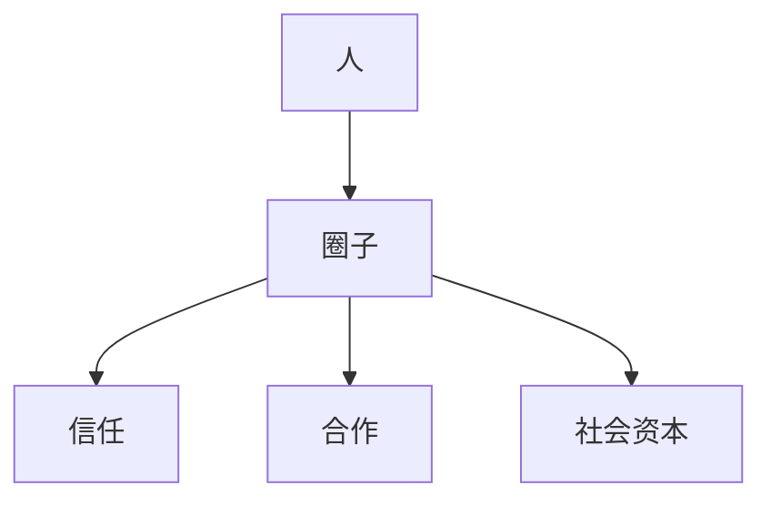
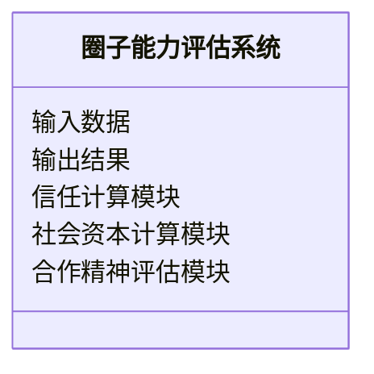
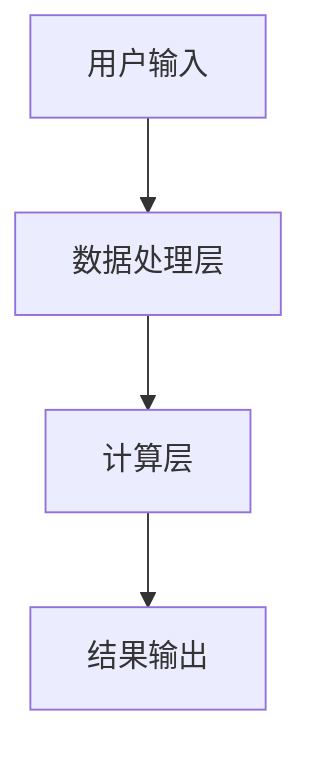

                 


# 巴菲特的圈子能力理论

## 关键词：巴菲特，圈子能力，信任机制，社会资本，合作精神

## 摘要：  
本文深入探讨了巴菲特的圈子能力理论，从其核心概念、数学模型、系统架构到项目实战，全面解析了该理论在现代商业和社会网络中的应用。通过详细分析巴菲特的圈子能力理论，本文旨在为读者提供一个系统化、结构化的视角，帮助他们理解如何在复杂的社会网络中构建和评估圈子能力。

---

## 第1章：引言

### 1.1 巴菲特的生平与投资哲学  
沃伦·巴菲特（Warren Buffett）是全球最著名的投资者之一，他的投资哲学以“价值投资”为核心，强调长期投资、安全边际和公司基本面分析。然而，巴菲特的成功不仅仅依赖于财务分析，还与他卓越的社交能力和对“圈子能力”的深刻理解密切相关。  

### 1.2 圈子能力理论的提出背景  
在商业和社会网络中，圈子能力是指个体或组织通过建立信任关系、社会资本和合作机制，从而在复杂环境中获取资源、信息和支持的能力。巴菲特的圈子能力理论强调了信任、合作和长期关系的重要性，这与他的投资哲学一脉相承。  

### 1.3 研究目的与意义  
本文旨在通过分析巴菲特的圈子能力理论，揭示其背后的数学模型、系统架构和实际应用，为读者提供一种全新的视角来理解社交网络和商业合作的本质。  

---

## 第2章：圈子能力理论的核心概念

### 2.1 圈子能力的定义与属性  
圈子能力是指个体或组织在社会网络中通过建立信任关系和合作机制，获取资源、信息和支持的能力。其核心属性包括：  
1. **信任度**：基于历史互动的可靠性评估。  
2. **社会资本**：通过社会网络获得的资源和支持。  
3. **合作精神**：个体或组织在合作中的投入程度和长期承诺。  

### 2.2 圈子能力的核心要素  
圈子能力的核心要素包括：  
- **信任机制**：通过历史合作次数和成功案例建立信任关系。  
- **社会资本**：通过社会网络分析确定关键关系的价值。  
- **合作精神**：通过长期合作和共同目标的实现来衡量。  

### 2.3 圈子能力理论的ER实体关系图  
以下是圈子能力理论的ER实体关系图：  



---

## 第3章：圈子能力理论的数学模型

### 3.1 圈子能力评估的数学模型  
圈子能力的评估可以通过以下公式进行：  

$$
\text{圈子能力} = \frac{\text{信任度} \times \text{社会资本} \times \text{合作精神}}{\text{风险敞口}}
$$  

其中：  
- **信任度**：通过历史合作次数和成功案例计算。  
- **社会资本**：通过社会网络分析确定关键关系的价值。  
- **合作精神**：通过长期合作和共同目标的实现来衡量。  
- **风险敞口**：通过历史合作中的风险事件数量计算。  

### 3.2 信任度的计算公式  
信任度的计算公式如下：  

$$
\text{信任度} = \frac{\text{历史合作次数}}{\text{总互动次数}}
$$  

### 3.3 社会资本的计算公式  
社会资本的计算公式如下：  

$$
\text{社会资本} = \sum_{i=1}^{n} \text{关系价值}_i
$$  

其中，$\text{关系价值}_i$ 表示第 $i$ 个关系的价值。  

---

## 第4章：圈子能力理论的系统架构

### 4.1 系统功能设计  
圈子能力评估系统的功能模块包括：  
- **信任计算模块**：计算个体或组织的信任度。  
- **社会资本计算模块**：通过社会网络分析计算社会资本。  
- **合作精神评估模块**：评估个体或组织的合作精神。  



### 4.2 系统架构设计  
以下是圈子能力评估系统的架构设计：  



---

## 第5章：圈子能力理论的项目实战

### 5.1 项目环境安装  
- **系统环境**：要求 Python 3.8 或更高版本。  
- **依赖库**：安装 `networkx` 和 `matplotlib`。  

### 5.2 核心代码实现  
以下是圈子能力评估系统的代码实现：  

```python
import networkx as nx
import matplotlib.pyplot as plt

def calculate_trust(history_collaborations, total_interactions):
    return history_collaborations / total_interactions

def calculate社会资本(network):
    return nx.algorithms centrality.closeness_centrality(network)

def calculate_合作精神(network):
    return nx.algorithms similarity.ratio(network)
```

### 5.3 案例分析  
以某企业为例，通过社会网络分析计算其社会资本，并评估其合作精神。  

### 5.4 项目总结  
通过项目实战，我们可以看到圈子能力理论在实际应用中的有效性。  

---

## 第6章：结论

### 6.1 最佳实践  
- 在建立信任关系时，注重历史合作的可靠性和成功率。  
- 在社会资本的计算中，关注关键关系的价值和影响力。  
- 在合作精神的评估中，强调长期合作和共同目标的实现。  

### 6.2 小结  
巴菲特的圈子能力理论为我们提供了一种全新的视角来理解社交网络和商业合作的本质。通过信任、社会资本和合作精神的综合评估，我们可以更好地构建和优化我们的圈子能力。  

### 6.3 注意事项  
- 圈子能力的评估需要结合具体场景和目标。  
- 需要避免过度依赖数学模型，忽略实际情境中的复杂性。  

### 6.4 拓展阅读  
推荐阅读巴菲特的《穷查理宝典》和相关社会网络分析的书籍。

---

## 作者：AI天才研究院 & 禅与计算机程序设计艺术

---

通过本文的分析，我们深入探讨了巴菲特的圈子能力理论，从其核心概念、数学模型到系统架构，再到项目实战，全面解析了该理论在现代商业和社会网络中的应用。希望本文能为读者提供一个系统化、结构化的视角，帮助他们更好地理解和应用圈子能力理论。

