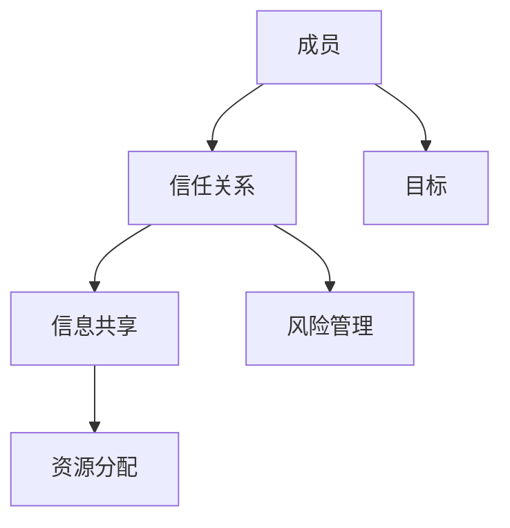

                 

# 巴菲特的圈子能力理论：知道自己的局限

## 关键词：巴菲特，圈子能力，投资决策，信息共享，能力边界

## 摘要：本文深入探讨了巴菲特的圈子能力理论，分析了其核心概念、构建策略、局限性及对投资决策的影响。通过详细讲解，帮助读者理解如何通过圈子能力优化投资策略，同时识别和管理能力边界，以实现更高效的决策过程。

---

# 第1章：巴菲特的圈子能力理论引言

## 1.1 巴菲特的背景与投资哲学

### 1.1.1 巴菲特的生平简介

沃伦·巴菲特（Warren Buffett），1934年8月31日出生于美国堪萨斯州奥马哈市，是世界著名投资者、企业家和慈善家。他以价值投资理念闻名，被誉为“股神”。巴菲特的投资哲学强调长期价值、安全边际和企业基本面分析，这些理念在他的投资生涯中取得了巨大成功。

### 1.1.2 巴菲特的投资哲学与理念

巴菲特的投资哲学主要包括以下几点：
1. **价值投资**：寻找具有持续盈利能力、良好管理和低估价值的企业进行投资。
2. **安全边际**：确保买入价格远低于内在价值，以降低风险。
3. **长期持有**：避免频繁交易，长期持有优质资产，获得复利效应。
4. **分散与集中**：适度分散投资以降低风险，同时集中投资于少数优质企业。

### 1.1.3 巴菲特的圈子能力理论的提出背景

巴菲特的成功不仅依赖于个人能力，还与其庞大的社交网络密切相关。他通过与优秀的企业家、投资者和管理层建立信任关系，获取关键信息和资源，从而做出更明智的投资决策。圈子能力理论正是基于这种社交资本的重要性而提出的。

---

## 1.2 圈子能力理论的核心概念

### 1.2.1 圈子能力的定义与内涵

圈子能力（Circle Competence）是指个体通过社交网络获取信息、资源和信任的能力。它不仅仅依赖于个人的知识和技能，还依赖于与他人建立的关系和合作。圈子能力的核心在于信任和信息共享，这使得个体能够在决策时获得更多支持。

### 1.2.2 圈子能力与投资决策的关系

圈子能力在投资决策中起着关键作用。通过强大的社交网络，投资者可以获取内部信息、行业趋势和潜在投资机会。此外，圈子还能提供支持和建议，帮助投资者规避风险并优化决策。

### 1.2.3 圈子能力理论的现实意义

在当今竞争激烈的商业环境中，圈子能力变得尤为重要。通过建立强大的社交网络，个人和企业能够更好地应对复杂挑战，抓住潜在机会，并实现长期成功。

---

# 第2章：圈子能力的核心概念与特征

## 2.1 圈子能力的定义与属性

### 2.1.1 圈子能力的定义

圈子能力是指个体或组织通过社交网络建立信任关系，获取信息、资源和合作机会的能力。它依赖于成员之间的互动和协作。

### 2.1.2 圈子能力的属性特征对比表格

| 特性       | 定义与特点                                                                 |
|------------|--------------------------------------------------------------------------|
| 信任度     | 成员之间基于长期合作建立的信任关系。                                     |
| 信息共享   | 成员之间能够高效共享关键信息和资源。                                     |
| 资源整合   | 成员能够通过协作整合多种资源，提升整体能力。                             |
| 可扩展性   | 圈子能够随着成员需求变化而动态调整和扩展。                               |
| 风险控制   | 成员之间能够共同分担风险，降低个体风险敞口。                             |

### 2.1.3 圈子能力的ER实体关系图（Mermaid流程图）

---

## 2.2 圈子能力的关键要素

### 2.2.1 信任与合作关系

信任是圈子能力的基础。只有在高度信任的环境中，成员才会愿意分享信息和资源。合作则是圈子能力的体现，成员之间需要共同努力才能实现目标。

### 2.2.2 信息共享机制

信息共享机制确保了成员之间的透明沟通，能够快速传递关键信息，避免信息不对称带来的风险。

### 2.2.3 资源整合能力

资源整合能力决定了圈子能否高效利用现有资源。这需要成员之间具备良好的协调能力和互补性。

---

# 第3章：巴菲特的圈子构建与管理

## 3.1 巴菲特的圈子构成

### 3.1.1 巴菲特的核心圈层

巴菲特的核心圈层主要包括他的长期合作伙伴、亲密的朋友和信任的顾问。这些人与他有着长期的合作关系，能够提供关键的信息和支持。

### 3.1.2 巴菲特的外围圈层

外围圈层包括巴菲特的投资者、行业专家和媒体 contacts。这些人虽然不如核心圈层紧密，但在特定领域内能够提供有价值的信息。

### 3.1.3 巴菲特圈子的动态调整

巴菲特的圈子并非一成不变。他会根据市场需求和个人能力的变化，不断调整圈成员构成，确保圈子的高效运作。

---

## 3.2 巴菲特的圈子管理策略

### 3.2.1 信任建立与维护

巴菲特通过长期合作和透明沟通建立信任。他注重与合作伙伴的关系，确保彼此之间的信任和忠诚。

### 3.2.2 信息过滤与筛选

巴菲特注重信息的筛选和过滤，确保获取的信息准确可靠。他通过与多个来源交叉验证，降低信息错误的风险。

### 3.2.3 资源分配与协调

在圈子内部，巴菲特通过协调资源分配，确保每个人能够发挥其最大潜力。他注重团队协作，避免资源浪费。

---

# 第4章：圈子能力的局限性与风险管理

## 4.1 圈子能力的局限性分析

### 4.1.1 信息不对称的风险

尽管圈子能力能够提供更多信息，但由于信息不对称，成员可能无法完全掌握所有关键信息，导致决策失误。

### 4.1.2 圈子内部的利益冲突

圈子成员之间的利益冲突可能影响合作效果。如何平衡个体利益与整体利益是圈子管理中的重要挑战。

### 4.1.3 圈子外部环境的不可控性

外部环境的变化，如政策调整和市场波动，可能对圈子能力产生重大影响。圈子无法完全控制这些外部因素。

---

## 4.2 巴菲特的局限性管理策略

### 4.2.1 通过多元化降低风险

巴菲特通过多元化投资降低风险。他不仅依赖圈子能力，还通过分散投资降低特定领域风险。

### 4.2.2 通过长期合作建立稳定性

长期合作能够增强圈子的稳定性，减少因短期利益冲突带来的问题。巴菲会长期持有优质企业，确保合作关系的稳固。

### 4.2.3 通过持续学习提升能力

巴菲特注重学习和自我提升，不断优化自己的能力。他通过阅读、研究和交流，提升自己在投资领域的专业能力。

---

# 第5章：圈子能力的扩展与优化

## 5.1 圈子能力的扩展路径

### 5.1.1 通过学习与交流扩大圈子

巴菲特通过参加行业会议、阅读专业书籍和与专家交流，不断扩展自己的社交网络。学习和交流是扩大圈子的有效方式。

### 5.1.2 通过合作与资源整合提升能力

合作与资源整合能够提升圈子的整体能力。巴菲特通过与其他投资者、企业合作，整合资源，提升投资效果。

### 5.1.3 通过技术与创新优化圈子结构

技术手段如社交媒体、数据分析工具能够优化圈子结构。通过技术手段，圈子成员能够更高效地沟通和协作，提升整体能力。

---

## 5.2 巴菲特的圈子能力优化实践

### 5.2.1 巴菲特的团队协作模式

巴菲特注重团队协作，他与合作伙伴共同决策，确保每个成员的意见得到充分考虑。这种协作模式能够提升决策质量。

### 5.2.2 巴菲特的决策支持系统

巴菲特通过建立决策支持系统，整合圈子内外的信息，辅助投资决策。系统化的决策流程能够降低人为错误，提升决策效率。

### 5.2.3 巴菲特的圈子文化与价值观

巴菲特注重圈子文化与价值观的建设，确保成员之间具有共同的目标和价值观。这种文化能够增强成员之间的信任和合作。

---

# 第6章：圈子能力对投资决策的影响

## 6.1 圈子能力在投资决策中的作用

### 6.1.1 信息获取与分析

圈子能力能够帮助投资者获取内部信息和行业趋势，提升决策的准确性。通过圈子网络，投资者能够更快地掌握市场动态。

### 6.1.2 投资机会的发现与评估

圈子能力能够帮助投资者发现潜在的投资机会，并通过合作评估其可行性。圈子内的信息共享和资源分配能够提升投资机会的评估效率。

### 6.1.3 投资风险的识别与控制

通过圈子能力，投资者能够更好地识别和控制风险。圈子内的信息共享和合作能够帮助投资者预测和应对潜在风险。

---

## 6.2 巴菲特的圈子能力与投资成功的关系

### 6.2.1 巴菲特的圈子能力如何影响投资决策

巴菲特的圈子能力帮助他获取关键信息和资源，做出更明智的投资决策。他的社交网络为他提供了独特的优势。

### 6.2.2 巴菲特的圈子能力如何提升投资收益

圈子能力能够帮助巴菲特发现优质投资机会，并通过合作降低投资风险。这使得他的投资收益更加稳定和可观。

### 6.2.3 巴菲特的圈子能力对投资风险的控制

通过圈子能力，巴菲特能够快速识别和应对潜在风险，降低投资损失。他的社交网络为他提供了强大的支持和保障。

---

# 第7章：巴菲特的圈子能力理论总结与启示

## 7.1 巴菲特圈子能力理论的核心总结

### 7.1.1 理论的核心观点

圈子能力是投资者成功的重要因素。通过建立强大的社交网络，投资者能够获取更多信息和资源，做出更明智的投资决策。

### 7.1.2 理论的实践价值

圈子能力理论不仅适用于投资领域，还可以应用于其他商业领域。通过建立强大的社交网络，个人和企业能够更好地应对挑战，抓住机会。

---

## 7.2 启示与建议

### 7.2.1 个人投资者的启示

对于个人投资者，圈子能力同样重要。通过建立自己的社交网络，投资者能够获取更多信息和资源，提升投资效果。

### 7.2.2 企业应用的建议

企业可以通过圈子能力理论优化内部管理和外部合作。建立信任的社交网络，能够提升企业的协作效率和创新能力。

### 7.2.3 未来发展的展望

随着技术的发展，圈子能力将更加依赖于数字化工具。通过利用社交媒体和数据分析工具，圈子能力将更加高效和精准。

---

## 作者：AI天才研究院/AI Genius Institute & 禅与计算机程序设计艺术 /Zen And The Art of Computer Programming

---

**摘要：**本文系统地分析了巴菲特的圈子能力理论，探讨了其核心概念、构建策略、局限性及对投资决策的影响。通过详细讲解，帮助读者理解如何通过圈子能力优化投资策略，同时识别和管理能力边界，以实现更高效的决策过程。

