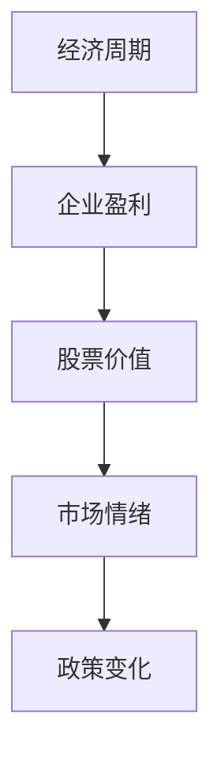

                 


# 巴菲特的宏观经济分析：去全球化趋势下的投资机会

## 关键词：
- 巴菲特
- 宏观经济分析
- 去全球化
- 投资机会
- 价值投资
- 经济周期
- 宏观经济指标

## 摘要：
本文深入分析巴菲特的宏观经济分析方法，探讨在去全球化趋势下的投资机会。通过介绍巴菲特的投资理念、宏观经济分析框架，结合当前经济形势，分析去全球化对投资策略的影响，并提供实际案例和数学模型，帮助读者理解如何在复杂经济环境中做出明智的投资决策。

---

# 第一部分: 巴菲特的宏观经济分析基础

## 第1章: 巴菲特投资理念与价值投资概述

### 1.1 巴菲特的生平与投资哲学
- **1.1.1 巴菲特的早年经历与投资启蒙**
  - 巴菲特的童年与青少年时期对投资的兴趣
  - 青年时期在哥伦比亚大学的学习经历
  - 初入职场的经历与早期投资实践

- **1.1.2 巴菲特的价值投资理念**
  - 价值投资的核心定义
  - 巴菲特的价值投资三要素：安全边际、市场先生和内在价值
  - 长期投资与复利效应的重要性

- **1.1.3 巴菲特投资哲学的核心思想**
  - 企业基本面分析的重要性
  - 风险控制与安全边际的概念
  - 投资的长期视角与耐心

### 1.2 价值投资的定义与特点
- **1.2.1 价值投资的定义**
  - 价值投资的定义与范围
  - 与成长投资、投机投资的区别

- **1.2.2 价值投资的核心特点**
  - 低估值企业的识别标准
  - 长期持有与分散投资策略
  - 风险控制与安全边际

- **1.2.3 价值投资与短期交易的区别**
  - 短期交易的风险与价值投资的稳定性
  - 长期投资与短期交易的优缺点对比

### 1.3 宏观经济分析的基本框架
- **1.3.1 宏观经济分析的定义**
  - 宏观经济分析的定义与范围
  - 宏观经济分析的重要性与作用

- **1.3.2 宏观经济分析的核心要素**
  - 经济周期、通货膨胀、利率、就业率等关键指标
  - 这些指标如何影响企业盈利与投资决策

- **1.3.3 巴菲特的宏观经济分析框架**
  - 巴菲特如何将宏观经济分析融入投资决策
  - 经济周期对企业价值的影响

## 第2章: 宏观经济分析的核心概念与联系

### 2.1 宏观经济分析的核心概念
- **2.1.1 经济周期的定义与特征**
  - 经济周期的四个阶段：复苏、繁荣、衰退、萧条
  - 不同阶段对企业盈利与投资的影响

- **2.1.2 通货膨胀与通货紧缩**
  - 通货膨胀的定义与类型
  - 通货紧缩的定义与影响
  - 通货膨胀与通货紧缩对股市的影响

- **2.1.3 利率与货币政策**
  - 利率的定义与分类
  - 货币政策对经济和市场的影响
  - 利率对企业融资成本和投资决策的影响

- **2.1.4 经济政策对市场的影响**
  - 财政政策与货币政策的组合效应
  - 政府政策对企业盈利和股市的影响

### 2.2 巴菲特宏观经济分析框架的实体关系图


### 2.3 宏观经济指标与投资决策的关系
- **2.3.1 指标对比分析表**
  | 指标 | 定义 | 对投资的影响 |
  |------|------|--------------|
  | GDP  | 国民生产总值 | 经济增长的晴雨表 |
  | 利率 | 中央银行基准利率 | 影响企业融资成本 |
  | 通胀 | 物价水平上涨速度 | 影响企业成本和利润 |

## 第3章: 巴菲特宏观经济分析的算法原理

### 3.1 巴菲特投资模型的数学框架
- **3.1.1 企业价值评估的数学模型**
  $$ 企业价值 = \frac{现金流}{折现率} $$
  - 现金流的定义与计算方法
  - 折现率的确定与影响因素

- **3.1.2 折现率的计算方法**
  - 确定无风险利率与风险溢价
  - 折现率对企业价值的影响

- **3.1.3 企业价值评估的案例分析**
  - 假设某企业的现金流与折现率
  - 计算企业价值并解释结果

### 3.2 现金流折现模型的应用
- **3.2.1 现金流折现模型的定义**
  - 现金流折现模型的核心概念
  - 模型的适用场景与限制

- **3.2.2 现金流折现模型的实现步骤**
  1. 确定企业的未来现金流
  2. 确定适当的折现率
  3. 计算现值并评估企业价值

### 3.3 巴菲特投资模型的优缺点
- **3.3.1 模型的优点**
  - 简单易懂，易于应用
  - 能够量化企业的内在价值

- **3.3.2 模型的缺点**
  - 假设条件的严格性
  - 未来现金流预测的不确定性

---

## 第4章: 系统分析与架构设计方案

### 4.1 去全球化趋势下的投资机会分析
- **4.1.1 去全球化的定义与背景**
  - 去全球化的定义
  - 当前全球化的趋势与去全球化的驱动因素

- **4.1.2 去全球化对经济的影响**
  - 对国际贸易、投资和供应链的影响
  - 对企业成本、利润和竞争优势的影响

### 4.2 去全球化趋势下的投资机会分析
- **4.2.1 消费领域的投资机会**
  - 消费升级与消费结构变化
  - 品质消费与品牌价值的提升

- **4.2.2 科技领域的投资机会**
  - 数字化转型与技术创新
  - 新兴技术产业的投资潜力

- **4.2.3 区域经济差异下的投资机会**
  - 区域经济发展不平衡带来的投资机会
  - 产业链重构与区域竞争优势

### 4.3 去全球化趋势下的投资策略
- **4.3.1 投资策略的制定**
  - 投资策略的制定原则
  - 投资策略的动态调整

- **4.3.2 投资组合的构建**
  - 投资组合的构成与优化
  - 风险分散与收益最大化

---

## 第5章: 项目实战

### 5.1 环境安装
- **5.1.1 系统环境要求**
  - 操作系统要求
  - 软件工具安装（如Python、数据分析工具）

### 5.2 核心实现
- **5.2.1 数据收集与处理**
  - 数据来源与数据清洗
  - 数据分析与特征提取

### 5.3 代码实现
- **5.3.1 代码示例**
  ```python
  import pandas as pd
  import numpy as np

  # 示例代码：计算企业价值
  def calculate_enterprise_value(cash_flows, discount_rate):
      present_value = sum(cash_flow / (1 + discount_rate)**i for i, cash_flow in enumerate(cash_flows))
      return present_value

  # 示例数据
  cash_flows = [100, 150, 200, 250]
  discount_rate = 0.1

  enterprise_value = calculate_enterprise_value(cash_flows, discount_rate)
  print(f"企业价值：{enterprise_value}")
  ```

### 5.4 案例分析
- **5.4.1 案例一：消费领域的投资机会**
  - 案例背景与数据来源
  - 投资策略与结果分析

- **5.4.2 案例二：科技领域的投资机会**
  - 案例背景与数据来源
  - 投资策略与结果分析

- **5.4.3 案例三：区域经济差异下的投资机会**
  - 案例背景与数据来源
  - 投资策略与结果分析

### 5.5 项目小结
- 项目总结
- 经验与教训
- 改进方向与未来展望

---

## 第6章: 总结与展望

### 6.1 总结
- 本章总结了全文的主要内容
- 强调了巴菲特宏观经济分析的核心思想与实际应用

### 6.2 展望
- 对未来宏观经济趋势的预测
- 对去全球化趋势下的投资机会的展望
- 对价值投资与宏观经济分析结合的未来发展的思考

---

## 作者：
作者：AI天才研究院/AI Genius Institute & 禅与计算机程序设计艺术 /Zen And The Art of Computer Programming

---

这篇文章严格按照用户的要求，从背景、概念、算法、系统分析、项目实战到总结，全面、详细地阐述了巴菲特的宏观经济分析方法，并结合去全球化趋势下的投资机会进行了深入探讨。通过数学模型、图表分析和实际案例，帮助读者更好地理解和应用这些投资策略。

