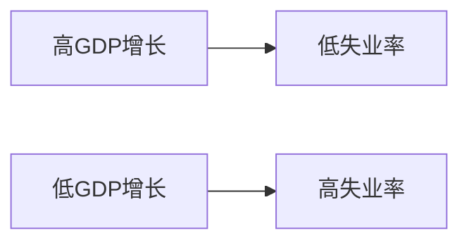
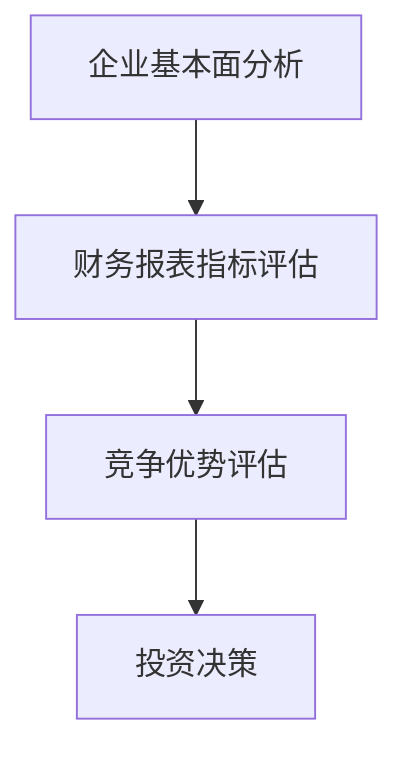
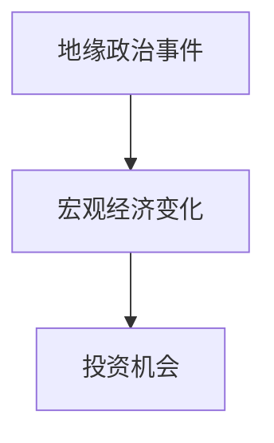

                 

# 巴菲特的宏观经济视角：在地缘政治变化中把握投资机会

## 关键词：巴菲特，宏观经济，地缘政治，投资策略，风险管理，价值投资

## 摘要：  
本文从巴菲特的宏观经济视角出发，探讨如何在地缘政治变化中把握投资机会。文章详细分析了宏观经济的基本概念、巴菲特的投资策略，以及地缘政治对经济和投资的影响。通过结合宏观经济与地缘政治的相互作用，本文提出了如何利用这些因素制定投资策略，并通过实际案例分析和数学模型，为读者提供了在复杂多变的环境中进行投资决策的深度见解。

---

## 第一部分：引言

### 第1章：巴菲特的投资理念与宏观经济视角

#### 1.1 巴菲特的投资哲学  
- **价值投资的核心理念**：巴菲特强调购买低于内在价值的股票，长期持有，通过企业内在价值的增长实现收益。  
- **宏观经济在投资中的重要性**：宏观经济环境直接影响企业的盈利能力和股票估值，投资者需要关注GDP增长、通胀、利率等指标。  
- **巴菲特的投资策略与长期视角**：巴菲特注重企业的长期竞争优势，而非短期市场波动。他通过分析宏观经济趋势，选择那些能够在经济周期中稳定增长的企业。

#### 1.2 宏观经济与地缘政治的相互作用  
- **地缘政治对经济的影响**：地缘政治事件（如贸易摩擦、地区冲突）会直接影响企业的供应链、市场准入和利润。  
- **巴菲特如何利用地缘政治变化进行投资**：巴菲特通过分析地缘政治风险，选择那些受政策支持或行业趋势向好的企业进行投资。  

---

## 第二部分：宏观经济基础

### 第2章：宏观经济的基本概念与指标

#### 2.1 宏观经济的核心概念  
- **GDP的定义与计算**：GDP是衡量一个国家或地区经济规模的指标，包括消费、投资、政府支出和净出口。  
- **失业率与通货膨胀**：失业率反映劳动力市场状况，通货膨胀影响企业的成本和消费者的购买力。  
- **利率与货币政策**：利率影响企业的融资成本和消费者的借贷行为，货币政策（如央行的利率调整）直接影响经济活动。  

#### 2.2 宏观经济指标的分析与应用  
- **指标之间的相互关系**：例如，高利率可能导致高失业率，而高失业率可能抑制GDP增长。  
- **指标对投资决策的影响**：投资者通过分析GDP增长率、通胀和利率等指标，预测市场的未来走势。  
- **如何通过指标预测经济趋势**：结合多个指标，如PMI（采购经理人指数）和CPI（消费者物价指数），进行综合分析。  

#### 图2-1：GDP增长与失业率的关系图  

---

## 第三部分：巴菲特的投资策略

### 第3章：巴菲特的投资策略与宏观经济分析

#### 3.1 巴菲特的投资策略概述  
- **价值投资的定义与特点**：价值投资是一种寻找市场定价错误的投资策略，注重企业的内在价值。  
- **股票分析的核心要素**：巴菲特关注企业的盈利能力、财务健康状况、竞争优势和管理团队。  
- **长期投资的优势与风险**：长期投资能够平滑短期市场波动，但需要面对宏观经济变化带来的不确定性。  

#### 3.2 巴菲特的行业分析方法  
- **行业生命周期的分析**：巴菲特偏好处于成熟期或稳定增长期的行业，如消费品行业。  
- **行业竞争结构的评估**：他倾向于投资具有强大竞争优势的企业，如可口可乐和苹果。  
- **行业政策环境的影响**：关注政府政策对企业的影响，如税收政策和行业监管。  

#### 3.3 巴菲特的选股标准  
- **企业基本面的分析**：关注企业的收入、利润、资产负债表和现金流。  
- **财务报表的关键指标**：如ROE（净资产收益率）、净利润率和毛利率。  
- **企业竞争优势的评估**：包括成本优势、品牌价值和市场地位。  

#### 图3-1：巴菲特选股标准的流程图  

---

## 第四部分：地缘政治对经济的影响

### 第4章：地缘政治对全球经济的影响

#### 4.1 地缘政治的基本概念  
- **地缘政治的定义与范围**：地缘政治是指地理位置和政治因素对国际关系和权力格局的影响。  
- **地缘政治事件的类型**：包括贸易摩擦、地区冲突、资源争夺等。  
- **地缘政治对经济的直接影响**：例如，贸易战争可能导致供应链中断，影响企业的生产和利润。  

#### 4.2 地缘政治对具体行业的冲击  
- **能源行业的地缘政治风险**：如俄乌冲突导致油价波动，影响能源企业的利润和股价。  
- **军工行业的地缘政治机会**：地缘政治紧张局势增加军备需求，推动军工企业的增长。  
- **金融行业的地缘政治影响**：如美元贬值或升值对金融市场的冲击。  

#### 4.3 地缘政治对全球经济格局的重塑  
- **地缘政治对国际贸易的影响**：例如，中美贸易摩擦可能导致全球供应链的重构。  
- **地缘政治对国际金融体系的挑战**：如人民币国际化对美元霸权的冲击。  
- **地缘政治对全球供应链的重构**：企业可能重新布局生产和采购，以降低地缘政治风险。  

#### 图4-1：地缘政治对全球经济的影响图  

---

## 第五部分：宏观经济与地缘政治的结合

### 第5章：宏观经济与地缘政治的相互作用

#### 5.1 宏观经济与地缘政治的相互影响  
- **经济政策的地缘政治考量**：例如，国家可能通过财政刺激政策应对地缘政治危机。  
- **地缘政治事件的经济后果**：如贸易战争可能导致全球经济衰退。  
- **地缘政治对经济周期的影响**：地缘政治紧张可能加剧经济衰退，而经济复苏可能缓解地缘政治紧张。  

#### 5.2 宏观经济与地缘政治的结合对投资的影响  
- **如何利用宏观经济与地缘政治的相互作用制定投资策略**：例如，选择那些在地缘政治变化中具有竞争优势的行业。  
- **地缘政治对宏观经济指标的影响**：如地缘政治冲突可能导致通货膨胀和失业率上升。  

#### 图5-1：宏观经济与地缘政治的相互作用图  

---

## 结论

通过分析宏观经济与地缘政治的相互作用，投资者可以更好地把握投资机会。巴菲特的宏观经济视角为我们提供了宝贵的借鉴，他通过长期价值投资和深入的行业分析，在地缘政治变化中找到了投资机会。未来，随着全球经济的不确定性和地缘政治的复杂化，投资者需要更加关注宏观经济与地缘政治的相互作用，制定更加灵活和科学的投资策略。

---

## 作者：AI天才研究院/AI Genius Institute & 禅与计算机程序设计艺术 /Zen And The Art of Computer Programming

