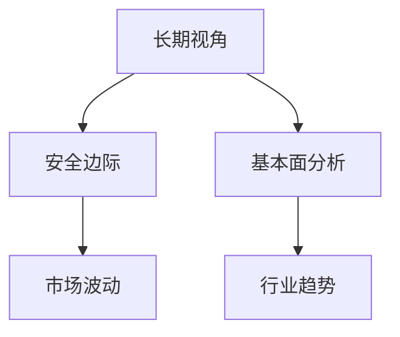

                 

# 巴菲特的宏观经济视角：量子计算对央行政策的影响

## 关键词：巴菲特，宏观经济，量子计算，央行政策，经济预测，量子算法

## 摘要：本文从巴菲特的宏观经济视角出发，探讨量子计算如何影响中央银行的政策制定。通过分析量子计算的基本原理、其在宏观经济模型中的应用，以及对货币政策和财政政策的潜在影响，本文揭示了量子计算在现代经济学中的变革潜力，为未来的经济预测和政策制定提供了新的思路。

---

## 第一部分：巴菲特的宏观经济视角

### 第1章：巴菲特的宏观经济视角概述

#### 1.1 巴菲特的宏观经济分析方法

##### 1.1.1 巴菲特的投资哲学

巴菲特的投资哲学以“价值投资”为核心，强调长期投资、安全边际和内在价值。他的宏观经济分析方法注重对经济基本面的深入研究，尤其是对利率、通货膨胀、GDP增长和就业市场的关注。以下是巴菲特投资哲学的核心要素：

1. **长期视角**：巴菲特定位为“市场的先生”，认为市场波动是机会而非风险，长期趋势才是关键。
2. **安全边际**：他强调以低于内在价值的价格买入资产，以避免潜在风险。
3. **基本面分析**：巴菲特别注重视频、收益、现金流和行业趋势等微观和宏观经济指标。

**图表：巴菲特投资哲学的框架**

##### 1.1.2 巴菲特对宏观经济的独到见解

巴菲特定期发布《致股东的信》，其中对宏观经济的分析提供了独特的视角：

1. **利率政策**：他认为利率是影响投资决策的关键因素，尤其是长期利率对资产价格的影响。
2. **通货膨胀**：巴菲特别关注通货膨胀对货币购买力和企业盈利的影响。
3. **经济周期**：他强调识别经济周期的重要性，尤其是在衰退时期的防御性投资。

##### 1.1.3 巴菲特宏观经济分析的核心要素

- **GDP增长**：关注GDP增长的驱动力和潜在风险。
- **就业市场**：通过失业率和就业趋势预测消费能力和企业盈利。
- **货币政策**：分析央行的货币政策对市场的影响，尤其是利率和货币供应的变化。

#### 1.2 宏观经济与投资策略

##### 1.2.1 宏观经济对投资决策的影响

宏观经济环境直接影响企业的盈利能力和资产价值。例如，低利率环境通常会推高资产价格，而高利率则会抑制企业投资。

##### 1.2.2 巴菲特的长期投资策略

- **买入并持有**：巴菲特定位于买入优质资产并长期持有，避免频繁交易。
- **价值发现**：他寻找被市场低估的企业，尤其是那些具有强大护城河和稳定现金流的企业。

##### 1.2.3 巴菲特对经济周期的判断

- **经济衰退**：巴菲通常会寻找在衰退期间表现稳健的企业，例如公用事业和消费品行业。
- **经济复苏**：他关注那些在复苏期间能够快速扩张的企业，尤其是那些能够利用低利率环境进行杠杆收购的企业。

#### 1.3 巴菲特的经济预测模型

##### 1.3.1 巴菲特经济预测的核心指标

- **利率水平**：尤其是长期利率对资产价格的影响。
- **通货膨胀率**：对购买力和企业盈利的影响。
- **GDP增长**：经济增长的驱动力和潜在风险。

##### 1.3.2 巴菲特经济预测的逻辑框架

1. **数据收集**：收集关键宏观经济指标，包括利率、通货膨胀、GDP增长、失业率等。
2. **趋势分析**：识别这些指标的长期趋势和周期性波动。
3. **情景分析**：基于不同的假设进行情景分析，评估不同经济条件对投资组合的影响。
4. **风险评估**：评估潜在风险，并制定应对策略。

##### 1.3.3 巴菲特经济预测的成功案例

- **2008年金融危机**：巴菲特定位于在危机期间保持投资，并在市场底部增持优质资产。
- **低利率环境**：巴菲特定位于在低利率环境下投资长期债券和股票，尤其是那些具有稳定现金流的企业。

---

### 第2章：量子计算的基本概念

#### 2.1 量子计算的定义与特点

量子计算是一种基于量子力学原理的计算方式，其核心优势在于并行计算能力和指数级加速。

##### 2.1.1 量子计算的定义

量子计算利用量子位（qubits）进行信息处理，利用量子叠加和量子纠缠的特性，可以在某些情况下实现指数级的计算速度。

##### 2.1.2 量子计算与经典计算的区别

- **并行性**：量子计算可以在同一时间处理大量可能性，而经典计算需要逐一处理。
- **复杂度**：某些问题（如因式分解）在量子计算中可以以指数级速度解决，而经典计算则需要多项式时间。

##### 2.1.3 量子计算的核心优势

- **加速能力**：在某些领域（如密码学、优化问题）中，量子计算可以显著提高计算效率。
- **并行处理**：量子计算机可以在同一时间处理大量信息，适用于复杂的宏观经济模型。

#### 2.2 量子位与量子叠加

##### 2.2.1 量子位的定义

量子位是量子计算的基本单位，可以处于0和1的叠加态。例如，一个量子位可以表示为：

$$
|q\rangle = \alpha|0\rangle + \beta|1\rangle
$$

其中，$\alpha$ 和 $\beta$ 是复数，满足$|\alpha|^2 + |\beta|^2 = 1$。

##### 2.2.2 量子叠加原理

量子叠加允许量子位处于多个状态的叠加态，从而在计算中实现并行处理。例如，两个量子位可以表示为：

$$
|q_1, q_2\rangle = \alpha|00\rangle + \beta|01\rangle + \gamma|10\rangle + \delta|11\rangle
$$

##### 2.2.3 量子叠加的数学表达

量子叠加的数学表达可以表示为：

$$
\psi = \sum_{i=0}^{n-1} \alpha_i |i\rangle
$$

其中，$\alpha_i$ 是叠加系数，满足$\sum_{i=0}^{n-1} |\alpha_i|^2 = 1$。

#### 2.3 量子纠缠与量子通信

##### 2.3.1 量子纠缠的定义

量子纠缠是量子系统中两个或多个粒子之间的一种特殊关系，其中一个粒子的状态会直接影响另一个粒子的状态，无论它们相隔多远。

##### 2.3.2 量子纠缠的特性

- **不可分割性**：纠缠粒子无法单独描述，必须作为一个整体来描述。
- **非局域性**：纠缠粒子之间的关系不受距离限制。

##### 2.3.3 量子纠缠在量子通信中的应用

量子纠缠可以用于量子通信，例如量子密钥分发（QKD），通过纠缠粒子的特性实现安全的密钥分发。

---

### 第3章：量子计算在宏观经济分析中的应用

#### 3.1 宏观经济模型的传统方法

##### 3.1.1 凯恩斯模型

凯恩斯模型是宏观经济学的基础，主要用于分析失业、通胀和GDP增长。其核心观点是总需求决定总供给。

##### 3.1.2 货币主义模型

货币主义模型强调货币供应对通货膨胀和实际变量的决定作用，认为货币供应是货币政策的主要工具。

##### 3.1.3 新古典主义模型

新古典主义模型强调市场机制的自我调节能力，认为价格机制可以有效分配资源。

#### 3.2 量子计算在宏观经济模型中的应用

##### 3.2.1 量子计算机在经济模拟中的优势

量子计算机可以在短时间内处理大量数据，适用于复杂的宏观经济模型。

##### 3.2.2 量子算法在宏观经济预测中的应用

量子算法可以用于宏观经济预测，例如预测市场波动和经济周期。

##### 3.2.3 量子计算对宏观经济模型的改进

量子计算可以提高宏观经济模型的准确性和预测能力，尤其是在处理大量数据时。

#### 3.3 量子宏观经济模型的构建

##### 3.3.1 量子宏观经济模型的框架

量子宏观经济模型通常包括以下几个部分：

1. **经济变量的量子表示**：将经济变量（如GDP、通货膨胀、失业率）表示为量子状态。
2. **量子算法的设计**：设计量子算法来模拟经济系统的动态。
3. **模型的验证与优化**：通过实验和模拟验证模型的准确性和实用性。

##### 3.3.2 量子宏观经济模型的参数选择

选择合适的参数是构建量子宏观经济模型的关键。例如，选择适当的量子位数和算法参数。

##### 3.3.3 量子宏观经济模型的验证与优化

通过模拟和实验验证模型的准确性和实用性，并根据结果进行优化。

---

## 第四部分：量子计算对央行政策的影响

### 第4章：央行政策的传统工具与量子计算

#### 4.1 央行的传统政策工具

##### 4.1.1 利率政策

央行通过调整利率来影响市场利率和企业投资行为。

##### 4.1.2 货币政策

央行通过调整货币供应量来影响通货膨胀和经济活动。

##### 4.1.3 财政政策

央行通过调整政府支出和税收来影响经济活动。

#### 4.2 央行的货币政策演变

##### 4.2.1 传统货币政策

传统货币政策主要依赖于利率和货币供应量的调整。

##### 4.2.2 量化宽松政策

量化宽松政策是通过购买长期资产来降低利率和刺激经济。

##### 4.2.3 正常化政策

正常化政策是央行在经济复苏后逐步退出宽松政策的过程。

#### 4.3 量子计算对货币政策的影响

##### 4.3.1 量子计算在货币政策中的应用

量子计算可以用于模拟经济系统的动态，从而帮助央行制定更有效的货币政策。

##### 4.3.2 量子计算对货币政策工具的影响

量子计算可以改变传统货币政策工具的实施方式，例如通过量子算法优化利率政策。

##### 4.3.3 量子计算对货币政策效果的影响

量子计算可以提高货币政策的精准性和效果，尤其是在处理复杂经济问题时。

---

## 第五部分：量子计算对宏观经济政策的未来展望

### 第5章：量子计算的未来挑战与机遇

#### 5.1 量子计算的技术挑战

##### 5.1.1 量子纠错

量子计算需要克服量子噪声和错误的影响。

##### 5.1.2 量子算法的发展

量子算法的设计和优化是量子计算应用的关键。

##### 5.1.3 量子计算的普及

量子计算的普及需要硬件和软件的支持。

#### 5.2 量子计算在宏观经济中的长期影响

##### 5.2.1 宏观经济预测的准确性

量子计算可以提高宏观经济预测的准确性，尤其是在处理复杂经济问题时。

##### 5.2.2 经济政策的制定

量子计算可以改变经济政策的制定方式，例如通过量子模拟优化政策组合。

##### 5.2.3 经济模型的发展

量子计算可以推动经济模型的发展，尤其是在处理复杂经济系统时。

---

## 第六部分：结论

### 第6章：量子计算对宏观经济政策的长期影响

#### 6.1 量子计算的潜力

量子计算在宏观经济分析中的应用潜力巨大，尤其是在处理复杂经济问题时。

#### 6.2 量子计算的挑战

量子计算的发展面临技术挑战，需要硬件和软件的支持。

#### 6.3 未来的研究方向

未来的研究方向包括量子算法的设计、量子计算在宏观经济中的应用以及量子计算与传统计算的结合。

---

## 作者：AI天才研究院/AI Genius Institute & 禅与计算机程序设计艺术/Zen And The Art of Computer Programming

---

通过以上结构和内容，我们可以看到量子计算对宏观经济分析和政策制定的深远影响。未来，随着量子计算技术的发展，宏观经济模型和政策工具将变得更加精准和高效，为经济学者和政策制定者提供新的工具和方法。

