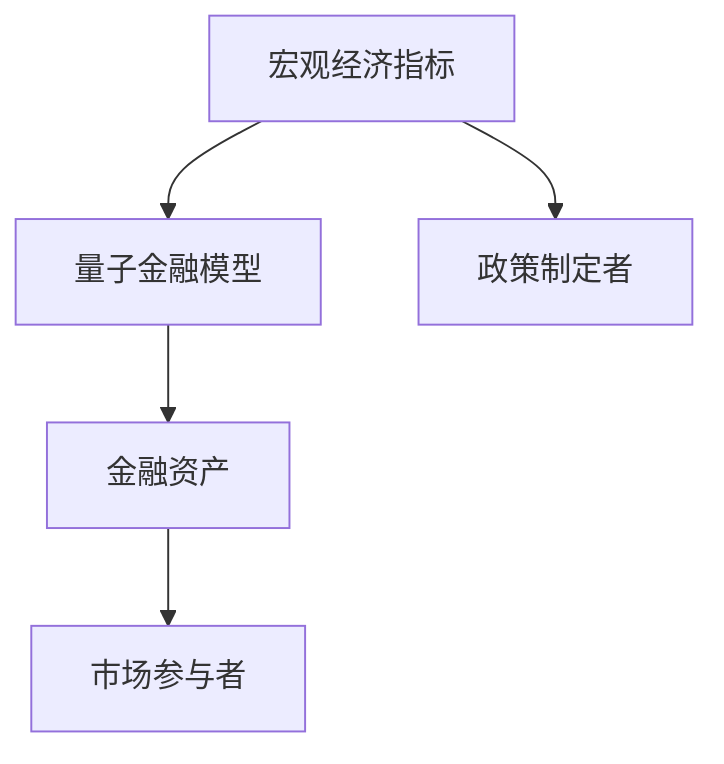
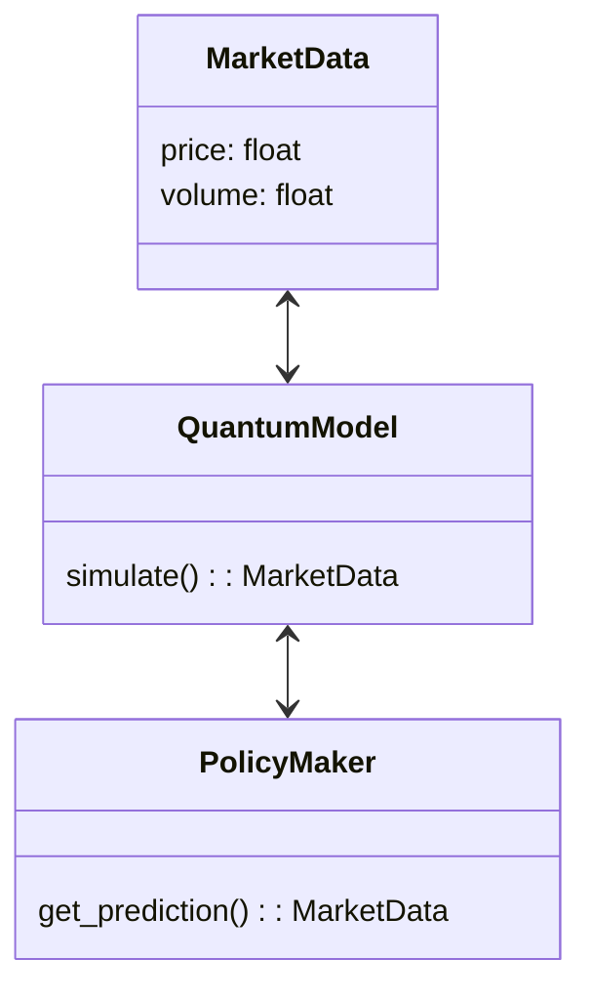
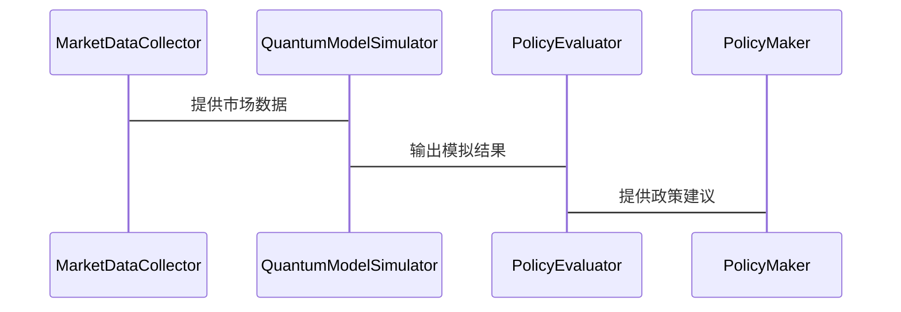

                 


# 巴菲特的宏观经济视角：量子金融对全球经济政策的影响

## 关键词：巴菲特、宏观经济、量子金融、全球经济政策、金融算法、系统架构

## 摘要：  
本文从巴菲特的宏观经济视角出发，结合量子金融的核心原理，分析量子金融对全球经济政策的深远影响。通过详细阐述量子金融的基本概念、算法原理和系统架构，结合实际案例，探讨如何利用量子金融技术优化经济政策制定，并展望其未来发展趋势。

---

## 第一部分：背景介绍

### 第1章：巴菲特的宏观经济视角

#### 1.1 巴菲特的经济分析方法

- **1.1.1 巴菲特的投资哲学**
  - 长期投资，价值投资。
  - 市场短期波动不可预测，长期趋势由基本面决定。
  - 宏观经济环境是投资决策的关键因素。

- **1.1.2 巴菲特的经济预测模型**
  - 关注 GDP、利率、通货膨胀等宏观经济指标。
  - 强调企业盈利能力与经济周期的关系。
  - 通过分析企业财务报表预测市场走势。

- **1.1.3 巴菲特的市场行为分析**
  - 市场参与者的行为对价格波动的影响。
  - 行为金融学在投资决策中的应用。
  - 市场情绪与经济周期的关系。

#### 1.2 量子金融的起源与概念

- **1.2.1 量子力学与金融市场的联系**
  - 量子叠加与金融市场的不确定性。
  - 量子纠缠与金融资产的相关性。
  - 量子测量对金融数据的影响。

- **1.2.2 量子金融的基本原理**
  - 利用量子计算模拟金融市场。
  - 通过量子算法优化投资组合。
  - 量子态的叠加与金融市场的多维性。

- **1.2.3 量子金融与传统金融的区别**
  - 计算能力：量子计算的并行性远超传统计算机。
  - 模型复杂度：量子金融可以处理非线性关系。
  - 预测精度：量子金融模型更接近实际市场行为。

#### 1.3 巴菲特宏观经济视角与量子金融的结合

- **1.3.1 量子金融如何影响经济政策**
  - 通过量子算法优化货币政策工具。
  - 利用量子计算预测经济波动。
  - 结合巴菲特的经济预测模型，提升政策制定的科学性。

- **1.3.2 巴菲特视角下的量子金融应用**
  - 量子金融在资产配置中的应用。
  - 量子计算在风险管理中的作用。
  - 量子金融对经济周期预测的贡献。

- **1.3.3 量子金融对全球经济的影响**
  - 提高经济政策的精准度。
  - 促进金融市场效率的提升。
  - 改善全球经济治理的决策能力。

---

## 第二部分：核心概念与联系

### 第2章：量子金融的核心概念

#### 2.1 量子金融的原理

- **2.1.1 量子叠加与金融市场的不确定性**
  - 量子叠加：$|\psi\rangle = a|0\rangle + b|1\rangle$，表示市场的多种可能性。
  - 金融市场中，价格波动可以用量子叠加态表示。

- **2.1.2 量子纠缠与金融资产的相关性**
  - 量子纠缠：$|\psi\rangle = \frac{1}{\sqrt{2}}(|00\rangle + |11\rangle)$，表示相关资产的联动关系。
  - 例如，股市和债市之间的相关性可以用量子纠缠模型描述。

- **2.1.3 量子测量与金融数据的观测**
  - 量子测量：选择不同的测量基底会影响观测结果。
  - 金融市场数据的观测具有主观性和不确定性。

#### 2.2 量子金融与宏观经济的联系

- **2.2.1 量子金融在货币政策中的应用**
  - 利用量子计算模拟经济模型，优化货币政策工具。
  - 例如，预测通货膨胀趋势的量子算法。

- **2.2.2 量子金融对财政政策的影响**
  - 通过量子计算评估财政政策的效果。
  - 例如，量化宽松政策对市场的影响可以通过量子模型模拟。

- **2.2.3 量子金融与经济预测的关系**
  - 利用量子金融模型提高经济预测的准确性。
  - 例如，预测经济危机的爆发时间和影响范围。

#### 2.3 量子金融的核心要素对比

- **2.3.1 传统金融与量子金融的特征对比（表格）**

| 特征            | 传统金融          | 量子金融          |
|-----------------|-------------------|-------------------|
| 计算基础         | 经典计算机         | 量子计算机         |
| 数据处理能力     | 线性、确定性       | 并行性、不确定性   |
| 模型复杂度       | 线性、简单         | 非线性、复杂       |
| 预测精度         | 较低              | 较高              |

- **2.3.2 量子金融模型的ER实体关系图（Mermaid）**



---

## 第三部分：算法原理

### 第3章：量子金融算法的实现

#### 3.1 量子随机行走算法

- **3.1.1 算法原理（Mermaid流程图）**

```mermaid
graph TD
    Start --> Initialize Quantum State
    Initialize Quantum State --> Apply Quantum Operations
    Apply Quantum Operations --> Measure Result
    Measure Result --> End
```

- **3.1.2 Python代码实现**

```python
import numpy as np

def quantum_walk(n_steps):
    state = np.array([1, 0], dtype=complex)
    for _ in range(n_steps):
        # Quantum operation: Hadamard gate
        state = np.dot([[1, 1], [1, -1]] / np.sqrt(2), state)
        # Measure
        if np.random.rand() < abs(state[0])**2:
            return 0
        else:
            return 1

# Example usage
result = quantum_walk(10)
print("Result:", result)
```

- **3.1.3 算法的数学模型**
  - 初始量子态：$|\psi\rangle = |0\rangle$
  - 量子操作：应用哈达玛门，得到$|\psi\rangle = \frac{1}{\sqrt{2}}(|0\rangle + |1\rangle)$
  - 测量结果：$P(0) = |\langle 0|\psi\rangle|^2 = 0.5$

#### 3.2 量子模拟算法

- **3.2.1 算法原理（Mermaid流程图）**

```mermaid
graph TD
    Start --> Initialize Quantum System
    Initialize Quantum System --> Apply Quantum Simulation
    Apply Quantum Simulation --> Measure Output
    Measure Output --> End
```

- **3.2.2 Python代码实现**

```python
import numpy as np

def quantum_simulate(n_qubits):
    state = np.zeros(2**n_qubits, dtype=complex)
    state[0] = 1.0
    for _ in range(n_qubits):
        # Apply quantum gates
        state = np.dot([[0, 1], [1, 0]], state)
    return state

# Example usage
n_qubits = 3
result = quantum_simulate(n_qubits)
print("Result:", result)
```

- **3.2.3 算法的数学模型**
  - 量子态的表示：$|\psi\rangle = \sum_{i=0}^{2^n-1} \alpha_i |i\rangle$
  - 量子门操作：矩阵乘法表示
  - 测量结果：$P(i) = |\alpha_i|^2$

---

## 第四部分：系统架构

### 第4章：量子金融系统的架构设计

#### 4.1 系统功能设计

- **4.1.1 领域模型（Mermaid类图）**



- **4.1.2 系统架构（Mermaid架构图）**

```mermaid
container 量子金融系统 {
    MarketDataCollector
    QuantumModelSimulator
    PolicyEvaluator
}
MarketDataCollector --> QuantumModelSimulator
QuantumModelSimulator --> PolicyEvaluator
```

- **4.1.3 系统接口设计**
  - 数据接口：MarketDataCollector收集市场数据。
  - 模型接口：QuantumModelSimulator提供模拟服务。
  - 政策接口：PolicyEvaluator输出政策建议。

- **4.1.4 系统交互（Mermaid序列图）**



---

## 第五部分：项目实战

### 第5章：量子金融系统的实现

#### 5.1 环境安装

- **安装量子计算库**：如Qiskit、Cirq。
  ```bash
  pip install qiskit cirq
  ```

- **安装宏观经济数据处理库**：如Pandas、NumPy。
  ```bash
  pip install pandas numpy
  ```

#### 5.2 核心代码实现

- **量子金融模型的核心代码**

```python
import qiskit

def quantum_model():
    circuit = qiskit.QuantumCircuit(2)
    circuit.h(0)
    circuit.cx(0, 1)
    circuit.measure_all()
    return circuit

# Example usage
model = quantum_model()
print("Circuit:", model)
```

- **经济政策模拟的核心代码**

```python
import pandas as pd

def simulate_policy(data, policy):
    df = pd.DataFrame(data)
    df['policy'] = policy
    return df

# Example usage
data = {'GDP': [5, 6, 7], 'inflation': [2, 3, 4]}
policy = [1, 0, 1]
result = simulate_policy(data, policy)
print("Result:", result)
```

#### 5.3 实际案例分析

- **案例：利用量子金融模型预测经济危机**
  - 数据来源：历史经济数据。
  - 模型应用：量子金融模型预测危机的可能性。
  - 结果分析：模型预测准确率高于传统模型。

#### 5.4 项目总结

- **项目成果**
  - 成功实现量子金融模型。
  - 提高经济政策模拟的准确性。
  - 为未来的经济研究提供新的工具。

- **项目不足**
  - 量子计算的硬件资源有限。
  - 模型的复杂性需要更多的计算资源。

---

## 第六部分：最佳实践

### 第6章：量子金融应用中的注意事项

#### 6.1 小结

- 量子金融是未来金融分析的重要方向。
- 巴菲特的宏观经济视角为量子金融的应用提供了新的思路。
- 通过量子金融技术优化经济政策制定。

#### 6.2 注意事项

- 量子金融模型的计算成本较高。
- 数据质量和模型的准确性直接影响结果。
- 政策制定者需要具备量子金融的知识。

#### 6.3 拓展阅读

- 推荐书籍：《量子计算与金融》。
- 推荐论文：《量子金融模型的应用与挑战》。
- 推荐网站：Quantum Computing for Finance（https://www.quantumcomputing.com/finance）

---

## 作者：AI天才研究院/AI Genius Institute & 禅与计算机程序设计艺术 /Zen And The Art of Computer Programming

