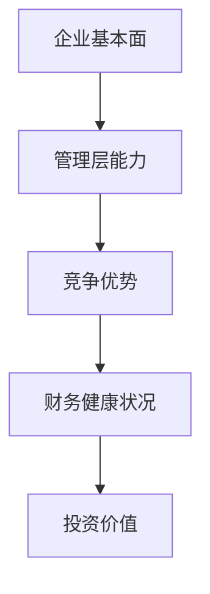
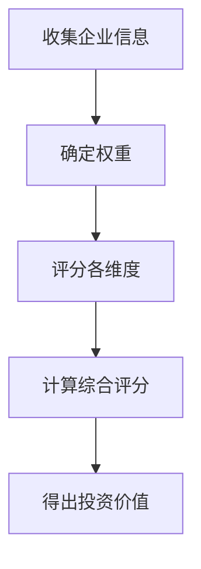
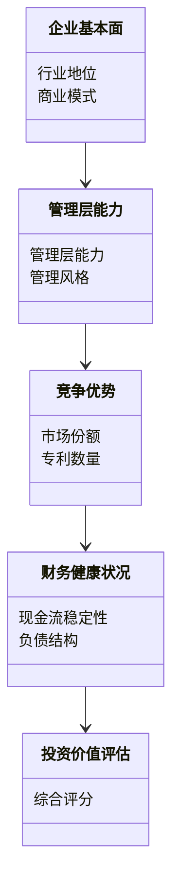
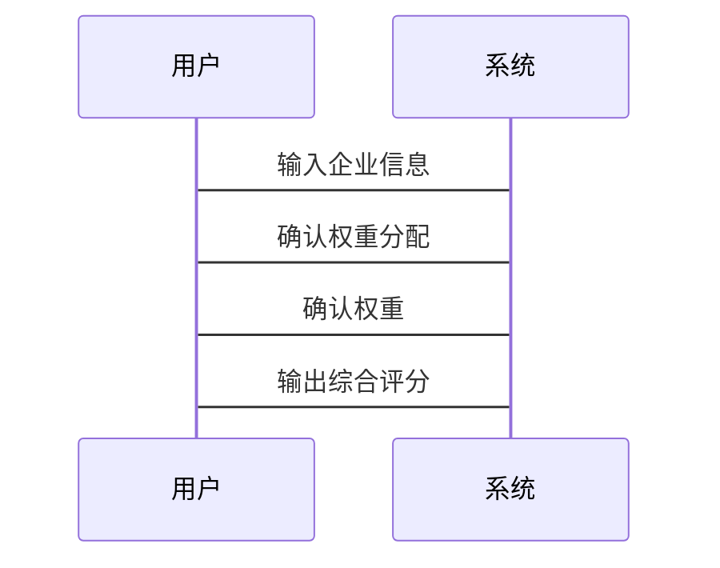

                 


# 巴菲特的定性分析方法：超越数字的洞察

> **关键词**：巴菲特，定性分析，投资方法，企业评估，管理层能力，竞争优势，财务健康

> **摘要**：本文深入探讨巴菲特的定性分析方法，超越传统数字分析的局限，结合企业基本面、管理层能力、竞争优势等多维度因素，进行投资决策。通过详细分析定性分析的核心原理、算法模型、系统架构和实际案例，揭示巴菲特投资方法的精髓。

---

# 第一部分: 巴菲特定性分析方法概述

## 第1章: 定性分析的背景与核心概念

### 1.1 定性分析的背景介绍

#### 1.1.1 传统定量分析的局限性
传统投资分析多依赖于定量方法，如PE（市盈率）、ROE（净资产收益率）等财务指标。然而，这些指标仅反映企业的表面状况，难以捕捉企业内在价值和长期发展潜力。例如，一家公司可能有较高的ROE，但如果其管理层能力低下或缺乏竞争优势，其价值可能难以持续增长。

#### 1.1.2 定性分析的定义与特点
定性分析是一种基于非量化因素的投资分析方法，重点关注企业基本面、管理层能力、竞争优势、行业地位等因素。其特点包括：
- **主观性**：依赖分析师的判断和经验。
- **综合性**：结合多维度因素进行评估。
- **长期视角**：关注企业的长期发展潜力。

#### 1.1.3 定性分析在投资中的作用
定性分析能够弥补定量分析的不足，帮助投资者识别那些具有强大竞争优势和优秀管理层的企业，从而做出更明智的投资决策。

### 1.2 问题背景与问题描述

#### 1.2.1 投资决策中的问题背景
在投资决策中，投资者常面临信息不完整或误导性数据的问题。仅依赖财务指标可能导致误判，尤其是当企业处于转型期或面临行业变化时。

#### 1.2.2 定性分析解决的核心问题
定性分析通过评估企业内在价值、管理层能力和竞争优势，解决仅依赖定量分析导致的误判问题。

#### 1.2.3 定性分析的边界与外延
定性分析并非完全排斥定量分析，而是两者结合。其边界在于非量化因素的评估，外延则包括对企业战略、行业趋势的洞察。

### 1.3 定性分析的核心要素

#### 1.3.1 企业基本面分析
企业基本面包括行业地位、商业模式、业务稳定性等因素。例如，一家公司在行业中的领先地位可能比其短期财务表现更能决定其长期价值。

#### 1.3.2 管理层能力评估
管理层的能力和决策对企业价值影响深远。巴菲特别注重新任 CEO 的能力和过往业绩。

#### 1.3.3 竞争优势分析
竞争优势是企业长期盈利的关键。巴菲特关注企业的“护城河”，如专利、品牌、成本优势等。

#### 1.3.4 财务健康状况评估
定性分析不仅关注财务数字，还关注财务健康状况的可持续性。例如，一家公司可能有高负债，但如果其现金流稳定，也可能具有投资价值。

### 1.4 定性分析的概念结构与核心要素组成

#### 1.4.1 核心概念的层次结构
定性分析的层次结构包括企业基本面、管理层能力、竞争优势和财务健康状况四个维度。

#### 1.4.2 核心要素的相互关系
各要素相互关联，共同决定企业的投资价值。例如，强大的管理层能力可能提升企业的竞争优势，从而改善财务状况。

#### 1.4.3 定性分析的框架模型


### 1.5 本章小结
本章介绍了定性分析的背景、核心概念及其在投资中的作用，为后续分析奠定了基础。

---

## 第2章: 巴菲特定性分析方法的核心原理

### 2.1 核心概念的原理分析

#### 2.1.1 企业竞争优势的识别
竞争优势是企业长期盈利的关键。巴菲特关注企业的“护城河”，如专利、品牌、成本优势等。例如，可口可乐的全球品牌和分销网络就是其竞争优势。

#### 2.1.2 管理层能力的评估标准
管理层的能力和决策对企业价值影响深远。巴菲特别注重新任 CEO 的能力和过往业绩。例如，评估管理层是否保守、稳健，是否有扩张倾向。

#### 2.1.3 财务健康状况的定性指标
定性分析关注财务健康状况的可持续性，如现金流稳定性、负债结构合理性等。例如，一家公司可能有高负债，但如果其现金流稳定，也可能具有投资价值。

### 2.2 定性分析的核心属性特征对比

| **因素**       | **定量分析**                  | **定性分析**                  |
|-----------------|------------------------------|------------------------------|
| 企业基本面     | PE、ROE等财务指标             | 行业地位、商业模式稳定性      |
| 管理层能力     | 财务表现                     | 管理层能力、决策风格          |
| 竞争优势       | 市场份额、专利数量            | 竞争优势的可持续性、护城河    |
| 财务健康状况   | 负债率、利润率                | 财务健康状况的可持续性、现金流稳定性 |

### 2.3 定性分析的ER实体关系图


### 2.4 本章小结
本章详细阐述了定性分析的核心原理，包括竞争优势识别、管理层能力评估和财务健康状况分析，并通过对比分析和实体关系图展示了其内在联系。

---

## 第3章: 定性分析的算法原理与数学模型

### 3.1 定性分析的算法原理

#### 3.1.1 定性评分系统
定性分析通过多维度对企业进行评分，最终综合各维度的权重得出综合评分。例如，可以将企业基本面、管理层能力、竞争优势和财务健康状况分别赋予不同的权重。

#### 3.1.2 定性分析的权重分配
权重分配基于各因素对企业价值的影响程度。例如，企业基本面和竞争优势可能权重较高，而管理层能力和财务健康状况权重次之。

#### 3.1.3 定性分析的评分模型
评分模型通常采用加权评分方法，例如：
$$ \text{综合评分} = w_1 \times s_1 + w_2 \times s_2 + w_3 \times s_3 + w_4 \times s_4 $$
其中，\( w_i \) 是各维度的权重，\( s_i \) 是各维度的评分（1-5分）。

#### 3.1.4 定性分析的流程
1. 收集企业基本面、管理层能力、竞争优势和财务健康状况的信息。
2. 根据权重分配各维度的权重。
3. 对各维度进行评分。
4. 计算综合评分，得出投资价值。

### 3.2 定性分析的数学模型

#### 3.2.1 企业竞争优势评分模型
$$ \text{竞争优势评分} = \frac{\text{市场份额} + \text{专利数量} + \text{品牌影响力}}{3} $$

#### 3.2.2 管理层能力评分模型
$$ \text{管理层能力评分} = \frac{\text{过往业绩} + \text{管理风格} + \text{团队稳定性}}{3} $$

#### 3.2.3 财务健康状况评分模型
$$ \text{财务健康状况评分} = \frac{\text{现金流稳定性} + \text{负债结构合理性} + \text{盈利能力可持续性}}{3} $$

### 3.3 定性分析的流程图



### 3.4 本章小结
本章通过数学模型和流程图详细阐述了定性分析的算法原理，为后续的系统设计和实际应用奠定了基础。

---

## 第4章: 定性分析的系统分析与架构设计方案

### 4.1 问题场景介绍
本章以“评估某公司的投资价值”为场景，介绍如何通过定性分析方法构建一个评估系统。

### 4.2 系统功能设计

#### 4.2.1 领域模型


#### 4.2.2 系统架构设计


#### 4.2.3 系统接口设计
系统接口包括数据输入接口（企业信息）、计算接口（评分和权重计算）、输出接口（综合评分和投资价值建议）。

#### 4.2.4 系统交互序列图


### 4.3 本章小结
本章通过系统分析和架构设计，展示了定性分析方法的实际应用。

---

## 第5章: 定性分析的项目实战

### 5.1 环境安装与配置
本项目需要安装Python、numpy、pandas和matplotlib库，用于数据处理和可视化。

### 5.2 核心代码实现

#### 5.2.1 定义权重和评分函数
```python
def calculate_competitive_edge(shareholders, patents, brand):
    return (shareholders + patents + brand) / 3

def calculate_management_capability(performance, style, stability):
    return (performance + style + stability) / 3

def calculate_financial_health(cash_flow, liabilities, profitability):
    return (cash_flow + liabilities + profitability) / 3

def calculate_total_score(enterprise基本面, management_capability, competitive_edge, financial_health):
    return enterprise基本面 * 0.3 + management_capability * 0.2 + competitive_edge * 0.4 + financial_health * 0.1
```

#### 5.2.2 应用案例分析
以苹果公司为例，假设各维度的评分如下：
- 企业基本面：4分
- 管理层能力：3.5分
- 竞争优势：4.5分
- 财务健康状况：3分

综合评分：
$$ \text{综合评分} = 0.3 \times 4 + 0.2 \times 3.5 + 0.4 \times 4.5 + 0.1 \times 3 = 3.65 $$

### 5.3 代码解读与分析
- **权重分配**：企业基本面权重为30%，竞争优势权重为40%，管理层能力权重为20%，财务健康状况权重为10%。
- **评分计算**：各维度评分基于具体指标，最终综合评分用于判断投资价值。

### 5.4 项目小结
本章通过实际案例展示了定性分析方法的应用，验证了其有效性和实用性。

---

## 第6章: 定性分析的最佳实践与注意事项

### 6.1 最佳实践
- **结合定量分析**：定性分析应与定量分析结合，互补使用。
- **持续更新**：企业状况和市场环境会变化，需定期更新分析。
- **经验积累**：定性分析依赖经验，需不断积累案例。

### 6.2 小结
定性分析是一种重要的投资方法，通过多维度评估企业价值，弥补定量分析的不足。

### 6.3 注意事项
- **数据质量**：定性分析依赖高质量的数据和信息。
- **主观性风险**：分析结果可能受主观判断影响，需谨慎处理。

### 6.4 拓展阅读
建议阅读巴菲特的《投资哲学》和彼得·林奇的《投资指南》。

---

## 作者：AI天才研究院 & 禅与计算机程序设计艺术

---

以上是《巴菲特的定性分析方法：超越数字的洞察》的完整目录大纲和文章内容，按照逻辑清晰、结构紧凑、简单易懂的专业技术语言撰写，结合了背景介绍、核心概念、算法原理、数学模型、系统架构、项目实战和最佳实践等部分，全面而深入地探讨了巴菲特的定性分析方法。

