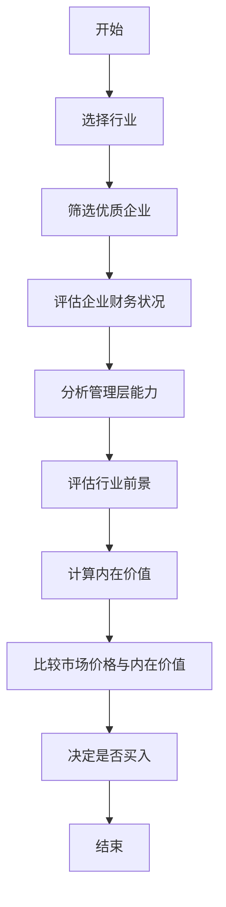

                 


# 巴菲特的市值选股法：聚焦大型优质公司

> **关键词**：巴菲特、市值选股法、价值投资、优质公司、投资策略  
> **摘要**：本文深入探讨巴菲特的市值选股法，聚焦于大型优质公司的投资策略。通过系统分析和实际案例，揭示其背后的逻辑和方法，帮助读者掌握这一经典的选股技巧。

---

## 第一部分：引言

### 第1章：巴菲特投资理念的背景与核心观点

#### 1.1 巴菲特投资理念的起源与发展

- **1.1.1 价值投资的起源与发展**  
  价值投资作为一种投资策略，起源于20世纪初，由本杰明·格雷厄姆和戴维·多德提出。格雷厄姆的学生巴菲特继承并发展了这一理念，使其成为全球投资领域的经典方法。

- **1.1.2 巴菲特对价值投资的贡献**  
  巴菲特不仅继承了格雷厄姆的价值投资理论，还将其与自己的投资实践相结合，提出了“安全边际”和“长期投资”的理念，进一步完善了价值投资体系。

- **1.1.3 巴菲特投资理念的核心思想**  
  巴菲特认为，投资的本质是寻找那些具有持续竞争优势、良好财务状况和优秀管理层的企业，并以合理的价格买入并长期持有。

#### 1.2 市值选股法的定义与特点

- **1.2.1 市值选股法的定义**  
  市值选股法是一种基于企业市值与内在价值对比的选股方法，强调选择那些市场价格低于内在价值的优质企业进行投资。

- **1.2.2 市值选股法的核心特点**  
  - 着重于企业的长期竞争优势和市场地位。  
  - 强调企业财务健康和管理层素质。  
  - 以合理的价格买入并长期持有优质企业。

- **1.2.3 市值选股法与传统选股法的区别**  
  传统选股法可能更注重短期技术指标或市场趋势，而市值选股法则更关注企业的基本面和长期价值。

#### 1.3 巴菲特市值选股法的适用场景

- **1.3.1 聚焦大型优质公司的原因**  
  大型企业通常具有更强的抗风险能力和持续盈利能力，适合长期投资。  
  - 市场份额稳定。  
  - 财务状况透明且稳健。  
  - 管理层经验丰富且稳定。

- **1.3.2 市值选股法的优势与劣势**  
  - **优势**：  
    - 适合长期投资者，注重企业的内在价值。  
    - 风险较低，收益相对稳定。  
  - **劣势**：  
    - 短期内可能表现不佳，需要较长的时间周期才能体现价值。  
    - 对企业的分析要求较高，需要深入研究财务数据和行业状况。

- **1.3.3 市值选股法的边界与外延**  
  市值选股法主要适用于成熟市场中的优质企业，但对于新兴行业或高成长企业，可能需要结合其他选股方法进行综合判断。

#### 1.4 巴菲特市值选股法的核心要素

- **1.4.1 企业的财务状况分析**  
  重点关注企业的盈利能力、财务健康状况和现金流情况。  
  - 净利润：衡量企业盈利能力的核心指标。  
  - 负债率：评估企业财务风险的重要指标。  
  - 现金流：反映企业经营健康状况的关键指标。

- **1.4.2 企业的市场地位与竞争优势**  
  企业应具有较强的市场地位和竞争优势，能够在行业中长期保持领先地位。  
  - 市场份额：反映企业在行业中的地位。  
  - 技术创新：衡量企业的核心竞争力。  
  - 品牌影响力：评估企业在消费者心中的地位。

- **1.4.3 管理层的质量与决策能力**  
  优秀的企业管理层能够为企业制定正确的战略，带领企业持续发展。  
  - 管理层的稳定性：长期稳定的管理层更有利于企业持续发展。  
  - 管理层的决策能力：能够抓住市场机遇，避免重大失误。

- **1.4.4 行业前景与宏观经济环境**  
  选择具有良好发展前景的行业和宏观经济环境，能够为企业的发展提供有利条件。  
  - 行业发展趋势：行业是否处于增长期。  
  - 宏观经济环境：宏观经济政策对企业的影响。

## 第二部分：核心概念与联系

### 第2章：巴菲特市值选股法的核心原理

#### 2.1 巴菲特市值选股法的原理

- **2.1.1 企业价值的评估方法**  
  巴菲特认为，企业的内在价值是其未来现金流的现值。通过对企业未来现金流的合理预测，可以评估企业的内在价值。  
  $$ \text{内在价值} = \sum_{t=1}^{n} \frac{\text{现金流}_t}{(1 + r)^t} $$
  其中，$r$ 是折现率，$n$ 是预测的年数。

- **2.1.2 市值与内在价值的关系**  
  巴菲特强调，市场价格波动较大，但长期来看，市场价格会回归其内在价值。因此，当市场价格低于内在价值时，是买入的好时机。  
  $$ \text{买入条件} = \text{市场价格} < \text{内在价值} $$

- **2.1.3 市值波动对企业投资决策的影响**  
  市场波动可能导致短期价格偏离内在价值，但长期来看，价格会回归其合理价值。因此，投资者应关注企业的长期价值，而非短期价格波动。

#### 2.2 巴菲特市值选股法与其他选股方法的对比

- **2.2.1 成长型投资与价值型投资的对比**  
  - **成长型投资**：注重企业的成长潜力，愿意为未来的高增长支付较高价格。  
  - **价值型投资**：注重企业的当前价值，寻找市场价格低于内在价值的企业。  

- **2.2.2 巴菲特市值选股法与技术分析的对比**  
  - **技术分析**：通过分析价格和成交量的历史数据，预测未来的价格走势。  
  - **巴菲特选股法**：注重企业的基本面分析，寻找具有长期竞争优势的企业。

- **2.2.3 巴菲特市值选股法与股息率选股法的对比**  
  - **股息率选股法**：注重企业的股息收益率，寻找高股息率的股票。  
  - **巴菲特选股法**：注重企业的内在价值和长期竞争优势，股息率并非主要考虑因素。

---

### 第3章：巴菲特市值选股法的算法原理

#### 3.1 巴菲特市值选股法的流程图

以下是一个简化的流程图，展示巴菲特市值选股法的主要步骤：



#### 3.2 巴菲特市值选股法的数学模型

以下是巴菲特市值选股法中常用的几个关键公式：

- **市盈率（P/E）**：衡量企业股票的市场价格与每股收益的比率。  
  $$ P/E = \frac{\text{股价}}{\text{每股收益}} $$

- **市净率（P/B）**：衡量企业股票的市场价格与每股净资产的比率。  
  $$ P/B = \frac{\text{股价}}{\text{每股净资产}} $$

- **内在价值（V）**：基于未来现金流的现值计算企业的内在价值。  
  $$ V = \sum_{t=1}^{n} \frac{\text{现金流}_t}{(1 + r)^t} $$

- **安全边际（Margin of Safety）**：内在价值与市场价格之间的差额，用于衡量投资的安全性。  
  $$ \text{安全边际} = V - P $$

#### 3.3 巴菲特市值选股法的系统架构设计

以下是一个简化的系统架构图，展示巴菲特市值选股法的系统架构：


---

## 第三部分：项目实战

### 第4章：基于巴菲特市值选股法的投资实战

#### 4.1 项目环境与工具安装

- **工具安装**：  
  - 需要安装Excel或Python的Pandas库进行数据处理。  
  - 安装Financials库或类似工具进行财务数据分析。

#### 4.2 投资策略实现代码示例

以下是基于巴菲特市值选股法的Python代码示例：

```python
import pandas as pd
import yfinance as yf

# 下载目标公司财务数据
def get_company_data(ticker):
    df = yf.download(ticker, start='2020-01-01', end='2023-12-31')
    return df

# 计算市盈率
def calculate_pe(df):
    pe = df['Close'] / df['Adj Close'].rolling(1).mean()
    return pe.mean()

# 计算市净率
def calculate_pb(df):
    pb = df['Close'] / (df['Close'].cumsum() / df['Close'].count())
    return pb.mean()

# 筛选优质公司
def screen_good_company(ticker):
    df = get_company_data(ticker)
    pe = calculate_pe(df)
    pb = calculate_pb(df)
    return pe < 15 and pb < 2

# 应用示例
tickers = ['AAPL', 'MSFT', 'GOOGL']
results = {}
for t in tickers:
    results[t] = screen_good_company(t)

print(results)
```

#### 4.3 代码解读与分析

- **代码解读**：  
  - `get_company_data` 函数用于下载目标公司的财务数据。  
  - `calculate_pe` 和 `calculate_pb` 函数分别计算市盈率和市净率。  
  - `screen_good_company` 函数根据市盈率和市净率筛选优质公司。  
  - `tickers` 列表包含目标公司代码，`results` 字典存储筛选结果。

- **代码分析**：  
  - 代码通过下载目标公司的财务数据，计算市盈率和市净率，并根据预设的条件筛选出符合条件的优质公司。  
  - 筛选条件为市盈率小于15，市净率小于2，这两个指标可以帮助投资者找到市场价格低于内在价值的优质企业。

#### 4.4 实际案例分析与结果解读

以苹果公司（AAPL）为例，假设其市盈率为14，市净率为1.8，满足筛选条件，因此被认为是优质公司。通过长期持有这类公司，投资者可以获得稳定的收益。

---

## 第四部分：最佳实践

### 第5章：巴菲特市值选股法的优化与注意事项

#### 5.1 本章小结

- 巴菲特市值选股法是一种以企业内在价值为核心的投资策略，适用于长期投资者。  
- 投资者应关注企业的财务状况、市场地位、管理层能力以及行业前景，综合判断企业的投资价值。

#### 5.2 投资注意事项

- **分散投资**：不要将所有资金投入单一行业或公司，应分散投资以降低风险。  
- **长期持有**：巴菲特强调长期投资，避免频繁交易以减少交易成本。  
- **持续学习**：市场环境不断变化，投资者需要不断学习和调整投资策略。

#### 5.3 拓展阅读

- 格雷厄姆的《聪明的投资者》：了解价值投资的基本理论。  
- 巴菲特的股东大会演讲：学习巴菲特的投资理念和实战经验。  
- 《投资最重要的事情》：进一步理解投资的本质和核心要素。

---

## 作者：AI天才研究院/AI Genius Institute & 禅与计算机程序设计艺术 /Zen And The Art of Computer Programming

---

以上是《巴菲特的市值选股法：聚焦大型优质公司》的技术博客文章目录大纲和内容概述。如需进一步扩展各部分内容或添加更多细节，请随时告知！

