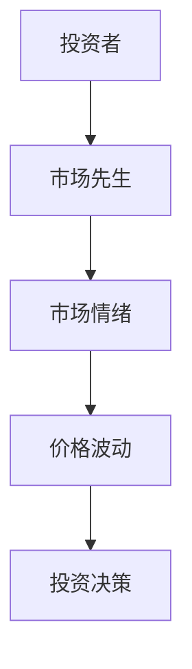

                 


# 巴菲特的市场先生比喻：理解市场的非理性

> **关键词**：巴菲特，市场先生，市场非理性，投资者情绪，行为金融学，风险管理，投资策略

> **摘要**：本文通过分析巴菲特的市场先生比喻，探讨市场非理性现象及其对投资者决策的影响。文章从市场先生的定义、市场非理性的表现、投资策略的制定、风险管理的重要性、行为金融学的视角以及实际案例分析等方面展开，帮助读者更好地理解市场波动背后的心理因素和非理性行为，并提供相应的投资策略建议。

---

## 第一部分：市场先生比喻的背景与核心概念

### 第1章：巴菲特的市场先生比喻概述

#### 1.1 市场先生比喻的起源与应用
- **1.1.1 巴菲特的市场先生概念**  
  巴菲特在《聪明的投资者》中提出了“市场先生”的概念，将市场比作一个情绪化的朋友。市场先生每天都会报出一个价格，而投资者可以选择以这个价格买入或卖出资产。市场的价格波动反映了投资者情绪的变化，而不是资产的真实价值。
  
- **1.1.2 市场先生比喻的核心思想**  
  市场先生是一个情绪化的个体，他的报价反映了市场的波动性和非理性。投资者的任务是识别市场先生报价中的非理性，并利用这种非理性进行投资决策。

- **1.1.3 市场先生与投资决策的关系**  
  市场先生的报价为投资者提供了买卖的机会，但投资者需要独立思考，避免被市场情绪左右。通过理解市场先生的行为，投资者可以更好地把握市场波动的规律。

#### 1.2 市场非理性的表现与特征
- **1.2.1 市场波动的非理性分析**  
  市场波动往往与实际经济数据不匹配，反映了投资者情绪的过度反应。例如，市场的恐慌性抛售或乐观性抢购。

- **1.2.2 投资者情绪的周期性变化**  
  投资者情绪呈现出周期性波动，从过度乐观到极度恐慌，再回到理性。这种周期性变化是市场波动的重要驱动因素。

- **1.2.3 市场先生的短期与长期视角**  
  市场先生关注的是短期价格波动，而投资者应关注资产的长期价值。这种视角差异是市场非理性的主要原因。

---

### 第2章：市场先生比喻的核心概念与联系

#### 2.1 市场先生的定义与属性
- **2.1.1 市场先生的定义**  
  市场先生是一个假设性的人物，代表市场的整体情绪和波动。他的报价反映了市场的供需关系和投资者情绪。

- **2.1.2 市场先生的核心属性对比**  
  | 属性 | 描述 |
  |------|------|
  | 情绪化 | 市场先生的报价受情绪影响，波动较大 |
  | 短期性 | 市场先生关注的是短期价格波动，而非长期价值 |
  | 不理性 | 市场先生的报价可能偏离资产的真实价值 |

- **2.1.3 市场先生与市场的实体关系图**  
  ```mermaid
  graph TD
    A[市场先生] --> B[投资者]
    B --> C[市场情绪]
    C --> D[价格波动]
  ```

#### 2.2 市场先生与市场参与者的互动关系
- **2.2.1 投资者与市场先生的互动**  
  投资者根据市场先生的报价做出买卖决策，而市场先生的报价又受到投资者行为的影响。

- **2.2.2 市场情绪的传播与影响**  
  市场情绪通过投资者之间的传播，影响市场的整体波动。例如，恐慌情绪会导致市场抛售，乐观情绪会导致市场上涨。

- **2.2.3 市场先生的决策机制**  
  市场先生的报价基于市场参与者的买卖行为，反映了市场的供需关系和情绪变化。

---

## 第二部分：市场先生比喻的算法与系统分析

### 第3章：市场先生比喻的数学模型与算法原理

#### 3.1 市场情绪分析的数学模型
- **3.1.1 市场情绪的量化方法**  
  市场情绪可以通过投资者行为数据（如交易量、买卖价差）和市场指标（如波动率、恐慌指数）进行量化。

- **3.1.2 情绪指数的计算公式**  
  情绪指数可以通过以下公式计算：
  $$ E = \frac{V_b - V_s}{V_b + V_s} $$
  其中，$V_b$ 是买入成交量，$V_s$ 是卖出成交量。

- **3.1.3 情绪与价格波动的关系模型**  
  $$ P(t) = a \times E(t) + b \times V(t) + c $$
  其中，$P(t)$ 是 t 时刻的价格，$E(t)$ 是市场情绪指数，$V(t)$ 是交易量，$a$、$b$、$c$ 是系数。

#### 3.2 投资决策算法的流程图


#### 3.3 市场波动预测的数学公式
$$ P(t) = a \times S(t-1) + b \times E(t) + c $$
其中，$P(t)$ 表示 t 时刻的价格，$S(t-1)$ 表示前一时刻的市场状态，$E(t)$ 表示当前市场情绪指数，$a$、$b$、$c$ 为系数。

---

### 第4章：市场先生比喻的系统分析与架构设计

#### 4.1 系统分析
- **4.1.1 问题场景介绍**  
  市场波动的非理性行为影响投资者决策，导致市场波动加剧。

- **4.1.2 系统功能需求**  
  - 实时监控市场情绪
  - 预测市场波动
  - 提供投资决策建议

- **4.1.3 系统架构设计**  
  ```mermaid
  classDiagram
  class 投资者
  class 市场先生
  class 市场情绪
  class 价格波动
  投资者 --> 市场先生
  市场先生 --> 市场情绪
  市场情绪 --> 价格波动
  ```

#### 4.2 系统架构设计
- **4.2.1 系统功能设计**  
  - 数据采集模块：采集市场数据和投资者行为数据
  - 情绪分析模块：计算市场情绪指数
  - 波动预测模块：基于情绪指数和历史数据预测市场波动
  - 决策支持模块：提供投资决策建议

- **4.2.2 系统架构图**  
  ```mermaid
  graph TD
    A[投资者] --> B[市场先生]
    B --> C[市场情绪]
    C --> D[价格波动]
    D --> E[投资决策]
  ```

---

## 第三部分：市场先生比喻的项目实战与总结

### 第5章：项目实战

#### 5.1 环境安装与数据准备
- 数据源：股票价格数据、交易量数据、市场情绪指标
- 工具：Python、Pandas、Matplotlib、Scikit-learn

#### 5.2 系统核心实现源代码
```python
import pandas as pd
import numpy as np
from sklearn.linear_model import LinearRegression

# 数据准备
data = pd.read_csv('market_data.csv')
X = data[['交易量', '情绪指数']]
y = data['价格']

# 模型训练
model = LinearRegression()
model.fit(X, y)

# 预测
predicted_price = model.predict(X)
```

#### 5.3 代码应用解读与分析
- 数据准备：读取市场数据，提取交易量和情绪指数作为特征变量。
- 模型训练：使用线性回归模型训练，建立价格与交易量和情绪指数的关系。
- 预测：基于训练好的模型，预测未来的价格波动。

#### 5.4 实际案例分析
- 案例：2020年新冠疫情对市场的冲击
- 分析：市场情绪从极度恐慌到逐步恢复的过程
- 启示：投资者应关注市场情绪的变化，避免盲目跟风。

#### 5.5 项目小结
- 项目目标：通过市场先生比喻，分析市场波动的非理性，制定投资策略。
- 实施步骤：数据采集、模型训练、案例分析、策略制定。
- 成果展示：通过模型预测价格波动，验证市场先生比喻的有效性。

---

## 第四部分：总结与启示

### 第6章：总结与启示

#### 6.1 最佳实践 tips
- **独立思考**：避免被市场情绪左右，关注资产的长期价值。
- **风险管理**：制定合理的投资策略，分散投资以降低风险。
- **持续学习**：关注市场动态，学习投资知识，提升决策能力。

#### 6.2 小结
通过巴菲特的市场先生比喻，我们理解了市场的非理性波动及其对投资者决策的影响。投资者应理性看待市场波动，结合市场先生的非理性行为，制定科学的投资策略。

#### 6.3 注意事项
- 市场波动的非理性是短期现象，长期投资仍需关注资产的真实价值。
- 投资者情绪的周期性变化是市场波动的重要驱动因素，需密切关注。

#### 6.4 拓展阅读
- 巴菲特的《聪明的投资者》
- 行为金融学相关书籍

---

**作者：AI天才研究院/AI Genius Institute & 禅与计算机程序设计艺术 /Zen And The Art of Computer Programming**

